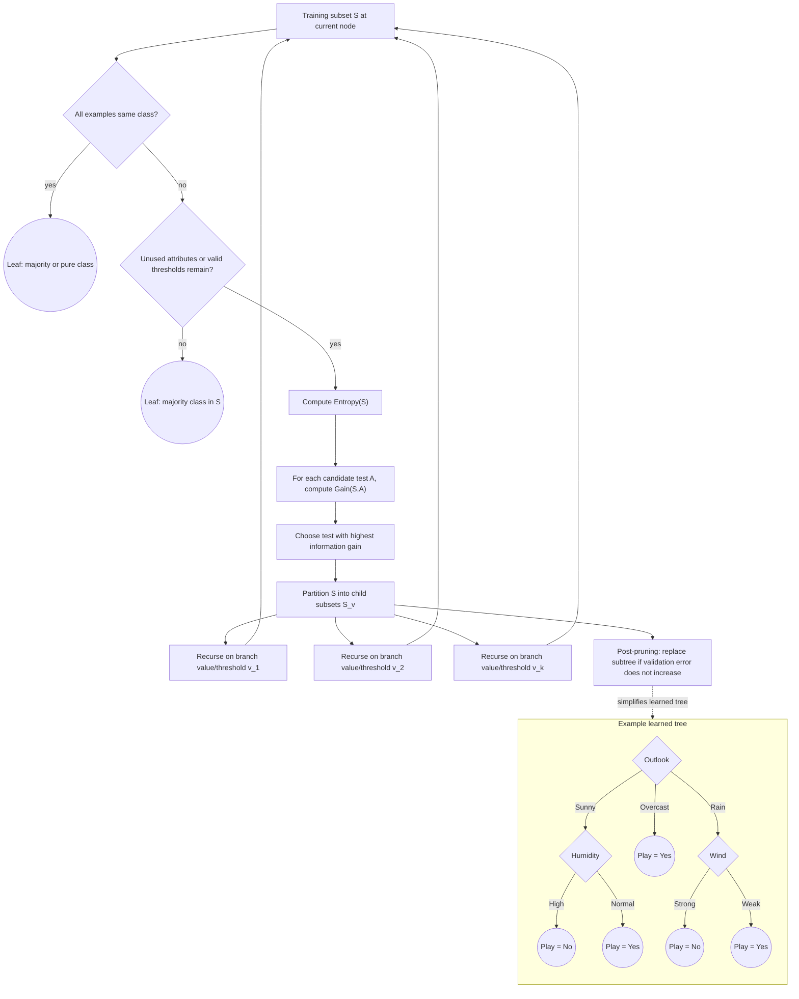

# Decision Tree Learning

Decision tree learning is one of the most practical algorithms in Mitchell's book. It learns a discrete-valued target function by recursively splitting the instance space according to attribute tests. The result is readable, fast at prediction time, and naturally handles interactions among attributes. ID3, the main algorithm in the chapter, is historically important because it made information-theoretic attribute selection a standard idea.

The chapter also introduces overfitting in a concrete way. A tree can keep growing until it matches every training example, but a perfectly fitted tree may generalize poorly. The tension among expressive trees, noisy data, small samples, and pruning remains central in modern tree methods such as random forests and gradient boosting, even though those methods go beyond Mitchell's 1997 scope.

## Definitions

A decision tree represents a function by internal decision nodes and leaf predictions. Each internal node tests an attribute. Each branch corresponds to an attribute value or threshold outcome. Each leaf gives the predicted class.

Entropy measures the impurity of a sample $S$ containing positive and negative examples:

$$
Entropy(S) =
-p_+ \log_2 p_+ - p_- \log_2 p_-.
$$

When a probability is zero, the corresponding term is treated as zero because $\lim_{p \to 0} p \log p = 0$.

Information gain measures the expected reduction in entropy after splitting on attribute $A$:

$$
Gain(S,A) =
Entropy(S) -
\sum_{v \in Values(A)}
\frac{|S_v|}{|S|}Entropy(S_v).
$$

Here $S_v$ is the subset of examples whose attribute $A$ has value $v$.

ID3 is a greedy top-down decision tree algorithm. At each node it chooses the attribute with highest information gain, creates child nodes for the attribute values, and recurses until the examples at a node are pure, no attributes remain, or another stopping rule applies.

Overfitting occurs when a hypothesis fits training examples so closely that it captures noise or accidental regularities, causing worse performance on future examples.

## Key results

ID3 performs a greedy search through the space of possible decision trees. It does not backtrack. Its bias is therefore a preference bias, not a hard restriction bias: ID3 can represent many discrete functions if allowed to grow large trees, but it prefers short trees that place high-gain attributes near the root.

Entropy has useful boundary behavior. If all examples have the same label, entropy is zero. If positive and negative examples are equally mixed, entropy is one bit for a boolean classification problem. Thus a split is good when it creates low-entropy children.

Information gain favors attributes that partition examples into purer subsets. However, it can also favor attributes with many values, especially identifiers. Mitchell discusses alternatives and practical modifications, including gain ratio in the broader decision-tree literature.

Pruning combats overfitting. Reduced-error pruning uses a validation set: remove a subtree when replacing it by a leaf does not reduce validation accuracy. Rule post-pruning converts a tree to rules, prunes rule conditions, and sorts or filters the resulting rules. Both methods accept that a smaller hypothesis may be better even if it has higher training error.

Decision-tree learning also makes the difference between restriction bias and preference bias concrete. A learner with a very small hypothesis language might be unable to represent the target function at all; that is restriction bias. ID3's more important bias is preference: it searches a rich space but prefers trees that put high-information-gain attributes near the root. This preference is not guaranteed to find the smallest correct tree. Greedy root choices can be locally sensible and globally awkward. Still, the preference often works because high-level splits that reduce impurity tend to create simpler downstream subproblems.

Handling continuous attributes requires converting numeric values into tests, commonly of the form $A \leq c$. A candidate threshold $c$ is usually chosen between adjacent sorted values where the class label changes. The algorithm then treats the threshold test like a boolean attribute and evaluates information gain. This preserves the recursive tree-building strategy while extending it beyond purely categorical data.

Missing values require another practical extension. A simple approach is to replace a missing value with the most common value of that attribute among examples at the node. A more refined approach distributes the example fractionally among branches according to observed branch frequencies. Mitchell's broader point is that the clean ID3 pseudocode is a core idea, not a finished industrial system; robust tree learners need policies for noise, continuous values, missing values, pruning, and attribute costs.

Attribute costs add one more design dimension. If two tests give similar information gain but one is expensive, risky, or slow to obtain, a practical learner may prefer the cheaper test. Medical diagnosis is the standard example: a symptom question and an invasive laboratory test should not be treated as equally cheap attributes. This turns splitting into a cost-sensitive decision rather than a pure information-gain calculation.

The final tree should be interpreted as both a predictor and a partition of the instance space. Every root-to-leaf path defines a region, and every leaf assigns a class to that region. This makes trees easy to explain but also exposes their instability: a small change in early splits can reorganize many downstream regions. Ensemble methods later exploit this instability, but Mitchell's chapter focuses on the single-tree case where pruning and careful attribute choice are the main controls.

That partitioning view also explains why trees handle mixed interactions naturally. One branch can test humidity after outlook is sunny, while another branch tests wind after outlook is rainy. The relevant second attribute can differ by region, which is harder to express in a single global linear rule.

Decision trees are appropriate when:

| Situation | Why trees fit |
|---|---|
| Instances are attribute-value pairs | Node tests match the data representation |
| Target values are discrete | Leaves naturally predict classes |
| Disjunctions are needed | Different paths encode different cases |
| Training data may contain errors | Pruning can reduce sensitivity to noise |
| Interpretability matters | Paths can be read as rules |

## Visual



This decision-tree diagram shows both the ID3 growth procedure and the resulting tree structure. The builder computes entropy, evaluates every candidate test by information gain, partitions the training subset, and recurses until purity, exhaustion, or a stopping rule creates a leaf. The pruning edge shows how a subtree can be replaced by a leaf when validation error does not increase, while the example tree makes the final root-to-leaf decision paths concrete.

## Worked example 1: Compute entropy and information gain

Problem: A training set $S$ has 14 examples: 9 positive and 5 negative. Attribute `Wind` has two values. For `Weak`, there are 6 positive and 2 negative examples. For `Strong`, there are 3 positive and 3 negative examples. Compute $Gain(S, Wind)$.

Method:

1. Compute parent entropy.

$$
p_+ = 9/14, \qquad p_- = 5/14.
$$

$$
\begin{aligned}
Entropy(S)
&= -\frac{9}{14}\log_2\frac{9}{14}
   -\frac{5}{14}\log_2\frac{5}{14} \\
&\approx -(0.643)(-0.637) -(0.357)(-1.485) \\
&\approx 0.410 + 0.530 \\
&\approx 0.940.
\end{aligned}
$$

2. Compute entropy for `Weak`.

$$
p_+ = 6/8 = 0.75, \qquad p_- = 2/8 = 0.25.
$$

$$
Entropy(S_{\text{Weak}})
= -0.75\log_2(0.75)-0.25\log_2(0.25)
\approx 0.811.
$$

3. Compute entropy for `Strong`.

$$
p_+ = 3/6 = 0.5, \qquad p_- = 3/6 = 0.5.
$$

$$
Entropy(S_{\text{Strong}})=1.
$$

4. Compute expected child entropy.

$$
\frac{8}{14}(0.811)+\frac{6}{14}(1)
\approx 0.463 + 0.429 = 0.892.
$$

5. Compute gain.

$$
Gain(S,Wind)=0.940-0.892=0.048.
$$

Answer: The information gain is approximately $0.048$ bits. This is small because the split does not create very pure child nodes.

## Worked example 2: Prune a subtree using validation accuracy

Problem: A subtree classifies a validation set of 20 examples. The current subtree gets 15 correct. If replaced by a single majority-class leaf, it gets 16 correct. Should reduced-error pruning replace the subtree?

Method:

1. Compute validation accuracy of the current subtree.

$$
Accuracy_{\text{subtree}} = 15/20 = 0.75.
$$

2. Compute validation accuracy of the replacement leaf.

$$
Accuracy_{\text{leaf}} = 16/20 = 0.80.
$$

3. Compare the two under reduced-error pruning.

   The pruning rule accepts the replacement when validation accuracy is not reduced. Here it increases.

4. Check the likely interpretation.

   The subtree may have captured details of the training set that do not help on validation cases. The leaf is simpler and validated better.

Answer: Yes. Replace the subtree with the majority-class leaf, because validation accuracy improves from $75$ percent to $80$ percent.

## Code

```python
import math
from collections import Counter, defaultdict

def entropy(labels):
    counts = Counter(labels)
    n = len(labels)
    total = 0.0
    for count in counts.values():
        p = count / n
        total -= p * math.log2(p)
    return total

def information_gain(rows, labels, attr):
    parent = entropy(labels)
    groups = defaultdict(list)
    for row, label in zip(rows, labels):
        groups[row[attr]].append(label)
    weighted = sum(len(g) / len(labels) * entropy(g) for g in groups.values())
    return parent - weighted

rows = [
    {"Wind": "Weak"} for _ in range(8)
] + [
    {"Wind": "Strong"} for _ in range(6)
]
labels = [1] * 6 + [0] * 2 + [1] * 3 + [0] * 3

print(entropy(labels))
print(information_gain(rows, labels, "Wind"))
```

## Common pitfalls

- Using training accuracy alone to decide tree size. A larger tree almost always fits training data at least as well, but that is not the same as better generalization.
- Forgetting the weighted average in information gain. Child entropies must be weighted by subset sizes.
- Treating high-cardinality attributes as automatically good. An ID attribute may perfectly split training data while giving no useful future rule.
- Assuming ID3 finds the globally smallest or best tree. It is greedy and can make locally attractive choices that are not globally optimal.
- Mixing entropy bases. Base 2 gives bits; natural logs give nats. Rankings are unchanged if used consistently, but numeric values differ.
- Pruning on the test set. Validation data can guide pruning; the final test set should be reserved for unbiased evaluation.

## Connections

- [Concept learning](/cs/machine-learning/concept-learning-and-version-spaces)
- [Evaluating hypotheses](/cs/machine-learning/evaluating-hypotheses)
- [Bayesian learning](/cs/machine-learning/bayesian-learning)
- [Data mining](/cs/data-mining/)
- [Statistics](/math/statistics/)
