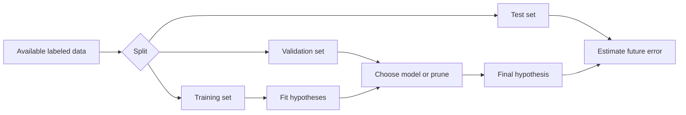

# Evaluating Hypotheses

Mitchell's evaluation chapter gives the statistical machinery needed to say whether a learned hypothesis is actually good. Earlier chapters build hypotheses; this chapter asks how accurately their future performance can be estimated from finite samples. The key warning is simple: training accuracy is not enough, and even test accuracy is an estimate with uncertainty.

The chapter is intentionally practical. It introduces sample error, true error, confidence intervals, tests for comparing hypotheses, and paired tests for comparing learning algorithms. These tools connect directly to modern model evaluation, even though modern practice often uses larger datasets, cross-validation, bootstrap procedures, and benchmark suites.

## Definitions

Let $h$ be a hypothesis and $D$ be a sample of examples drawn independently from some distribution. For a discrete-valued target function, the sample error is:

$$
error_D(h)=\frac{1}{n}\sum_{x \in D} I(h(x) \neq c(x)),
$$

where $n=\vert D\vert $ and $I$ is 1 when its condition is true and 0 otherwise.

The true error is the probability that $h$ misclassifies a new instance drawn from the same distribution:

$$
error_{\mathcal{D}}(h)=Pr_{x \sim \mathcal{D}}[h(x)\neq c(x)].
$$

A confidence interval gives a range that contains the unknown true value with a specified probability under repeated sampling. For a measured sample error $\hat{p}=error_D(h)$, Mitchell uses normal approximations for large enough samples:

$$
\hat{p} \pm z_N \sqrt{\frac{\hat{p}(1-\hat{p})}{n}}.
$$

For an approximate 95 percent interval, $z_N \approx 1.96$.

Hypothesis testing compares observed differences against what might occur by sampling variation alone. The null hypothesis usually says that no real difference exists.

A paired t-test compares two learning algorithms across matched trials, such as the same train/test splits. Pairing reduces noise because each pair shares the same data conditions.

## Key results

If a hypothesis is tested on $n$ independent examples and commits $r$ errors, then the number of errors behaves like a binomial random variable with parameter $p=error_{\mathcal{D}}(h)$:

$$
r \sim Binomial(n,p).
$$

The observed sample error is:

$$
\hat{p}=r/n.
$$

For sufficiently large samples, the binomial can be approximated by a normal distribution. That is why the standard error of the sample proportion is:

$$
SE(\hat{p})=\sqrt{\frac{\hat{p}(1-\hat{p})}{n}}.
$$

When comparing two hypotheses $h_1$ and $h_2$ on independent test sets, estimate the difference:

$$
d = error_D(h_1)-error_D(h_2).
$$

The uncertainty of this difference depends on both sample sizes. If both hypotheses are tested on the same examples, however, the errors are correlated, and paired methods are more appropriate.

For comparing algorithms $A$ and $B$ over $k$ matched trials, compute differences:

$$
\delta_i = error_i(A)-error_i(B).
$$

Then compute:

$$
\bar{\delta}=\frac{1}{k}\sum_{i=1}^k \delta_i,
\qquad
s_{\delta}=\sqrt{\frac{1}{k-1}\sum_{i=1}^k(\delta_i-\bar{\delta})^2}.
$$

The t statistic is:

$$
t=\frac{\bar{\delta}}{s_{\delta}/\sqrt{k}}.
$$

The interpretation depends on the t distribution with $k-1$ degrees of freedom.

Mitchell's evaluation framework depends on the same distributional assumption that appears in computational learning theory: the examples used to estimate performance should be drawn from the same distribution as future cases of interest. If the test set is easier, cleaner, or differently sampled than deployment cases, the confidence interval can be numerically correct for the wrong population. This is a statistical version of the training-experience problem from Chapter 1.

The chapter also distinguishes estimating a single hypothesis from comparing algorithms. Once a learning algorithm has used data to choose among many hypotheses, the selected hypothesis is no longer independent of the training sample. That is why validation and test separation matters. A model selected because it happened to perform well on a validation set may have a slightly optimistic validation estimate, so a final untouched test set is still valuable.

In small-sample settings, the normal approximation should be treated as an approximation rather than a law. Mitchell introduces it because it is simple and widely useful, but the underlying binomial structure matters. When errors are rare or test sets are small, exact intervals or resampling methods may be preferable. The main lesson is not the specific constant $1.96$; it is that observed error is a random variable.

Cross-validation is a practical response to limited data. Instead of reserving one large test subset during development, the data are partitioned into folds, and each fold is used as a test fold while the others train the model. The resulting errors are averaged. This gives a more stable estimate than a single split when data are scarce, although it is still an estimate and can still be biased if used repeatedly for model selection.

The paired t-test section is best read as a warning against overinterpreting isolated wins. If algorithm $A$ beats algorithm $B$ on one split, the difference may reflect the split rather than the algorithm. Matched trials ask whether the difference persists across comparable conditions. Even then, the conclusion depends on the number of trials, the variability of the differences, and whether the assumptions behind the test are reasonable.

Evaluation choices should be made before looking at the final results whenever possible. If the metric, test subset, or comparison procedure is changed after seeing outcomes, the reported number can become an artifact of selection. Mitchell's formulas assume a clean sampling story; disciplined experimental design is what makes that story plausible.

The practical habit is to write down the evaluation protocol before tuning begins, then treat deviations as new experiments rather than as the same estimate.

| Evaluation question | Suitable tool | Main assumption |
|---|---|---|
| How accurate is one hypothesis? | Confidence interval for sample error | Independent test examples |
| Is one hypothesis better than another? | Difference in error, hypothesis test | Comparable evaluation distributions |
| Is one algorithm better across datasets or splits? | Paired t-test | Matched trials, approximately normal differences |
| Is the model overfitting? | Training vs validation/test curves | Validation data represent future cases |

## Visual



The central discipline is separation of roles. Training fits parameters, validation guides choices, and test data estimate final performance.

## Worked example 1: Confidence interval for error

Problem: A classifier is tested on $n=200$ independent examples and makes $r=30$ errors. Estimate a 95 percent confidence interval for its true error.

Method:

1. Compute sample error.

$$
\hat{p}=r/n=30/200=0.15.
$$

2. Compute standard error.

$$
SE=\sqrt{\frac{0.15(1-0.15)}{200}}
=\sqrt{\frac{0.1275}{200}}
=\sqrt{0.0006375}
\approx 0.02525.
$$

3. Use $z=1.96$ for an approximate 95 percent interval.

$$
1.96SE \approx 1.96(0.02525)\approx 0.0495.
$$

4. Form the interval.

$$
0.15 \pm 0.0495 = [0.1005,0.1995].
$$

5. Check reasonableness.

   The interval is centered at the observed 15 percent error and spans about 5 percentage points on each side. With 200 examples, this degree of uncertainty is plausible.

Answer: The approximate 95 percent confidence interval is $[0.101,0.200]$. In words, the true error is estimated to be between about 10.1 percent and 20.0 percent.

## Worked example 2: Paired t-test calculation

Problem: Algorithms $A$ and $B$ are compared on five matched train/test splits. The observed error differences $\delta_i=error_i(A)-error_i(B)$ are:

$$
[0.03, 0.01, 0.04, -0.01, 0.02].
$$

Compute the paired t statistic.

Method:

1. Compute the mean difference.

$$
\bar{\delta}=\frac{0.03+0.01+0.04-0.01+0.02}{5}
=\frac{0.09}{5}=0.018.
$$

2. Compute deviations from the mean.

$$
[0.012,-0.008,0.022,-0.028,0.002].
$$

3. Square and sum deviations.

$$
0.012^2+(-0.008)^2+0.022^2+(-0.028)^2+0.002^2
$$

$$
=0.000144+0.000064+0.000484+0.000784+0.000004=0.00148.
$$

4. Compute sample standard deviation.

$$
s_{\delta}=\sqrt{\frac{0.00148}{5-1}}
=\sqrt{0.00037}\approx 0.01924.
$$

5. Compute t.

$$
t=\frac{0.018}{0.01924/\sqrt{5}}
=\frac{0.018}{0.00860}\approx 2.09.
$$

Answer: The paired t statistic is about $2.09$ with $4$ degrees of freedom. This suggests $A$ has higher error than $B$ on average, but the sample is small, so the final significance judgment must be made against a t table or software.

## Code

```python
import math
from statistics import mean, stdev

def error_confidence_interval(errors, n, z=1.96):
    p_hat = errors / n
    se = math.sqrt(p_hat * (1.0 - p_hat) / n)
    return p_hat - z * se, p_hat + z * se

def paired_t_statistic(differences):
    k = len(differences)
    avg = mean(differences)
    sd = stdev(differences)
    return avg / (sd / math.sqrt(k))

print(error_confidence_interval(errors=30, n=200))
print(paired_t_statistic([0.03, 0.01, 0.04, -0.01, 0.02]))
```

## Common pitfalls

- Evaluating on the training set and reporting the result as future accuracy. This estimates memorization plus generalization, not generalization alone.
- Reusing the test set for model selection. Once the test set guides choices, it is no longer an unbiased final test.
- Reporting one accuracy number without uncertainty. Small test sets can make large differences appear by chance.
- Applying the normal approximation when $n$ is too small or the error rate is too close to 0 or 1. Exact binomial intervals or other methods may be better.
- Comparing algorithms on different splits without pairing. Paired comparisons are usually more sensitive because they control for split difficulty.
- Treating statistical significance as practical significance. A tiny improvement can be statistically detectable but operationally irrelevant.

## Connections

- [Decision tree learning](/cs/machine-learning/decision-tree-learning)
- [Artificial neural networks](/cs/machine-learning/artificial-neural-networks)
- [Computational learning theory](/cs/machine-learning/computational-learning-theory)
- [Statistics](/math/statistics/)
- [Probability](/math/probability/)
