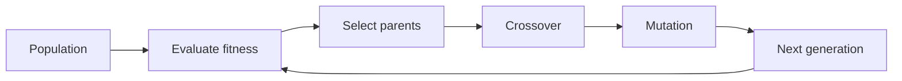

# Genetic Algorithms

Genetic algorithms search a hypothesis space by maintaining a population of candidate hypotheses and applying selection, crossover, and mutation. Mitchell presents them as learning methods inspired by biological evolution, with hypotheses encoded as strings and fitness measuring performance. In the 1997 context, genetic algorithms were a prominent alternative to gradient descent, greedy symbolic search, and probabilistic inference.

The chapter is brief relative to decision trees or Bayesian learning, but it contributes an important perspective: learning can be viewed as randomized population search. This is useful when hypotheses are hard to differentiate, search spaces are rugged, or candidate solutions have natural compositional encodings.

## Definitions

A genetic algorithm maintains a population:

$$
P_t = \{h_1,h_2,\ldots,h_m\}
$$

at generation $t$. Each hypothesis is encoded as a chromosome, often a bit string.

A fitness function assigns a score:

$$
Fitness(h)
$$

based on training accuracy, reward, cost, or another task measure.

Selection chooses parent hypotheses with probability related to fitness. A common fitness-proportionate selection rule is:

$$
Pr(h_i)=\frac{Fitness(h_i)}{\sum_j Fitness(h_j)}.
$$

Crossover combines parts of two parent encodings. In one-point crossover, a split position is chosen and suffixes are swapped.

Mutation randomly changes components of an encoding, such as flipping a bit with small probability.

Genetic programming extends the representation from fixed-length strings to executable program trees. Instead of crossing over bit strings, it crosses over subtrees.

A schema is a template describing a subset of strings, using symbols such as `0`, `1`, and `*` for "do not care." For example, `1*0**` matches all five-bit strings beginning with `1` and having third bit `0`.

## Key results

The genetic algorithm cycle is:

1. Initialize a population.
2. Evaluate fitness.
3. Select parents biased toward high fitness.
4. Apply crossover and mutation.
5. Form the next generation.
6. Repeat until a stopping condition holds.

The schema theorem, in simplified form, says that short, low-order schemata with above-average fitness receive exponentially increasing trials in later generations, subject to disruption by crossover and mutation. Mitchell treats this as an explanatory principle rather than a complete performance guarantee.

Genetic algorithms are less tied to differentiability than neural networks and less tied to symbolic general-to-specific ordering than version spaces. Their bias enters through representation, fitness design, genetic operators, and selection pressure.

However, the flexibility has costs. Fitness evaluation can be expensive. Encodings can be awkward. Crossover is useful only when meaningful building blocks survive recombination. Mutation rates that are too low can stagnate; rates that are too high can destroy useful structure.

A genetic algorithm is best understood as a search heuristic rather than a guaranteed route to the global optimum. It can be effective when the search space has reusable partial solutions and when fitness gives a useful signal before the full solution is perfect. If every partial solution has nearly identical fitness, selection has little guidance. If tiny encoding changes cause chaotic fitness changes, crossover and mutation may not preserve progress.

Representation is therefore not a minor implementation detail. Suppose a rule set is encoded as a bit string. Adjacent bits might represent unrelated rule conditions, or they might represent conditions that naturally work together. One-point crossover is more likely to preserve useful combinations in the second design. This is why many successful evolutionary systems use domain-informed encodings rather than arbitrary strings.

Genetic programming pushes this idea further by evolving program trees. A subtree can represent a meaningful expression, test, or action sequence. Crossover swaps subtrees, so the unit of recombination may be semantically larger than a bit. The benefit is expressive power; the risk is uncontrolled growth, often called bloat, where programs become larger without becoming better.

Mitchell's discussion of evolution and learning also raises an important distinction. Lamarckian evolution would pass learned traits directly into the genome; standard Darwinian evolution selects inherited variation based on fitness. In computational systems, designers can choose hybrids: an individual may improve by local search during its lifetime, and the improved result or its fitness can influence selection. This anticipates later memetic and hybrid evolutionary algorithms.

Diversity is a resource in population search. If all individuals become nearly identical early, crossover can no longer produce much novelty and the algorithm depends mostly on mutation. Techniques such as lower selection pressure, explicit diversity preservation, random immigrants, or niching can keep multiple regions of the search space alive. Elitism, which copies the best individuals unchanged into the next generation, pushes in the opposite direction: it protects good solutions but can accelerate premature convergence if overused.

Parallelization is a natural advantage of genetic algorithms. Fitness evaluations for different individuals are often independent, so they can be distributed across processors or machines. Mitchell includes parallel genetic algorithms because population methods fit parallel hardware and distributed search conceptually well. The engineering benefit depends on the cost of evaluating one individual compared with the overhead of coordination.

The schema idea is easiest to use as a diagnostic question: does the encoding contain short patterns that are meaningful and heritable? If yes, crossover and selection may amplify them. If no, the algorithm may still work through mutation and selection, but the biological metaphor becomes less informative. Good evolutionary design therefore asks what partial structures should survive recombination.

Stopping criteria are also part of the algorithm. A run may stop after a fixed number of generations, after fitness stops improving, after reaching a target score, or after exhausting a compute budget. Because genetic algorithms are stochastic, a single run is not always representative. Multiple runs with different random seeds give a better picture of whether the representation and operators are reliably useful.

In machine-learning applications, the final population can be used in different ways. The system may return the single best individual, keep an ensemble of high-fitness individuals, or use the population to seed another local optimizer. This flexibility is useful, but it makes evaluation discipline important: the reported model should be tested on data not used to drive fitness selection.

Genetic algorithms also make randomness explicit. Random initialization, random parent sampling, random crossover points, and random mutations are not incidental details; they are the source of exploration. Reproducible experiments should record random seeds and report variation across runs. Otherwise a lucky run can be mistaken for a reliable learning method.

The same point applies to hyperparameters. Population size, mutation probability, crossover rate, and selection scheme can change outcomes substantially, so they should be treated as part of the learning method being evaluated.

| Component | Design question | Failure mode |
|---|---|---|
| Encoding | How is a hypothesis represented as a chromosome? | Good solutions are unreachable or hard to express |
| Fitness | What score drives selection? | Learner optimizes the wrong proxy |
| Selection | How strongly do fit individuals dominate? | Premature convergence or weak progress |
| Crossover | How are parts recombined? | Useful building blocks are disrupted |
| Mutation | How is diversity introduced? | Search becomes random or stagnant |

## Visual



The loop is a search process. Fitness guides exploitation, while mutation and recombination preserve exploration.

## Worked example 1: One-point crossover

Problem: Two six-bit parent chromosomes are:

$$
p_1=110010,\qquad p_2=001111.
$$

Apply one-point crossover after the third bit.

Method:

1. Split each parent after bit 3.

$$
p_1 = 110 \mid 010
$$

$$
p_2 = 001 \mid 111
$$

2. Create child 1 from the prefix of $p_1$ and suffix of $p_2$.

$$
c_1 = 110 \mid 111 = 110111.
$$

3. Create child 2 from the prefix of $p_2$ and suffix of $p_1$.

$$
c_2 = 001 \mid 010 = 001010.
$$

4. Check that length is preserved.

   Both children have six bits, matching the parent encoding.

Answer: The children are $110111$ and $001010$. The operation recombines existing genetic material without changing individual bits.

## Worked example 2: Fitness-proportionate selection

Problem: A population has four hypotheses with fitness values:

| Hypothesis | Fitness |
|---|---:|
| $h_1$ | 10 |
| $h_2$ | 20 |
| $h_3$ | 30 |
| $h_4$ | 40 |

Compute the selection probability of each hypothesis under fitness-proportionate selection.

Method:

1. Sum fitness values.

$$
10+20+30+40=100.
$$

2. Divide each fitness by the total.

$$
Pr(h_1)=10/100=0.10.
$$

$$
Pr(h_2)=20/100=0.20.
$$

$$
Pr(h_3)=30/100=0.30.
$$

$$
Pr(h_4)=40/100=0.40.
$$

3. Check probabilities sum to one.

$$
0.10+0.20+0.30+0.40=1.00.
$$

Answer: The selection probabilities are 0.10, 0.20, 0.30, and 0.40. The highest-fitness hypothesis is most likely to reproduce, but lower-fitness hypotheses can still be selected, preserving diversity.

## Code

```python
import random

def one_point_crossover(a, b, point):
    return a[:point] + b[point:], b[:point] + a[point:]

def mutate(bits, p=0.01):
    out = []
    for bit in bits:
        if random.random() < p:
            out.append("1" if bit == "0" else "0")
        else:
            out.append(bit)
    return "".join(out)

def select(population, fitnesses):
    total = sum(fitnesses)
    r = random.random() * total
    upto = 0
    for h, fit in zip(population, fitnesses):
        upto += fit
        if upto >= r:
            return h
    return population[-1]

p1, p2 = "110010", "001111"
c1, c2 = one_point_crossover(p1, p2, point=3)
print(c1, c2)
print(mutate(c1, p=0.05))
```

## Common pitfalls

- Designing an encoding where crossover has no semantic value. Recombination helps only when substrings correspond to useful building blocks.
- Using training accuracy as fitness without validation. A population can evolve overfit rules.
- Setting selection pressure too high. The population can converge early to mediocre hypotheses.
- Setting mutation too high. The search loses memory and behaves like random sampling.
- Treating the schema theorem as a complete guarantee of success. It gives useful intuition, not a universal convergence proof.
- Forgetting evaluation cost. If each fitness call trains or simulates something expensive, population search can become impractical.

## Connections

- [Learning problems and system design](/cs/machine-learning/learning-problems-and-system-design)
- [Rule learning and ILP](/cs/machine-learning/rule-learning-and-ilp)
- [Evaluating hypotheses](/cs/machine-learning/evaluating-hypotheses)
- [Computational learning theory](/cs/machine-learning/computational-learning-theory)
- [Data mining](/cs/data-mining/)
