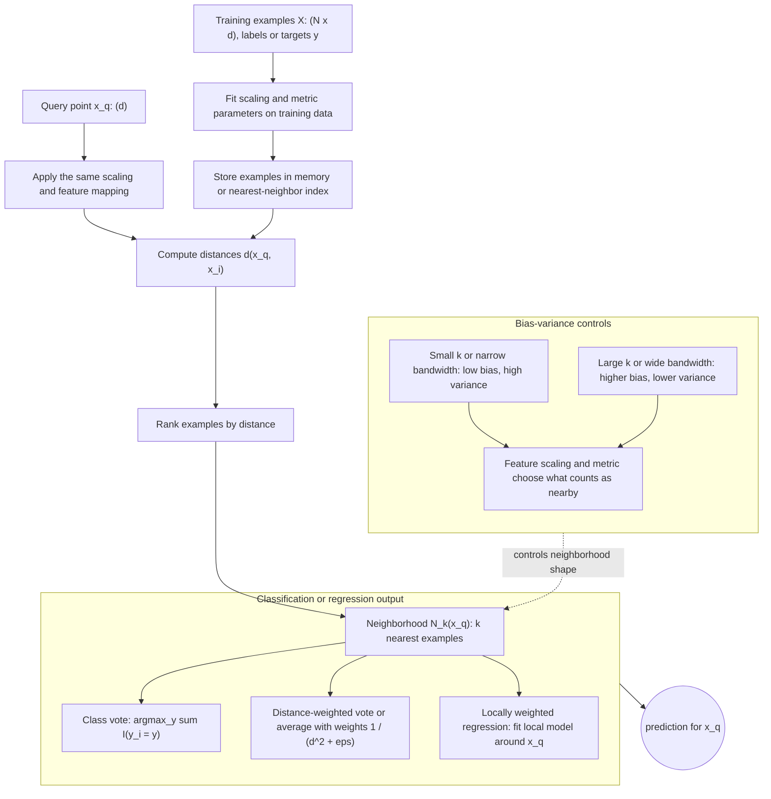

# Instance-Based Learning

Instance-based learning postpones generalization until a query arrives. Instead of eagerly building a global model during training, the learner stores examples and uses nearby cases to answer new questions. Mitchell uses this chapter to introduce k-nearest neighbor, distance-weighted voting, locally weighted regression, radial basis functions, case-based reasoning, and the distinction between lazy and eager learning.

The central idea is locality. If similar instances tend to have similar target values, then nearby training examples are useful evidence. This is simple and powerful, but it makes the choice of distance metric, feature scaling, and local weighting extremely important.

## Definitions

The k-nearest neighbor algorithm stores all training examples. To classify a query $x_q$, it finds the $k$ training examples closest to $x_q$ and predicts by majority vote:

$$
\hat{f}(x_q)=\arg\max_v \sum_{i=1}^k I(v=f(x_i)).
$$

For regression, it averages target values:

$$
\hat{f}(x_q)=\frac{1}{k}\sum_{i=1}^k f(x_i).
$$

Distance-weighted nearest neighbor gives closer examples more influence:

$$
\hat{f}(x_q)=
\frac{\sum_i w_i f(x_i)}{\sum_i w_i},
\qquad
w_i=\frac{1}{d(x_q,x_i)^2}.
$$

Practical implementations often add a small constant to avoid division by zero.

Locally weighted regression fits a local model around the query point, often by minimizing:

$$
E(x_q)=\frac{1}{2}\sum_i K(d(x_q,x_i))(f(x_i)-\hat{f}(x_i))^2.
$$

Here $K$ is a kernel or weighting function that decreases with distance from $x_q$.

Radial basis functions use localized functions centered at selected points:

$$
\phi_i(x)=\exp\left(-\frac{\|x-c_i\|^2}{2\sigma_i^2}\right).
$$

The prediction is a weighted combination of these basis functions.

## Key results

Instance-based methods can approximate complex target functions by combining simple local decisions. k-NN has almost no training cost beyond storing examples, but prediction can be expensive because distances to many stored examples must be computed. This is the classic lazy-learning tradeoff.

The choice of distance function is part of the hypothesis bias. Euclidean distance implies that attributes are numeric, scaled comparably, and meaningful under straight-line geometry. If one feature has a much larger numeric range than others, it can dominate the neighbor relation.

High-dimensional spaces create difficulty. As dimensions increase, distances often become less informative because points become sparse. This is one form of the curse of dimensionality. Mitchell's chapter predates many modern approximate-nearest-neighbor systems, but the underlying issue remains.

Locally weighted regression differs from k-NN voting by fitting a local approximation at query time. The local model can be constant, linear, or more complex. A local linear model can capture slope near the query even when the global target function is nonlinear.

Case-based reasoning extends nearest-neighbor thinking to structured problems. Instead of merely voting over labels, the system retrieves similar past cases, adapts their solutions, and stores the new solved case for future use.

Lazy learning changes when computation and commitment happen. An eager learner such as ID3 or backpropagation commits to a global hypothesis before seeing the query. A lazy learner waits, then forms a local approximation tailored to the query. This can be an advantage when the target function has different behavior in different regions. The learner does not need one global formula to fit all regions equally well.

The price is that storage and indexing become part of the learning system. A naive k-NN implementation compares the query with every stored example. For small datasets this is fine; for large datasets it can dominate runtime. Data structures such as k-d trees, ball trees, and approximate nearest-neighbor indexes can help, but their effectiveness depends on dimension and metric structure.

The bias-variance tradeoff appears through $k$ and bandwidth. Small $k$ or narrow kernels produce low-bias, high-variance predictions that follow local quirks. Large $k$ or wide kernels produce smoother, higher-bias predictions. Locally weighted regression makes this tradeoff continuous: the kernel width decides how quickly examples lose influence with distance.

Irrelevant features are especially harmful for nearest-neighbor methods. If many attributes have nothing to do with the target, they still contribute to distance unless the metric ignores or down-weights them. Two examples can appear far apart because of irrelevant coordinates even when they are similar in the dimensions that matter. Feature selection, metric learning, and domain-specific similarity functions are therefore natural companions to instance-based learning.

Locally weighted regression can be seen as building a new model for every query. At one query point, the nearby examples might support a rising linear trend; at another query point, they might support a flat or falling trend. This is more flexible than fitting one global line, but it means the learner must solve a weighted fitting problem repeatedly. Mitchell's discussion highlights the general theme: lazy methods save effort during training by spending it at prediction time.

Radial basis function networks sit between lazy and eager learning. Once centers and widths are chosen, prediction is an eager weighted combination of basis functions. But the intuition is still local: each radial unit responds most strongly near its center. This makes RBFs a bridge from nearest-neighbor locality to neural-network-style parametric prediction.

Tie-breaking and class imbalance are small details that can change predictions. With even $k$, a query may receive equal votes from two classes. With imbalanced data, the majority class may dominate neighborhoods even when minority-class examples are closer. Weighted voting, odd $k$, prior adjustment, or class-sensitive distance rules can make the behavior match the task better.

The chapter's terminology of lazy and eager learning is also a reminder that there is no free generalization. A lazy learner may look assumption-light because it stores examples, but its distance metric and weighting rule are strong assumptions about the target function. It generalizes by saying nearby points should behave similarly. That assumption is powerful when the feature space is meaningful and weak when similarity has been poorly encoded.

For this reason, instance-based learning often benefits from careful preprocessing. Normalization, removal of irrelevant attributes, and domain-specific distance functions can matter more than the choice between several neighbor-voting variants.

When the distance notion is wrong, storing more examples can simply make the learner confidently localize around the wrong neighbors.

| Method | Training time | Prediction time | Main design choice | Output type |
|---|---:|---:|---|---|
| k-NN | Low | High | $k$ and distance metric | Classification or regression |
| Distance-weighted k-NN | Low | High | Weight function | Classification or regression |
| Locally weighted regression | Low to moderate | High | Kernel and local model | Regression |
| RBF network | Moderate | Moderate | Centers and widths | Classification or regression |
| Case-based reasoning | Domain dependent | Domain dependent | Retrieval and adaptation rules | Structured solutions |

## Visual



This lazy-learning diagram shows the runtime path from stored training examples through query scaling, distance computation, neighbor selection, and the final vote or local regression. The dotted capacity branch makes the bias-variance tradeoff explicit: `k`, bandwidth, feature scaling, and metric choice determine which points are treated as local evidence for `x_q`.

## Worked example 1: k-NN classification

Problem: A query point is $x_q=(2,2)$. Four labeled training examples are:

| Point | Class |
|---|---|
| $(1,1)$ | A |
| $(2,1)$ | A |
| $(4,4)$ | B |
| $(2,3)$ | B |

Use Euclidean distance and $k=3$.

Method:

1. Compute distance to $(1,1)$.

$$
d=\sqrt{(2-1)^2+(2-1)^2}=\sqrt{2}\approx 1.414.
$$

2. Compute distance to $(2,1)$.

$$
d=\sqrt{(2-2)^2+(2-1)^2}=1.
$$

3. Compute distance to $(4,4)$.

$$
d=\sqrt{(2-4)^2+(2-4)^2}=\sqrt{8}\approx 2.828.
$$

4. Compute distance to $(2,3)$.

$$
d=\sqrt{(2-2)^2+(2-3)^2}=1.
$$

5. Sort by distance.

   | Point | Class | Distance |
   |---|---|---:|
   | $(2,1)$ | A | 1.000 |
   | $(2,3)$ | B | 1.000 |
   | $(1,1)$ | A | 1.414 |
   | $(4,4)$ | B | 2.828 |

6. Take the three nearest neighbors: A, B, A.

Answer: The majority vote is class A, with two votes out of three. The checked distances show that the more distant B point is excluded.

## Worked example 2: Distance-weighted regression

Problem: Estimate a real target at query $x_q=3$ from three examples:

| $x_i$ | $f(x_i)$ |
|---:|---:|
| 2 | 10 |
| 4 | 14 |
| 7 | 30 |

Use weights $w_i=1/d_i^2$, where $d_i=\vert x_q-x_i\vert $.

Method:

1. Compute distances.

$$
d_1=|3-2|=1,\qquad d_2=|3-4|=1,\qquad d_3=|3-7|=4.
$$

2. Compute weights.

$$
w_1=1/1^2=1,\quad w_2=1/1^2=1,\quad w_3=1/4^2=1/16=0.0625.
$$

3. Compute weighted numerator.

$$
1(10)+1(14)+0.0625(30)=10+14+1.875=25.875.
$$

4. Compute sum of weights.

$$
1+1+0.0625=2.0625.
$$

5. Divide.

$$
\hat{f}(3)=25.875/2.0625\approx 12.545.
$$

Answer: The distance-weighted estimate is approximately $12.55$. The far point at $x=7$ influences the answer only weakly.

## Code

```python
import numpy as np
from collections import Counter

def knn_predict(X, y, query, k=3):
    distances = np.linalg.norm(X - query, axis=1)
    neighbor_ids = np.argsort(distances)[:k]
    votes = Counter(y[i] for i in neighbor_ids)
    return votes.most_common(1)[0][0], distances[neighbor_ids]

X = np.array([[1, 1], [2, 1], [4, 4], [2, 3]], dtype=float)
y = np.array(["A", "A", "B", "B"])
label, distances = knn_predict(X, y, np.array([2, 2]), k=3)

print(label)
print(distances)
```

## Common pitfalls

- Forgetting to scale features. A feature measured in thousands can dominate one measured in decimals.
- Choosing $k=1$ without considering noise. One noisy neighbor can control the prediction.
- Choosing very large $k$ and washing out local structure. The method becomes less local as $k$ grows.
- Treating Euclidean distance as neutral. It encodes a strong assumption about similarity.
- Ignoring prediction-time cost. Lazy learning can be expensive when many queries or many stored examples are present.
- Using distance-weighted formulas without handling zero distance. If the query exactly matches a training point, return that target or add a small stabilizer.

## Connections

- [Learning problems and system design](/cs/machine-learning/learning-problems-and-system-design)
- [Evaluating hypotheses](/cs/machine-learning/evaluating-hypotheses)
- [Artificial neural networks](/cs/machine-learning/artificial-neural-networks)
- [Data mining](/cs/data-mining/)
- [Probability](/math/probability/)
