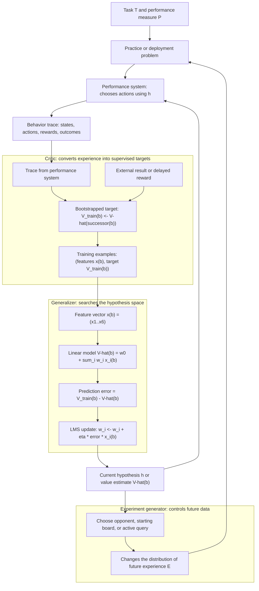

# Learning Problems and System Design

Mitchell's first chapter frames machine learning as the engineering problem of making a program improve through experience. That sounds broad, but the value of the definition is that it forces every learning claim to name the task being improved, the evidence used for improvement, and the measurement that decides whether improvement actually occurred. This is a pre-deep-learning formulation: it is less concerned with giant model families and more concerned with the precise relation among task, representation, training signal, and search.


*Figure: The Iris scatterplot makes feature spaces and class separation visible. Image: [Wikimedia Commons](https://commons.wikimedia.org/wiki/File:Iris_dataset_scatterplot.svg), Nicoguaro, CC BY 4.0.*

The chapter's checkers example is also a compact design pattern for the whole book. A learner does not directly receive the perfect strategy. It receives experience, converts experience into training examples, searches a hypothesis space, and updates a performance system. The same pattern reappears in decision trees, neural networks, Bayesian classifiers, instance-based methods, explanation-based learning, and reinforcement learning.

## Definitions

A computer program learns from experience $E$ with respect to a class of tasks $T$ and performance measure $P$ if its performance at tasks in $T$, as measured by $P$, improves with experience $E$.

A well-posed learning problem therefore specifies three pieces.

| Symbol | Meaning | Example for checkers |
|---|---|---|
| $T$ | Task class | Playing legal games of checkers |
| $P$ | Performance measure | Percent of games won in a tournament |
| $E$ | Training experience | Games played against itself |

A target function is the function the learner is trying to approximate. In the checkers example, one possible target is `ChooseMove`, mapping board states to moves. Mitchell instead uses an evaluation function $V : B \to \mathbb{R}$, where $B$ is the set of legal board states. Good states get high values; bad states get low values.

An operational definition is a definition that can actually be computed within the resource limits of the performance system. The ideal minimax value of a board may be mathematically clear but nonoperational if it requires searching the game tree to the end of play.

A hypothesis is the learner's current approximation to the target function. Mitchell often writes the learned approximation to $V$ as $\hat{V}$. A hypothesis space $H$ is the set of all hypotheses representable by the chosen representation.

For the checkers design, a simple linear representation is:

$$
\hat{V}(b) = w_0 + w_1x_1(b) + w_2x_2(b) + \cdots + w_6x_6(b)
$$

where the $x_i$ are hand-designed board features such as number of pieces, number of kings, and number of threatened pieces.

## Key results

The central reduction in the chapter is from performance improvement to function approximation. Instead of asking "How can a program learn to play checkers?", the designer asks:

1. What target function would allow good play if it were known?
2. What representation can approximate that target?
3. What training examples can be extracted from experience?
4. What search or update rule will improve the hypothesis?

The checkers learner estimates training values for intermediate states by bootstrapping from successor states:

$$
V_{\text{train}}(b) \leftarrow \hat{V}(\text{Successor}(b)).
$$

This is a historical bridge to reinforcement learning. The learner updates a state estimate using an estimate of a later state, which is the same broad idea behind temporal-difference methods and Q-learning.

The least mean squares update for a linear evaluation function adjusts each weight in proportion to the prediction error and the feature value:

$$
w_i \leftarrow w_i + \eta\left(V_{\text{train}}(b) - \hat{V}(b)\right)x_i(b).
$$

Here $\eta$ is the learning rate. If the prediction is too low, weights attached to active positive-valued features increase. If it is too high, they decrease. This rule is a stochastic gradient step on squared error:

$$
E = \sum_{b \in D}\left(V_{\text{train}}(b) - \hat{V}(b)\right)^2.
$$

Mitchell also separates a learning system into four modules:

| Module | Input | Output | Role |
|---|---|---|---|
| Performance system | New problem and current hypothesis | Behavior trace | Uses what has been learned |
| Critic | Behavior trace | Training examples | Interprets experience as feedback |
| Generalizer | Training examples | Revised hypothesis | Searches for a better general rule |
| Experiment generator | Current hypothesis | New practice problem | Chooses what experience to gather next |

This decomposition matters because learning failures can occur in any module. A poor critic can assign misleading labels. A narrow representation can make the right function impossible to express. A weak experiment generator can avoid important regions of the state space. A powerful generalizer can still overfit bad training examples.

A useful reading of Mitchell's design is that every learning system contains both an external problem and an internal surrogate problem. The external problem is to win games, recognize handwriting, drive a vehicle, or classify patients. The internal surrogate may be to fit a value function, infer a decision tree, estimate posterior probabilities, or tune network weights. Good machine-learning design makes the surrogate faithful enough that improving it improves the external performance measure. Bad design creates a surrogate that is easy to optimize but detached from the real task.

The training-experience choice is especially subtle. Direct instruction, labeled examples, passive observation, self-play, and active experimentation give different information. A learner that receives legal moves and final game outcomes faces a harder credit-assignment problem than a learner that receives the best move in every position. Similarly, a medical classifier trained only on historical treatment decisions may inherit the biases of past decisions. Mitchell's framework does not solve these problems, but it gives a vocabulary for locating them: the problem is not "machine learning failed" in general; it may be that $E$ is weakly related to $P$ or that the distribution generating $E$ differs from the distribution used to evaluate $T$.

The representation choice also controls what can be learned. A linear checkers evaluator over six hand-designed features cannot express every useful board pattern. It may miss tactics involving piece placement, tempo, or forced captures. The benefit is that only a few weights must be estimated, so small amounts of experience can improve the program. This tradeoff between expressiveness and sample requirements recurs throughout the book: decision trees can represent disjunctions but overfit, neural networks can represent nonlinear functions but require careful optimization, and Bayesian networks can encode structured uncertainty but demand modeling assumptions.

## Visual



This learning-system diagram expands Mitchell's four modules into their data contracts: a performance trace becomes bootstrapped training examples, the generalizer turns features and errors into weight updates, and the revised hypothesis feeds the next behavior. The feedback loop is deliberate because the current hypothesis influences future experience in self-play, active learning, robotics, and reinforcement learning.

## Worked example 1: Specify a well-posed learning problem

Problem: A hospital wants a program that predicts whether a pneumonia patient is at high risk of complications. Specify $T$, $P$, and $E$ in Mitchell's format.

Method:

1. Identify the task.

   The program receives a patient record and must assign a risk label such as `high` or `not high`.

$$
T = \text{classifying pneumonia patient records by complication risk}.
$$

2. Identify the performance measure.

   A reasonable measure is accuracy on future patients, but in medicine false negatives and false positives may have different costs. Suppose the hospital wants high-risk cases caught reliably. A better performance measure might be area under the ROC curve or sensitivity at a fixed specificity.

$$
P = \text{sensitivity at 90 percent specificity on held-out future cases}.
$$

3. Identify the experience.

   The learner needs historical records containing features and outcomes.

$$
E = \text{past patient records with observed complications}.
$$

4. Check whether it is well posed.

   The three parts are concrete enough to test improvement. If a new model has higher sensitivity at the same specificity on a held-out sample, it improved under $P$.

Answer: The well-posed problem is: learn from historical labeled pneumonia records $E$ to classify new records $T$, with performance $P$ measured by sensitivity at 90 percent specificity. The checked answer is valid because it names the future task, the source of training information, and the exact measurement rule.

## Worked example 2: One LMS update for a board evaluator

Problem: A checkers learner represents a board as two features, $x_1 =$ number of black pieces and $x_2 =$ number of red pieces. Its hypothesis is

$$
\hat{V}(b)=w_0+w_1x_1+w_2x_2.
$$

Suppose $w_0=0$, $w_1=4$, $w_2=-3$, the current board has $x_1=5$, $x_2=4$, the training value is $V_{\text{train}}(b)=20$, and $\eta=0.1$. Compute the update.

Method:

1. Compute the current prediction.

$$
\hat{V}(b)=0+4(5)+(-3)(4)=20-12=8.
$$

2. Compute the prediction error.

$$
V_{\text{train}}(b)-\hat{V}(b)=20-8=12.
$$

3. Update the bias weight. Treat $x_0=1$.

$$
w_0 \leftarrow 0+0.1(12)(1)=1.2.
$$

4. Update $w_1$.

$$
w_1 \leftarrow 4+0.1(12)(5)=4+6=10.
$$

5. Update $w_2$.

$$
w_2 \leftarrow -3+0.1(12)(4)=-3+4.8=1.8.
$$

6. Check the new prediction on the same board.

$$
\hat{V}_{\text{new}}(b)=1.2+10(5)+1.8(4)=1.2+50+7.2=58.4.
$$

Answer: The updated weights are $(1.2,10,1.8)$. The check reveals that with $\eta=0.1$ and large feature values, the update overshoots the target value of 20 on this single example. That does not make the rule wrong, but it shows why feature scaling and learning-rate choice matter.

## Code

```python
import numpy as np

def lms_update(weights, features, target, eta=0.01):
    """One LMS update for a linear value function."""
    x = np.r_[1.0, np.asarray(features, dtype=float)]
    prediction = float(weights @ x)
    error = target - prediction
    return weights + eta * error * x, prediction, error

weights = np.array([0.0, 4.0, -3.0])
features = np.array([5.0, 4.0])
new_weights, pred, err = lms_update(weights, features, target=20.0, eta=0.1)

print("prediction:", pred)
print("error:", err)
print("new weights:", new_weights)
```

## Common pitfalls

- Calling a system "learning" without specifying $T$, $P$, and $E$. Without all three, there is no precise claim to evaluate.
- Confusing the target function with the learned hypothesis. $V$ is the ideal function; $\hat{V}$ is what the learner currently represents.
- Assuming the training distribution matches the future test distribution. Mitchell notes that much theory assumes this, while practice often violates it.
- Choosing a representation before deciding what information the performance system needs. A representation is useful only relative to the target function and the final task.
- Treating self-play as automatically representative. Self-play can generate many examples, but it may miss strategies used by external opponents.
- Forgetting that a nonoperational definition can still guide learning. The exact minimax value may be too expensive to compute, but it can motivate a learnable approximation.

## Connections

- [Concept learning](/cs/machine-learning/concept-learning-and-version-spaces)
- [Artificial neural networks](/cs/machine-learning/artificial-neural-networks)
- [Reinforcement learning](/cs/machine-learning/reinforcement-learning)
- [Modern deep learning](/cs/deep-learning/)
- [Deeper reinforcement learning coverage](/cs/reinforcement-learning/)
