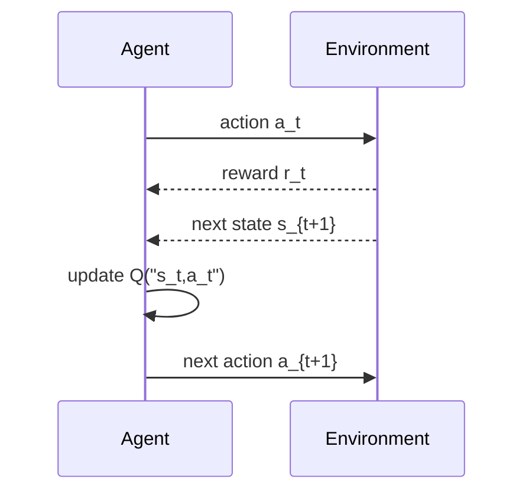

# Reinforcement Learning

Reinforcement learning studies how an agent learns to choose actions through interaction with an environment. Mitchell's final chapter presents the problem through Markov decision processes, delayed reward, Q-learning, exploration, temporal-difference learning, and generalization. It also connects back to the checkers learner from Chapter 1, where values of earlier states were updated from estimated values of later states.


*Figure: Cart-pole is a standard control and reinforcement-learning benchmark. Image: [Wikimedia Commons](https://commons.wikimedia.org/wiki/File:Cartpole.gif), Condordellanebbia, CC BY-SA 4.0.*

This is a compact introduction compared with modern reinforcement learning, but the core concepts are still central. Current deep RL often replaces tabular values with neural networks and trains at much larger scale, yet it still wrestles with delayed reward, exploration, bootstrapping, instability, and the relation between value functions and policies.

## Definitions

An agent observes a state $s \in S$, chooses an action $a \in A$, receives a reward $r$, and transitions to a next state $s'$.

A policy $\pi$ maps states to actions:

$$
\pi:S \to A.
$$

A Markov decision process (MDP) assumes that the next state and reward depend only on the current state and action, not on the full past history.

The discounted return is:

$$
R_t = r_t + \gamma r_{t+1} + \gamma^2 r_{t+2}+\cdots,
$$

where $0 \leq \gamma \lt  1$ is the discount factor.

The optimal action-value function $Q^*(s,a)$ is the maximum expected discounted return achievable after taking action $a$ in state $s$ and then acting optimally:

$$
Q^*(s,a)=r(s,a)+\gamma \max_{a'} Q^*(s',a')
$$

for deterministic transitions.

Q-learning updates estimates using:

$$
Q(s,a) \leftarrow r + \gamma\max_{a'}Q(s',a').
$$

In incremental stochastic settings, the update is often written:

$$
Q(s,a) \leftarrow Q(s,a) + \alpha\left[r+\gamma\max_{a'}Q(s',a')-Q(s,a)\right].
$$

The bracketed term is a temporal-difference error.

## Key results

Reinforcement learning differs from supervised learning in several ways. The learner is not told the correct action. Rewards may be delayed. The agent's choices influence which training examples it sees. Exploration is necessary because actions that currently look poor may reveal better long-term reward.

Q-learning is off-policy: it can learn the optimal action-value function while following an exploratory behavior policy, under suitable assumptions. In the tabular case, with sufficient exploration and appropriate update conditions, Q-learning converges to the optimal Q values for finite MDPs. Mitchell presents deterministic and nondeterministic cases separately to build intuition.

The learned Q function directly determines a greedy policy:

$$
\pi(s)=\arg\max_a Q(s,a).
$$

However, acting greedily during learning can prevent discovery. Common exploration strategies include random actions, epsilon-greedy choice, and probabilistic action selection biased toward high-valued actions.

Temporal-difference learning updates current estimates using later estimates. This bootstrapping is what links Q-learning to the checkers value-function update in Chapter 1 and to dynamic programming methods for MDPs.

Function approximation generalizes Q values across states. Instead of storing a table entry for every $(s,a)$ pair, a neural network or other approximator can estimate $Q(s,a)$ from features. This is necessary for large state spaces but introduces stability and generalization challenges.

The delayed-reward problem is the main reason reinforcement learning is not just classification. If an agent wins a game after fifty moves, the final reward does not immediately say which earlier moves were good. Temporal-difference learning addresses this by moving value estimates backward one transition at a time. A state becomes valuable because it leads to a valuable successor; that successor became valuable because it led to reward or to another valuable state.

Exploration creates an additional design tradeoff. An agent that explores too little may never discover high-reward regions. An agent that explores too much may keep taking poor actions even after it has learned a good policy. Epsilon-greedy action selection is simple: with probability $\epsilon$ choose a random action, otherwise choose the current best action. More sophisticated methods vary exploration over time or prefer actions with uncertain estimates.

The relation to dynamic programming is important historically. Dynamic programming assumes a known transition and reward model and computes optimal values from that model. Q-learning can learn from experience without being given the model. This model-free property is powerful, but it usually requires many interactions. When a model is available or can be learned, planning methods can be more sample-efficient.

Nondeterministic environments require incremental averaging rather than one deterministic assignment. If the same action in the same state can lead to different rewards or next states, a single observed transition is only a sample. The learning-rate form of Q-learning moves the estimate partway toward the sampled target. Over many visits, under suitable learning-rate conditions, the estimate averages over the stochastic outcomes.

State representation is another central design issue. The MDP assumption may hold for the true environment state but fail for the agent's observations. For example, a robot may need memory of previous sensor readings to infer velocity or hidden context. If important information is missing, the same observed state may require different actions at different times. Mitchell notes extensions to hidden-state settings in the further-reading context, while keeping the main chapter focused on the fully observable MDP formulation.

Function approximation brings reinforcement learning back to the rest of the book. A Q table is possible only when states and actions are small enough to enumerate. With features or neural networks, Q-learning becomes a supervised-style update using bootstrapped targets. That connection is powerful, but the targets change as the learner changes, so the stability assumptions are more delicate than in ordinary fixed-dataset regression.

Reward design is part of the problem specification. A reward that is too sparse may make learning very slow, while a poorly shaped reward can encourage behavior that scores well without solving the intended task. Mitchell's formalism treats the reward function as given, but practical reinforcement learning often spends significant effort making sure the reward actually represents the desired performance measure.

The same care applies to terminal states and discounting. A high discount factor makes distant rewards influential, while a low discount factor favors short-term payoff. Neither is universally correct; it depends on the time scale of the task.

For episodic tasks, the episode definition itself determines when credit assignment stops and when the next independent trial begins.

| Issue | Supervised learning | Reinforcement learning |
|---|---|---|
| Training signal | Correct label or target value | Reward, often delayed |
| Data distribution | Usually fixed dataset | Influenced by the agent's policy |
| Main objective | Predict labels or values | Choose actions maximizing return |
| Exploration | Usually not central | Essential |
| Bootstrapping | Optional | Central in TD and Q-learning |

## Visual




*Figure: Agent-environment interface diagram by [Martin Thoma, 2016](https://commons.wikimedia.org/wiki/File:Agent-environment-diagram-rl.svg) — CC0 via Wikimedia Commons with attribution.*

The training loop is interactive. The agent's current policy changes the future data it receives.

## Worked example 1: One deterministic Q update

Problem: An agent is in state $s$ and takes action $a$, receiving reward $r=5$ and moving to $s'$. Current estimates for actions in $s'$ are:

$$
Q(s',left)=4,\qquad Q(s',right)=7.
$$

Use $\gamma=0.9$ and the deterministic assignment update:

$$
Q(s,a)\leftarrow r+\gamma\max_{a'}Q(s',a').
$$

Method:

1. Find the best next-state action value.

$$
\max_{a'}Q(s',a')=\max(4,7)=7.
$$

2. Discount the future value.

$$
\gamma \max_{a'}Q(s',a')=0.9(7)=6.3.
$$

3. Add immediate reward.

$$
r+\gamma\max_{a'}Q(s',a')=5+6.3=11.3.
$$

4. Assign the new value.

$$
Q(s,a)\leftarrow 11.3.
$$

Answer: The updated Q value is $11.3$. The action is valuable because it gives immediate reward 5 and leads to a state with estimated future value 7.

## Worked example 2: Incremental temporal-difference update

Problem: Suppose $Q(s,a)=8$, reward $r=2$, $\gamma=0.5$, $\max_{a'}Q(s',a')=10$, and learning rate $\alpha=0.1$. Compute the incremental Q-learning update.

Method:

1. Compute the target.

$$
target = r+\gamma\max_{a'}Q(s',a')=2+0.5(10)=7.
$$

2. Compute the temporal-difference error.

$$
\delta = target-Q(s,a)=7-8=-1.
$$

3. Scale by learning rate.

$$
\alpha\delta=0.1(-1)=-0.1.
$$

4. Update Q value.

$$
Q_{\text{new}}(s,a)=8-0.1=7.9.
$$

5. Check direction.

   The target is lower than the old estimate, so the value decreases. The small learning rate moves only partway.

Answer: The updated Q value is $7.9$. The update is a small correction toward the bootstrapped target 7.

## Code

```python
import random
from collections import defaultdict

actions = ["left", "right"]
Q = defaultdict(float)

def choose_action(state, epsilon=0.1):
    if random.random() < epsilon:
        return random.choice(actions)
    return max(actions, key=lambda a: Q[(state, a)])

def q_update(state, action, reward, next_state, alpha=0.1, gamma=0.9):
    best_next = max(Q[(next_state, a)] for a in actions)
    target = reward + gamma * best_next
    Q[(state, action)] += alpha * (target - Q[(state, action)])

Q[("s2", "left")] = 4
Q[("s2", "right")] = 7
q_update("s1", "right", reward=5, next_state="s2", alpha=1.0, gamma=0.9)
print(Q[("s1", "right")])
```

## Common pitfalls

- Treating reward as a supervised label for the correct action. A low immediate reward action can still be optimal if it leads to high future return.
- Forgetting exploration. A greedy learner can get stuck repeating actions whose estimates are initially high.
- Using $\gamma$ without interpreting the time horizon. Larger $\gamma$ values make future reward matter more.
- Assuming tabular convergence guarantees automatically apply with neural-network function approximation. Function approximation changes the analysis.
- Confusing value functions and policies. $Q$ evaluates state-action pairs; a policy chooses actions, often by maximizing $Q$.
- Ignoring the Markov assumption. If the observed state omits important history, the process may not be Markov from the agent's perspective.

## Connections

- [Learning problems and system design](/cs/machine-learning/learning-problems-and-system-design)
- [Artificial neural networks](/cs/machine-learning/artificial-neural-networks)
- [Analytical learning](/cs/machine-learning/analytical-learning)
- [Combining inductive and analytical learning](/cs/machine-learning/combining-inductive-and-analytical-learning)
- [Deeper reinforcement learning coverage](/cs/reinforcement-learning/)
