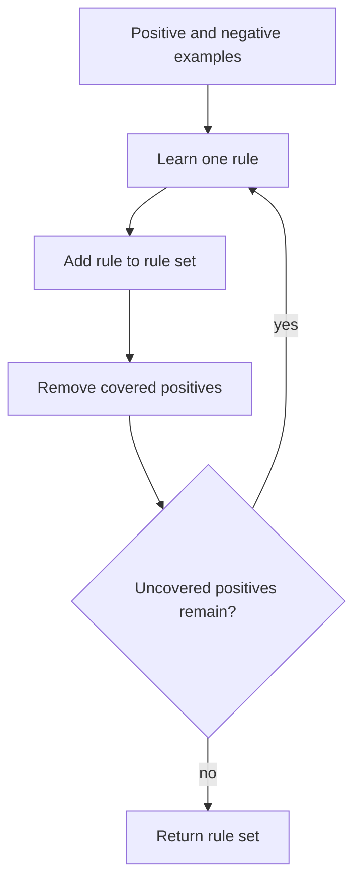

# Rule Learning and ILP

Learning sets of rules returns to symbolic representations, but with more practical machinery than the early concept-learning chapter. Mitchell covers sequential covering, rule evaluation, FOIL, first-order Horn clauses, and inductive logic programming. The goal is to learn readable if-then rules, sometimes with variables and relations rather than fixed attribute vectors.

This chapter is historically important because it shows machine learning interacting with logic programming. Rules can express relational structure that ordinary feature-vector methods hide. A rule learner can describe family relations, list structure, chemical relations, or database facts when examples are naturally relational.

## Definitions

A propositional rule has the form:

$$
IF \; conditions \; THEN \; class.
$$

For example:

$$
IF \; Outlook=Sunny \land Humidity=Normal \; THEN \; PlayTennis=Yes.
$$

A sequential covering algorithm learns one rule at a time. After learning a rule that covers some positive examples, it removes those examples and learns another rule for the remaining positives.

A rule covers an example if the example satisfies the rule's conditions.

First-order Horn clauses allow variables and predicates:

$$
Grandparent(x,z) \leftarrow Parent(x,y) \land Parent(y,z).
$$

FOIL is a top-down inductive logic programming algorithm. It starts with a general rule and specializes it by adding literals to the rule body. It chooses candidate literals using an information-gain measure adapted to first-order rules.

Inductive logic programming (ILP) studies learning logical rules from examples plus background knowledge. The learner searches a space of logic programs rather than ordinary attribute tests.

## Key results

Sequential covering decomposes a disjunctive concept into a set of conjunctive rules. Each learned rule captures one region of the positive class. The full learned concept is the disjunction of all rules:

$$
h(x)=Rule_1(x)\lor Rule_2(x)\lor \cdots \lor Rule_k(x).
$$

The general strategy is:

1. While positive examples remain, learn one high-precision rule.
2. Add the rule to the rule set.
3. Remove positive examples covered by the rule.
4. Continue until enough positives are covered or stopping criteria apply.

Rule learning often uses a general-to-specific search. A very general rule covers many positives but may cover negatives. Adding conditions specializes the rule, reducing coverage and ideally increasing accuracy.

FOIL extends this idea to first-order logic. Candidate literals may introduce new variables, enabling relational definitions. For example, to learn `Grandparent(x,z)`, FOIL can introduce a variable `y` and connect two `Parent` facts.

The main benefit of first-order rules is expressiveness. The main cost is search. The space of possible literals, variable bindings, and clauses can be enormous, so language restrictions and heuristics are essential.

Rule learners also face a coverage-accuracy tension. A very general rule may cover many positive examples, which is useful for compactness, but it may also cover negatives. A very specific rule may avoid negatives but cover only one or two positives. Sequential covering usually tries to learn rules that are accurate enough to be trusted while broad enough to make progress. This is why rule-quality measures often combine positive coverage, negative coverage, and sometimes description length.

Pruning matters for rules just as it matters for decision trees. A rule can be specialized until it excludes every negative training example, but the last few literals may only describe accidents of the sample. Post-pruning removes conditions when doing so improves validation performance or an estimated quality measure. The result may cover a few training negatives but perform better on future data.

First-order representations make background knowledge central. If the learner knows `Parent`, it can express `Grandparent` compactly. If it lacks the relevant predicates, no amount of FOIL search can invent the intended relational bridge without additional representational support. Thus ILP's power comes from the combination of examples, hypothesis language, and background predicates.

Default predictions are part of the learned rule set. In many sequential covering systems, the learned rules describe one target class, and any example not covered by a rule receives the default negative class. In multiclass settings, the system may learn separate rule sets or ordered rules. This matters because uncovered regions are not "unknown" unless the system is designed to abstain; they usually receive an implicit prediction.

Rule ordering can also change behavior. An unordered rule set may vote or combine all matching rules. An ordered decision list uses the first matching rule, so an early broad rule can prevent later rules from firing. Mitchell's chapter focuses on the mechanics of learning rules, but practical rule systems must specify conflict resolution clearly.

Compared with decision trees, separate-and-conquer rule learning can produce more modular descriptions. A tree path is constrained by earlier splits near the root, while a separately learned rule can use just the conditions needed for one subcase. That modularity is useful, but the greedy removal of covered positives can make later rules depend on earlier choices.

ILP also changes what counts as an example. A single labeled relation can be supported by many background facts, and a candidate rule can have many possible variable bindings. This makes coverage testing more expensive than in propositional rule learning. Efficient implementations depend heavily on indexing facts, restricting candidate literals, and pruning the search.

The reward for that extra cost is expressive clarity. A short first-order rule can state a pattern that would require many propositional features if variables and relations were flattened away.

| Approach | Representation | Search direction | Strength | Risk |
|---|---|---|---|---|
| Decision tree rules | Propositional path rules | Tree induction then conversion | Simple and readable | Tree bias controls rule form |
| Sequential covering | Propositional rule set | Often general to specific | Directly learns disjunctions | Rule ordering and pruning matter |
| FOIL | First-order Horn clauses | General to specific | Handles relations and variables | Large search space |
| Inverse resolution | Logic clauses | Inverts deduction | Strong logical foundation | Complex and sensitive to bias |

## Visual



Sequential covering is greedy. It commits to one rule, removes covered positives, and then searches for the next rule.

## Worked example 1: Sequential covering for a tiny dataset

Problem: Learn rules for `Buy=Yes` from two binary attributes, `Student` and `Coupon`.

| Example | Student | Coupon | Buy |
|---|---|---|---|
| 1 | Yes | Yes | Yes |
| 2 | Yes | No | Yes |
| 3 | No | Yes | Yes |
| 4 | No | No | No |

Use a simple covering approach that chooses rules with no negative coverage.

Method:

1. List positive examples: 1, 2, and 3. Negative example: 4.

2. Consider the rule:

$$
IF \; Student=Yes \; THEN \; Buy=Yes.
$$

   It covers examples 1 and 2. Both are positive. It covers no negative examples.

3. Add the rule and remove covered positives 1 and 2.

   Remaining positive: example 3.

4. Learn another rule for example 3.

$$
IF \; Coupon=Yes \; THEN \; Buy=Yes.
$$

   It covers examples 1 and 3. Both are positive. It covers no negative examples.

5. Add the rule and remove example 3.

6. No positives remain. The learned rule set is:

$$
Student=Yes \Rightarrow Buy=Yes
$$

$$
Coupon=Yes \Rightarrow Buy=Yes.
$$

7. Check all examples.

   - Example 1 satisfies both rules, predict Yes.
   - Example 2 satisfies the student rule, predict Yes.
   - Example 3 satisfies the coupon rule, predict Yes.
   - Example 4 satisfies neither rule, predict No by default.

Answer: The learned concept is $Student=Yes \lor Coupon=Yes$. It matches all four training examples.

## Worked example 2: FOIL-style literal choice

Problem: Learn `Grandparent(x,z)` using background predicate `Parent`. Positive examples include `Grandparent(Alice,Carol)`. Background facts include `Parent(Alice,Bob)` and `Parent(Bob,Carol)`. Show why adding `Parent(x,y)` and then `Parent(y,z)` is useful.

Method:

1. Start with the most general rule:

$$
Grandparent(x,z) \leftarrow true.
$$

   This covers every pair $(x,z)$, including many negatives.

2. Add a literal that connects $x$ to an intermediate variable:

$$
Grandparent(x,z) \leftarrow Parent(x,y).
$$

   For `x=Alice`, this binds `y=Bob`. The rule still does not constrain `z`, so it remains too general.

3. Add a second literal connecting the intermediate variable to $z$:

$$
Grandparent(x,z) \leftarrow Parent(x,y) \land Parent(y,z).
$$

4. Test the positive example.

   Substitute $x=Alice$ and $z=Carol$:

$$
Parent(Alice,y) \land Parent(y,Carol).
$$

   With $y=Bob$, both facts are true:

$$
Parent(Alice,Bob) \land Parent(Bob,Carol).
$$

5. Interpret the specialization.

   The new variable $y$ expresses the relational bridge needed for grandparenthood. A propositional learner would need this relation pre-engineered as a feature.

Answer: The rule

$$
Grandparent(x,z) \leftarrow Parent(x,y) \land Parent(y,z)
$$

covers the example through the binding $y=Bob$ and captures the intended relational concept.

## Code

```python
def covers(rule_conditions, example):
    return all(example[attr] == value for attr, value in rule_conditions.items())

examples = [
    {"Student": "Yes", "Coupon": "Yes", "Buy": "Yes"},
    {"Student": "Yes", "Coupon": "No", "Buy": "Yes"},
    {"Student": "No", "Coupon": "Yes", "Buy": "Yes"},
    {"Student": "No", "Coupon": "No", "Buy": "No"},
]

rules = [
    {"Student": "Yes"},
    {"Coupon": "Yes"},
]

for ex in examples:
    predicted = "Yes" if any(covers(rule, ex) for rule in rules) else "No"
    print(ex, "=>", predicted)
```

## Common pitfalls

- Assuming a rule set is unordered when the learning system uses ordered defaults. Some rule learners predict using the first matching rule.
- Learning rules that cover many positives but also many negatives. Coverage alone is not enough; precision matters.
- Removing negative examples during sequential covering. Usually covered positive examples are removed; negatives remain to constrain future rules.
- Letting first-order rule search introduce unlimited variables and literals. ILP needs language bias to keep search finite.
- Confusing entailment with statistical confidence. A learned logical rule may be syntactically valid but empirically unreliable.
- Ignoring pruning. Rule learners can overfit by adding conditions that explain accidental quirks of the training set.

## Connections

- [Concept learning](/cs/machine-learning/concept-learning-and-version-spaces)
- [Decision tree learning](/cs/machine-learning/decision-tree-learning)
- [Genetic algorithms](/cs/machine-learning/genetic-algorithms)
- [Analytical learning](/cs/machine-learning/analytical-learning)
- [Data mining](/cs/data-mining/)
