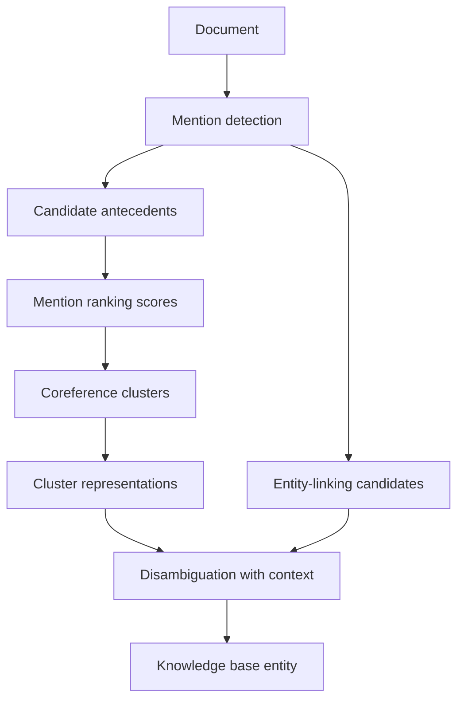

# Coreference Resolution and Entity Linking

Coreference resolution links mentions that refer to the same discourse entity. Entity linking connects a mention to an external knowledge base entry. Jurafsky and Martin cover coreference phenomena, datasets, architectures, neural mention-ranking, entity linking, evaluation, Winograd-style reasoning, and gender bias. Eisenstein contributes a formal reference-resolution chapter, including mention detection, coreference algorithms, representations, evaluation, and the relationship between coreference and information extraction.


*Figure: ELIZA provides historical context for dialogue systems and chatbot evaluation. Image: [Wikimedia Commons](https://commons.wikimedia.org/wiki/File:ELIZA_conversation.png), Unknown author, public domain text.*

These tasks matter because texts refer to the same entity in many ways: `Marie Curie`, `Curie`, `the scientist`, `she`, and `the Nobel laureate`. Downstream systems need to know when these expressions co-refer. Entity linking goes one step further and asks which real-world entity the cluster denotes.

## Definitions

A **mention** is a span of text that refers to an entity or event. Mentions include names, pronouns, definite descriptions, and some nominals.

**Coreference** holds when two mentions refer to the same discourse entity. A **coreference chain** or **cluster** is a set of mutually coreferent mentions:

```text
[Marie Curie] won the prize after [the scientist] discovered radium. [She] changed physics.
```

The three bracketed mentions can belong to one cluster.

**Anaphora** is reference to something introduced elsewhere, often earlier. The referring expression is the **anaphor**, and the expression it depends on is the **antecedent**. Not all anaphora is identity coreference; bridging references such as `a car` and `the engine` involve related entities rather than identical ones.

**Entity linking** maps a mention or cluster to a knowledge base entity, such as a Wikidata or Wikipedia page. The task has two parts: candidate generation and disambiguation.

Common model architectures include **mention-pair** models, which classify pairs; **mention-ranking** models, which choose the best antecedent; and **entity-based** models, which maintain cluster representations. Modern neural models often score all spans as candidate mentions and then score antecedents.

## Key results

Coreference is hard because it combines syntax, salience, discourse, agreement, semantics, and world knowledge. Pronouns often depend on gender, number, grammatical role, recency, and discourse prominence. Definite noun phrases may require lexical or encyclopedic knowledge.

Mention-ranking models score candidate antecedents for each mention $i$:

$$
\hat{a}_i=\arg\max_{j<i \text{ or } \epsilon} s(i,j),
$$

where $\epsilon$ represents no antecedent or a new entity. Neural models represent spans with boundary embeddings, attention over span-internal words, width features, and contextual encoders. The antecedent score often includes the anaphor span, antecedent span, elementwise product, distance, and speaker or genre features.

Training is complicated because datasets usually give clusters, not a single gold antecedent. If a mention has multiple previous mentions in its gold cluster, any of them is a valid antecedent. Loss functions therefore maximize probability mass assigned to all legal antecedents.

Evaluation is also complicated. MUC counts links, $B^3$ evaluates mention-level cluster overlap, CEAF aligns predicted and gold entities, BLANC balances coreference and non-coreference links, and LEA weights entities by importance. CoNLL-style scores commonly average MUC, $B^3$, and CEAF.

Entity linking uses surface-form dictionaries, popularity priors, context similarity, and graph coherence. Neural bi-encoders embed mention contexts and entity descriptions into the same space, then retrieve candidates by dot product. Linking and coreference can help each other: a cluster provides more surface forms for linking, and a linked entity provides attributes for resolving later mentions.

Bias is a central issue. Coreference systems can reproduce gender stereotypes, for example linking `doctor` more readily with masculine pronouns and `nurse` with feminine pronouns. Counterfactual data augmentation, balanced evaluation sets, and careful corpus analysis are common mitigation tools.

Coreference is also a discourse task. A mention is often resolved not to the nearest compatible noun phrase, but to the most salient discourse entity. Grammatical role, recency, parallelism, topic continuity, and information status all affect salience. This is why simple agreement filters are useful but insufficient. In `The trophy did not fit in the suitcase because it was too large`, compatibility alone does not solve the pronoun; world knowledge about containment does.

Entity linking adds an external-memory dimension. Surface forms are ambiguous, knowledge bases are incomplete, and context can point to entities at different granularities. `Washington` may be a person, city, state, government, sports team, or metonymic institution. A good linker balances popularity priors with local context, document topic, and coherence among linked entities.

The boundary between coreference and linking is porous. If a document first says `International Business Machines` and later says `IBM`, coreference can combine evidence for linking. If the linker knows that IBM is a company, that type information can help resolve `the company` later. Joint modeling is attractive, but it also couples errors: a bad link can make a wrong coreference decision more confident.

Coreference systems must also decide what not to link. Generic mentions such as `dogs` in `Dogs are loyal`, predicative nominals such as `Kim is a doctor`, and appositives such as `Kim, a doctor,` follow different annotation conventions. Some datasets focus on identity coreference and ignore bridging, split antecedents, or discourse deixis. Before comparing systems, check which phenomena the dataset includes.

Long documents add another scaling problem. A naive span-ranking system may consider every possible span and every previous span as an antecedent, which is quadratic or worse in document length. Practical systems prune candidate mentions, limit antecedent distance, or process documents in segments. These speed choices can remove the correct antecedent, so recall after pruning should be measured.

For entity linking, candidate recall plays the same role. If the correct entity is not generated in the candidate list, no disambiguation model can recover it. Always measure recall@k before blaming the ranking model.

## Visual



| Task | Output | Main ambiguity | Typical metric |
|---|---|---|---|
| Mention detection | spans | referential vs non-referential NPs | span precision/recall |
| Coreference | clusters | which mentions are identical | MUC, $B^3$, CEAF, LEA |
| Pronoun resolution | antecedent | salience and world knowledge | accuracy or F1 |
| Entity linking | KB id | same surface form, many entities | accuracy, recall@k |
| Event coreference | event clusters | same event vs related event | cluster metrics |

## Worked example 1: forming a coreference chain

Problem: find likely coreference clusters in:

```text
Ada Lovelace wrote notes on the engine. The mathematician understood its promise. She described it clearly.
```

1. Detect mentions:
   - `Ada Lovelace`
   - `notes`
   - `the engine`
   - `The mathematician`
   - `its`
   - `promise`
   - `She`
   - `it`
2. Link person mentions:
   - `The mathematician` describes Ada Lovelace.
   - `She` is singular feminine and saliently refers to Ada Lovelace.
   - Cluster: `{Ada Lovelace, The mathematician, She}`.
3. Link machine mentions:
   - `its` likely refers to `the engine`.
   - `it` in `described it clearly` likely refers to `its promise` or the engine's promise depending on interpretation. The direct object of `described` is more naturally `its promise`, but `it` could also refer to the engine in a broader reading.
4. Conservative cluster:
   - `{the engine, its}`
   - `{promise, it}` if interpreting `it` as the promise.

Checked answer: the person cluster is strong. The object cluster requires a semantic decision, illustrating why coreference is not just string matching.

## Worked example 2: entity linking disambiguation

Problem: link `Python` in `Python added pattern matching in version 3.10`.

1. Candidate entities from surface form:
   - Python programming language
   - Python snake
   - Monty Python comedy group
   - Python mythology figure
2. Context cues:
   - `version 3.10` strongly indicates software.
   - `pattern matching` is a programming-language feature.
   - `added` is compatible with software releases.
3. Score candidates by context:
   - Programming language: high.
   - Snake: low.
   - Comedy group: low.
   - Mythology: low.
4. Link:

```text
Python -> Python (programming language)
```

Checked answer: the correct entity is the programming language. Popularity alone may already favor it, but context makes the decision robust.

## Code

```python
from collections import defaultdict

mentions = [
    ("Ada Lovelace", {"gender": "fem", "number": "sg", "type": "person"}),
    ("the engine", {"gender": "neut", "number": "sg", "type": "artifact"}),
    ("The mathematician", {"gender": "fem", "number": "sg", "type": "person"}),
    ("She", {"gender": "fem", "number": "sg", "type": "person"}),
]

def compatible(a, b):
    keys = ["gender", "number", "type"]
    return all(a[1].get(k) == b[1].get(k) for k in keys if k in a[1] and k in b[1])

clusters = []
for mention in mentions:
    placed = False
    for cluster in clusters:
        if compatible(mention, cluster[-1]):
            cluster.append(mention)
            placed = True
            break
    if not placed:
        clusters.append([mention])

for cluster in clusters:
    print([m[0] for m in cluster])
```

## Common pitfalls

- Treating all anaphora as identity coreference.
- Ignoring pleonastic `it`, as in `It is raining`, which does not refer to an entity.
- Resolving pronouns by nearest noun only.
- Evaluating with one coreference metric and assuming it captures all cluster quality.
- Linking mentions independently when a document-level cluster could disambiguate them.
- Ignoring gender, dialect, and occupation bias in training data and evaluation.
- Assuming Wikipedia coverage is universal or culturally neutral.

## Connections

- [Information extraction](/cs/nlp/information-extraction)
- [Semantic role labeling and word-sense disambiguation](/cs/nlp/semantic-role-labeling-and-word-sense-disambiguation)
- [Vector semantics and embeddings](/cs/nlp/vector-semantics-and-embeddings)
- [Dialogue and chatbots](/cs/nlp/dialogue-and-chatbots)
