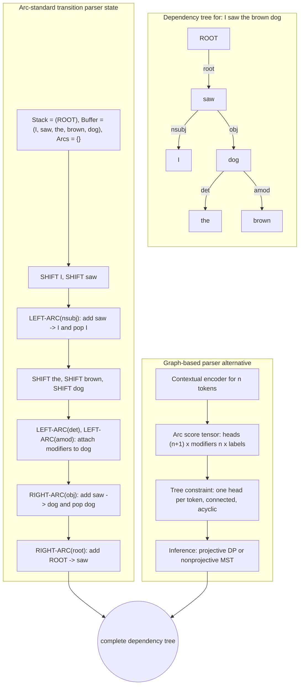

# Dependency Parsing

Dependency parsing represents syntax as directed relations between words. Jurafsky and Martin present dependency relations, transition-based parsing, graph-based parsing, and evaluation. Eisenstein gives a formal structure prediction account: dependency parses are directed graphs over words, graph-based parsers search for high-scoring trees, and transition-based parsers build trees with actions.


*Figure: Parse trees make grammar derivations visible as rooted syntax structures. Image: [Wikimedia Commons](https://commons.wikimedia.org/wiki/File:Parse-tree.svg), Martin Thoma, CC BY 3.0.*

Dependency syntax is often more compact than constituency syntax and is widely used across languages through Universal Dependencies. It directly identifies who depends on whom: subjects attach to predicates, objects attach to verbs, modifiers attach to heads, and function words receive language-specific analyses. These arcs are useful for information extraction, semantic role labeling, relation extraction, and downstream interpretation.

## Definitions

A **dependency parse** is a directed graph over the tokens of a sentence, usually a tree rooted at a special `ROOT` node. Each word except the root has exactly one head. An arc may be labeled, for example `nsubj`, `obj`, `amod`, or `obl`.

For a sentence $w_1,\ldots,w_n$, a dependency tree can be written as a set of arcs:

$$
y=\{(h \xrightarrow{r} m)\}.
$$

Here $h$ is the head index, $m$ is the modifier index, and $r$ is the relation label.

A parse is **projective** if its arcs do not cross when drawn above the sentence. Informally, every word between a head and dependent is inside the head's subtree. Non-projective arcs occur in many languages and are important for free word order.

A **transition-based parser** uses a parser state, often including a stack, buffer, and set of arcs. Actions such as `SHIFT`, `LEFT-ARC`, and `RIGHT-ARC` update the state until a tree is complete.

A **graph-based parser** scores possible arcs and searches for the highest-scoring valid tree:

$$
\hat{y}=\arg\max_{y\in Y(w)} \sum_{(h,r,m)\in y} s(h,r,m,w).
$$

An **arc-factored** model assumes the score of a tree decomposes as a sum of independent arc scores.

## Key results

Dependency parsing is a structured prediction problem. The number of possible trees grows rapidly with sentence length, but useful decompositions make search tractable.

Transition-based parsers are fast. In an arc-standard system, a projective parse can be built with a linear number of actions. At each state, a classifier chooses the next action from features of the stack, buffer, existing arcs, and neural representations. The risk is search error: an early wrong action can make the gold tree unreachable.

Graph-based parsers search more globally. If the parse must be projective, dynamic programming algorithms related to lexicalized constituency parsing can find the best tree. If non-projective trees are allowed and the model is arc-factored, maximum spanning tree algorithms such as Chu-Liu-Edmonds can find the best tree. Higher-order graph-based parsing scores siblings or grandparents, but exact inference becomes more expensive and sometimes NP-hard for non-projective trees.

Evaluation uses **unlabeled attachment score** and **labeled attachment score**:

$$
\mathrm{UAS}=\frac{\#\text{tokens with correct head}}{\#\text{tokens}},
$$

$$
\mathrm{LAS}=\frac{\#\text{tokens with correct head and label}}{\#\text{tokens}}.
$$

Dependency choices are not purely mathematical; annotation guidelines matter. In Universal Dependencies, content words are often preferred as heads, which can differ from older constituency-derived head rules. Coordination, ellipsis, copulas, prepositions, and multiword expressions are common sources of disagreement.

Modern parsers usually score arcs using contextual encoders such as BiLSTMs or transformers. A biaffine scorer computes head-dependent compatibility for all pairs, and a tree algorithm or local selection produces the final parse.

The contrast with constituency parsing is not only visual. Constituency structures emphasize nested spans; dependency structures emphasize bilexical relations. This makes dependencies attractive for relation extraction, where the shortest dependency path between two entities can be more informative than the surface words between them. It also makes dependencies easier to compare across languages with freer word order, although annotation decisions still vary.

Transition-based and graph-based parsers embody a tradeoff between greedy flexibility and global optimality. A transition parser can use rich features of the current configuration and run very quickly, but it may commit to an action that blocks the correct tree. A graph-based parser can optimize a global tree objective, but the objective is often restricted to arc-factored or low-order scores so inference remains tractable. Neural scoring reduces the need for manual feature engineering in both families.

Projectivity is a useful diagnostic. If a language or domain has many non-projective sentences, a parser restricted to projective trees has a ceiling no matter how good its classifier is. If the corpus is mostly projective, projective parsing may be faster and simpler. The right algorithm depends on treebank guidelines, language typology, and downstream tolerance for attachment errors.

Dependency parsing also depends heavily on tokenization and multiword conventions. A contraction, compound name, or fixed expression may be represented as one token, several syntactic words, or a multiword token with internal structure. Universal Dependencies makes these conventions explicit, but downstream users often see only the final arcs. If relation extraction relies on dependency paths, a tokenization mismatch can change the path and therefore the extracted relation.

Error analysis should distinguish head errors from label errors. A parser may attach a modifier to the correct head but choose `obl` instead of `nmod`, or choose the wrong head with a plausible label. These two failures affect downstream systems differently. Relation extraction often cares more about the path topology, while grammar feedback may care strongly about the label.

## Visual



The upper tree shows the final labeled arcs, while the transition parser expands how stack, buffer, and arc set evolve until every token has a head. The graph-based branch exposes the alternative architecture: score all head-modifier-label triples, then enforce the global tree constraint with dynamic programming or maximum-spanning-tree inference.

| Parser type | Search unit | Strength | Weakness |
|---|---|---|---|
| Transition-based | actions over stack and buffer | very fast, flexible features | search errors |
| Graph-based arc-factored | dependency arcs | global tree optimization | limited arc independence |
| Higher-order graph-based | arcs plus siblings or grandparents | richer structure | expensive inference |
| Neural biaffine | contextual pair scores | strong modern accuracy | needs labeled treebanks |

## Worked example 1: arc-standard transition parsing

Problem: parse `I saw dogs` with arcs `saw -> I` as `nsubj`, `saw -> dogs` as `obj`, and `ROOT -> saw` as `root`. Use an arc-standard style stack and buffer. Initial state has stack `[ROOT]`, buffer `[I, saw, dogs]`, arcs `{}`.

1. `SHIFT` moves `I` to the stack:
   - Stack: `[ROOT, I]`
   - Buffer: `[saw, dogs]`
2. `SHIFT` moves `saw`:
   - Stack: `[ROOT, I, saw]`
   - Buffer: `[dogs]`
3. `LEFT-ARC(nsubj)` adds `saw -> I` and removes `I`:
   - Stack: `[ROOT, saw]`
   - Buffer: `[dogs]`
   - Arcs: `{saw -> I}`
4. `SHIFT` moves `dogs`:
   - Stack: `[ROOT, saw, dogs]`
   - Buffer: `[]`
5. `RIGHT-ARC(obj)` adds `saw -> dogs` and removes `dogs`:
   - Stack: `[ROOT, saw]`
   - Arcs: `{saw -> I, saw -> dogs}`
6. `RIGHT-ARC(root)` adds `ROOT -> saw` and removes `saw`:
   - Stack: `[ROOT]`
   - Buffer: `[]`

Checked answer: the final arc set matches the intended parse.

## Worked example 2: choosing a graph-based parse

Problem: choose heads for `I saw dogs` from these unlabeled arc scores:

| Arc | Score |
|---|---:|
| `ROOT -> saw` | $5$ |
| `ROOT -> I` | $0$ |
| `ROOT -> dogs` | $0$ |
| `saw -> I` | $4$ |
| `saw -> dogs` | $3$ |
| `I -> saw` | $1$ |
| `dogs -> saw` | $1$ |
| `I -> dogs` | $0$ |
| `dogs -> I` | $0$ |

A valid dependency tree over three words must give each word one head and avoid cycles.

1. For `saw`, the best incoming arc is `ROOT -> saw` with score $5$.
2. For `I`, the best incoming arc is `saw -> I` with score $4$.
3. For `dogs`, the best incoming arc is `saw -> dogs` with score $3$.
4. These arcs form a connected tree with no cycle:

$$
ROOT\to saw,\quad saw\to I,\quad saw\to dogs.
$$

5. Total score:

$$
5+4+3=12.
$$

Checked answer: choose the three arcs above. In more complex cases, locally best incoming arcs can create cycles, so a maximum spanning tree algorithm is needed.

## Code

```python
tokens = ["ROOT", "I", "saw", "dogs"]
scores = {
    ("ROOT", "saw"): 5,
    ("ROOT", "I"): 0,
    ("ROOT", "dogs"): 0,
    ("saw", "I"): 4,
    ("saw", "dogs"): 3,
    ("I", "saw"): 1,
    ("dogs", "saw"): 1,
    ("I", "dogs"): 0,
    ("dogs", "I"): 0,
}

# Tiny exhaustive search for demonstration only.
words = tokens[1:]
best = None
for h_i in tokens:
    if h_i == "I":
        continue
    for h_saw in tokens:
        if h_saw == "saw":
            continue
        for h_dogs in tokens:
            if h_dogs == "dogs":
                continue
            arcs = [(h_i, "I"), (h_saw, "saw"), (h_dogs, "dogs")]
            if sum(1 for h, m in arcs if h == "ROOT") != 1:
                continue
            total = sum(scores.get(arc, -99) for arc in arcs)
            if best is None or total > best[0]:
                best = (total, arcs)

print(best)
```

## Common pitfalls

- Assuming every dependency annotation scheme chooses the same head.
- Ignoring non-projective constructions in languages where they are common.
- Reporting UAS only when relation labels matter for downstream tasks.
- Using transition systems without understanding which trees they can produce.
- Letting local arc choices form cycles in graph-based parsing.
- Comparing parsers across treebanks with different tokenization or punctuation conventions.
- Treating dependency parses as complete semantics; they are syntactic structures, not full meaning representations.

## Connections

- [Constituency parsing with CKY](/cs/nlp/constituency-parsing-cky)
- [Information extraction](/cs/nlp/information-extraction)
- [Semantic role labeling and word-sense disambiguation](/cs/nlp/semantic-role-labeling-and-word-sense-disambiguation)
- [Sequence labeling with HMMs and CRFs](/cs/nlp/sequence-labeling-hmms-crfs)
