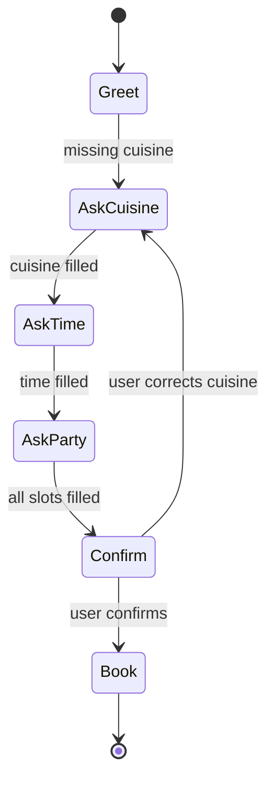

# Dialogue and Chatbots

Dialogue systems interact with users over multiple turns. Jurafsky and Martin cover properties of conversation, frame-based systems, dialogue acts, dialogue state, chatbots, and dialogue system design. Eisenstein discusses dialogue in the broader text generation chapter, including finite-state and agenda-based systems, Markov decision processes, POMDPs, neural encoder-decoder chatbots, and integration with task-oriented dialogue.

Dialogue is not just text generation repeated turn by turn. A system must track user goals, slot values, grounding, corrections, initiative, persona, safety constraints, and sometimes speech recognition uncertainty. Chatbots range from scripted pattern systems like ELIZA to task-oriented assistants and open-domain LLM interfaces.

## Definitions

A **dialogue system** maps a dialogue history to the next system action or utterance. A **turn** is one speaker contribution. A **dialogue act** labels the function of a turn, such as question, answer, request, confirmation, greeting, or backchannel.

A **frame-based dialogue system** represents the user's goal as a frame with slots. For a restaurant booking system, slots might include cuisine, date, time, party size, and location.

**Dialogue state tracking** estimates the current state:

$$
b_t(s)=P(s_t=s\mid o_{1:t},a_{1:t-1}),
$$

where $o_t$ is the user observation and $a_t$ is the system action. A system may keep a single best state or a belief distribution.

A **dialogue policy** chooses the next action from the state. In a Markov decision process, the policy is

$$
\pi(a\mid s).
$$

In a partially observable MDP, the policy conditions on a belief state rather than a known state.

A **chatbot** may be task-oriented, open-domain, retrieval-based, generative, or hybrid. Modern LLM chatbots use prompting, instruction tuning, retrieval augmentation, tools, and safety policies to shape behavior.

## Key results

Finite-state dialogue is reliable for narrow tasks. It defines a fixed graph of states and transitions, so it is easy to test and control. Its weakness is inflexibility: users may provide information out of order, revise earlier answers, or combine multiple intents.

Frame-based and agenda-based systems improve flexibility. The system fills any slots it can extract from the user utterance, then asks for missing required slots. This supports mixed initiative: either the user or system can guide the next turn.

Dialogue state tracking handles uncertainty. In spoken systems, ASR may confuse words; in text systems, NLU may misclassify intent. A belief distribution lets the system ask confirmations or choose robust actions:

```text
User: I need a table near campus.
System belief: location=campus 0.72, cuisine=unknown, time=unknown.
System action: ask time.
```

Neural dialogue models can generate fluent responses, but likelihood training often rewards generic replies like `I don't know`. Reinforcement learning, retrieval grounding, reranking, instruction tuning, and explicit state representations help align generation with task success and conversational quality.

LLM dialogue systems make the boundary between task-oriented and open-domain dialogue less rigid, but they still need state, grounding, tool-use protocols, memory policies, and safety checks. A system that can generate plausible text is not automatically reliable at booking, diagnosis, finance, legal advice, or personal data handling.

Evaluation is difficult. Task success, slot accuracy, user satisfaction, factuality, harmlessness, latency, and repair behavior all matter. Automatic overlap metrics correlate poorly with human judgments for open-ended dialogue.

Dialogue differs from single-turn QA because every answer changes the future context. A bad clarification question can frustrate the user; an unsupported assumption can send the dialogue down the wrong path; an overconfident generated answer can create false commitments. Good systems therefore separate language understanding, state update, policy, tool execution, and response generation, even when an LLM is used inside one or more of those steps.

Grounding is the process of establishing that participants understand each other well enough to proceed. Human conversations use confirmations, repairs, backchannels, and reformulations. Task systems need similar mechanisms: `Did you mean Hongdae in Seoul?`, `I found two bookings; which one should I cancel?`, or `I cannot complete that without a date.` These moves are not failures; they are part of robust dialogue.

Safety and privacy are dialogue-specific because users reveal information over time. A system may need to remember a slot within a session but not store it permanently. It may need to call tools only after confirmation. It may need to refuse unsafe requests while still helping with a safe alternative. These policies belong in the dialogue design, not only in the final generated wording.

Open-domain chatbots add persona and style issues. Consistency can improve user experience, but fabricated personal experiences or emotional claims can be misleading. The system should distinguish between conversational warmth, factual grounding, and actual commitments.

Tool use makes dialogue state more concrete. A travel assistant may need to search flights, hold an itinerary, ask for confirmation, book only after approval, and remember the booking reference for later turns. The language model can help interpret and phrase requests, but the application should maintain authoritative state outside the generated text. This separation prevents the system from treating a guessed sentence as a completed action.

A good dialogue design includes graceful failure. The system should know when to ask again, when to offer choices, when to summarize state, when to hand off to a human, and when to stop. These behaviors often matter more to users than whether every individual response is maximally fluent.

Conversation logs should be reviewed as trajectories, not isolated turns. A response that looks reasonable alone may be wrong because it ignores a correction three turns earlier or contradicts a tool result. Multi-turn evaluation should therefore include state consistency.

## Visual



| Dialogue type | State representation | Response method | Best fit |
|---|---|---|---|
| Finite-state | current node | scripted prompt | narrow fixed flow |
| Frame-based | slot table | templates or NLG | task completion |
| POMDP | belief distribution | learned policy | noisy spoken dialogue |
| Retrieval chatbot | dialogue context vector | retrieved response | FAQ and support |
| Generative LLM | prompt and hidden context | next-token generation | flexible mixed tasks |

## Worked example 1: slot filling

Problem: update a restaurant-booking frame from this user utterance:

```text
I need a Korean place for four near Hongdae tomorrow at 7.
```

Frame slots: cuisine, party size, location, date, time.

1. Detect cuisine:
   - `Korean` fills cuisine = Korean.
2. Detect party size:
   - `for four` fills party size = 4.
3. Detect location:
   - `near Hongdae` fills location = Hongdae.
4. Detect date:
   - `tomorrow` fills date = tomorrow relative to the dialogue date.
5. Detect time:
   - `at 7` fills time = 7. This may require clarification if AM/PM is ambiguous.
6. Updated frame:

| Slot | Value |
|---|---|
| cuisine | Korean |
| party size | 4 |
| location | Hongdae |
| date | tomorrow |
| time | 7, needs AM/PM if domain requires |

Checked answer: all slots are filled, but a robust system should confirm the ambiguous time.

## Worked example 2: choosing a repair action

Problem: after ASR/NLU, the system has these beliefs for cuisine:

| cuisine | probability |
|---|---:|
| Korean | $0.45$ |
| Italian | $0.40$ |
| Thai | $0.05$ |
| unknown | $0.10$ |

The confidence threshold for direct confirmation is $0.70$. Choose the next action.

1. Best hypothesis is Korean with probability $0.45$.
2. Since $0.45 \lt  0.70$, confidence is too low for `confirm Korean`.
3. The top two hypotheses are close: Korean $0.45$ and Italian $0.40$.
4. A good repair question contrasts them:

```text
Did you want Korean or Italian food?
```

Checked answer: ask a disambiguating question rather than silently choosing Korean.

## Code

```python
import re

def update_frame(frame, utterance):
    text = utterance.lower()
    cuisines = ["korean", "italian", "thai", "japanese"]
    for cuisine in cuisines:
        if cuisine in text:
            frame["cuisine"] = cuisine.title()
    m = re.search(r"for (\d+|one|two|three|four)", text)
    if m:
        word = m.group(1)
        frame["party_size"] = {"one": 1, "two": 2, "three": 3, "four": 4}.get(word, int(word) if word.isdigit() else None)
    m = re.search(r"near ([a-zA-Z]+)", utterance)
    if m:
        frame["location"] = m.group(1)
    if "tomorrow" in text:
        frame["date"] = "tomorrow"
    m = re.search(r"at (\d{1,2})(?::(\d{2}))?", text)
    if m:
        frame["time"] = m.group(0).replace("at ", "")
    return frame

frame = {}
print(update_frame(frame, "I need a Korean place for four near Hongdae tomorrow at 7."))
```

## Common pitfalls

- Building a chatbot with no explicit state and expecting it to complete multi-turn tasks reliably.
- Treating ASR or NLU one-best output as certain.
- Failing to support corrections such as `no, I said Korean, not Italian`.
- Evaluating open-domain dialogue only with BLEU-like overlap metrics.
- Allowing generated responses to invent bookings, policies, citations, or tool results.
- Mixing long-term memory and sensitive user data without explicit policy.
- Designing prompts instead of designing the whole dialogue workflow, including fallbacks and escalation.

## Connections

- [Pretrained language models](/cs/nlp/pretrained-language-models)
- [Speech recognition and synthesis](/cs/nlp/speech-recognition-and-synthesis)
- [Information extraction](/cs/nlp/information-extraction)
- [Coreference resolution and entity linking](/cs/nlp/coreference-resolution-and-entity-linking)
