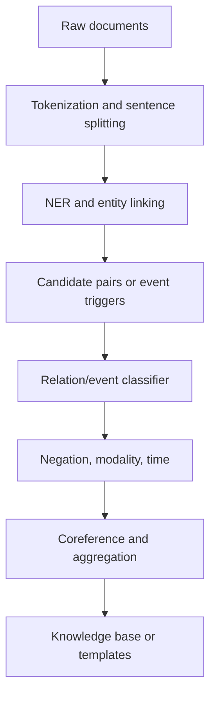

# Information Extraction

Information extraction turns unstructured text into structured records. Jurafsky and Martin cover relation extraction, relation algorithms, events, time, aspect, temporal datasets, automatic temporal analysis, and template filling. Eisenstein gives a complementary account of entities, relation extraction patterns, classification, neural relation extraction, distant supervision, open information extraction, events, modality, negation, and links to question answering.

IE is useful when the goal is not to understand every sentence completely but to populate a database, knowledge graph, alert, timeline, or report. It asks targeted questions: Which entities are mentioned? What relation holds between them? Did an event happen? Who participated? When? Was it negated, hypothetical, or certain?

## Definitions

An **entity mention** is a text span referring to an entity, such as a person, organization, location, product, or date. Named entity recognition detects and classifies such mentions.

**Relation extraction** identifies semantic relations between entity mentions or entities. Example:

```text
[Marie Curie] was born in [Warsaw].
```

This expresses a `PERSON-BIRTHPLACE` relation.

**Event extraction** identifies event triggers and arguments. In `The company acquired the startup on Monday`, `acquired` is a trigger, the company is buyer, the startup is acquired entity, and Monday is time.

**Template filling** populates predefined slots for an event or entity type. A management succession template might include organization, old executive, new executive, position, and date.

**Open information extraction** extracts textual triples without a fixed relation schema:

```text
(Marie Curie; was born in; Warsaw)
```

**Distant supervision** uses an existing knowledge base to label sentences automatically: if a KB contains relation $(e_1,r,e_2)$, sentences mentioning $e_1$ and $e_2$ are treated as noisy evidence for $r$.

## Key results

Pattern-based IE is precise when language is formulaic. Hearst-style lexico-syntactic patterns can identify relations such as hyponymy, and regular expressions or finite-state transducers work well for dates, money, citations, and domain forms. The weakness is recall: natural language expresses the same relation in many ways.

Classification-based relation extraction represents a candidate pair and predicts a relation label:

$$
\hat{r}=\arg\max_r s(r,e_1,e_2,w).
$$

Features may include entity types, words between mentions, dependency paths, trigger words, order, distance, and surrounding context. Neural models encode the sentence or dependency path with CNNs, RNNs, or transformers, then classify candidate pairs.

Dependency paths are especially useful because relations often follow syntax rather than surface distance. In `The book that Kim recommended was written by Lee`, the relation between `book` and `Lee` is clearer through the dependency path than through adjacent words.

Distant supervision reduces annotation cost but introduces noise. A KB fact may be true even if a particular sentence mentioning the entities does not express it. Multi-instance learning handles this by treating a bag of sentences for an entity pair as evidence, assuming at least one sentence expresses the relation.

Event extraction extends relation extraction with triggers, event types, arguments, time, modality, and coreference. Negation and factuality are crucial. `The company did not acquire the startup` should not populate the same acquisition fact as an affirmative sentence. `plans to acquire` and `may acquire` express possibility or intention, not completed events.

IE evaluation can be mention-level, sentence-level, relation-level, or KB-level. A system with high sentence-level F1 may still produce duplicate or contradictory KB entries if coreference, entity linking, and aggregation are weak.

A useful design distinction is closed-schema versus open-schema extraction. Closed-schema IE knows the relation or event types in advance, so it can use supervised classifiers and precise templates. OpenIE is more flexible and can discover relation phrases from text, but the resulting triples may be redundant, vague, or hard to canonicalize. Knowledge-base construction usually needs normalization after extraction: entity linking, relation clustering, type checking, and conflict resolution.

The best features depend on the relation. A birthplace relation may be expressed with prepositions such as `in` or verbs such as `born`; an employment relation may require organization names and titles; a drug-side-effect relation may rely on biomedical terminology. This is why IE systems are often domain-specific. A news-trained extractor may not work on clinical notes, legal contracts, scientific papers, or social media without adaptation.

IE should preserve provenance. A structured fact is more trustworthy when it points back to the sentence, document, date, source, and extraction confidence that produced it. Provenance supports error analysis, human review, temporal updates, and conflict handling. Without provenance, a knowledge base becomes hard to debug when the world changes or when extraction rules are revised.

The extraction pipeline should also expose abstention. In many domains, a system that says `unknown` is preferable to one that fills a plausible but unsupported slot. Confidence thresholds, calibration, human-in-the-loop review, and consistency checks can reduce false facts. This is especially important when extracted records drive search, recommendations, compliance workflows, or scientific databases.

Aggregation can improve precision but also introduce bias. If a relation is mentioned in many documents, it may be more likely to be true, but widely repeated false claims also become overrepresented. IE systems should distinguish evidence count, source reliability, and extraction confidence rather than merging them into one opaque score.

Schema design is another source of errors. If the schema lacks a slot for uncertainty, planned events, or source attribution, the system may force nuanced language into an overconfident fact. Good schemas reflect the decisions users actually need to make.

Finally, IE is rarely finished at extraction time. Users need search, filtering, deduplication, confidence display, and correction workflows so extracted structure can be inspected and improved over time.

## Visual



| IE task | Input candidate | Output | Typical signal |
|---|---|---|---|
| NER | token span | entity type | capitalization, context, gazetteers |
| Relation extraction | entity pair | relation label | dependency path, context |
| Event extraction | trigger and arguments | event frame | trigger verbs, roles, time |
| Temporal IE | event and time mentions | ordering or anchoring | tense, aspect, temporal expressions |
| OpenIE | sentence | textual triples | shallow syntax patterns |
| Template filling | document set | slot values | aggregation across mentions |

## Worked example 1: relation extraction from a dependency cue

Problem: extract a relation from:

```text
Ada Lovelace worked with Charles Babbage on the Analytical Engine.
```

1. Detect entity mentions:
   - `Ada Lovelace`: person
   - `Charles Babbage`: person
   - `the Analytical Engine`: artifact
2. Generate candidate pairs:
   - `(Ada Lovelace, Charles Babbage)`
   - `(Ada Lovelace, Analytical Engine)`
   - `(Charles Babbage, Analytical Engine)`
3. Look for lexical and syntactic cues:
   - `worked with` connects the two person mentions.
   - `on` connects the work relation to the artifact.
4. Assign relation labels:
   - `(Ada Lovelace, Charles Babbage)`: `COLLABORATED_WITH`
   - `(Ada Lovelace, Analytical Engine)`: `WORKED_ON`
   - `(Charles Babbage, Analytical Engine)`: likely `WORKED_ON`, though the sentence directly says Lovelace worked with him on it; a cautious extractor may require stronger evidence.

Checked answer: at minimum, extract `COLLABORATED_WITH(Ada Lovelace, Charles Babbage)` and `WORKED_ON(Ada Lovelace, Analytical Engine)`.

## Worked example 2: template filling with negation

Problem: decide whether to fill an acquisition template from:

```text
Northstar said it would not acquire Bluefin in 2025.
```

Template slots are buyer, acquired company, and date.

1. Detect event trigger:
   - `acquire` suggests an acquisition event.
2. Identify arguments:
   - Buyer: `Northstar`
   - Acquired company: `Bluefin`
   - Date: `2025`
3. Detect modality and negation:
   - `would` indicates modal/future or reported plan.
   - `not` negates the acquisition.
4. Decide template status:
   - Do not insert as a completed acquisition.
   - Store as a negated or denied acquisition statement if the schema supports factuality.

Checked answer: a fact KB should not add `ACQUIRED(Northstar, Bluefin, 2025)`. The extracted event is negated.

## Code

```python
import re

pattern = re.compile(
    r"(?P<buyer>[A-Z][A-Za-z]+)\s+"
    r"(?:said\s+it\s+would\s+)?"
    r"(?P<neg>not\s+)?acquire\s+"
    r"(?P<target>[A-Z][A-Za-z]+)\s+in\s+"
    r"(?P<date>\d{4})"
)

def extract_acquisition(sentence):
    m = pattern.search(sentence)
    if not m:
        return None
    return {
        "event": "ACQUIRE",
        "buyer": m.group("buyer"),
        "target": m.group("target"),
        "date": m.group("date"),
        "factuality": "NEGATED" if m.group("neg") else "ASSERTED",
    }

for s in [
    "Northstar acquire Bluefin in 2025",
    "Northstar said it would not acquire Bluefin in 2025",
]:
    print(extract_acquisition(s))
```

## Common pitfalls

- Confusing entity mentions with canonical entities; coreference and linking may be needed.
- Extracting relations from sentences where the relation is negated, hypothetical, questioned, or attributed to an unreliable source.
- Treating every sentence containing two entities as expressing a KB relation.
- Using fixed patterns and expecting high recall across genres.
- Evaluating only trigger detection while ignoring argument correctness.
- Letting duplicate mentions create duplicate facts.
- Ignoring temporal scope; `formerly worked at` and `currently works at` should not populate the same current-employment slot.

## Connections

- [Sequence labeling with HMMs and CRFs](/cs/nlp/sequence-labeling-hmms-crfs)
- [Dependency parsing](/cs/nlp/dependency-parsing)
- [Coreference resolution and entity linking](/cs/nlp/coreference-resolution-and-entity-linking)
- [Semantic role labeling and word-sense disambiguation](/cs/nlp/semantic-role-labeling-and-word-sense-disambiguation)
