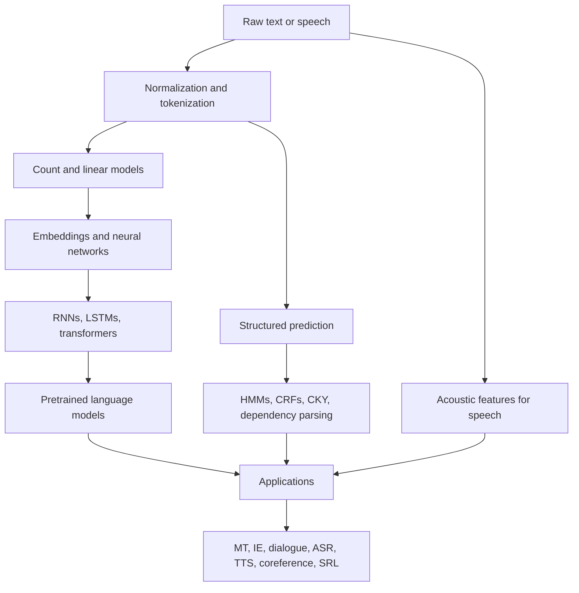

# Natural Language Processing

Natural language processing studies computational methods for analyzing, representing, transforming, and generating human language. This section combines two complementary sources: Jurafsky and Martin's *Speech and Language Processing* is used as the primary structure because it gives the broadest modern coverage, including transformers, pretrained language models, dialogue, and speech. Eisenstein's *Natural Language Processing* is used as a secondary source for formal machine-learning depth, especially probabilistic models, structured prediction, parsing, semantics, and the connections among learning, search, and linguistic structure.


*Figure: ELIZA provides historical context for dialogue systems and chatbot evaluation. Image: [Wikimedia Commons](https://commons.wikimedia.org/wiki/File:ELIZA_conversation.png), Unknown author, public domain text.*


*Figure: Parse trees make grammar derivations visible as rooted syntax structures. Image: [Wikimedia Commons](https://commons.wikimedia.org/wiki/File:Parse-tree.svg), Martin Thoma, CC BY 3.0.*


*Figure: Skip-gram training ties word meaning to surrounding context. Image: [Wikimedia Commons](https://commons.wikimedia.org/wiki/File:Word_embeddings_Skip-gram.svg), Jeran Renz, CC BY-SA 4.0.*

The notes are organized as a single merged course rather than as per-book summaries. When the books overlap, the pages usually follow Jurafsky and Martin for terminology and topic order, then add Eisenstein's notation or modeling perspective where it sharpens the math. When a topic is covered mainly by one book, the page says so implicitly through its emphasis: speech and modern prompting come mostly from Jurafsky and Martin, while weighted grammars, CRFs, and structured search draw heavily from Eisenstein.

## Definitions

An **NLP task** maps linguistic input to a useful output: labels, spans, parse trees, entities, translations, answers, speech transcripts, synthetic speech, or generated text. Tasks vary by input and output structure. Classification maps one input to one label; sequence labeling maps tokens to labels; parsing maps a sentence to a tree or graph; generation maps context to a sequence.

A **representation** is the form in which language is encoded for a model. The section moves from characters and regular expressions to tokens, n-grams, sparse vectors, dense embeddings, recurrent states, attention states, parse structures, semantic frames, discourse entities, and acoustic features.

A **model** assigns scores or probabilities to outputs. Examples include Naive Bayes, logistic regression, HMMs, CRFs, feedforward networks, RNNs, LSTMs, transformers, encoder-decoders, and CTC models. Some are generative, modeling how inputs and labels arise jointly; others are discriminative, modeling outputs conditional on inputs.

An **inference algorithm** searches for the best output under a model. Viterbi searches tag sequences, CKY searches constituency parses, beam search approximates decoding in translation and generation, maximum spanning tree algorithms search dependency parses, and CTC dynamic programming sums alignments.

An **evaluation metric** measures whether the output is useful. Accuracy, precision, recall, $F_1$, perplexity, attachment score, BLEU, chrF, word error rate, and human preference all measure different properties. No single metric captures all behavior.

## Key results

The first recurring result is that language is discrete but sparse. Vocabulary grows with corpus size, rare words matter, and exact n-gram histories are often unseen. This motivates smoothing, subword tokenization, embeddings, and pretrained models. It also explains why simple baselines can fail abruptly on domain shift.

The second result is that local decisions often need global structure. A token classifier can assign impossible BIO sequences; a grammar can produce exponentially many parses; a translation system must choose among many target strings. NLP therefore repeatedly combines local scoring functions with dynamic programming, graph algorithms, or approximate search.

The third result is that representation and learning are inseparable. A bag-of-words representation makes Naive Bayes and logistic regression fast and interpretable, but it loses order. RNNs add order through recurrence. Transformers add direct pairwise token interaction through self-attention. Semantic and discourse tasks add frames, roles, entities, and links. Speech tasks add acoustic time-frequency features before language modeling even begins.

The fourth result is that modern systems are layered. A single application may use tokenization, pretrained embeddings, sequence labeling, dependency parsing, entity linking, retrieval, generation, and speech components. Errors compound across layers, so robust engineering requires understanding both the individual algorithms and their interfaces.

The detail pages in this section are:

| Position | Page | Main sources |
|---:|---|---|
| 2 | [Regular Expressions, Text Normalization, and Edit Distance](/cs/nlp/regular-expressions-normalization-edit-distance) | J&M Ch. 2, Eisenstein formal language background |
| 3 | [N-gram Language Models](/cs/nlp/n-gram-language-models) | J&M Ch. 3, Eisenstein Ch. 6 |
| 4 | [Naive Bayes and Sentiment Classification](/cs/nlp/naive-bayes-sentiment-classification) | J&M Ch. 4, Eisenstein Ch. 2 and 4 |
| 5 | [Logistic Regression for Text](/cs/nlp/logistic-regression-for-text) | J&M Ch. 5, Eisenstein Ch. 2 |
| 6 | [Vector Semantics and Embeddings](/cs/nlp/vector-semantics-and-embeddings) | J&M Ch. 6, Eisenstein Ch. 14 |
| 7 | [Neural Networks for NLP](/cs/nlp/neural-networks-for-nlp) | J&M Ch. 7, Eisenstein Ch. 3 |
| 8 | [RNNs and LSTMs for Sequence Modeling](/cs/nlp/rnns-lstms-sequence-modeling) | J&M Ch. 9, Eisenstein Ch. 6 and 7 |
| 9 | [Transformers and Self-Attention](/cs/nlp/transformers-self-attention) | J&M Ch. 10, Eisenstein neural attention context |
| 10 | [Pretrained Language Models](/cs/nlp/pretrained-language-models) | J&M Ch. 10-12, Eisenstein foundations |
| 11 | [Sequence Labeling with HMMs and CRFs](/cs/nlp/sequence-labeling-hmms-crfs) | J&M Ch. 8, Eisenstein Ch. 7-8 |
| 12 | [Constituency Parsing with CKY](/cs/nlp/constituency-parsing-cky) | J&M Ch. 17, Eisenstein Ch. 9-10 |
| 13 | [Dependency Parsing](/cs/nlp/dependency-parsing) | J&M Ch. 18, Eisenstein Ch. 11 |
| 14 | [Machine Translation](/cs/nlp/machine-translation) | J&M Ch. 13, Eisenstein Ch. 18 |
| 15 | [Semantic Role Labeling and Word-Sense Disambiguation](/cs/nlp/semantic-role-labeling-and-word-sense-disambiguation) | J&M Ch. 20, Eisenstein Ch. 4 and 13 |
| 16 | [Coreference Resolution and Entity Linking](/cs/nlp/coreference-resolution-and-entity-linking) | J&M Ch. 22, Eisenstein Ch. 15 and 17 |
| 17 | [Information Extraction](/cs/nlp/information-extraction) | J&M Ch. 19, Eisenstein Ch. 17 |
| 18 | [Dialogue and Chatbots](/cs/nlp/dialogue-and-chatbots) | J&M Ch. 15, Eisenstein Ch. 19 |
| 19 | [Speech Recognition and Synthesis](/cs/nlp/speech-recognition-and-synthesis) | J&M Ch. 16, Eisenstein speech overview |

## Visual



| Theme | Classical expression | Neural expression | Why it recurs |
|---|---|---|---|
| Sparsity | smoothing and backoff | embeddings and pretraining | language has a long tail |
| Sequence dependence | HMM, CRF, Viterbi | RNN, transformer | words depend on context |
| Structure | CFG, CKY, dependencies | neural span and graph parsers | meaning is not flat text |
| Search | dynamic programming, beam search | decoding and constrained generation | output spaces are huge |
| Meaning | roles, senses, entities | contextual embeddings and LLMs | surface form underdetermines intent |
| Evaluation | F1, perplexity, WER | human eval plus benchmarks | metrics capture only slices of quality |

## Worked example 1: choosing a model family

Problem: decide which family of methods is appropriate for four tasks: spam detection, named entity recognition, machine translation, and word error rate computation.

1. Spam detection has one label for a whole document or message. A bag-of-words Naive Bayes or logistic regression baseline is appropriate. A transformer classifier may improve accuracy, but the output structure is still simple classification.
2. Named entity recognition assigns a BIO label to each token. This is sequence labeling. A CRF, BiLSTM tagger, or transformer token classifier with a CRF layer is appropriate because label transitions matter.
3. Machine translation maps one sequence to another sequence of different length, with reordering and lexical choice. An encoder-decoder model with attention or a transformer MT system is appropriate. Beam search or another decoding method is needed.
4. Word error rate compares a hypothesis transcript against a reference transcript. This is not a learned model by itself; it is sequence alignment by edit distance over words.

Checked answer: the tasks map to four different output structures: document label, token labels, generated sequence, and alignment distance. The model choice follows the output structure.

## Worked example 2: tracing one sentence through the wiki

Problem: trace the sentence `Ada wrote code for the engine` through several layers of NLP analysis.

1. Tokenization produces:

```text
Ada | wrote | code | for | the | engine
```

2. A POS tagger might assign:

```text
Ada/PROPN wrote/VERB code/NOUN for/ADP the/DET engine/NOUN
```

3. A dependency parser might identify:
   - `wrote` as root
   - `Ada` as nominal subject of `wrote`
   - `code` as object of `wrote`
   - `engine` as oblique modifier or prepositional object connected through `for`
4. Semantic role labeling for `wrote` might produce:

```text
[ARG0 Ada] [PRED wrote] [ARG1 code] [ARGM-Purpose for the engine]
```

5. Information extraction might create a structured candidate:

```text
WORKED_ON(person=Ada, artifact=engine, product=code)
```

Checked answer: each layer adds structure, but each layer also introduces possible ambiguity. `for the engine` could mean purpose, beneficiary, or target artifact depending on context.

## Code

```python
from pathlib import Path

pages = [
    "regular-expressions-normalization-edit-distance",
    "n-gram-language-models",
    "naive-bayes-sentiment-classification",
    "logistic-regression-for-text",
    "vector-semantics-and-embeddings",
    "neural-networks-for-nlp",
    "rnns-lstms-sequence-modeling",
    "transformers-self-attention",
    "pretrained-language-models",
    "sequence-labeling-hmms-crfs",
    "constituency-parsing-cky",
    "dependency-parsing",
    "machine-translation",
    "semantic-role-labeling-and-word-sense-disambiguation",
    "coreference-resolution-and-entity-linking",
    "information-extraction",
    "dialogue-and-chatbots",
    "speech-recognition-and-synthesis",
]

docs_root = Path("docs/cs/nlp")
for index, slug in enumerate(pages, start=2):
    path = docs_root / f"{slug}.md"
    print(index, path.name, path.exists())
```

## Common pitfalls

- Treating NLP as only language modeling; many core tasks require structured outputs and evaluation beyond next-token prediction.
- Comparing models without matching the task's output structure and data regime.
- Skipping preprocessing decisions, then debugging model behavior that actually comes from tokenization or normalization.
- Assuming neural models remove the need to understand HMMs, CRFs, CKY, or beam search; modern systems reuse the same inference ideas.
- Reading metrics as complete truth. Perplexity, BLEU, WER, and F1 are useful but partial.
- Ignoring source differences: Jurafsky and Martin is broader and newer, while Eisenstein is more formal in several probabilistic and structured areas.
- Building applications without considering fairness, privacy, corpus provenance, and domain shift.

## Connections

- [Regular expressions, text normalization, and edit distance](/cs/nlp/regular-expressions-normalization-edit-distance)
- [Pretrained language models](/cs/nlp/pretrained-language-models)
- [Information extraction](/cs/nlp/information-extraction)
- [Speech recognition and synthesis](/cs/nlp/speech-recognition-and-synthesis)
