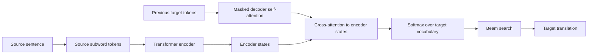

# Machine Translation

Machine translation maps text from a source language to a target language. Jurafsky and Martin emphasize modern encoder-decoder transformer translation, typological divergences, beam search, low-resource settings, and evaluation with chrF and BLEU. Eisenstein gives a complementary historical and formal view: translation as an optimization problem, statistical machine translation with latent alignments, phrase-based and syntax-based ideas, and neural machine translation with attention.

MT is a compact view of NLP as a whole. It needs tokenization, language modeling, sequence modeling, search, semantics, evaluation, and awareness of social context. A translation must be adequate, preserving meaning, and fluent, sounding natural in the target language. Those goals are easy to state and hard to optimize directly.


*Figure: Recurrent neural network shown compactly and unfolded through time. Image: [Wikimedia Commons](https://commons.wikimedia.org/wiki/File:Recurrent_neural_network_unfold.svg), fdeloche, CC BY-SA 4.0.*

## Definitions

Given a source sentence $x$ and target sentence $y$, machine translation seeks

$$
\hat{y}=\arg\max_y P(y\mid x).
$$

In **statistical machine translation**, a classic noisy-channel formulation separates adequacy and fluency:

$$
\hat{e}=\arg\max_e P(f\mid e)P(e),
$$

where $f$ is the foreign/source sentence and $e$ is the English/target sentence in the conventional notation. Word alignments are latent variables that connect source and target words.

In **neural machine translation**, an encoder maps the source tokens to contextual states, and a decoder generates target tokens autoregressively:

$$
P(y\mid x)=\prod_{t=1}^{T}P(y_t\mid y_{<t},x).
$$

An **encoder-decoder transformer** uses self-attention in the encoder, causal self-attention in the decoder, and **cross-attention** from decoder queries to encoder keys and values. **Teacher forcing** trains the decoder on gold previous target tokens. **Beam search** keeps the best $k$ partial translations at each decoding step.

**Parallel corpora** or **bitexts** contain aligned source-target sentence pairs. **Backtranslation** creates synthetic parallel data by translating monolingual target-language text back into the source language.

## Key results

Translation is not word substitution. Languages differ in word order, morphology, agreement, pronoun use, politeness, tense, evidentiality, and what must be made explicit. These divergences explain why phrase-based SMT, syntax-based SMT, and encoder-decoder neural models all needed mechanisms beyond dictionary lookup.

Attention solved a major bottleneck in early neural MT. Instead of encoding a whole source sentence into one final vector, the decoder attends to source states at each target step. Transformer cross-attention keeps this idea: decoder queries decide which source representations are relevant for generating the next target token.

Beam search approximates the impossible exact argmax over all target strings. It tracks $k$ hypotheses, expands each by possible next tokens, and keeps the top $k$ by accumulated log probability. Because raw log probabilities favor shorter outputs, systems often use length normalization:

$$
\mathrm{score}(y)=\frac{1}{|y|^\alpha}\sum_{t=1}^{|y|}\log P(y_t\mid y_{<t},x).
$$

Evaluation is difficult. BLEU measures clipped n-gram precision with a brevity penalty. chrF measures character n-gram precision and recall, often helping with morphologically rich languages. Automatic metrics are useful for comparing similar systems on fixed test sets, but they miss adequacy, discourse context, terminology, style, and serious meaning errors. Human evaluation and task-specific evaluation remain important.

Low-resource MT is not only a technical problem. Many languages lack digitized corpora, standardized orthography resources, or paid annotation infrastructure. Responsible MT development involves native speakers, domain-aware evaluation, and attention to who benefits from the system.

Statistical and neural MT differ in where structure is explicit. SMT exposes phrase tables, alignments, reordering models, and target language models as separate components. Neural MT folds much of this into continuous representations and attention weights. The neural version is usually stronger and more fluent, but its errors can be harder to diagnose. For example, an SMT system might choose an awkward phrase but preserve all content, while an NMT system might generate a fluent sentence that omits a negation.

Subword tokenization is central in modern MT. A fixed word vocabulary cannot cover all inflected forms, names, compounds, and rare words across languages. BPE or related methods let the model translate partly by composing subword units. This helps rare words but can still fail for morphology, names, scripts, and domain terminology. Terminology constraints and copy mechanisms are often needed in professional settings.

MT also shows why document context matters. Sentence-level systems can mistranslate pronouns, formality, discourse connectives, and repeated terminology because the necessary context is outside the sentence. Document-level MT, cache methods, and retrieval of previous translations are attempts to address this, but evaluation remains more difficult than sentence-level scoring.

A deployment-oriented MT system also needs uncertainty handling. Some sentences contain names, measurements, legal terms, or medical statements where a fluent but slightly wrong translation is costly. Practical systems may show confidence, preserve source spans, enforce terminology, route low-confidence outputs to human translators, or provide post-editing interfaces. These workflow choices are part of MT quality, even though they are not captured by the basic encoder-decoder equation.

Search errors and model errors should be separated when debugging. If the gold or a good translation has high model probability but beam search fails to find it, decoding is the issue. If the model assigns high probability to a bad translation, training data, objective, or architecture is the issue. This distinction mirrors the search-versus-learning theme in Eisenstein.

Human post-editing data is especially informative because it shows what a professional translator had to change. Edits can be grouped into terminology, word order, omission, addition, agreement, style, and meaning errors, giving more actionable feedback than a single corpus BLEU score.

## Visual



| MT era | Main representation | Search problem | Strength | Weakness |
|---|---|---|---|---|
| Word-based SMT | words and alignments | target string plus alignment | interpretable alignments | weak fluency and reordering |
| Phrase-based SMT | phrase pairs | phrase segmentation and order | strong pre-neural baseline | sparse phrase tables |
| Syntax-based SMT | trees or transductions | structured translation | handles reordering | parser dependence |
| Neural MT | encoder-decoder states | autoregressive decoding | fluent and generalizing | hallucination and data hunger |
| Transformer MT | self-attention plus cross-attention | beam or sampling | parallel training, strong quality | quadratic attention and bias risks |

## Worked example 1: beam search

Problem: decode two steps with beam width $k=2$. At step 1, the decoder offers:

| token | log probability |
|---|---:|
| `the` | $-0.2$ |
| `a` | $-1.0$ |
| `green` | $-1.5$ |

At step 2:

```text
after "the": witch -0.3, green -0.8
after "a": witch -0.4, house -0.6
```

1. Keep top $2$ step-1 hypotheses:
   - `the` with score $-0.2$
   - `a` with score $-1.0$
2. Expand them:
   - `the witch`: $-0.2 + (-0.3)=-0.5$
   - `the green`: $-0.2 + (-0.8)=-1.0$
   - `a witch`: $-1.0 + (-0.4)=-1.4$
   - `a house`: $-1.0 + (-0.6)=-1.6$
3. Keep top $2$:
   - `the witch` with $-0.5$
   - `the green` with $-1.0$

Checked answer: after two steps, the beam contains `the witch` and `the green`. A later token may still make the second hypothesis better, which is why beam search delays commitment.

## Worked example 2: clipped unigram precision for BLEU

Problem: candidate translation is `the the the cat`; reference is `the cat sat`. Compute clipped unigram precision.

1. Candidate unigram counts:
   - `the`: $3$
   - `cat`: $1$
2. Reference unigram counts:
   - `the`: $1$
   - `cat`: $1$
   - `sat`: $1$
3. Clip candidate counts by reference counts:
   - `the`: $\min(3,1)=1$
   - `cat`: $\min(1,1)=1$
4. Total clipped matches:

$$
1+1=2.
$$

5. Total candidate unigrams:

$$
4.
$$

6. Precision:

$$
p_1=\frac{2}{4}=0.5.
$$

Checked answer: clipped unigram precision is $0.5$. Clipping prevents repeated `the` from receiving unlimited credit.

## Code

```python
from math import log

def beam_decode(next_logprobs, beam_size=2, max_steps=3):
    beam = [([], 0.0)]
    for _ in range(max_steps):
        candidates = []
        for prefix, score in beam:
            if prefix and prefix[-1] == "</s>":
                candidates.append((prefix, score))
                continue
            for token, lp in next_logprobs(prefix):
                candidates.append((prefix + [token], score + lp))
        beam = sorted(candidates, key=lambda x: x[1], reverse=True)[:beam_size]
    return beam

def toy_model(prefix):
    if not prefix:
        return [("the", -0.2), ("a", -1.0), ("green", -1.5)]
    if prefix == ["the"]:
        return [("witch", -0.3), ("green", -0.8)]
    if prefix == ["a"]:
        return [("witch", -0.4), ("house", -0.6)]
    return [("</s>", -0.1)]

print(beam_decode(toy_model, beam_size=2, max_steps=3))
```

## Common pitfalls

- Treating bilingual dictionaries as sufficient for translation.
- Evaluating with BLEU or chrF on single sentences and over-interpreting the result.
- Comparing BLEU scores without standardized tokenization.
- Forgetting length normalization in beam search.
- Assuming a fluent translation is adequate; neural MT can hallucinate or omit content.
- Training low-resource systems without involving speakers and domain experts.
- Ignoring document context, terminology constraints, and politeness or register.

## Connections

- [Transformers and self-attention](/cs/nlp/transformers-self-attention)
- [RNNs and LSTMs for sequence modeling](/cs/nlp/rnns-lstms-sequence-modeling)
- [N-gram language models](/cs/nlp/n-gram-language-models)
- [Speech recognition and synthesis](/cs/nlp/speech-recognition-and-synthesis)
