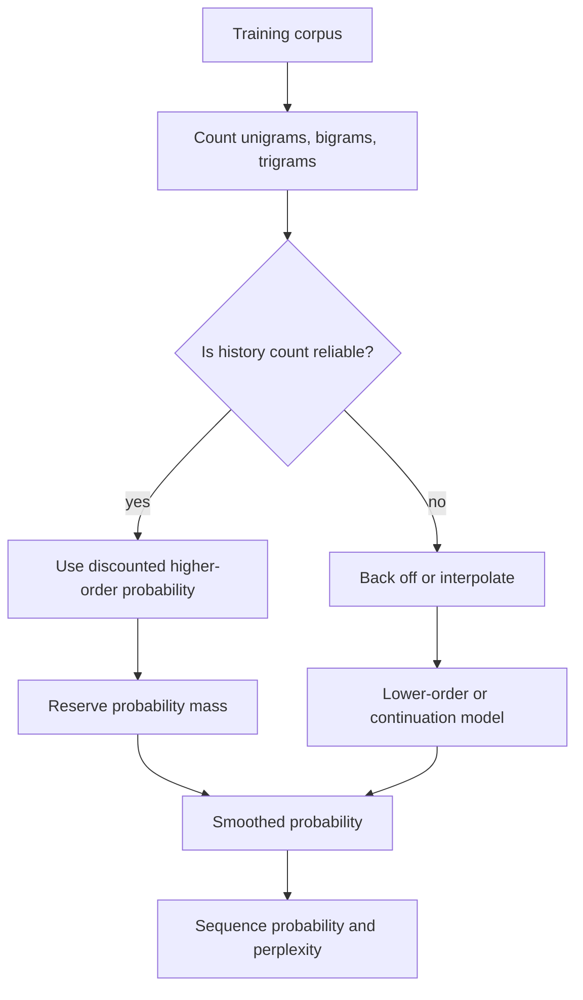

# N-gram Language Models

An n-gram language model assigns probabilities to word sequences by assuming that each word depends on a fixed-size history. Jurafsky and Martin use n-grams to introduce the language modeling task, perplexity, smoothing, backoff, interpolation, and Kneser-Ney. Eisenstein gives a more formal probabilistic treatment and connects smoothing to the same bias-variance tradeoff seen in Naive Bayes.

N-grams are no longer the strongest language models, but they remain essential for understanding modern NLP. They clarify what a probability over text means, why unseen events are dangerous, how intrinsic evaluation works, and why neural models were such a major change. They also remain useful in speech recognition, spelling correction, input methods, decoding features, and small-data baselines.

## Definitions

A **language model** is a probability distribution over token sequences. By the chain rule,

$$
P(w_1,\ldots,w_T)=\prod_{t=1}^T P(w_t \mid w_1,\ldots,w_{t-1}).
$$

An **n-gram model** approximates this distribution with a Markov assumption:

$$
P(w_t \mid w_1,\ldots,w_{t-1}) \approx P(w_t \mid w_{t-n+1},\ldots,w_{t-1}).
$$

For a bigram model, the maximum likelihood estimate is

$$
P_{\mathrm{MLE}}(w_i \mid w_{i-1}) =
\frac{C(w_{i-1},w_i)}{C(w_{i-1})}.
$$

**Perplexity** is the geometric mean inverse probability assigned to a test sequence:

$$
\mathrm{PP}(W)=P(w_1,\ldots,w_T)^{-1/T}.
$$

With log base $2$, perplexity is $2^{H(W)}$, where $H(W)$ is empirical cross-entropy. Lower perplexity means the model assigns higher probability to the test data, but only when tokenization and test sets are comparable.

**Smoothing** adjusts maximum likelihood estimates so unseen n-grams receive nonzero probability. **Backoff** uses a lower-order model when a higher-order count is unavailable. **Interpolation** mixes several orders at once. **Kneser-Ney smoothing** changes the lower-order distribution so a word is likely if it appears in many distinct contexts, not merely if it is frequent.

## Key results

The zero-count problem is the central weakness of unsmoothed n-grams. If a single test bigram has probability $0$, the whole sequence probability becomes $0$ and perplexity is infinite. Add-$k$ smoothing prevents this:

$$
P_{+k}(w_i \mid h)=
\frac{C(h,w_i)+k}{C(h)+k|V|}.
$$

Add-one smoothing is easy but often too aggressive because it moves too much mass from frequent events to unseen events. Smaller $k$, discounting, interpolation, or Kneser-Ney are usually better.

Absolute discounting subtracts a discount $d$ from nonzero counts:

$$
P_{\mathrm{AD}}(w \mid h)=
\frac{\max(C(h,w)-d,0)}{C(h)}+\lambda(h)P_{\mathrm{lower}}(w).
$$

The interpolation weight $\lambda(h)$ returns the discounted mass to the lower-order model. Kneser-Ney improves the lower-order model by using continuation probability:

$$
P_{\mathrm{cont}}(w)=
\frac{|\{h:C(h,w)>0\}|}{|\{(h,w'):C(h,w')>0\}|}.
$$

This handles words like `Francisco`: it may be frequent, but it appears in few contexts, mostly after `San`, so it should not receive a high unigram probability when backing off from arbitrary histories.

N-gram complexity grows quickly. A vocabulary of size $\vert V\vert $ has $\vert V\vert ^n$ possible n-grams, though most are unseen. Web-scale systems use pruning, hashing, quantized probabilities, tries, Bloom filters, and simple backoff approximations. Neural language models reduce sparsity by representing words as embeddings and conditioning on continuous context representations, but n-grams remain the cleanest introduction to probabilistic sequence modeling.

A useful way to compare smoothing methods is to ask where the probability mass for unseen events comes from and where it goes. Add-$k$ smoothing changes every count, including events whose empirical estimates were already reliable. Discounting removes mass mainly from seen events and gives it to a lower-order distribution. Kneser-Ney changes the meaning of that lower-order distribution so it rewards words that complete many different histories. That is why it behaves differently from simply backing off to a frequent unigram list.

N-gram models also clarify the difference between model order and linguistic context. A trigram model has a two-token history, but that does not mean the relevant linguistic dependency is two tokens long. In `The keys to the cabinet are`, the number agreement cue is farther back than a trigram window. Increasing $n$ helps only until data sparsity overwhelms the benefit. This tension between longer context and reliable estimation is one of the main motivations for neural language models and pretraining.

When using n-grams as baselines, keep the experimental protocol strict. The vocabulary, unknown-word handling, start and end symbols, smoothing hyperparameters, and train/dev/test split all affect perplexity. A lower perplexity from a larger vocabulary can be misleading if the tokenization changed, because the model may be predicting smaller or easier units. For speech or MT decoding, an n-gram LM may be evaluated extrinsically by whether it improves WER or translation quality, even if its standalone perplexity is not the best.

Historically, n-grams were also important because they separated the language model from other system components. In ASR, the acoustic model could propose candidate word strings and the language model could prefer fluent ones. In SMT, the translation model could propose target phrases and the language model could rank target-language fluency. Even when a neural encoder-decoder combines these roles, the n-gram decomposition remains the clearest diagnostic for asking whether an error came from local lexical choice, poor context modeling, or bad search.

## Visual

| Method | Formula idea | Strength | Weakness |
|---|---|---|---|
| MLE | normalize observed counts | simple, interpretable | zero probability for unseen events |
| Add-$k$ | add pseudo-counts | prevents zeros | poor for large vocabularies if $k$ is too high |
| Backoff | use lower order only when needed | efficient and intuitive | needs careful discounting |
| Interpolation | mix all orders | robust when counts are sparse | weights must be chosen |
| Kneser-Ney | discount plus continuation counts | strong classic baseline | more complex bookkeeping |



## Worked example 1: add-one smoothed bigram

Problem: train a bigram model on the sentence `I am Sam` with start and end symbols: `<s> I am Sam </s>`. Compute $P(\mathrm{Sam}\mid \mathrm{am})$ with add-one smoothing. Let the vocabulary be `{I, am, Sam, </s>}`, so $\vert V\vert =4$ for predicted tokens.

1. Count the bigrams:
   - `(<s>, I)` occurs $1$ time.
   - `(I, am)` occurs $1$ time.
   - `(am, Sam)` occurs $1$ time.
   - `(Sam, </s>)` occurs $1$ time.
2. Count the history `am`:
   - $C(\mathrm{am})=1$ because `am` appears once as a history.
3. Apply add-one smoothing:

$$
\begin{aligned}
P_{+1}(\mathrm{Sam}\mid \mathrm{am})
&=\frac{C(\mathrm{am},\mathrm{Sam})+1}{C(\mathrm{am})+|V|}\\
&=\frac{1+1}{1+4}\\
&=\frac{2}{5}=0.4.
\end{aligned}
$$

Checked answer: the probability is $0.4$. Without smoothing it would be $1.0$, which overfits a one-sentence corpus. Add-one smoothing reserves mass for `I`, `am`, and `</s>` after `am`, even though they were unseen there.

## Worked example 2: continuation probability in Kneser-Ney

Problem: compare continuation probabilities for `Francisco` and `the` from this observed bigram type set:

```text
San Francisco
old Francisco
near Francisco
read the
eat the
watch the
near the
```

Assume these are the only observed bigram types.

1. Count distinct histories:
   - `Francisco` appears after `{San, old, near}`, so it has $3$ distinct histories.
   - `the` appears after `{read, eat, watch, near}`, so it has $4$ distinct histories.
2. Count all observed bigram types:
   - There are $7$ total bigram types.
3. Compute continuation probabilities:

$$
P_{\mathrm{cont}}(\mathrm{Francisco})=\frac{3}{7},\qquad
P_{\mathrm{cont}}(\mathrm{the})=\frac{4}{7}.
$$

Checked answer: under this toy corpus, `the` receives the larger continuation probability. In a realistic corpus, `Francisco` often has high raw frequency but low continuation diversity, making Kneser-Ney especially helpful.

## Code

```python
from collections import Counter, defaultdict
from math import exp, log

sentences = [["<s>", "I", "am", "Sam", "</s>"],
             ["<s>", "Sam", "I", "am", "</s>"]]

unigrams = Counter()
bigrams = Counter()
for sent in sentences:
    unigrams.update(sent[:-1])
    bigrams.update(zip(sent[:-1], sent[1:]))

vocab = {"I", "am", "Sam", "</s>"}

def add_k_prob(history, word, k=0.1):
    return (bigrams[(history, word)] + k) / (unigrams[history] + k * len(vocab))

def sequence_logprob(tokens):
    return sum(log(add_k_prob(h, w)) for h, w in zip(tokens[:-1], tokens[1:]))

test = ["<s>", "I", "am", "Sam", "</s>"]
lp = sequence_logprob(test)
perplexity = exp(-lp / (len(test) - 1))
print(add_k_prob("am", "Sam"))
print(perplexity)
```

## Common pitfalls

- Evaluating perplexity on a different tokenization than the training model used.
- Forgetting start and end symbols, which makes sentence boundary probabilities undefined.
- Treating add-one smoothing as a strong default for realistic vocabulary sizes.
- Comparing perplexity across corpora with different preprocessing.
- Assuming a lower perplexity always means better task performance; extrinsic evaluation can disagree.
- Using raw unigram frequency for Kneser-Ney lower-order probabilities instead of continuation counts.
- Letting unknown words leak from test into training vocabulary.

## Connections

- [Regular expressions and normalization](/cs/nlp/regular-expressions-normalization-edit-distance)
- [Neural networks for NLP](/cs/nlp/neural-networks-for-nlp)
- [RNNs and LSTMs for sequence modeling](/cs/nlp/rnns-lstms-sequence-modeling)
- [Speech recognition and synthesis](/cs/nlp/speech-recognition-and-synthesis)
