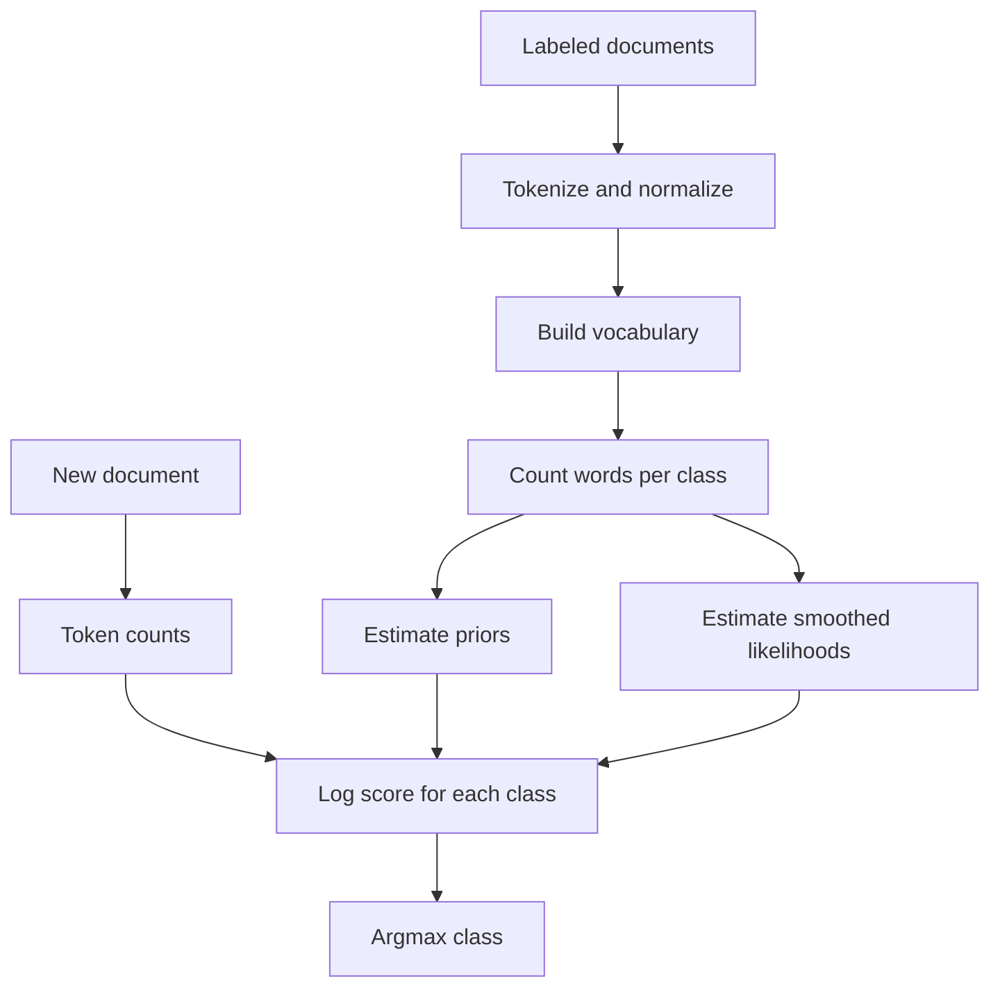

# Naive Bayes and Sentiment Classification

Naive Bayes is the classic first probabilistic classifier for text. Jurafsky and Martin introduce it through sentiment analysis, where words in a review provide strong evidence for positive or negative orientation. Eisenstein treats it as a linear text classifier with a clear generative story, showing why smoothing and feature choices matter.


*Figure: ELIZA provides historical context for dialogue systems and chatbot evaluation. Image: [Wikimedia Commons](https://commons.wikimedia.org/wiki/File:ELIZA_conversation.png), Unknown author, public domain text.*

The model is simple enough to compute by hand, yet strong enough to remain a useful baseline. It teaches the bag-of-words representation, priors, likelihoods, log-space scoring, smoothing, evaluation with precision and recall, and the distinction between generative and discriminative classifiers.

## Definitions

A **text classification** problem maps a document $d$ to a class $c \in C$. In binary sentiment classification, $C=\{\mathrm{pos},\mathrm{neg}\}$, but the same framework applies to topic classification, spam detection, language identification, author attributes, or toxicity detection.

The **multinomial Naive Bayes** classifier assumes that a class first generates a document length and then generates word tokens independently from a class-specific word distribution. The independence assumption is false for language, but it often works because repeated word evidence is useful.

The classifier chooses

$$
\hat{c}=\arg\max_{c\in C} P(c\mid d).
$$

By Bayes' rule and by dropping the denominator $P(d)$, which is constant across classes,

$$
\hat{c}=\arg\max_{c\in C} P(c)\prod_{w\in d} P(w\mid c).
$$

In practice we use log probabilities:

$$
\mathrm{score}(c,d)=\log P(c)+\sum_{w\in d}\mathrm{count}(w,d)\log P(w\mid c).
$$

The class prior is estimated by

$$
P(c)=\frac{N_c}{N},
$$

and add-$\alpha$ smoothed word likelihoods are estimated by

$$
P(w\mid c)=\frac{\mathrm{count}(w,c)+\alpha}{\sum_{w'\in V}\mathrm{count}(w',c)+\alpha |V|}.
$$

## Key results

Naive Bayes is a **generative classifier** because it models $P(c)$ and $P(d\mid c)$, a story for how the class generated the document. Logistic regression is **discriminative** because it directly models $P(c\mid d)$. Generative models can be data efficient and fast; discriminative models often win when there is more labeled data and correlated features.

The bag-of-words assumption discards word order. That means `not good` contains the positive word `good`, which can fool a simple model. Sentiment systems often add negation handling, binary word presence instead of raw counts, phrase features, lexicons, or feature selection.

Smoothing is mandatory. If the word `masterpiece` appears only in positive training examples, an unsmoothed model assigns $P(\mathrm{masterpiece}\mid \mathrm{neg})=0$. Then any negative document containing it gets probability zero, regardless of all other evidence. Additive smoothing prevents a single unseen feature from dominating.

The model is linear in log space. Each word contributes a class-specific weight:

$$
\log P(w\mid \mathrm{pos})-\log P(w\mid \mathrm{neg}).
$$

This explains why Naive Bayes can be interpreted as evidence accumulation. Words with high positive log odds push toward positive sentiment, and words with high negative log odds push the other way.

Evaluation should match the task. Accuracy is useful when classes are balanced and errors have equal cost. Precision, recall, and $F_1$ are better when positive examples are rare or when false positives and false negatives matter differently:

$$
\mathrm{Precision}=\frac{TP}{TP+FP},\qquad
\mathrm{Recall}=\frac{TP}{TP+FN},\qquad
F_1=\frac{2PR}{P+R}.
$$

The most important modeling choice is often not the classifier but the event definition. Multinomial Naive Bayes treats every token occurrence as evidence, so a long review with repeated words has more influence than a short one. Bernoulli Naive Bayes treats word presence or absence as evidence, which can work well for short sentiment texts where repeated words should not multiply the score. Binary features also reduce the effect of boilerplate or repeated emphasis.

Sentiment classification also shows why labels need documentation. A review can be positive about acting and negative about plot; an annotation guideline may force one overall label or allow aspect labels. Sarcasm, quoted speech, domain-specific vocabulary, and cultural context can all break a model trained on generic product or movie reviews. Jurafsky and Martin emphasize harms and evaluation; Eisenstein emphasizes feature design and dataset construction. Together they imply that a sentiment classifier should be treated as a measured instrument whose domain, label definition, and intended use are explicit.

Naive Bayes remains useful even when stronger models are available. It trains from counts, works with tiny data, gives interpretable log-odds features, and is easy to implement as a sanity check. If a large neural classifier cannot beat a carefully tuned Naive Bayes baseline on a sparse text task, the issue may be data leakage, bad preprocessing, label noise, or an evaluation mismatch.

A careful implementation should also decide how to handle words outside the selected vocabulary. Some systems drop rare words, some map them to an unknown token, and some keep only the most informative features. Dropping rare words can reduce variance, but it can also remove domain-specific sentiment cues such as product names, slang, or newly coined terms. This choice should be tuned with development data, because the best vocabulary size depends on corpus size, genre, and label balance.

## Visual



| Modeling choice | Common option | Benefit | Risk |
|---|---|---|---|
| Counts | token frequency | uses repeated evidence | long documents dominate |
| Binary features | word present or absent | robust for sentiment | loses intensity |
| Case | lowercase | reduces sparsity | loses entity and emphasis cues |
| Negation | append `NOT_` in scope | handles `not good` | brittle scope rules |
| Smoothing | add-$\alpha$ | avoids zeros | too much smoothing underfits |

## Worked example 1: classifying a tiny review

Problem: classify `good fun` with two classes. Training counts are:

| Class | Documents | Word counts |
|---|---:|---|
| pos | 3 | `good: 3`, `fun: 2`, `boring: 0` |
| neg | 2 | `good: 0`, `fun: 1`, `boring: 3` |

Use vocabulary $V=\{\mathrm{good},\mathrm{fun},\mathrm{boring}\}$ and $\alpha=1$.

1. Priors:

$$
P(\mathrm{pos})=\frac{3}{5},\qquad P(\mathrm{neg})=\frac{2}{5}.
$$

2. Positive likelihood denominator:

$$
3+2+0+\alpha |V|=5+3=8.
$$

So

$$
P(\mathrm{good}\mid\mathrm{pos})=\frac{3+1}{8}=\frac{4}{8},\quad
P(\mathrm{fun}\mid\mathrm{pos})=\frac{2+1}{8}=\frac{3}{8}.
$$

3. Negative likelihood denominator:

$$
0+1+3+3=7.
$$

So

$$
P(\mathrm{good}\mid\mathrm{neg})=\frac{1}{7},\quad
P(\mathrm{fun}\mid\mathrm{neg})=\frac{2}{7}.
$$

4. Scores:

$$
\begin{aligned}
P(\mathrm{pos})P(\mathrm{good}\mid\mathrm{pos})P(\mathrm{fun}\mid\mathrm{pos})
&=\frac35\cdot\frac48\cdot\frac38=\frac{36}{320}=0.1125,\\
P(\mathrm{neg})P(\mathrm{good}\mid\mathrm{neg})P(\mathrm{fun}\mid\mathrm{neg})
&=\frac25\cdot\frac17\cdot\frac27=\frac{4}{245}\approx0.0163.
\end{aligned}
$$

Checked answer: classify the review as positive.

## Worked example 2: precision, recall, and F1

Problem: a sentiment classifier marks 12 reviews as positive. Of these, 9 really are positive. The test set has 15 positive reviews total. Compute precision, recall, and $F_1$ for the positive class.

1. Identify counts:
   - $TP=9$ because 9 predicted positives are correct.
   - $FP=12-9=3$ because 3 predicted positives are wrong.
   - $FN=15-9=6$ because 6 actual positives were missed.
2. Precision:

$$
P=\frac{TP}{TP+FP}=\frac{9}{9+3}=\frac{9}{12}=0.75.
$$

3. Recall:

$$
R=\frac{TP}{TP+FN}=\frac{9}{9+6}=\frac{9}{15}=0.60.
$$

4. F1:

$$
F_1=\frac{2PR}{P+R}=\frac{2(0.75)(0.60)}{0.75+0.60}=\frac{0.90}{1.35}=0.667.
$$

Checked answer: precision $0.75$, recall $0.60$, and $F_1 \approx 0.667$.

## Code

```python
from collections import Counter, defaultdict
from math import log

train = [
    ("pos", "good fun good"),
    ("pos", "good moving fun"),
    ("neg", "boring dull"),
    ("neg", "boring fun"),
]

alpha = 1.0
class_docs = Counter()
word_counts = defaultdict(Counter)
total_words = Counter()
vocab = set()

for label, text in train:
    class_docs[label] += 1
    words = text.split()
    vocab.update(words)
    word_counts[label].update(words)
    total_words[label] += len(words)

def score(label, text):
    s = log(class_docs[label] / sum(class_docs.values()))
    denom = total_words[label] + alpha * len(vocab)
    for word in text.split():
        s += log((word_counts[label][word] + alpha) / denom)
    return s

doc = "good fun"
scores = {label: score(label, doc) for label in class_docs}
print(scores)
print(max(scores, key=scores.get))
```

## Common pitfalls

- Multiplying many probabilities in normal space and causing numerical underflow; use log space.
- Training on test data vocabulary or statistics.
- Forgetting smoothing for words unseen in a class.
- Assuming feature independence is true just because the classifier is useful.
- Using accuracy alone on imbalanced data.
- Treating sentiment as only positive or negative when neutral, mixed, sarcasm, target, and aspect matter.
- Ignoring dataset harms: labels, annotator norms, dialect, and domain shifts can all affect classification behavior.

## Connections

- [Logistic regression for text](/cs/nlp/logistic-regression-for-text)
- [Vector semantics and embeddings](/cs/nlp/vector-semantics-and-embeddings)
- [Information extraction](/cs/nlp/information-extraction)
- [Regular expressions and normalization](/cs/nlp/regular-expressions-normalization-edit-distance)
