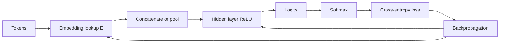

# Neural Networks for NLP

Feedforward neural networks extend linear models by learning hidden representations. Jurafsky and Martin use them to connect logistic regression, embeddings, softmax classification, and neural language modeling. Eisenstein gives a machine-learning-oriented account of nonlinear classification, activation functions, lookup layers, backpropagation, regularization, dropout, and design choices.

For NLP, the critical shift is from hand-built sparse features to learned dense features. A word can be mapped through an embedding lookup, combined with nearby words or pooled over a document, transformed by hidden layers, and finally converted to a probability distribution with softmax. This architecture is the ancestor of RNNs, encoder-decoders, and transformers.

## Definitions

A **feedforward neural network** maps an input vector $x$ to an output through layers with no cycles. A one-hidden-layer network is

$$
\begin{aligned}
h &= g(Wx+b),\\
z &= Uh+c,\\
\hat{y} &= \mathrm{softmax}(z).
\end{aligned}
$$

Here $g$ is an activation function such as ReLU:

$$
\mathrm{ReLU}(a)=\max(a,0).
$$

An **embedding layer** is a lookup table $E\in\mathbb{R}^{\vert V\vert \times d}$. If word $w$ has index $i$, its embedding is row $E_i$. Multiplying a one-hot vector by an embedding matrix is equivalent to selecting one row or column, but implementations use direct lookup.

For classification, the output softmax is

$$
\hat{y}_k=\frac{\exp(z_k)}{\sum_{j=1}^K\exp(z_j)}.
$$

For language modeling, the classes are vocabulary items, so the network predicts the next token:

$$
P(w_t\mid w_{t-n+1},\ldots,w_{t-1}).
$$

**Backpropagation** computes gradients of the loss with respect to all parameters by applying the chain rule from output to input. **Dropout** randomly masks hidden units during training to reduce overfitting. **Pretraining** initializes embeddings or models from a separate objective before supervised training.

## Key results

A linear classifier can only learn linear decision boundaries in its input features. A neural network with nonlinear hidden layers can learn feature interactions. In text classification, this means a hidden layer can learn combinations such as sentiment-bearing adjective plus negation cue, or domain-specific combinations that would otherwise require manual feature engineering.

The neural language model solves two weaknesses of n-grams. First, embeddings let the model share statistical strength across similar words: if `cat` and `dog` have nearby vectors, the model can generalize from contexts containing one to contexts containing the other. Second, hidden layers learn distributed representations of contexts rather than separate count tables for every exact n-gram.

Training minimizes cross-entropy:

$$
L=-\log \hat{y}_c
$$

where $c$ is the correct class. Unlike logistic regression, multilayer networks have nonconvex objectives. Initialization, learning rate, optimizer, normalization, regularization, and batch size can change results. Random initialization must break symmetry; if all hidden units start identically, they receive identical gradients.

Lookup layers make NLP models efficient but introduce vocabulary and tokenization decisions. Unknown words, rare words, casing, subwords, and domain-specific terms all affect the embedding table. Modern models often replace word-level lookup with subword lookup to handle rare forms.

A feedforward neural language model with a fixed context window is still limited: it cannot naturally condition on arbitrary-length history. RNNs and transformers address that limitation differently, but they keep the same core components: embeddings, learned transformations, softmax output, and cross-entropy training.

One conceptual shift from linear models is that features no longer need to be named by the engineer. In logistic regression, a useful interaction such as `not` plus a positive adjective must be inserted as a feature template or n-gram. In a neural network, the hidden layer can learn a detector for that interaction if the architecture and data make it learnable. This does not remove feature design completely; tokenization, pooling, window size, pretrained embeddings, and loss function are still design choices.

The lookup layer is especially important in NLP. It is a parameter matrix indexed by discrete symbols, so only rows for observed tokens receive updates in a batch. Frequent tokens are updated often; rare tokens may remain poorly estimated. Subword tokenization, character encoders, pretrained embeddings, and regularization are different responses to the same rare-word problem. Eisenstein's discussion of lookup layers makes this explicit, while Jurafsky and Martin connect the same idea to word2vec, GloVe, and later contextual representations.

Neural networks should be compared to strong linear baselines. If a feedforward classifier uses averaged embeddings, it may lose word order and perform similarly to a bag-of-words model. Its advantage appears when dense semantic similarity, nonlinear interactions, or pretrained representations provide information that sparse features cannot easily capture.

Another practical distinction is between learning embeddings from scratch and fine-tuning pretrained embeddings. Learning from scratch lets the representation specialize to the task, but it needs enough labeled or self-supervised data to estimate many embedding rows. Starting from pretrained word vectors gives useful geometry immediately, especially for small supervised datasets. Freezing the embeddings reduces overfitting and compute; updating them can improve task fit but may damage general-purpose similarity if the dataset is narrow.

The loss surface is nonconvex, so reproducibility requires more care than with logistic regression. Random seeds, initialization, batch order, dropout, optimizer, and hardware kernels can all change the final model slightly. Serious experiments report mean and variance across runs or at least fix seeds and keep validation curves, especially on small NLP datasets.

## Visual



| Component | Shape example | Role in NLP |
|---|---:|---|
| Embedding table $E$ | $\vert V\vert \times d$ | maps token ids to dense vectors |
| Pooled document vector | $d$ | summarizes variable-length text |
| Hidden layer $W$ | $h\times d$ | learns nonlinear feature combinations |
| Output matrix $U$ | $K\times h$ | scores classes or vocabulary words |
| Softmax | $K$ | converts logits into probabilities |

## Worked example 1: forward pass for a tiny classifier

Problem: classify a two-dimensional pooled embedding $x=[1,2]$ with a hidden layer of size $2$ and two output classes. Let

$$
W=\begin{bmatrix}1&-1\\0.5&0.5\end{bmatrix},\quad
b=\begin{bmatrix}0\\0\end{bmatrix}.
$$

Let

$$
U=\begin{bmatrix}1&0\\0&1\end{bmatrix},\quad c=\begin{bmatrix}0\\0\end{bmatrix}.
$$

Use ReLU and softmax.

1. Hidden preactivation:

$$
Wx+b=
\begin{bmatrix}1(1)+(-1)(2)\\0.5(1)+0.5(2)\end{bmatrix}
=\begin{bmatrix}-1\\1.5\end{bmatrix}.
$$

2. ReLU activation:

$$
h=\begin{bmatrix}\max(-1,0)\\\max(1.5,0)\end{bmatrix}
=\begin{bmatrix}0\\1.5\end{bmatrix}.
$$

3. Output logits:

$$
z=Uh+c=\begin{bmatrix}0\\1.5\end{bmatrix}.
$$

4. Softmax:

$$
\hat{y}_1=\frac{e^0}{e^0+e^{1.5}}\approx\frac{1}{1+4.482}=0.182,
$$

$$
\hat{y}_2=\frac{e^{1.5}}{e^0+e^{1.5}}\approx0.818.
$$

Checked answer: class $2$ is predicted with probability about $0.818$.

## Worked example 2: feedforward neural language model context

Problem: a vocabulary has embeddings of dimension $2$:

| token | embedding |
|---|---|
| `the` | $[1,0]$ |
| `cat` | $[0,1]$ |
| `sat` | $[1,1]$ |

For a window model that predicts the next word from the previous two words, form the input vector for context `the cat`.

1. Look up embeddings:

$$
e(\mathrm{the})=[1,0],\qquad e(\mathrm{cat})=[0,1].
$$

2. Concatenate in time order:

$$
x=[e(\mathrm{the});e(\mathrm{cat})]=[1,0,0,1].
$$

3. If the hidden layer has matrix $W\in\mathbb{R}^{h\times4}$, then the first layer can learn different weights for the same word depending on position. The first two input dimensions represent the word two steps back; the last two represent the previous word.

Checked answer: the neural LM input vector is $[1,0,0,1]$. It is dense, fixed length, and position-sensitive because of concatenation.

## Code

```python
import torch
import torch.nn as nn

class TinyTextClassifier(nn.Module):
    def __init__(self, vocab_size, emb_dim, hidden_dim, num_classes):
        super().__init__()
        self.embedding = nn.Embedding(vocab_size, emb_dim)
        self.ffn = nn.Sequential(
            nn.Linear(emb_dim, hidden_dim),
            nn.ReLU(),
            nn.Dropout(0.1),
            nn.Linear(hidden_dim, num_classes),
        )

    def forward(self, token_ids):
        emb = self.embedding(token_ids)          # batch x length x emb_dim
        pooled = emb.mean(dim=1)                # batch x emb_dim
        return self.ffn(pooled)                 # logits

model = TinyTextClassifier(vocab_size=1000, emb_dim=64, hidden_dim=32, num_classes=3)
batch = torch.randint(0, 1000, (8, 12))
labels = torch.randint(0, 3, (8,))
logits = model(batch)
loss = nn.CrossEntropyLoss()(logits, labels)
loss.backward()
print(logits.shape, loss.item())
```

## Common pitfalls

- Passing probabilities rather than logits into `CrossEntropyLoss`; most frameworks combine log-softmax and negative log likelihood.
- Averaging embeddings and assuming word order is preserved.
- Forgetting padding masks, so padded tokens affect pooled representations.
- Initializing all hidden units identically.
- Using a huge vocabulary without handling rare or unknown words.
- Treating nonconvex training curves like logistic regression; neural models need validation, early stopping, and careful hyperparameters.
- Confusing static pretrained embeddings with contextual embeddings from transformers.

## Connections

- [Logistic regression for text](/cs/nlp/logistic-regression-for-text)
- [RNNs and LSTMs for sequence modeling](/cs/nlp/rnns-lstms-sequence-modeling)
- [Transformers and self-attention](/cs/nlp/transformers-self-attention)
- [Vector semantics and embeddings](/cs/nlp/vector-semantics-and-embeddings)
