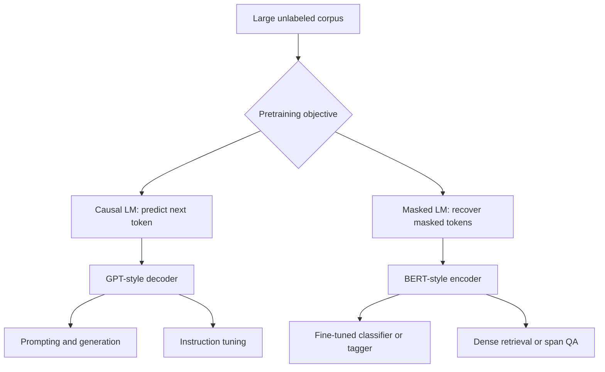

# Pretrained Language Models


*Figure: GPT-3 frames few-shot prompting as in-context learning during a forward pass. From [Brown et al., 2020](https://arxiv.org/abs/2005.14165) — embedded under educational fair use with attribution.*


*Figure: T5 casts translation, classification, question answering, and summarization as the same text-to-text problem. From [Raffel et al., 2019](https://arxiv.org/abs/1910.10683) — embedded under educational fair use with attribution.*


*Figure: BART combines a corrupted input encoder with an autoregressive decoder for denoising pretraining. From [Lewis et al., 2019](https://arxiv.org/abs/1910.13461) — embedded under educational fair use with attribution.*

Pretrained language models learn general-purpose representations from large unlabeled corpora and are then adapted to tasks. Jurafsky and Martin separate causal transformer LLMs, bidirectional masked language models, fine-tuning, prompting, in-context learning, and instruction tuning. Eisenstein's text predates BERT and GPT-style deployment, but its chapters on language modeling, embeddings, neural networks, and structured prediction explain the underlying probabilistic and optimization ideas.


*Figure: Skip-gram training ties word meaning to surrounding context. Image: [Wikimedia Commons](https://commons.wikimedia.org/wiki/File:Word_embeddings_Skip-gram.svg), Jeran Renz, CC BY-SA 4.0.*

The practical shift is from training a separate model from scratch for each NLP task to reusing a large model that already encodes syntax, lexical meaning, world associations, and many task formats. Adaptation may happen by adding a classifier head and updating weights, by prompting without weight updates, or by instruction tuning and preference optimization.

## Definitions

A **pretrained language model** is trained on a broad self-supervised objective before being used for downstream tasks. **Self-supervised** means the training signal is derived from the text itself.

A **causal language model** predicts the next token:

$$
L_{\mathrm{CLM}}=-\sum_{t=1}^T\log P(w_t\mid w_{<t}).
$$

It uses a causal attention mask and is naturally suited to generation. GPT-style models are causal decoders.

A **masked language model** corrupts some input tokens and predicts the original tokens from bidirectional context:

$$
L_{\mathrm{MLM}}=-\sum_{i\in M}\log P(w_i\mid \tilde{w}_1,\ldots,\tilde{w}_T).
$$

BERT-style models are bidirectional encoders. They are naturally suited to representation tasks such as classification, sequence labeling, retrieval features, and span prediction.

**Fine-tuning** adapts a pretrained model with labeled task data, often by adding a small task head and updating all or some parameters. **Prompting** describes the task in text and asks the model to generate or score an answer. **In-context learning** gives examples inside the prompt. **Instruction tuning** trains a model on many instruction-response pairs so it follows natural-language task descriptions more reliably.

## Key results

Pretraining works because many NLP tasks depend on reusable linguistic and semantic regularities. A model trained to predict tokens must learn word order, agreement, selectional preferences, entity facts, genre conventions, and discourse patterns. Fine-tuning or prompting exposes a downstream task through this learned representation.

BERT-style encoders and GPT-style decoders differ in information flow. Encoders use bidirectional attention, so each token representation can depend on both left and right context. Decoders use causal attention, so generation can proceed one token at a time without seeing the future. Encoder-decoder models combine a bidirectional source encoder with a causal target decoder and cross-attention, making them natural for translation and summarization.

Fine-tuning for classification commonly uses a special sequence representation. In BERT, the `[CLS]` output vector is passed through a classifier:

$$
\hat{y}=\mathrm{softmax}(Wz_{\mathrm{CLS}}+b).
$$

For sequence labeling, each token output vector receives a tag classifier, optionally followed by a CRF layer. For span question answering, the model predicts start and end positions.

Prompting changes the interface. Instead of changing model parameters for every task, we condition the model with instructions and demonstrations:

```text
Review: "The plot was thin but the acting was excellent."
Sentiment:
```

The output distribution at the next token or generated span becomes the task prediction. This makes task specification flexible but sensitive to prompt wording, example order, decoding, and hidden biases.

Pretraining is not neutral. Corpus composition, filtering, memorization, toxic text, private data, annotator choices, and reinforcement learning objectives all shape behavior. Evaluation must include not only aggregate task scores but robustness, calibration, harmful outputs, bias, privacy, and domain shift.

The adaptation method should match the amount of supervision and the risk of the task. Full fine-tuning can give strong performance when labeled data is available, but it can overfit, forget general knowledge, or require careful hyperparameters. Feature extraction freezes the model and trains a smaller classifier, which is cheaper and more stable but less flexible. Prompting needs no gradient updates, but it can be brittle and hard to evaluate exhaustively. Instruction tuning changes the base behavior across many tasks and is usually done once at model-development time rather than for every application.

Contextual embeddings also changed how older NLP tasks are implemented. A CRF tagger once needed hand-built capitalization, suffix, and gazetteer features. A BERT-style encoder supplies token vectors that already encode much of this context, so the task head can be simple. But the old structure has not disappeared: BIO constraints, span boundaries, coreference clusters, and decoding algorithms still matter on top of pretrained representations.

For generated outputs, probability is not truth. A causal LM assigns high probability to text that resembles its training distribution and prompt context. It can produce correct facts, plausible falsehoods, biased completions, or unsafe instructions. This is why retrieval, tool use, verification, calibration, and refusal policies are engineering components, not optional wrappers.

Pretraining also changes data economics. Instead of requiring a large labeled dataset for every task, one can often use a smaller labeled set, a natural-language prompt, or a retrieval index. This does not eliminate supervision; it moves supervision into corpus selection, instruction datasets, human preference data, evaluation suites, and deployment feedback. The source of the supervision should still be documented because it shapes model behavior.

A useful rule is to distinguish model knowledge from application knowledge. Model knowledge is whatever the parameters encode from training. Application knowledge is supplied at run time through retrieved documents, tools, databases, or user context. For high-stakes or fast-changing facts, application knowledge should dominate because it can be inspected and updated without retraining the base model.

This distinction also helps evaluation. A closed-book benchmark tests parameterized memory and reasoning under a prompt. An open-book or retrieval-augmented benchmark tests whether the system can find, use, and cite supplied evidence. Mixing the two hides important failure modes.

## Visual




*Figure: BERT forms each input vector by summing token, segment, and position embeddings before bidirectional Transformer encoding. From [Devlin et al., 2018](https://arxiv.org/abs/1810.04805) — embedded under educational fair use with attribution.*

| Model family | Attention direction | Objective | Best-known use |
|---|---|---|---|
| GPT-style decoder | left-to-right causal | next-token prediction | generation, prompting |
| BERT-style encoder | bidirectional | masked token prediction | classification, tagging, retrieval features |
| Encoder-decoder | bidirectional source, causal target | denoising or seq2seq | translation, summarization |
| Instruction-tuned LLM | usually causal | supervised instructions plus preferences | assistant behavior |

## Worked example 1: masked language modeling loss

Problem: a masked LM receives `The [MASK] barked`. The model predicts probabilities for the masked token:

| candidate | probability |
|---|---:|
| `dog` | $0.70$ |
| `cat` | $0.20$ |
| `car` | $0.10$ |

The true token is `dog`. Compute the masked LM loss for this token.

1. The masked LM loss for one masked token is negative log probability of the true token:

$$
L=-\log P(\mathrm{dog}\mid \mathrm{The\ [MASK]\ barked}).
$$

2. Substitute the probability:

$$
L=-\log(0.70).
$$

3. Compute:

$$
\log(0.70)\approx -0.357,
$$

so

$$
L\approx0.357.
$$

Checked answer: the loss is about $0.357$ nats. If the model had assigned probability $0.01$ to `dog`, the loss would be $4.605$, much worse.

## Worked example 2: classification head on `[CLS]`

Problem: a BERT-style model outputs

$$
z_{\mathrm{CLS}}=[2,-1].
$$

A sentiment head has

$$
W=
\begin{bmatrix}
1&0\\
0&1\\
-1&1
\end{bmatrix},
\quad b=[0,0,0].
$$

Rows correspond to positive, negative, and neutral. Compute logits and predicted class.

1. Positive logit:

$$
z_+=1(2)+0(-1)=2.
$$

2. Negative logit:

$$
z_-=0(2)+1(-1)=-1.
$$

3. Neutral logit:

$$
z_0=-1(2)+1(-1)=-3.
$$

4. Softmax argmax does not require computing probabilities; the largest logit is $2$.

Checked answer: the classifier predicts positive sentiment. If probabilities are desired, divide $e^2$, $e^{-1}$, and $e^{-3}$ by their sum.

## Code

```python
import torch
import torch.nn as nn

class TinyBertStyleHead(nn.Module):
    def __init__(self, hidden_size=768, num_labels=3):
        super().__init__()
        self.classifier = nn.Linear(hidden_size, num_labels)

    def forward(self, last_hidden_state):
        cls = last_hidden_state[:, 0, :]  # first token, BERT-style [CLS]
        return self.classifier(cls)

batch, length, hidden = 4, 12, 768
fake_encoder_output = torch.randn(batch, length, hidden)
labels = torch.tensor([0, 1, 2, 1])

head = TinyBertStyleHead(hidden_size=hidden, num_labels=3)
logits = head(fake_encoder_output)
loss = nn.CrossEntropyLoss()(logits, labels)
loss.backward()

print(logits.shape)
print(loss.item())
```

## Common pitfalls

- Using a causal decoder for token classification without accounting for missing right context.
- Fine-tuning with too high a learning rate and destroying pretrained representations.
- Assuming prompt results are stable across paraphrases, example order, or decoding parameters.
- Comparing BERT and GPT scores without recognizing that they optimize different objectives.
- Treating `[CLS]` as universally optimal; pooling choices can matter.
- Ignoring subword-to-word alignment in sequence labeling.
- Reporting only benchmark accuracy while ignoring bias, privacy, memorization, and domain shift.

## Connections

- [Transformers and self-attention](/cs/nlp/transformers-self-attention)
- [Vector semantics and embeddings](/cs/nlp/vector-semantics-and-embeddings)
- [Sequence labeling with HMMs and CRFs](/cs/nlp/sequence-labeling-hmms-crfs)
- [Dialogue and chatbots](/cs/nlp/dialogue-and-chatbots)
