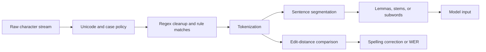

# Regular Expressions, Text Normalization, and Edit Distance

Regular expressions and normalization are the front door of most NLP pipelines. Before a classifier, parser, or language model can reason about text, the raw character stream must be segmented into units, cleaned into a consistent representation, and sometimes compared against other strings. Jurafsky and Martin treat these as the first concrete algorithms of NLP because they turn informal text into structured inputs. Eisenstein places the same ideas inside finite-state language theory, emphasizing that many practical tokenizers and morphological analyzers are regular languages or finite-state transducers.


*Figure: ELIZA provides historical context for dialogue systems and chatbot evaluation. Image: [Wikimedia Commons](https://commons.wikimedia.org/wiki/File:ELIZA_conversation.png), Unknown author, public domain text.*

The practical lesson is that preprocessing is not a harmless detail. Tokenization choices affect vocabulary size, named entity boundaries, speech transcripts, subword models, and evaluation. Edit distance then gives a dynamic programming bridge between surface forms, supporting spelling correction, speech error analysis, approximate matching, and minimum-error alignments.

## Definitions

A **regular expression** is a pattern language for matching sets of strings. Concatenation joins patterns in sequence, alternation chooses between patterns, character classes describe sets of characters, and repetition operators such as `*`, `+`, and `{m,n}` describe repeated occurrences. A regular expression denotes a regular language, and every regular language can be recognized by some finite-state automaton.

**Text normalization** converts raw text into a form that is easier to process. Common steps include Unicode normalization, case handling, tokenization, sentence segmentation, lemmatization, stemming, and special handling for numbers, dates, hashtags, URLs, contractions, and disfluencies. A **token** is the unit emitted by a tokenizer; it may be a word, punctuation mark, subword, or special symbol. A **word type** is a distinct vocabulary item, while a **word instance** is one occurrence in a corpus.

A **wordform** is an inflected surface form such as `cats`; a **lemma** is the dictionary-like base shared by related forms, such as `cat`. **Stemming** strips affixes by rule or heuristic, while **lemmatization** normally uses vocabulary and part-of-speech information.

The **minimum edit distance** between strings $x$ and $y$ is the minimum total cost of operations that transform $x$ into $y$. The usual operations are insertion, deletion, and substitution. With unit costs, the Levenshtein distance uses cost $1$ for all three operations. The dynamic programming table $D(i,j)$ stores the best cost for converting the first $i$ characters of $x$ into the first $j$ characters of $y$:

$$
\begin{aligned}
D(i,j)=\min\{&
D(i-1,j)+c_{\mathrm{del}},\\
&D(i,j-1)+c_{\mathrm{ins}},\\
&D(i-1,j-1)+c_{\mathrm{sub}}(x_i,y_j)\}.
\end{aligned}
$$

Here $c_{\mathrm{sub}}(x_i,y_j)=0$ when the two characters match and is otherwise the substitution cost.

## Key results

Regular expressions are efficient because they can be compiled into finite-state machines. Once compiled, many tokenization and extraction patterns can be applied in time linear in the length of the text. That is why production tokenizers often combine regular expression rules, exception lists, and deterministic finite-state logic rather than expensive downstream models.

Normalization decisions are task dependent. Lowercasing can help a document classifier generalize across `Apple` and `apple`, but it can hurt named entity recognition because capitalization is a strong cue. Splitting punctuation can help parsers and sentence segmenters, but splitting periods in abbreviations creates false sentence boundaries. In large language models, bottom-up subword tokenization such as byte-pair encoding avoids an enormous open vocabulary by building a vocabulary of frequent character sequences.

Heaps' law describes how vocabulary size grows with corpus length:

$$
|V| = kN^\beta,\qquad 0 < \beta < 1.
$$

This matters because a larger corpus continually introduces new word types. Normalization and subword tokenization are ways to reduce sparsity, but they also remove distinctions. The correct level is the one that preserves distinctions needed by the task.

Minimum edit distance has optimal substructure. The best alignment of two prefixes must end in one of three possibilities: delete the last source character, insert the last target character, or align the last two characters by match or substitution. Filling the table by increasing prefix length gives time $O(\vert x\vert \vert y\vert )$ and space $O(\vert x\vert \vert y\vert )$, or $O(\min(\vert x\vert ,\vert y\vert ))$ if only the distance is needed and backpointers are not stored. If we keep backpointers, the table also gives an alignment, not only a score.

The same dynamic programming idea reappears throughout NLP: Viterbi for HMM tagging, CKY for constituency parsing, CTC for speech recognition, and sequence alignment for evaluation. The preprocessing chapter is therefore also an introduction to a general algorithmic style. One practical check is to ask whether a preprocessing decision changes the label space, the feature space, or only the display form. If it changes labels or features, it is part of the model design and should be versioned with experiments.

## Visual



| Task | Typical unit | Normalization risk | Common tool |
|---|---:|---|---|
| Sentiment classification | word or subword | losing negation or emoticons | regex tokenizer plus vocabulary |
| Named entity recognition | word plus punctuation | lowercasing names | rule tokenizer with case preserved |
| Neural language modeling | subword | opaque token boundaries | BPE, WordPiece, unigram LM |
| TTS normalization | semiotic class | wrong verbalization of numbers | rules plus encoder-decoder models |
| ASR evaluation | word | inconsistent tokenization | edit distance alignment |

## Worked example 1: tokenizing a noisy sentence

Problem: tokenize the sentence `Dr. Lee paid $1,250.50 for 3kg of coffee... wow!` for a downstream named entity and information extraction system.

1. Decide what must be preserved. The title `Dr.`, the name `Lee`, the money amount, the quantity, and sentence-final punctuation may all be useful. Lowercasing would erase the name cue, so keep case.
2. Write a priority order. Match special tokens before generic words:
   - abbreviations: `Dr\.`
   - money: `\$\d{1,3}(,\d{3})*(\.\d+)?`
   - quantities: `\d+(\.\d+)?[A-Za-z]+`
   - words: `[A-Za-z]+`
   - punctuation: `[.!?]+|[,;:]`
3. Apply left-to-right longest matching:
   - `Dr.` matches abbreviation.
   - `Lee` matches word.
   - `paid` matches word.
   - `$1,250.50` matches money.
   - `for` matches word.
   - `3kg` matches quantity.
   - `of` and `coffee` match words.
   - `...` matches punctuation as one token.
   - `wow` matches word.
   - `!` matches punctuation.

Checked answer:

```text
["Dr.", "Lee", "paid", "$1,250.50", "for", "3kg", "of", "coffee", "...", "wow", "!"]
```

The answer is not the only possible tokenization. A parser might prefer `["3", "kg"]`, and a TTS system might classify `$1,250.50` as a money semiotic class before verbalizing it. The important check is that the tokenization is consistent with the task.

## Worked example 2: minimum edit distance for spelling correction

Problem: compute the Levenshtein distance between `intention` and `execution`.

Use unit insertion, deletion, and substitution costs. Instead of displaying all $10 \times 10$ cells, show a valid shortest edit script and verify its cost:

1. Start with `intention`.
2. Substitute `i -> e`: `entention` with cost $1$.
3. Substitute `n -> x`: `extention` with cost $2$.
4. Substitute `t -> e`: `exeention` with cost $3$.
5. Substitute `n -> c`: `execetion` with cost $4$.
6. Substitute `t -> u`: `execution` with cost $5$.

So the edit distance is at most $5$. To check that it is not smaller, note that the two strings have equal length, so an edit script using only insertions and deletions would need pairs of operations and would not beat substitutions for mismatched positions. Comparing aligned positions:

```text
intention
execution
^^^^^    
```

The last four letters `tion` already match. The first five positions differ, so at least five substitutions or equivalent operations are required. Therefore the minimum edit distance is exactly $5$.

## Code

```python
import re

TOKEN_RE = re.compile(
    r"""
    Dr\. |
    \$\d{1,3}(?:,\d{3})*(?:\.\d+)? |
    \d+(?:\.\d+)?[A-Za-z]+ |
    [A-Za-z]+ |
    [.!?]+ | [,;:]
    """,
    re.VERBOSE,
)

def tokenize(text: str) -> list[str]:
    return [m.group(0) for m in TOKEN_RE.finditer(text)]

def edit_distance(a: str, b: str) -> int:
    dp = [[0] * (len(b) + 1) for _ in range(len(a) + 1)]
    for i in range(len(a) + 1):
        dp[i][0] = i
    for j in range(len(b) + 1):
        dp[0][j] = j
    for i, ca in enumerate(a, 1):
        for j, cb in enumerate(b, 1):
            dp[i][j] = min(
                dp[i - 1][j] + 1,
                dp[i][j - 1] + 1,
                dp[i - 1][j - 1] + (ca != cb),
            )
    return dp[-1][-1]

print(tokenize("Dr. Lee paid $1,250.50 for 3kg of coffee... wow!"))
print(edit_distance("intention", "execution"))
```

## Common pitfalls

- Treating tokenization as universal. A good tokenizer for search may be a poor tokenizer for NER, parsing, or TTS.
- Lowercasing before deciding whether capitalization is a feature.
- Using `.*` greedily in regexes and accidentally matching across fields or sentences.
- Splitting punctuation without protecting abbreviations, decimal numbers, URLs, and money amounts.
- Reporting edit distance without specifying operation costs.
- Computing edit distance recursively without memoization, which turns a simple dynamic program into exponential work.
- Forgetting that subword tokenization changes the unit of downstream labels; word-level NER labels must be projected to subwords and then reconstructed.

## Connections

- [N-gram language models](/cs/nlp/n-gram-language-models)
- [Sequence labeling with HMMs and CRFs](/cs/nlp/sequence-labeling-hmms-crfs)
- [Speech recognition and synthesis](/cs/nlp/speech-recognition-and-synthesis)
- [Information extraction](/cs/nlp/information-extraction)
