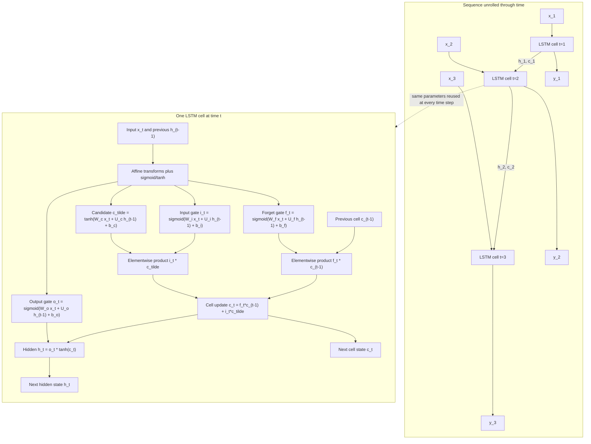

# RNNs and LSTMs for Sequence Modeling

Recurrent neural networks process sequences by carrying a hidden state forward through time. Jurafsky and Martin present RNNs and LSTMs as the bridge from fixed-window feedforward language models to encoder-decoder models and attention. Eisenstein introduces recurrent neural language models, backpropagation through time, gated recurrent networks, and sequence labeling variants from a more formal learning perspective.


*Figure: ELIZA provides historical context for dialogue systems and chatbot evaluation. Image: [Wikimedia Commons](https://commons.wikimedia.org/wiki/File:ELIZA_conversation.png), Unknown author, public domain text.*

The core motivation is simple: language is not a fixed-size input. A word's interpretation can depend on earlier words, and sequence tasks require predictions at many positions. RNNs encode a prefix into a vector state; LSTMs improve that state with gates that control what is remembered, forgotten, and exposed.

## Definitions

A simple **recurrent neural network** updates a hidden state $h_t$ for each input $x_t$:

$$
h_t=g(W_xx_t+W_hh_{t-1}+b).
$$

The same parameters are reused at every time step. For language modeling, the output distribution is often

$$
\hat{y}_t=\mathrm{softmax}(Uh_t+c),
$$

which estimates $P(w_{t+1}\mid w_1,\ldots,w_t)$.

**Backpropagation through time** unrolls the recurrent computation across the sequence and applies ordinary backpropagation to the unrolled graph. Because the same weights occur at every time step, gradients from all time steps are accumulated for shared parameters.

An **LSTM** adds a memory cell $c_t$ and gates:

$$
\begin{aligned}
i_t &= \sigma(W_ix_t+U_ih_{t-1}+b_i),\\
f_t &= \sigma(W_fx_t+U_fh_{t-1}+b_f),\\
o_t &= \sigma(W_ox_t+U_oh_{t-1}+b_o),\\
\tilde{c}_t &= \tanh(W_cx_t+U_ch_{t-1}+b_c),\\
c_t &= f_t\odot c_{t-1}+i_t\odot \tilde{c}_t,\\
h_t &= o_t\odot \tanh(c_t).
\end{aligned}
$$

A **bidirectional RNN** runs one recurrence left-to-right and another right-to-left, then combines their states. This is useful for tagging and classification when the whole input is available.

An **encoder-decoder** uses one network to encode the source sequence and another to decode the target sequence. Attention improves the decoder by letting it look back at encoder states instead of relying on a single final vector.

## Key results

RNNs replace the Markov assumption of n-gram models with a learned continuous state. In principle, $h_t$ can summarize all prior tokens. In practice, simple RNNs suffer from vanishing and exploding gradients because backpropagation multiplies through many recurrent Jacobians. Gradients can shrink toward zero, making early tokens hard to learn from, or explode, making training unstable. Gradient clipping helps explosions; gated architectures help vanishing.

LSTMs improve long-range learning through the additive cell update

$$
c_t=f_t\odot c_{t-1}+i_t\odot\tilde{c}_t.
$$

The forget gate can preserve part of the old cell nearly unchanged, creating a path for information and gradients across many time steps. The input gate controls new information, and the output gate controls what part of memory influences the hidden state.

RNNs support several NLP architectures:

- many-to-one classification, such as sentiment from a final or pooled state;
- many-to-many sequence labeling, such as POS or NER from each hidden state;
- language modeling, predicting the next token at every position;
- encoder-decoder transduction, such as machine translation or summarization.

Attention addresses the bottleneck in early encoder-decoder models. Instead of compressing the source into one final hidden state, the decoder computes weights over all encoder states and forms a context vector. This idea prepares the move to transformers, where attention becomes the primary sequence operation rather than an add-on to recurrence.

RNNs are sequential by design: $h_t$ depends on $h_{t-1}$, so training and inference are harder to parallelize than transformer self-attention. However, the recurrence has linear memory in sequence length and remains useful for streaming and small models.

A practical distinction is between using an RNN as an encoder and using it as a decoder. As an encoder, a bidirectional LSTM can read the whole sentence and produce contextual states for every token, which works well for tagging and classification. As a decoder, an RNN must generate one token at a time, conditioning on previous generated tokens and perhaps an attention context. This decoder view is what early neural MT, summarization, and dialogue systems used before transformer decoders became dominant.

The hidden state is a learned summary, not a guaranteed memory. If a sequence is long, information may be overwritten or compressed away even in an LSTM. Attention was introduced partly because forcing all source information through one final encoder vector was too severe. With attention, the decoder can inspect all encoder states and use the recurrent state mainly to represent target-side history and decoding context.

RNNs are still pedagogically valuable because they make temporal parameter sharing explicit. The same transition function is applied at every position, just as an n-gram model applies the same conditional probability table to every position. The difference is that an RNN learns a continuous state instead of using a discrete suffix of the history.

In implementation, sequence batching creates subtle engineering details. Sentences have different lengths, so batches usually contain padding tokens and masks. Losses should ignore padded positions, and hidden states should not treat padding as real evidence. Packed sequence utilities or explicit masks solve this for RNN encoders. The same issue appears in transformers, but RNNs make it especially visible because the hidden state can carry padding effects forward if masking is mishandled.

## Visual



This LSTM diagram shows both the unrolled recurrent computation and the internals of one cell. The cell labels the forget, input, candidate, and output gates, plus the additive cell-state update that carries information across time. The dotted edge emphasizes temporal parameter sharing: every time step uses the same gate equations while passing distinct `h_t` and `c_t` states forward.

| Architecture | Input-output shape | Typical task | Limitation |
|---|---|---|---|
| Simple RNN LM | prefix to next token | language modeling | vanishing gradients |
| BiLSTM tagger | tokens to tags | POS, NER, SRL | cannot stream right context |
| Encoder-decoder | source sequence to target sequence | MT, summarization | bottleneck without attention |
| Attention-based seq2seq | decoder attends to encoder states | MT, ASR, TTS | still sequential decoding |
| Transformer | all tokens attend in parallel | LLMs, encoders | quadratic attention cost |

## Worked example 1: one RNN update

Problem: compute one hidden-state update with

$$
x_t=\begin{bmatrix}1\\0\end{bmatrix},\quad
h_{t-1}=\begin{bmatrix}0.5\\-0.5\end{bmatrix}.
$$

Let

$$
W_x=\begin{bmatrix}1&2\\0&1\end{bmatrix},\quad
W_h=\begin{bmatrix}0.5&0\\0&0.5\end{bmatrix},\quad
b=\begin{bmatrix}0\\0\end{bmatrix},
$$

and $g=\tanh$.

1. Input contribution:

$$
W_xx_t=
\begin{bmatrix}1&2\\0&1\end{bmatrix}
\begin{bmatrix}1\\0\end{bmatrix}
=\begin{bmatrix}1\\0\end{bmatrix}.
$$

2. Recurrent contribution:

$$
W_hh_{t-1}=
\begin{bmatrix}0.5&0\\0&0.5\end{bmatrix}
\begin{bmatrix}0.5\\-0.5\end{bmatrix}
=\begin{bmatrix}0.25\\-0.25\end{bmatrix}.
$$

3. Preactivation:

$$
a_t=\begin{bmatrix}1.25\\-0.25\end{bmatrix}.
$$

4. Apply $\tanh$:

$$
h_t=\begin{bmatrix}\tanh(1.25)\\\tanh(-0.25)\end{bmatrix}
\approx
\begin{bmatrix}0.848\\-0.245\end{bmatrix}.
$$

Checked answer: the next hidden state is approximately $[0.848,-0.245]^\top$.

## Worked example 2: LSTM memory gate intuition

Problem: an LSTM has previous cell value $c_{t-1}=4.0$, forget gate $f_t=0.75$, input gate $i_t=0.2$, and candidate memory $\tilde{c}_t=-1.0$. Compute the new cell value.

1. Start from the LSTM cell update:

$$
c_t=f_t c_{t-1}+i_t\tilde{c}_t.
$$

2. Substitute values:

$$
c_t=(0.75)(4.0)+(0.2)(-1.0).
$$

3. Compute retained memory:

$$
(0.75)(4.0)=3.0.
$$

4. Compute new candidate contribution:

$$
(0.2)(-1.0)=-0.2.
$$

5. Add:

$$
c_t=3.0-0.2=2.8.
$$

Checked answer: the new cell value is $2.8$. Most old memory was retained, and a small amount of negative new evidence was added.

## Code

```python
import torch
import torch.nn as nn

class BiLSTMTagger(nn.Module):
    def __init__(self, vocab_size, tag_count, emb_dim=64, hidden=128):
        super().__init__()
        self.emb = nn.Embedding(vocab_size, emb_dim, padding_idx=0)
        self.lstm = nn.LSTM(
            emb_dim,
            hidden // 2,
            batch_first=True,
            bidirectional=True,
        )
        self.out = nn.Linear(hidden, tag_count)

    def forward(self, token_ids):
        x = self.emb(token_ids)
        h, _ = self.lstm(x)
        return self.out(h)  # batch x length x tag_count

model = BiLSTMTagger(vocab_size=5000, tag_count=9)
tokens = torch.randint(1, 5000, (4, 10))
tags = torch.randint(0, 9, (4, 10))
logits = model(tokens)
loss = nn.CrossEntropyLoss()(logits.reshape(-1, 9), tags.reshape(-1))
loss.backward()
print(logits.shape, loss.item())
```

## Common pitfalls

- Using the final hidden state for long-document classification without checking whether it actually preserves early information.
- Forgetting masks for padded tokens in sequence losses.
- Treating bidirectional RNNs as valid for streaming applications; they require future context.
- Allowing exploding gradients by training without clipping on long sequences.
- Assuming LSTMs completely solve long-range dependency; they help but do not remove all memory limits.
- Comparing RNN and transformer models without accounting for parameter count, data size, and sequence length.
- Confusing attention over encoder states with self-attention among all tokens.

## Connections

- [N-gram language models](/cs/nlp/n-gram-language-models)
- [Transformers and self-attention](/cs/nlp/transformers-self-attention)
- [Machine translation](/cs/nlp/machine-translation)
- [Speech recognition and synthesis](/cs/nlp/speech-recognition-and-synthesis)
