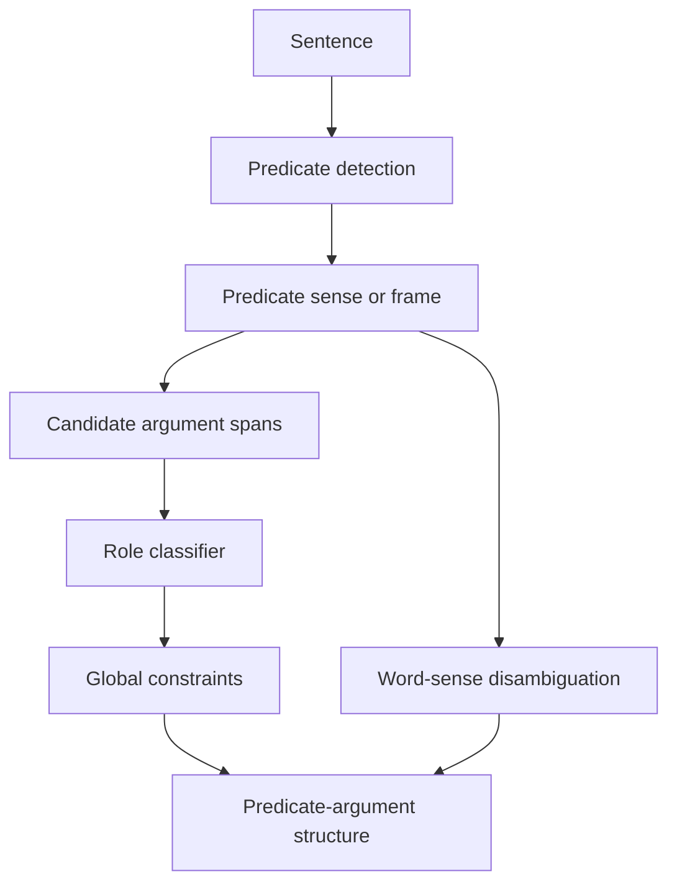

# Semantic Role Labeling and Word-Sense Disambiguation

Semantic role labeling and word-sense disambiguation move from surface form toward meaning. Jurafsky and Martin cover semantic roles, PropBank-style arguments, thematic role problems, selectional restrictions, and semantic role labeling algorithms. Eisenstein adds predicate-argument semantics, VerbNet, PropBank, FrameNet, SRL as classification and constrained optimization, neural SRL, AMR, and a classification view of word-sense disambiguation.


*Figure: Skip-gram training ties word meaning to surrounding context. Image: [Wikimedia Commons](https://commons.wikimedia.org/wiki/File:Word_embeddings_Skip-gram.svg), Jeran Renz, CC BY-SA 4.0.*

Both tasks ask a contextual question. For SRL: who did what to whom, where, when, and how? For WSD: which meaning of a word is intended here? They are distinct tasks, but they share a dependence on syntax, lexical semantics, context, and inventories of labels.

## Definitions

A **predicate** evokes an event, state, or relation. Its **arguments** fill semantic roles. In `Asha gave Boyang a book`, the predicate `gave` has a giver, recipient, and theme.

**Semantic role labeling** identifies predicates and labels their arguments. PropBank uses predicate-specific numbered arguments such as `ARG0`, `ARG1`, and `ARG2`, plus adjunct roles such as `AM-TMP` for time and `AM-LOC` for location. The exact role meaning depends on the predicate frameset.

**FrameNet** uses semantic frames: structured scenes with frame elements. For example, a commercial transaction frame can include buyer, seller, goods, and money. **VerbNet** groups verbs by syntactic and semantic behavior and uses more general thematic roles.

A simplified SRL output might be:

```text
[ARG0 Asha] [PRED gave] [ARG2 Boyang] [ARG1 a book] [AM-TMP yesterday]
```

**Word-sense disambiguation** assigns a sense to a word occurrence from an inventory such as WordNet synsets or FrameNet frames. For example, `bank` may mean a financial institution or river edge.

SRL can be formulated as span classification, sequence labeling, or structured prediction. WSD can be treated as supervised classification with contextual features or contextual embeddings.

## Key results

Semantic roles are useful because syntax alone does not identify event participants. In active and passive forms, the subject changes but the underlying role can remain stable:

```text
Asha taught algebra to Boyang.
Boyang was taught algebra by Asha.
```

In both cases, Asha is the teacher and Boyang is the student.

SRL pipelines often include predicate identification, predicate sense disambiguation, argument identification, and argument classification. Earlier systems used parse-tree features such as phrase type, path from argument to predicate, head word, position, and voice. Neural systems use BiLSTMs or transformers to classify spans or tokens, sometimes with constraints.

Constraints matter because not every local role decision is globally coherent. A predicate should not usually have two core `ARG0` spans, argument spans should not overlap, and role labels must belong to the predicate's frame. Integer linear programming, dynamic programming, CRFs, and constrained decoding have all been used to enforce such rules.

WSD has a strong most-frequent-sense baseline. Many words are skewed toward one sense, so systems must beat this baseline to show contextual understanding. Contextual embeddings improve WSD because the same word type receives different vectors in different contexts. A practical method is to average contextual embeddings for labeled training examples of each sense, then classify a new occurrence by nearest sense vector.

SRL and WSD also expose the limits of fixed inventories. Sense boundaries can be fuzzy, metaphors can stretch frames, and different resources carve meaning differently. The label inventory is part of the model.

Syntax is helpful but not sufficient. Constituency parses can propose argument spans, and dependency parses can reveal paths from predicates to arguments, but semantic roles do not always follow syntax directly. Control, raising, passive voice, nominal predicates, implicit arguments, and coordination can all require additional reasoning. This is why SRL systems historically combined parse features with classifiers and why neural systems still benefit from syntactic signals in some domains.

WSD and SRL meet at predicate sense. PropBank roles such as `ARG0` and `ARG1` depend on the predicate frameset, so choosing the wrong sense can change the interpretation of every argument. In FrameNet, the lexical unit evokes a frame, and frame elements are defined relative to that frame. A model that labels argument spans without resolving predicate sense may produce locally plausible but semantically inconsistent outputs.

These tasks are valuable for applications because they normalize surface variation. `Asha sold the bike to Ravi` and `Ravi bought the bike from Asha` describe closely related commercial events with different syntax and predicates. SRL, frames, and event representations can make that relationship explicit, supporting question answering, information extraction, and summarization.

Evaluation should distinguish subtasks. Predicate detection, predicate sense, argument boundary detection, and role classification can fail independently. Reporting only an end-to-end score hides whether a model is missing predicates, finding wrong spans, or assigning wrong labels to correct spans.

WSD evaluation has a similar decomposition. A system may choose among senses for a fixed target word, disambiguate every content word in running text, or map tokens to a sense inventory while also lemmatizing and tagging parts of speech. These settings are not interchangeable. A model that performs well on coarse homographs such as `bank` may still struggle with fine-grained WordNet distinctions, where even humans disagree.

For applications, coarse meaning may be enough. A search system may only need to separate financial `bank` from river `bank`; a lexical resource project may need much finer distinctions. Similarly, IE may only need buyer, seller, and goods, while a semantic theory may care about possession transfer, payment, and obligations. The granularity should follow the downstream question.

The same granularity issue appears in roles. Some tasks need only agent-like and patient-like participants; others need instrument, beneficiary, source, destination, manner, and temporal modifiers. More labels can express more meaning, but they require more data and create harder annotation decisions.

## Visual



| Resource | Organizing idea | Example labels | Strength |
|---|---|---|---|
| PropBank | predicate-specific framesets | `ARG0`, `ARG1`, `AM-TMP` | broad treebank annotation |
| FrameNet | semantic frames | Buyer, Seller, Goods | richer frame semantics |
| VerbNet | verb classes and thematic roles | Agent, Theme, Recipient | syntax-semantics links |
| WordNet | synsets and lexical relations | word senses | useful WSD inventory |
| AMR | graph of concepts and roles | `want-01`, `:ARG0` | sentence-level meaning graph |

## Worked example 1: PropBank-style SRL

Problem: label the roles in `Maya sold Ravi a bicycle yesterday` for predicate `sold`.

1. Identify predicate:
   - `sold` evokes a selling event.
2. Identify core participants:
   - Seller: `Maya`
   - Buyer or recipient: `Ravi`
   - Thing sold: `a bicycle`
3. Map to typical PropBank-style roles for `sell`:
   - `ARG0`: seller
   - `ARG1`: thing sold
   - `ARG2`: buyer
4. Identify adjunct:
   - `yesterday` is a temporal modifier, `AM-TMP`.
5. Produce the labeled structure:

```text
[ARG0 Maya] [PRED sold] [ARG2 Ravi] [ARG1 a bicycle] [AM-TMP yesterday]
```

Checked answer: the roles are not determined only by position. If the sentence were passive, `A bicycle was sold to Ravi by Maya yesterday`, the same event roles would remain.

## Worked example 2: word-sense disambiguation with context

Problem: choose the sense of `bank` in `The canoe reached the bank before sunset`. Candidate senses are financial institution and river edge.

1. Extract context words:
   - `canoe`, `reached`, `before`, `sunset`.
2. Compare selectional and topical cues:
   - `canoe` strongly suggests water or rivers.
   - `reached the bank` can describe arriving at land beside water.
   - There are no finance cues such as `loan`, `account`, `deposit`, or `branch`.
3. Score senses informally:
   - River edge: high contextual compatibility.
   - Financial institution: low contextual compatibility.
4. Assign the sense:

```text
bank = river edge
```

Checked answer: the intended sense is river edge. A supervised WSD model would learn this from context features or contextual embeddings around labeled examples.

## Code

```python
from collections import Counter
from math import sqrt

examples = {
    "financial": ["loan account deposit teller credit money"],
    "river": ["canoe river water shore flood sunset"],
}

def bow(text):
    return Counter(text.lower().split())

def cosine(a, b):
    vocab = set(a) | set(b)
    dot = sum(a[w] * b[w] for w in vocab)
    na = sqrt(sum(v * v for v in a.values()))
    nb = sqrt(sum(v * v for v in b.values()))
    return dot / (na * nb) if na and nb else 0.0

sense_vectors = {
    sense: bow(" ".join(texts))
    for sense, texts in examples.items()
}

context = bow("canoe reached bank before sunset")
scores = {sense: cosine(context, vec) for sense, vec in sense_vectors.items()}
print(scores)
print(max(scores, key=scores.get))
```

## Common pitfalls

- Treating PropBank `ARG0` as always identical to Agent; roles are predicate-specific.
- Ignoring predicate sense, which changes argument interpretation.
- Assuming syntactic subject equals semantic actor.
- Allowing overlapping SRL spans without a clear representation.
- Evaluating WSD without comparing against the most-frequent-sense baseline.
- Assuming WordNet, FrameNet, and PropBank labels are interchangeable.
- Using contextual embeddings without deciding which layer or pooling method represents the target word.

## Connections

- [Constituency parsing with CKY](/cs/nlp/constituency-parsing-cky)
- [Dependency parsing](/cs/nlp/dependency-parsing)
- [Vector semantics and embeddings](/cs/nlp/vector-semantics-and-embeddings)
- [Information extraction](/cs/nlp/information-extraction)
