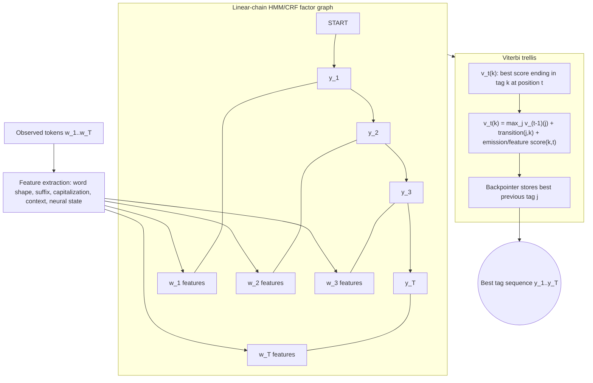

# Sequence Labeling with HMMs and CRFs

Sequence labeling assigns one label to each token in a sequence. Jurafsky and Martin introduce the topic through part-of-speech tagging and named entity recognition, using HMMs as the classic generative model and CRFs as the discriminative feature-rich model. Eisenstein gives the formal structure prediction view: the output space is exponentially large, but local score decompositions make Viterbi inference efficient.


*Figure: Parse trees make grammar derivations visible as rooted syntax structures. Image: [Wikimedia Commons](https://commons.wikimedia.org/wiki/File:Parse-tree.svg), Martin Thoma, CC BY 3.0.*

This topic matters because many NLP annotations are token-aligned: POS tags, named entity BIO tags, chunk labels, morphological tags, dialogue acts, and some semantic roles. The key idea is to score whole tag sequences rather than independent token decisions, so the model can prefer globally coherent outputs.

## Definitions

Given tokens $w_1,\ldots,w_T$, a **sequence labeling** model predicts tags $y_1,\ldots,y_T$. If there are $K$ possible tags, the number of tag sequences is $K^T$, so exhaustive enumeration is usually impossible.

A **hidden Markov model** defines transition probabilities and emission probabilities:

$$
P(y_1,\ldots,y_T,w_1,\ldots,w_T)
=\prod_{t=1}^T P(y_t\mid y_{t-1})P(w_t\mid y_t).
$$

Here the tags are hidden states and the words are observations. Decoding chooses

$$
\hat{y}_{1:T}=\arg\max_y P(y,w).
$$

A **linear-chain conditional random field** directly models the conditional probability of a tag sequence:

$$
P(y\mid w)=\frac{\exp\left(\sum_t \theta^\top f(y_{t-1},y_t,w,t)\right)}
{\sum_{y'}\exp\left(\sum_t \theta^\top f(y'_{t-1},y'_t,w,t)\right)}.
$$

The local feature function can inspect the input sequence, position, current tag, and previous tag. This allows spelling, capitalization, suffixes, word shape, neighboring words, gazetteers, and neural features.

**Viterbi decoding** is a dynamic programming algorithm for the best tag path. It stores the best score ending in each tag at each position:

$$
v_t(k)=\max_j v_{t-1}(j)+s_t(j,k).
$$

Backpointers recover the best sequence.

## Key results

The output space is exponential, but a first-order Markov or linear-chain decomposition makes exact decoding polynomial. With $T$ tokens and $K$ tags, Viterbi takes $O(TK^2)$ time because each cell considers $K$ possible predecessor tags.

HMMs are generative and make two major independence assumptions: each tag depends only on the previous tag, and each word depends only on its tag. These assumptions make estimation easy from counts:

$$
P(y_t=k\mid y_{t-1}=j)=\frac{C(j,k)}{C(j)},
$$

$$
P(w\mid k)=\frac{C(k,w)}{C(k)}.
$$

Smoothing is especially important for emissions because vocabularies are much larger than tag sets.

CRFs are discriminative. They do not need to model $P(w)$, and they can use arbitrary overlapping features of the observed input. This is why CRFs historically outperformed HMMs on NER and other feature-rich sequence tasks. CRF training requires computing the partition function, but the forward algorithm makes this efficient for linear chains.

BIO tagging is common for named entities. `B-PER` begins a person mention, `I-PER` continues it, and `O` marks outside. Sequence models are useful because some tag transitions are invalid or unlikely, such as `I-ORG` immediately after `B-PER`.

Modern systems often use transformer or BiLSTM representations with a token-level classifier, sometimes with a CRF layer on top. The neural encoder learns contextual features; the CRF enforces transition coherence.

The HMM-to-CRF progression is a useful example of changing what the model is responsible for. An HMM must explain the words and the tags, so its feature space is limited by the emission and transition probabilities. A CRF conditions on the whole observed sentence and only needs to score tag sequences, so it can include arbitrary features without modeling their probability. This is the same generative-versus-discriminative distinction seen in Naive Bayes versus logistic regression, but with structured outputs.

Unknown words expose the difference. An HMM can smooth emissions or use special unknown-word buckets, but adding features such as `ends in -ing`, `contains digit`, `is capitalized`, or `previous word is Mr.` is awkward in the generative story. A CRF can include all of these as overlapping feature functions. Neural taggers learn many such cues automatically from characters, subwords, and contextual encoders, but they still benefit from a structured decoder when label consistency matters.

A final practical issue is span reconstruction. In NER, the model predicts token labels, but the application consumes entity spans. Invalid transitions, subword splits, punctuation, and nested names can all create mismatch between token accuracy and entity-level usefulness. Always inspect both token-level errors and reconstructed-span errors.

Sequence labeling also illustrates exposure to domain shift. A POS tagger trained on edited newswire may perform poorly on social media, code-switched text, clinical notes, or speech transcripts with disfluencies. The label inventory may be the same, but tokenization, capitalization, spelling, punctuation, and vocabulary all change. Robust systems therefore evaluate by domain and often adapt with character features, subwords, contextual models, or small amounts of in-domain annotation.

The same framework also applies below and above the word. Character-level sequence labeling can segment words or detect spelling errors; sentence-level sequence labeling can assign dialogue acts or discourse functions. What changes is the unit being labeled and the feature representation. The inference issue remains: neighboring labels are usually not independent.

When teaching or debugging these models, always draw the trellis. The trellis makes it clear which local scores are available, where backpointers point, and why a locally attractive tag can lose after later transition costs are considered.

## Visual



This sequence-labeling diagram shows the chain structure and the dynamic-programming decoder. Observed token features connect to each position, adjacent tags contribute transition scores, and Viterbi stores the best score ending in each tag plus a backpointer. The recurrence makes the `O(TK^2)` computation visible: every tag at position `t` considers every previous tag.

| Model | Probability modeled | Features | Decoding | Main weakness |
|---|---|---|---|---|
| Independent classifier | $P(y_t\mid w,t)$ | rich local features | per-token argmax | incoherent tag sequences |
| HMM | $P(y,w)$ | emissions and transitions | Viterbi | hard to add arbitrary features |
| CRF | $P(y\mid w)$ | arbitrary local input features | Viterbi | training is more expensive |
| Neural tagger | $P(y_t\mid h_t)$ | learned contextual states | per token or CRF | needs data and compute |

## Worked example 1: Viterbi with two tags

Problem: tag the two-word sentence `fish swim` with tags $N$ and $V$. Use log scores.

Transition and emission local scores:

| Item | Score |
|---|---:|
| start to $N$ | $0$ |
| start to $V$ | $-2$ |
| $N$ to $N$ | $-3$ |
| $N$ to $V$ | $0$ |
| $V$ to $N$ | $-1$ |
| $V$ to $V$ | $-2$ |
| emit `fish` as $N$ | $0$ |
| emit `fish` as $V$ | $-1$ |
| emit `swim` as $N$ | $-2$ |
| emit `swim` as $V$ | $0$ |

1. Initialize position 1:

$$
v_1(N)=0+0=0.
$$

$$
v_1(V)=-2+(-1)=-3.
$$

2. Position 2, tag $N$:

$$
\max(v_1(N)+s(N,N),v_1(V)+s(V,N))+\mathrm{emit}(swim,N)
$$

$$
=\max(0-3,-3-1)-2=\max(-3,-4)-2=-5.
$$

3. Position 2, tag $V$:

$$
\max(v_1(N)+s(N,V),v_1(V)+s(V,V))+\mathrm{emit}(swim,V)
$$

$$
=\max(0+0,-3-2)+0=0.
$$

Checked answer: the best final tag is $V$ with score $0$, and its backpointer comes from $N$. The best sequence is $N,V$.

## Worked example 2: BIO transition check

Problem: decide whether the predicted BIO tag sequence is valid:

```text
New      I-LOC
York     I-LOC
is       O
busy     O
```

1. BIO convention requires an entity span to begin with `B-TYPE`.
2. The first tag is `I-LOC`. It has no preceding `B-LOC` or `I-LOC`.
3. Therefore the sequence starts inside a location without beginning one.
4. A corrected sequence is:

```text
New      B-LOC
York     I-LOC
is       O
busy     O
```

Checked answer: the original sequence is invalid under strict BIO. A CRF can learn or enforce low scores for such transitions.

## Code

```python
import torch

tags = ["N", "V"]
start = torch.tensor([0.0, -2.0])
trans = torch.tensor([
    [-3.0, 0.0],   # from N to N,V
    [-1.0, -2.0],  # from V to N,V
])
emit = torch.tensor([
    [0.0, -1.0],   # fish as N,V
    [-2.0, 0.0],   # swim as N,V
])

v = start + emit[0]
backpointers = []
for t in range(1, emit.shape[0]):
    scores = v[:, None] + trans
    best_prev = scores.argmax(dim=0)
    v = scores.max(dim=0).values + emit[t]
    backpointers.append(best_prev)

last = int(v.argmax())
path = [last]
for bp in reversed(backpointers):
    last = int(bp[last])
    path.append(last)
path.reverse()
print([tags[i] for i in path], v.max().item())
```

## Common pitfalls

- Tagging each token independently and then being surprised by impossible BIO sequences.
- Forgetting log space in Viterbi for probabilistic HMMs.
- Smoothing HMM emissions inadequately for unknown words.
- Using future context in a model intended for streaming.
- Evaluating NER by token accuracy instead of entity-level precision, recall, and F1.
- Letting subword tokenization misalign labels.
- Confusing CRF decoding with CRF training; decoding uses Viterbi, training uses normalization over all sequences.

## Connections

- [Regular expressions and normalization](/cs/nlp/regular-expressions-normalization-edit-distance)
- [RNNs and LSTMs for sequence modeling](/cs/nlp/rnns-lstms-sequence-modeling)
- [Pretrained language models](/cs/nlp/pretrained-language-models)
- [Information extraction](/cs/nlp/information-extraction)
