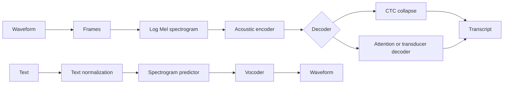

# Speech Recognition and Synthesis

Speech processing connects language to sound. Jurafsky and Martin include automatic speech recognition, log Mel features, encoder-decoder ASR, CTC, word error rate, text-to-speech, text normalization, spectrogram prediction, and vocoding. Eisenstein treats speech as a neighboring field to NLP and notes the role of language models in recognition and spoken dialogue. The combined view is that speech systems are language systems plus acoustic modeling and signal representations.


*Figure: ELIZA provides historical context for dialogue systems and chatbot evaluation. Image: [Wikimedia Commons](https://commons.wikimedia.org/wiki/File:ELIZA_conversation.png), Unknown author, public domain text.*

ASR maps audio to text. TTS maps text to audio. Both tasks involve sequence transduction, uncertainty, and evaluation problems. Speech also forces preprocessing questions to become concrete: numbers, abbreviations, punctuation, disfluencies, speaker variation, dialect, and code switching can change both recognition and synthesis.

## Definitions

**Automatic speech recognition** estimates a word or token sequence $y$ from acoustic input $x$:

$$
\hat{y}=\arg\max_y P(y\mid x).
$$

The input waveform is usually transformed into acoustic features such as a **log Mel spectrogram**, a time-frequency representation approximating human auditory resolution.

An **encoder-decoder ASR** model encodes acoustic frames and decodes text tokens autoregressively:

$$
P(y\mid x)=\prod_t P(y_t\mid y_{<t},x).
$$

**Connectionist Temporal Classification** handles unknown alignments between long frame sequences and shorter output strings. It introduces a blank symbol and sums over all frame-level alignments that collapse to the target string:

$$
P_{\mathrm{CTC}}(y\mid x)=\sum_{a\in B^{-1}(y)}P(a\mid x).
$$

Here $B$ removes blanks and repeated labels.

**Word error rate** is the standard ASR metric:

$$
\mathrm{WER}=100\cdot\frac{S+D+I}{N},
$$

where $S$ is substitutions, $D$ deletions, $I$ insertions, and $N$ words in the reference.

**Text-to-speech** converts text to waveform. Modern systems often predict Mel spectrograms from text and then use a **vocoder** to synthesize waveform audio.

## Key results

ASR is difficult because the acoustic signal is continuous, variable, and ambiguous. Speakers differ in accent, pitch, speed, microphone, background noise, emotion, health, and dialect. The same sound segment may map to different words depending on context, so language modeling is essential.

CTC solves alignment by allowing many frame-level paths to collapse to the same output. For example, alignments such as `d _ oo g` and `dd _ o g` can both collapse to `dog`, depending on the blank and repeat rules. Exact CTC training uses dynamic programming to sum over alignments rather than choosing a single forced alignment.

CTC has a conditional independence limitation: output labels are independent across time given the input. This makes external language models or transducer variants valuable. RNN-T adds a prediction network that conditions on previous nonblank outputs, making it useful for streaming ASR.

TTS has a different challenge: the input text underdetermines pronunciation and prosody. Text normalization must decide how to verbalize `Dr.`, `151`, `$12.50`, `2026`, URLs, and abbreviations. Grapheme-to-phoneme conversion, duration, stress, pitch, and phrasing all affect naturalness.

Evaluation differs between ASR and TTS. WER is useful but treats all word errors equally and can be harsh about harmless alternatives. TTS evaluation often uses human mean opinion scores, intelligibility tests, preference tests, and task-specific checks. A synthesized voice can be intelligible but unnatural, natural but mispronouncing names, or fluent but unsafe for impersonation contexts.

Speech systems intersect with fairness. Error rates can vary by dialect, accent, gender, age, disability, microphone quality, and background noise. A single aggregate WER can hide large disparities.

The language model component is what connects ASR most directly to the rest of NLP. Acoustic evidence may not distinguish homophones, reduced pronunciations, or noisy segments, so the system uses linguistic context to prefer likely word sequences. Classical ASR combined acoustic models, pronunciation lexicons, and n-gram language models. Modern end-to-end systems fold these components into neural architectures, but external language model rescoring is still useful, especially for CTC systems and domain adaptation.

Text normalization appears on both sides of speech. ASR may output `twenty twenty six` or `2026` depending on the transcript convention. TTS must decide how to verbalize `2026`, `Dr.`, `St.`, `3/4`, and `$12.50`. Evaluation becomes unfair if the reference uses one convention and the system another. Normalization therefore must be part of the metric pipeline, not just preprocessing.

TTS quality is multidimensional. A system can pronounce words correctly but sound flat; it can sound natural but place stress on the wrong word; it can handle common words but fail on names. Modern neural TTS often separates linguistic encoding, acoustic feature prediction, and vocoding, but the user experiences one waveform. Error analysis should inspect each stage as well as end-to-end listening tests.

Streaming constraints change model design. A batch ASR system can attend over an entire utterance before producing a transcript, but a live captioning system must emit partial results with low latency. This favors monotonic attention, CTC, RNN-T, chunked encoders, or other streaming architectures. The same transcript quality at very different latency can produce very different user experiences.

Speech also carries information that ordinary transcripts discard: speaker identity, emotion, prosody, hesitation, overlap, and background context. Some applications should preserve these cues, while others should remove them for privacy or readability. The correct representation depends on the downstream task, just as tokenization depends on the text task.

For ASR datasets, transcript conventions are part of the label. Filled pauses, partial words, punctuation, casing, and normalization may be included or excluded. A model trained under one convention can look wrong under another even when the recognized words are essentially correct.

## Visual



| Task | Input | Output | Key model issue | Common metric |
|---|---|---|---|---|
| ASR | waveform | text | acoustic-text alignment | WER |
| CTC ASR | frames | frame labels then collapse | independence assumptions | WER, CER |
| Streaming ASR | live audio | partial text | low latency | WER plus latency |
| TTS normalization | written text | spoken form | ambiguous semiotic classes | accuracy |
| TTS synthesis | text or phonemes | waveform | prosody and naturalness | MOS, preference |

## Worked example 1: word error rate

Problem: reference transcript is `the cat sat down`. ASR hypothesis is `the bat sat`.

1. Align the strings:

```text
ref: the cat sat down
hyp: the bat sat ----
```

2. Count errors:
   - `the` matches.
   - `cat -> bat` is one substitution, so $S=1$.
   - `sat` matches.
   - `down` is missing, so $D=1$.
   - There are no extra hypothesis words, so $I=0$.
3. Reference length:

$$
N=4.
$$

4. Compute WER:

$$
\mathrm{WER}=100\cdot\frac{1+1+0}{4}=50\%.
$$

Checked answer: WER is $50\%$. The number can be high for short utterances because each word carries large weight.

## Worked example 2: CTC collapsing

Problem: apply the CTC collapse function $B$ to this frame-level alignment, where `_` is blank:

```text
_ h h _ e l l _ o _
```

1. First merge consecutive repeated labels when they are not separated by blanks:
   - `_ h h _ e l l _ o _`
   - `h h` collapses to `h`.
   - `l l` collapses to `l`.
   - Result: `_ h _ e l _ o _`.
2. Remove blanks:
   - `h e l o`
3. Output string:

```text
helo
```

Checked answer: the alignment collapses to `helo`, not `hello`. To output double `l`, the alignment needs a blank between the two `l` labels, such as `_ h e l _ l o _`.

## Code

```python
def edit_distance_words(ref, hyp):
    r, h = ref.split(), hyp.split()
    dp = [[0] * (len(h) + 1) for _ in range(len(r) + 1)]
    for i in range(len(r) + 1):
        dp[i][0] = i
    for j in range(len(h) + 1):
        dp[0][j] = j
    for i in range(1, len(r) + 1):
        for j in range(1, len(h) + 1):
            dp[i][j] = min(
                dp[i - 1][j] + 1,
                dp[i][j - 1] + 1,
                dp[i - 1][j - 1] + (r[i - 1] != h[j - 1]),
            )
    return dp[-1][-1]

def wer(ref, hyp):
    return 100 * edit_distance_words(ref, hyp) / len(ref.split())

def ctc_collapse(labels, blank="_"):
    merged = []
    prev = None
    for label in labels:
        if label != prev:
            merged.append(label)
        prev = label
    return "".join(label for label in merged if label != blank)

print(wer("the cat sat down", "the bat sat"))
print(ctc_collapse("_ h h _ e l _ l o _".split()))
```

## Common pitfalls

- Comparing WER across systems with different text normalization.
- Ignoring punctuation and casing policies when aligning transcripts.
- Treating CTC's best frame path as the same as the most probable collapsed output.
- Forgetting that repeated letters need blanks between them in CTC alignments.
- Training TTS without robust normalization for numbers, dates, and abbreviations.
- Reporting one aggregate WER without checking accent, dialect, speaker, and noise subgroups.
- Assuming ASR output is ground truth for downstream NLP; recognition errors propagate.

## Connections

- [Regular expressions and normalization](/cs/nlp/regular-expressions-normalization-edit-distance)
- [RNNs and LSTMs for sequence modeling](/cs/nlp/rnns-lstms-sequence-modeling)
- [Machine translation](/cs/nlp/machine-translation)
- [Dialogue and chatbots](/cs/nlp/dialogue-and-chatbots)
