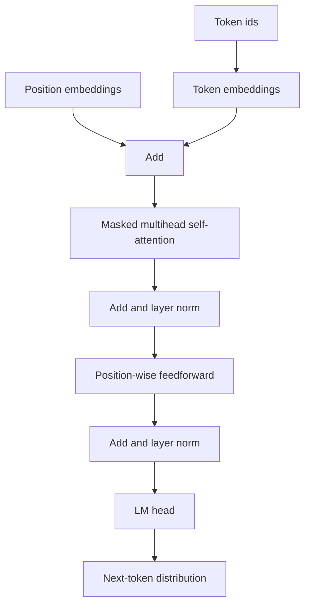

# Transformers and Self-Attention

Transformers replace recurrence with attention over token representations. Jurafsky and Martin present self-attention, multihead attention, transformer blocks, positional embeddings, causal language modeling, generation, and harms. Eisenstein's 2018 text predates the full LLM era but includes the formal ingredients that transformers build on: embeddings, neural language models, attention-based neural machine translation, and non-recurrent sequence transduction.


*Figure: Skip-gram training ties word meaning to surrounding context. Image: [Wikimedia Commons](https://commons.wikimedia.org/wiki/File:Word_embeddings_Skip-gram.svg), Jeran Renz, CC BY-SA 4.0.*

The key idea is that each token representation is updated by looking at other tokens. In causal language models, a token may attend only to previous tokens. In bidirectional encoders, it may attend to the whole input. This attention pattern, stacked with feedforward layers and residual connections, is the main architecture behind modern pretrained language models.

## Definitions

Given input vectors $x_1,\ldots,x_n$, self-attention creates queries, keys, and values:

$$
Q=XW_Q,\qquad K=XW_K,\qquad V=XW_V.
$$

Scaled dot-product attention is

$$
\mathrm{Attention}(Q,K,V)=
\mathrm{softmax}\left(\frac{QK^\top}{\sqrt{d_k}}\right)V.
$$

For a single token $i$, the attention weight on token $j$ is proportional to

$$
\exp\left(\frac{q_i^\top k_j}{\sqrt{d_k}}\right).
$$

**Multihead attention** runs several attention heads with separate projections, concatenates their outputs, and projects again. Different heads can learn different relations, such as local syntax, delimiter matching, coreference cues, or positional patterns.

A **transformer block** usually contains multihead attention, a position-wise feedforward network, residual connections, and layer normalization. A **causal mask** prevents position $i$ from attending to future positions $j\gt i$. **Positional encodings** or position embeddings provide order information, because attention itself is permutation-invariant without them.

An **autoregressive language model** factors text left-to-right:

$$
P(w_1,\ldots,w_T)=\prod_{t=1}^T P(w_t\mid w_1,\ldots,w_{t-1}).
$$

## Key results

Self-attention directly connects any two positions in one layer. This short path is a major advantage over RNNs, where information from token $1$ must pass through many recurrent updates to affect token $T$. Transformers are also parallel during training because all positions in a sequence can compute their masked attention at once.

The scaling factor $\sqrt{d_k}$ prevents dot products from growing too large as dimension increases. Without scaling, the softmax can become extremely peaked early in training, which weakens gradients.

The transformer block is more than attention. The feedforward network applies nonlinear transformations independently at each position; residual connections preserve a stream of information across layers; layer normalization stabilizes training. The residual stream view is useful: attention and MLP sublayers write updates into a shared token representation.

Causal transformers generate by repeated next-token prediction. Decoding choices include greedy search, beam search, temperature sampling, top-$k$, and nucleus sampling. Greedy decoding often becomes repetitive; high-temperature sampling can become incoherent. Decoding is therefore a modeling decision, not just an implementation detail.

The cost of full self-attention is quadratic in sequence length because it forms all pairwise token scores:

$$
O(n^2d).
$$

This cost motivates context-window limits, sparse attention, retrieval augmentation, recurrence-like memory, and other long-context methods.

Transformers can encode social biases, memorize data, produce toxic or private content, and generate fluent falsehoods. These harms are not side notes; they follow from training large models on broad text distributions and using them in open-ended settings.

A transformer layer can be read as two alternating operations. Attention moves information across positions: a pronoun can gather information from a candidate antecedent, or a verb can gather information from its subject. The feedforward network then transforms each position independently, applying nonlinear feature computation to the updated representation. Stacking many layers lets the model alternate communication and computation.

The architecture also changes how batching works. RNNs have a hard sequential dependency across time, while transformer training can compute attention for all positions in a sequence with large matrix multiplications. This matches GPU and TPU hardware well and is one reason transformers scaled so effectively. The price is memory: the attention matrix has one score for every ordered pair of tokens, so long documents are expensive.

Attention masks define the task. Causal masks create left-to-right generation. No mask creates bidirectional encoding. Encoder-decoder masks let target tokens attend to all source tokens but not to future target tokens. Many modeling mistakes are mask mistakes, and they can silently leak answers during training.

Finally, a transformer is not automatically a pretrained language model. The architecture is a computation pattern. The behavior associated with modern LLMs comes from the combination of architecture, tokenization, massive training data, objective, scale, fine-tuning, prompting, decoding, and deployment constraints.

The residual stream also explains why depth matters. Early layers often represent local lexical and positional information, middle layers can combine syntactic or entity cues, and later layers become more task- or objective-specific. This is a useful heuristic, not a law, but it guides probing and fine-tuning. For example, token classification tasks may benefit from intermediate layers, while generation uses the final layer because it is trained to feed the language modeling head.

Because attention is content-dependent, the same token can behave differently in different sentences. This is a major difference from static word embeddings. The representation of `bank` can attend to `river` in one context and `loan` in another, producing different hidden states. That contextualization is one reason transformers improved WSD, coreference, QA, and many classification tasks.

A final diagnostic is to inspect sequence length. If quality drops on long inputs, the cause may be truncation, attention dilution, positional extrapolation, retrieval failure, or simply missing information. Long-context behavior should be tested directly rather than assumed from the advertised context window.

For classroom calculations, small attention matrices are worth doing by hand. They make the query-key comparison, masking, normalization, and value mixing visible before those operations are hidden inside large tensor libraries.

## Visual




*Figure: The original Transformer separates encoder self-attention, decoder masked self-attention, and encoder-decoder attention. From [Vaswani et al., 2017](https://arxiv.org/abs/1706.03762) — embedded under educational fair use with attribution.*

| Attention type | Can attend to future? | Typical model | Common task |
|---|---:|---|---|
| Causal self-attention | no | GPT-style decoder | generation |
| Bidirectional self-attention | yes | BERT-style encoder | classification, tagging |
| Cross-attention | attends to source states | encoder-decoder MT | translation, ASR, TTS |
| Sparse attention | limited pattern | long-context models | long documents |

## Worked example 1: one-token attention weights

Problem: one query attends over two keys. Let

$$
q=[1,1],\quad k_1=[1,0],\quad k_2=[0,2],
$$

with $d_k=2$. Compute attention weights.

1. Dot products:

$$
q^\top k_1=1,\qquad q^\top k_2=2.
$$

2. Scale by $\sqrt{2}\approx1.414$:

$$
s_1=\frac{1}{1.414}=0.707,\qquad s_2=\frac{2}{1.414}=1.414.
$$

3. Exponentiate:

$$
e^{s_1}\approx2.028,\qquad e^{s_2}\approx4.113.
$$

4. Normalize:

$$
\alpha_1=\frac{2.028}{2.028+4.113}=0.330,
$$

$$
\alpha_2=\frac{4.113}{6.141}=0.670.
$$

Checked answer: the query places about $33.0\%$ weight on key $1$ and $67.0\%$ on key $2$.

## Worked example 2: applying a causal mask

Problem: a sequence has four tokens. At position $3$, which positions may a causal decoder attend to? Then describe the attention mask row for position $3$ using zero for allowed and $-\infty$ for blocked.

1. In a causal model, position $i$ can attend to positions $j\le i$.
2. For $i=3$, allowed positions are $1,2,3$.
3. Future position $4$ is blocked.
4. The mask row is

$$
[0,\;0,\;0,\;-\infty].
$$

5. Before softmax, this mask is added to attention scores. The fourth score becomes $-\infty$, so its softmax probability becomes $0$.

Checked answer: token $3$ can use itself and earlier context, but cannot see token $4$. This is what makes next-token prediction nontrivial during training.

## Code

```python
import torch
import torch.nn as nn

batch, length, dim = 2, 5, 16
x = torch.randn(batch, length, dim)

attn = nn.MultiheadAttention(
    embed_dim=dim,
    num_heads=4,
    batch_first=True,
)

# True entries are blocked in PyTorch's attention mask.
causal_mask = torch.triu(torch.ones(length, length, dtype=torch.bool), diagonal=1)
out, weights = attn(x, x, x, attn_mask=causal_mask)

ffn = nn.Sequential(
    nn.LayerNorm(dim),
    nn.Linear(dim, 4 * dim),
    nn.GELU(),
    nn.Linear(4 * dim, dim),
)

block_out = x + out
block_out = block_out + ffn(block_out)
print(block_out.shape)
print(weights.shape)
```

## Common pitfalls

- Forgetting the causal mask and accidentally letting a language model see the answer.
- Treating attention weights as a complete explanation; they are useful diagnostics but not definitive causal explanations.
- Omitting positional information and expecting the model to know word order.
- Comparing transformer and RNN complexity only by big-O without considering parallel hardware.
- Applying softmax over the wrong dimension in attention.
- Using beam search for open-ended generation and getting dull, repetitive outputs.
- Ignoring context-window limits and assuming a model can use all prompt information equally well.

## Connections

- [Pretrained language models](/cs/nlp/pretrained-language-models)
- [RNNs and LSTMs for sequence modeling](/cs/nlp/rnns-lstms-sequence-modeling)
- [Machine translation](/cs/nlp/machine-translation)
- [Dialogue and chatbots](/cs/nlp/dialogue-and-chatbots)
