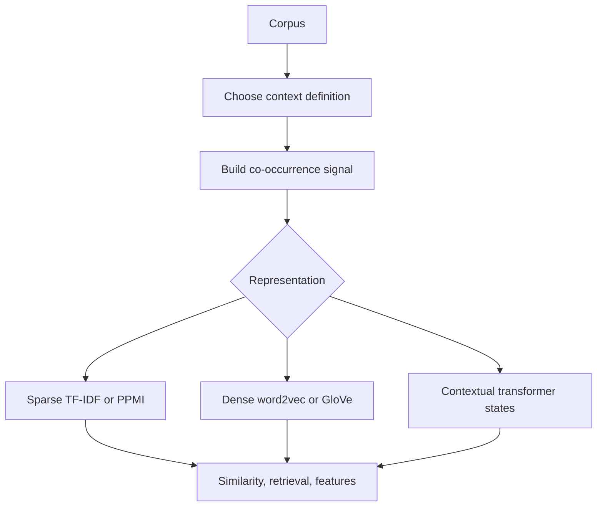

# Vector Semantics and Embeddings

Vector semantics represents word meaning with numbers. Jurafsky and Martin introduce count vectors, cosine similarity, TF-IDF, PMI, PPMI, word2vec, GloVe, visualization, evaluation, and bias. Eisenstein frames the same area around the distributional hypothesis, distinguishing distributional statistics from distributed representations and adding Brown clusters, latent semantic analysis, structured contexts, and formal links among embedding objectives.

The central idea is that words occurring in similar contexts tend to have related meanings. Count-based methods make this idea explicit with word-context matrices. Predictive embedding methods learn dense vectors that are more compact and often more useful downstream. Modern contextual language models extend the same idea by giving each token occurrence its own vector.

## Definitions

The **distributional hypothesis** says that a word's meaning is reflected in the contexts in which it appears. A **word-context matrix** $X$ has rows for target words and columns for contexts. An entry might be a raw count, a weighted count, or a transformed association score.

**Cosine similarity** compares vector directions:

$$
\cos(u,v)=\frac{u^\top v}{||u||\,||v||}.
$$

Cosine is common because vector length often reflects frequency more than semantic content.

**TF-IDF** weights a term by how frequent it is in a document and how rare it is across documents:

$$
\mathrm{tfidf}(t,d)=\mathrm{tf}(t,d)\log\frac{N}{\mathrm{df}(t)}.
$$

**Pointwise mutual information** measures association between a word $w$ and context $c$:

$$
\mathrm{PMI}(w,c)=\log\frac{P(w,c)}{P(w)P(c)}.
$$

**Positive PMI** clips negative values:

$$
\mathrm{PPMI}(w,c)=\max(\mathrm{PMI}(w,c),0).
$$

**Embeddings** are dense vectors, usually with tens to thousands of dimensions. Word2vec learns embeddings by predicting words from contexts or contexts from words. GloVe factorizes a transformation of global co-occurrence counts. Both produce static embeddings: one vector per word type.

## Key results

Sparse count vectors are interpretable but high-dimensional. Dense embeddings are less interpretable but compact and effective. Count-based and predictive methods are not opposites: many predictive objectives can be understood as implicitly factorizing a shifted PMI-like matrix.

The skip-gram version of word2vec predicts context words from a target word. With negative sampling, it trains a binary classifier to distinguish observed word-context pairs from randomly sampled noise pairs. For target $w$, observed context $c$, and negative samples $n_i$, a simplified objective is

$$
\log\sigma(v_c^\top u_w)+\sum_i\log\sigma(-v_{n_i}^\top u_w).
$$

CBOW reverses the direction: it predicts the target from a bag or average of context embeddings. GloVe minimizes a weighted squared error:

$$
J=\sum_{i,j} f(X_{ij})\left(w_i^\top \tilde{w}_j+b_i+\tilde{b}_j-\log X_{ij}\right)^2.
$$

Context definition changes what similarity means. A small symmetric window captures topical and functional similarity. Dependency contexts can emphasize syntactic substitutability. Document contexts support information retrieval and topic similarity. Subword-enriched embeddings improve rare and morphologically complex words.

Static embeddings conflate senses. The vector for `bank` averages financial and river contexts. Contextual embeddings from BERT-style and GPT-style models produce different vectors for different occurrences, which helps word-sense disambiguation and downstream tasks.

Embeddings also encode social biases present in training corpora. Bias is not only a geometric artifact; it is a data, annotation, deployment, and evaluation issue. Measuring nearest neighbors, analogy behavior, or downstream disparities can reveal problems, but mitigation must be tied to the actual application.

Count vectors and embeddings differ in how much they expose the modeling assumptions. With PPMI, one can inspect which contexts make two words similar. With dense vectors, the dimensions are usually not directly interpretable, but the model can compress many weak contextual signals into a useful representation. This creates a tradeoff between transparency and downstream accuracy. A good workflow is to start with count-based representations to understand the corpus, then use embeddings when generalization and compactness matter.

The context window is a hidden semantic choice. A wide window tends to group words by topic, so `doctor` may be close to `hospital`. A narrow or dependency-based context tends to group words by substitutability, so `doctor` may be closer to `nurse` or `surgeon`. Neither is universally correct. Information retrieval, analogy solving, WSD, and syntactic features can prefer different context definitions.

Static embeddings are often evaluated with word similarity or analogy datasets, but these tests cover only a small slice of usefulness. Downstream evaluation is still necessary. A representation that looks worse on analogies may be better for NER, sentiment, or low-resource transfer if its subword modeling, corpus domain, or frequency handling better matches the task.

## Visual

| Representation | Matrix or objective | Best for | Main limitation |
|---|---|---|---|
| Raw counts | $C(w,c)$ | transparent corpus analysis | frequency dominates |
| TF-IDF | term by document | retrieval and document similarity | not a lexical semantic model by itself |
| PPMI | word by context | interpretable association | sparse and noisy for rare words |
| LSA/SVD | low-rank count matrix | compression and smoothing | expensive on large matrices |
| word2vec | prediction with negative sampling | efficient dense embeddings | static senses |
| GloVe | weighted count factorization | global co-occurrence structure | static senses |
| Contextual LM | transformer hidden states | token meaning in context | expensive and layer-dependent |



## Worked example 1: TF-IDF by hand

Problem: compute TF-IDF for `cat` in document $d_1$.

Corpus:

```text
d1: cat sat cat
d2: dog sat
d3: cat ate fish
```

Use raw term frequency and $\mathrm{idf}(t)=\log(N/\mathrm{df}(t))$.

1. Number of documents:

$$
N=3.
$$

2. Term frequency of `cat` in $d_1$:

$$
\mathrm{tf}(\mathrm{cat},d_1)=2.
$$

3. Document frequency of `cat`: it appears in $d_1$ and $d_3$, so

$$
\mathrm{df}(\mathrm{cat})=2.
$$

4. IDF:

$$
\mathrm{idf}(\mathrm{cat})=\log\frac{3}{2}\approx0.405.
$$

5. TF-IDF:

$$
\mathrm{tfidf}(\mathrm{cat},d_1)=2(0.405)=0.811.
$$

Checked answer: `cat` in $d_1$ has TF-IDF about $0.811$ with natural logarithms. It receives less weight than a word that appears only in one document, because it is not maximally document-specific.

## Worked example 2: PPMI for a word-context pair

Problem: compute PPMI for target `coffee` and context `drink`. Suppose a corpus has $1000$ total word-context pairs. The pair (`coffee`, `drink`) occurs $20$ times. `coffee` appears in $50$ pairs, and `drink` appears as a context in $100$ pairs.

1. Estimate probabilities:

$$
P(\mathrm{coffee},\mathrm{drink})=\frac{20}{1000}=0.02.
$$

$$
P(\mathrm{coffee})=\frac{50}{1000}=0.05,\qquad
P(\mathrm{drink})=\frac{100}{1000}=0.10.
$$

2. Compute independence expectation:

$$
P(\mathrm{coffee})P(\mathrm{drink})=0.05(0.10)=0.005.
$$

3. Compute PMI:

$$
\mathrm{PMI}=\log\frac{0.02}{0.005}=\log 4\approx1.386.
$$

4. Clip at zero:

$$
\mathrm{PPMI}=\max(1.386,0)=1.386.
$$

Checked answer: PPMI is about $1.386$, indicating that `coffee` and `drink` co-occur four times more often than independence would predict.

## Code

```python
from collections import Counter, defaultdict
from math import log, sqrt

sentences = [
    "coffee drink hot",
    "tea drink hot",
    "coffee bean roast",
    "dog bark loud",
]

window = 1
pairs = Counter()
word_counts = Counter()
context_counts = Counter()

for sent in sentences:
    words = sent.split()
    for i, w in enumerate(words):
        word_counts[w] += 1
        for j in range(max(0, i - window), min(len(words), i + window + 1)):
            if i == j:
                continue
            c = words[j]
            pairs[(w, c)] += 1
            context_counts[c] += 1

total = sum(pairs.values())
vocab = sorted(word_counts)

def ppmi(w, c):
    if pairs[(w, c)] == 0:
        return 0.0
    p_wc = pairs[(w, c)] / total
    p_w = sum(pairs[(w, x)] for x in context_counts) / total
    p_c = context_counts[c] / total
    return max(log(p_wc / (p_w * p_c)), 0.0)

def vector(w):
    return [ppmi(w, c) for c in vocab]

def cosine(a, b):
    dot = sum(x * y for x, y in zip(a, b))
    na = sqrt(sum(x * x for x in a))
    nb = sqrt(sum(y * y for y in b))
    return dot / (na * nb) if na and nb else 0.0

print(cosine(vector("coffee"), vector("tea")))
print(cosine(vector("coffee"), vector("dog")))
```

## Common pitfalls

- Treating cosine similarity as meaning equivalence; it may reflect topic, syntax, domain, or frequency artifacts.
- Forgetting that PMI is biased toward rare events unless counts are smoothed or thresholded.
- Comparing embeddings trained with different corpora, dimensions, tokenization, or context windows as if they were directly equivalent.
- Ignoring out-of-vocabulary and rare word behavior.
- Assuming analogies prove deep semantic understanding.
- Using static embeddings for sense-sensitive tasks without checking ambiguity.
- Treating embedding bias as solved by a single vector projection.

## Connections

- [Pretrained language models](/cs/nlp/pretrained-language-models)
- [Logistic regression for text](/cs/nlp/logistic-regression-for-text)
- [Semantic role labeling and word-sense disambiguation](/cs/nlp/semantic-role-labeling-and-word-sense-disambiguation)
- [Information extraction](/cs/nlp/information-extraction)
