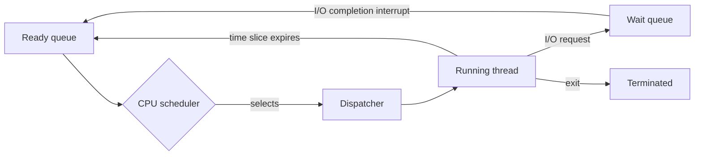

# CPU Scheduling

CPU scheduling is the policy problem at the heart of multiprogramming: when several processes or kernel-level threads are ready, which one gets the CPU next? The answer shapes responsiveness, throughput, fairness, deadline behavior, and user perception. The scheduler cannot make a slow CPU fast, but it can avoid wasting the CPU while processes wait for I/O and can prevent one activity from monopolizing the machine.

The textbook presents scheduling after synchronization in this edition, but conceptually it builds on processes and threads. The scheduler chooses among ready execution contexts; the dispatcher performs the context switch; timers and blocking operations create opportunities to reconsider the choice. Different environments want different outcomes, so a batch server, desktop, mobile phone, and real-time controller should not all use the same simple rule.

## Definitions

The **CPU scheduler** selects a process or thread from the ready queue. In operating systems that support kernel threads, the scheduled entities are usually kernel-level threads, even when people casually say "process scheduling."

The **dispatcher** gives control of the CPU to the selected execution context. It switches context, changes to user mode when appropriate, and jumps to the correct program location. **Dispatch latency** is the time needed to stop one process and start another.

A **CPU burst** is a period of computation between waits. An **I/O burst** is a period waiting for I/O. Interactive and I/O-bound processes often have short CPU bursts; CPU-bound processes have longer bursts.

A scheduling algorithm is **preemptive** if the OS can take the CPU away from a running process, typically because a timer interrupt occurs or a higher-priority task becomes ready. It is **nonpreemptive** if a running process keeps the CPU until it blocks or exits.

Common criteria include **CPU utilization**, **throughput**, **turnaround time**, **waiting time**, and **response time**. Real-time systems add **deadline satisfaction**, **latency bounds**, and sometimes formal schedulability tests.

Major algorithms include first-come, first-served (FCFS), shortest-job-first (SJF), priority scheduling, round-robin (RR), multilevel queue scheduling, multilevel feedback queues, and real-time algorithms such as rate-monotonic and earliest-deadline-first.

## Key results

FCFS is simple but can cause the **convoy effect**: short processes wait behind one long CPU-bound process, reducing device and CPU overlap. SJF is optimal for minimum average waiting time if exact next CPU-burst lengths are known, but they are usually not known. Operating systems estimate burst lengths with exponential averaging:

$$
\tau_{n+1} = \alpha t_n + (1-\alpha)\tau_n
$$

Here $t_n$ is the last observed burst, $\tau_n$ is the previous estimate, and $0 \le \alpha \le 1$ controls how quickly the estimate reacts.

Round-robin gives each ready process a time quantum. If the quantum is too large, RR degenerates toward FCFS. If the quantum is too small, context-switch overhead becomes excessive. A useful quantum should be large compared with dispatch latency but small enough for interactive response.

Priority scheduling can starve low-priority processes. **Aging** fixes this by gradually increasing the priority of processes that wait too long. Multilevel feedback queues generalize aging and interactivity: jobs that use short bursts stay in high-priority queues, while CPU-bound jobs migrate downward.

Real-time scheduling has stronger claims. Under **rate-monotonic scheduling**, shorter-period periodic tasks receive higher static priority. A classic sufficient CPU-utilization bound for $n$ independent periodic tasks is:

$$
U \le n(2^{1/n}-1)
$$

Under **earliest-deadline-first**, the task with the nearest absolute deadline runs first. On a single CPU with ideal assumptions, EDF can schedule any feasible set whose total utilization is at most 1.

| Algorithm | Preemptive? | Strength | Weakness |
|---|---:|---|---|
| FCFS | No | Simple and low overhead | Convoy effect, poor response |
| SJF / SRTF | SJF no, SRTF yes | Minimum average waiting if bursts known | Requires prediction |
| Priority | Either | Expresses importance | Starvation without aging |
| Round-robin | Yes | Good interactive sharing | Sensitive to quantum |
| Multilevel feedback | Yes | Adapts to behavior | More tuning and complexity |
| EDF | Yes | Strong real-time utilization property | Deadline tracking overhead and assumptions |

Multiprocessor scheduling adds another layer of policy. With multiple cores, the OS must decide not only which thread runs next but also where it should run. **Processor affinity** keeps a thread on the same CPU when possible so its cache contents remain useful. **Load balancing** moves work from busy CPUs to idle CPUs. These goals conflict: aggressive migration balances queues but can destroy cache locality; strict affinity preserves locality but can leave some cores idle while others are overloaded.

The textbook's operating-system examples show why production schedulers are rarely a single textbook algorithm. Linux's Completely Fair Scheduler uses a fairness model based on virtual runtime rather than a fixed round-robin queue. Windows scheduling combines priorities, dynamic boosts, and special support for user-mode scheduling. Real-time classes must coexist with ordinary interactive and batch work. A scheduler therefore contains mechanisms for accounting, preemption, priority adjustment, load balancing, and wakeup placement, while the policy expresses what kind of responsiveness or fairness the system wants.

Evaluation is also more subtle than computing an average for a small table of bursts. Queueing behavior depends on arrival distributions, burst variability, I/O blocking, lock contention, cache effects, and interrupt load. Simulations are useful because they let designers test algorithms under controlled workloads. Measurements on a real system are necessary because dispatch latency, timer granularity, NUMA topology, and device interrupts can change the result. A good scheduling argument states the workload, metric, and assumptions; otherwise "better scheduler" is too vague to mean much.

Energy is another scheduling concern, especially for mobile and multicore systems. A scheduler may pack work onto fewer cores so other cores can sleep, or spread work to finish sooner and return the whole chip to a low-power state. Those policies interact with thermal limits and real-time responsiveness. The scheduling problem is therefore not only "who runs next?" but "which execution choice best serves throughput, latency, fairness, deadlines, cache locality, and energy under current load?" This is why scheduler changes are usually evaluated with workload traces, benchmark suites, and latency measurements instead of only hand-computed examples.

Even in a small teaching example, state the arrival times explicitly; otherwise waiting time, turnaround time, and response time can be computed from different hidden assumptions.

## Visual



Scheduling is not only a queue operation. Hardware timer interrupts, I/O completion interrupts, locks, and process exits all change which threads are ready.

## Worked example 1: comparing FCFS and SJF

Problem: Three processes arrive at time 0. Their CPU bursts are `P1 = 24`, `P2 = 3`, and `P3 = 3` milliseconds. Compute average waiting time for FCFS order `P1, P2, P3` and for nonpreemptive SJF.

1. FCFS schedule:
   - `P1` runs from 0 to 24, so `P1` waits 0.
   - `P2` runs from 24 to 27, so `P2` waits 24.
   - `P3` runs from 27 to 30, so `P3` waits 27.
2. FCFS average waiting time:

$$
\frac{0 + 24 + 27}{3} = \frac{51}{3} = 17\ \mathrm{ms}
$$

3. SJF schedule is `P2, P3, P1` because the 3 ms bursts are shortest.
4. SJF waiting times:
   - `P2` waits 0.
   - `P3` waits 3.
   - `P1` waits 6.
5. SJF average waiting time:

$$
\frac{0 + 3 + 6}{3} = \frac{9}{3} = 3\ \mathrm{ms}
$$

Checked answer: FCFS average waiting time is 17 ms; SJF average waiting time is 3 ms. The improvement is large because FCFS placed two short jobs behind a long job.

## Worked example 2: round-robin with a 4 ms quantum

Problem: Processes arrive at time 0 with bursts `P1 = 10`, `P2 = 4`, and `P3 = 5`. Use round-robin with quantum 4 ms and order `P1, P2, P3`. Compute completion times.

1. Time 0-4: `P1` runs for 4 ms. Remaining `P1 = 6`.
2. Time 4-8: `P2` runs for 4 ms. Remaining `P2 = 0`, so `P2` completes at 8.
3. Time 8-12: `P3` runs for 4 ms. Remaining `P3 = 1`.
4. Time 12-16: `P1` runs for 4 ms. Remaining `P1 = 2`.
5. Time 16-17: `P3` runs for 1 ms. Remaining `P3 = 0`, so `P3` completes at 17.
6. Time 17-19: `P1` runs for 2 ms. Remaining `P1 = 0`, so `P1` completes at 19.
7. Completion times are `P1 = 19`, `P2 = 8`, `P3 = 17`. Since all arrived at 0, turnaround times are the same as completion times.

Checked answer: The RR sequence is `P1, P2, P3, P1, P3, P1`; completion times are 19 ms, 8 ms, and 17 ms. Short `P2` finishes quickly even though `P1` arrived first.

## Code

```python
from collections import deque

def round_robin(bursts, quantum):
    remaining = dict(bursts)
    queue = deque(bursts.keys())
    time = 0
    timeline = []
    completion = {}

    while queue:
        pid = queue.popleft()
        run = min(quantum, remaining[pid])
        timeline.append((time, time + run, pid))
        time += run
        remaining[pid] -= run

        if remaining[pid] == 0:
            completion[pid] = time
        else:
            queue.append(pid)

    return timeline, completion

bursts = {"P1": 10, "P2": 4, "P3": 5}
timeline, completion = round_robin(bursts, quantum=4)
print(timeline)
print(completion)
```

This simulation assumes all processes arrive at time 0 and context-switch cost is zero. Those assumptions simplify the scheduler enough to inspect the round-robin order directly.

## Common pitfalls

- Optimizing only average waiting time. Interactive systems often care more about response time and tail latency.
- Treating SJF as directly implementable with perfect knowledge. Real systems estimate future bursts from past behavior.
- Picking a round-robin quantum without considering context-switch cost. A tiny quantum can waste CPU time on overhead.
- Ignoring starvation in priority scheduling. Aging or fairness rules are needed when priorities are long-lived.
- Confusing real-time scheduling with "fast." Real-time means bounded timing behavior, not maximum throughput.
- Forgetting that modern kernels often schedule threads, not entire multi-threaded processes.

## Connections

- [Processes](/cs/operating-systems/processes)
- [Threads](/cs/operating-systems/threads)
- [Process Synchronization](/cs/operating-systems/process-synchronization)
- [Deadlocks](/cs/operating-systems/deadlocks)
- [Linux Case Study](/cs/operating-systems/linux-case-study)
