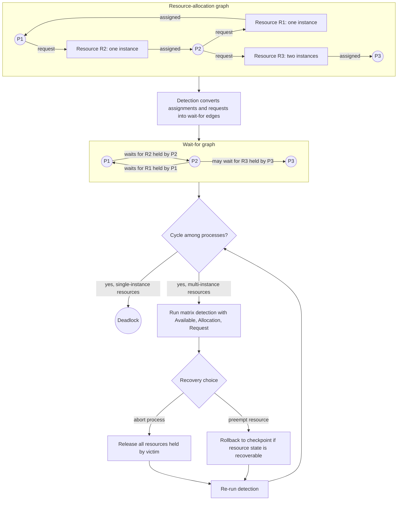

# Deadlocks

Deadlock is the failure mode where a set of processes can never make progress because each is waiting for an event that only another member of the set can cause. It is not simply a slow system, a busy lock, or a priority problem. In a deadlock, the wait relationship forms a closed trap: every participant is stuck, and ordinary scheduling cannot free them.


*Figure: The Linux kernel map shows how OS services become interacting subsystems. Image: [Wikimedia Commons](https://commons.wikimedia.org/wiki/File:Linux_kernel_map.png), Conan at English Wikipedia, CC BY 3.0.*

Silberschatz, Galvin, and Gagne place the detailed deadlock discussion inside the synchronization chapter in the Essentials edition, while the broader dinosaur-book family often treats it as a full chapter. The topic deserves its own wiki page because the same ideas appear in mutexes, semaphores, memory allocation, file locks, device allocation, database transactions, and distributed systems.

## Definitions

A **deadlock** exists when every process in a set is waiting for an event that can be caused only by another process in the same set. The event is often the release of a resource.

A **resource type** is a class of interchangeable resources, such as identical printers or blocks of memory. A **resource instance** is one concrete unit of that type. A process can **request**, **use**, and **release** resources.

The four necessary deadlock conditions are **mutual exclusion**, **hold and wait**, **no preemption**, and **circular wait**. Mutual exclusion means at least one resource cannot be shared. Hold and wait means a process holds one resource while requesting another. No preemption means resources cannot be forcibly taken away. Circular wait means there is a cycle of processes, each waiting for a resource held by the next.

A **resource-allocation graph** has process nodes, resource nodes, request edges, and assignment edges. A request edge points from process to resource; an assignment edge points from resource instance to process. If each resource type has one instance, a cycle is both necessary and sufficient for deadlock. With multiple instances, a cycle is necessary but not sufficient.

**Deadlock prevention** structurally denies at least one necessary condition. **Deadlock avoidance** uses runtime information to avoid unsafe allocations. **Deadlock detection** allows deadlocks, finds them, and then recovers.

The **banker's algorithm** is a deadlock-avoidance algorithm. It requires each process to declare its maximum possible demand. The OS grants a request only if the resulting state is safe, meaning there exists some order in which all processes can finish.

## Key results

The four necessary conditions are a diagnostic checklist:

| Condition | Meaning | Prevention strategy |
|---|---|---|
| Mutual exclusion | Some resource is nonsharable | Make resource sharable when possible |
| Hold and wait | Process holds resources while requesting more | Request all resources up front or release before requesting |
| No preemption | Held resources cannot be forcibly removed | Preempt resources whose state can be saved |
| Circular wait | Wait-for cycle exists | Impose a total ordering on resource acquisition |

Not all prevention strategies are practical. Making printers sharable like read-only files is impossible. Requiring all resources up front wastes resources and can cause starvation. Preempting a CPU is easy, but preempting a printer halfway through a page or a mutex halfway through a critical update is not. Resource ordering is widely useful because it attacks circular wait without needing future demand knowledge.

A state can be **safe** even if not all requested resources are immediately available. Safety asks whether there is at least one completion sequence. An **unsafe** state is not necessarily deadlocked, but it has lost the guarantee that all processes can complete. Avoidance algorithms refuse transitions into unsafe states.

Detection is often the pragmatic choice when deadlocks are rare or prevention would be too restrictive. A database system may detect transaction cycles and abort one transaction. An OS might let an administrator kill a process or might choose victims automatically based on priority, resource usage, or rollback cost.

Recovery has costs. Terminating all deadlocked processes is simple but harsh. Terminating one process at a time requires repeated detection. Resource preemption requires selecting a victim, rolling back state, and preventing starvation of the same victim.

The prevention, avoidance, and detection approaches fit different environments. Prevention is attractive in kernel lock design because lock ordering can be checked by convention, code review, or lock-dependency tools. Avoidance is attractive only when maximum demands are known in advance; that assumption is reasonable for some resource-allocation problems but unrealistic for general-purpose processes that open files, allocate memory, and request devices dynamically. Detection is attractive for databases and transaction systems because aborting and retrying a transaction is a normal recovery action.

Deadlock is closely related to starvation but not identical. In starvation, a process waits indefinitely because scheduling or allocation policy keeps favoring others; the resource might become free many times, but the process never wins. In deadlock, the resource cannot become free because the holder is also waiting in the dependency cycle. Aging helps starvation but does not break a deadlock cycle. Killing or rolling back a participant can break deadlock but may be far too disruptive if the real problem was only unfair scheduling.

Operating systems also face deadlock-like problems with internal locks. Suppose a filesystem path holds a directory lock while requesting a memory allocation, and the memory allocator tries to reclaim pages by calling back into the filesystem. If the reclaim path needs the same directory lock, the kernel can deadlock even though no user process explicitly requested two locks. This is why kernel developers care about lock ordering, nonblocking allocation flags, interrupt context, and avoiding calls into complex subsystems while holding low-level locks.

A practical deadlock analysis starts by naming resources precisely. "The file system is locked" is too vague; the useful question is which inode lock, journal lock, memory reclaim lock, device queue lock, or user-visible file lock is held. Precise resource naming makes cycles visible and helps decide whether prevention, detection, timeout, retry, or redesign is the right response. Vague resource names hide the actual wait-for graph.

Deadlock proofs and fixes both become clearer when the exact resource graph is drawn.

## Visual



This deadlock diagram shows both the resource-allocation graph and the derived wait-for graph. The explicit assignment and request edges reveal the `P1 -> P2 -> P1` cycle, while the extra multi-instance resource shows why a cycle is only immediately decisive for single-instance resources. The recovery branch makes the operational choices visible: abort a participant or preempt/rollback a recoverable resource, then re-run detection.

## Worked example 1: identifying the four conditions

Problem: Two threads need locks `A` and `B`. Thread 1 executes `lock(A); lock(B);`, while Thread 2 executes `lock(B); lock(A);`. Show whether deadlock is possible.

1. Mutual exclusion: a lock is held by at most one thread, so the condition holds.
2. Hold and wait: Thread 1 can hold `A` while waiting for `B`; Thread 2 can hold `B` while waiting for `A`. The condition holds.
3. No preemption: the runtime normally cannot forcibly take a mutex from a thread without corrupting the protected invariant. The condition holds.
4. Circular wait: the following interleaving creates a cycle:
   - Thread 1 acquires `A`.
   - Thread 2 acquires `B`.
   - Thread 1 requests `B` and waits.
   - Thread 2 requests `A` and waits.
5. The wait cycle is Thread 1 $\rightarrow B \rightarrow$ Thread 2 $\rightarrow A \rightarrow$ Thread 1.

Checked answer: Deadlock is possible because all four necessary conditions can hold. A standard fix is to impose one order, for example always acquire `A` before `B`.

## Worked example 2: banker's safety check

Problem: There is one resource type with 10 total instances. Three processes currently have allocations `P1 = 2`, `P2 = 3`, `P3 = 2`. Their maximum claims are `P1 = 5`, `P2 = 6`, `P3 = 4`. Is the state safe?

1. Compute available resources:

$$
Available = 10 - (2 + 3 + 2) = 3
$$

2. Compute each remaining need:

$$
Need(P1)=5-2=3
$$

$$
Need(P2)=6-3=3
$$

$$
Need(P3)=4-2=2
$$

3. With `Available = 3`, choose any process whose need is at most 3. `P3` can finish because it needs 2.
4. After `P3` finishes, it releases its allocation of 2:

$$
Available = 3 + 2 = 5
$$

5. Now `P1` can finish because it needs 3. After release:

$$
Available = 5 + 2 = 7
$$

6. Now `P2` can finish because it needs 3. After release:

$$
Available = 7 + 3 = 10
$$

Checked answer: The state is safe. One safe sequence is `P3, P1, P2`. The system is not required to run in that exact order, but the existence of the sequence proves safety.

## Code

```python
def is_safe(available, allocation, maximum):
    n = len(allocation)
    work = available[:]
    finish = [False] * n
    sequence = []

    while len(sequence) < n:
        progress = False
        for i in range(n):
            need = [maximum[i][j] - allocation[i][j] for j in range(len(work))]
            if not finish[i] and all(need[j] <= work[j] for j in range(len(work))):
                work = [work[j] + allocation[i][j] for j in range(len(work))]
                finish[i] = True
                sequence.append(i)
                progress = True
        if not progress:
            return False, sequence

    return True, sequence

available = [3]
allocation = [[2], [3], [2]]
maximum = [[5], [6], [4]]
print(is_safe(available, allocation, maximum))
```

This is the safety portion of the banker's algorithm for multiple resource types. A real request algorithm first pretends to grant a request and then runs this safety check.

## Common pitfalls

- Calling every long wait a deadlock. Deadlock requires a cycle of dependencies with no possible progress.
- Forgetting the multiple-instance case. A cycle in a resource-allocation graph may not be sufficient when resources have several instances.
- Treating an unsafe state as already deadlocked. Unsafe means deadlock may occur depending on future requests.
- Preventing deadlock by overconstraining the system. Request-all-at-once policies can waste resources and cause starvation.
- Ignoring lock ordering in code review. Inconsistent acquisition order is one of the simplest ways to create circular wait.
- Recovering without considering invariants. Killing a process or preempting a resource can leave files, devices, or shared data inconsistent.

## Connections

- [Process Synchronization](/cs/operating-systems/process-synchronization)
- [Threads](/cs/operating-systems/threads)
- [CPU Scheduling](/cs/operating-systems/cpu-scheduling)
- [Main Memory](/cs/operating-systems/main-memory)
- [File-System Implementation](/cs/operating-systems/file-system-implementation)
