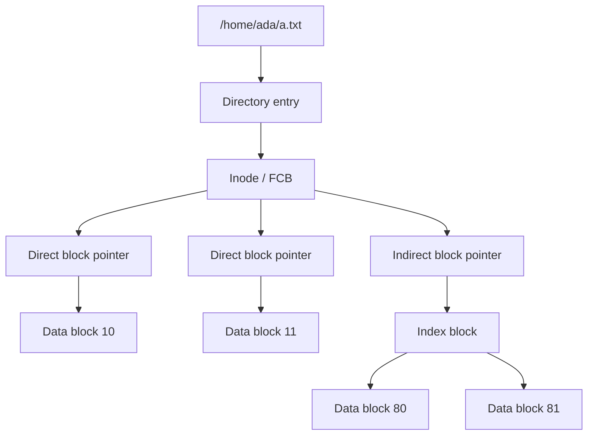

# File-System Implementation

File-system implementation explains how the friendly interface of files and directories becomes persistent structures on storage. The user sees names, folders, permissions, and bytes. The OS must maintain metadata, allocate blocks, track free space, cache data, recover after crashes, and connect the file-system layer to the block-device layer. Good implementation turns slow storage into a usable abstraction without losing consistency.

The textbook separates file-system interface from implementation because the two levels answer different questions. The interface says what operations mean; the implementation says how to store and retrieve the data. This page focuses on file-control blocks, directory implementation, allocation methods, free-space management, caching, recovery, NFS, and the WAFL example mentioned in the chapter.

## Definitions

A **file-control block** (FCB) stores metadata needed to manage a file. UNIX-style systems use an **inode** for this role. It may include ownership, permissions, size, timestamps, and pointers to data blocks. The directory maps names to FCBs or inode numbers.

A **volume control block** stores file-system-wide information such as block size, total block count, free-block count, and pointers to free-space structures. A **mount table** records mounted file systems and their mount points.

A **directory implementation** can use a linear list of names and pointers, a hash table, or tree-like indexes. A linear list is simple but slow for large directories. Hashing improves lookup but adds collision handling and ordering complications.

**Allocation methods** determine how file blocks are placed on disk. **Contiguous allocation** gives each file a continuous run of blocks. **Linked allocation** stores each block with a pointer to the next block. **Indexed allocation** stores block pointers in an index block, such as an inode direct/indirect pointer structure.

**Free-space management** tracks unallocated blocks. Common approaches include bitmaps, linked free lists, grouping, and counting. A bitmap uses one bit per block: 0 for free and 1 for allocated, or the reverse depending on convention.

**Caching** stores recently used file data or metadata in memory. **Buffer cache** and **page cache** ideas overlap in modern systems. **Write-through** writes changes immediately; **write-back** delays writes for performance, requiring recovery mechanisms.

**Journaling** records intended metadata changes before applying them, so after a crash the file system can replay or roll back to a consistent state. **Log-structured** designs write changes sequentially to a log-like structure.

## Key results

Allocation method controls both performance and fragmentation:

| Allocation method | Random access | Sequential performance | Fragmentation | Main issue |
|---|---:|---:|---|---|
| Contiguous | Excellent | Excellent | External | File growth is hard |
| Linked | Poor without extra table | Good enough sequentially | No external | Pointer overhead and reliability |
| FAT-style linked table | Better than in-block links | Good with caching | No external | Table can be large |
| Indexed | Good | Good | Index overhead | Very large files need multi-level indexing |

Contiguous allocation is attractive for read-only media or files with known size. Linked allocation avoids external fragmentation but makes direct access expensive because block $n$ requires following $n$ pointers. Indexed allocation is flexible and supports direct access, but small files should not pay huge index overhead. UNIX-style inode structures address this by combining direct pointers for small files with single, double, and triple indirect pointers for larger files.

Free-space bitmaps make it easy to find contiguous runs if the bitmap is cached. For a disk with $N$ blocks, the bitmap needs $N$ bits. If the block size is 4 KiB and the disk has 1,000,000 blocks, the bitmap is 1,000,000 bits, or 125,000 bytes, which is small compared with the data area.

Caching improves performance but creates a consistency problem. If a process writes data and the OS delays the actual storage write, a crash can lose data or leave metadata pointing to uninitialized blocks. Journaling narrows the problem by making metadata updates recoverable. It does not automatically guarantee that every application-level write is durable; applications still need explicit synchronization calls when durability matters.

Remote file systems such as NFS add another layer: the implementation must handle server crashes, client caching, idempotent operations, authentication, and consistency across machines. The interface may look like ordinary file access, but failures are now distributed failures.

A typical local file-system stack has several layers. The system-call layer validates user buffers and descriptors. The VFS layer turns generic operations into file-system-specific operations. The file system maps offsets to logical blocks and metadata changes. The page cache or buffer cache stores data in memory. The block layer merges and schedules requests. The device driver submits commands to hardware. Each layer has its own data structures, and a bug in any layer can appear to the user as the same simple symptom: a read failed, a write was lost, or a directory entry disappeared.

Crash consistency is difficult because one logical operation can require many physical writes. Creating a file may allocate an inode, allocate or update a directory block, update free-space metadata, set timestamps, and write journal records. If power fails halfway through, the storage image may show an allocated inode with no directory entry, a directory entry pointing to an uninitialized inode, or free-space records that disagree with metadata. Journaling, soft updates, copy-on-write file systems, and log-structured designs are different ways to make update ordering recoverable.

Performance tuning often means avoiding unnecessary I/O rather than making individual I/O magically fast. Directory-entry caches avoid repeated path walks. Read-ahead guesses that sequential access will continue. Delayed allocation waits before choosing blocks so the file system can allocate larger contiguous extents. Write clustering combines dirty blocks into larger transfers. These optimizations improve common workloads, but they must be balanced against memory pressure and durability requirements.

Directory implementation affects both speed and semantics. A linear directory is easy to update and inspect, but lookup cost grows with the number of entries. Hash-indexed or tree-indexed directories improve large-directory lookup, insertion, and deletion, but they require more complex recovery rules and may not preserve a simple physical ordering. Case sensitivity, Unicode normalization, maximum name length, and hard-link rules are also implementation choices that leak into user-visible behavior.

The implementation must also manage reference counts. An inode may be reachable from several directory entries through hard links and may also be held open by running processes. Blocks can be freed only when the link count and open references allow it. Getting this wrong can either leak storage forever or free blocks that a live file still uses. This accounting is why deletion, close, rename, and crash recovery are tightly connected rather than independent features.

Because metadata links many structures together, implementation bugs often appear as cross-structure inconsistencies rather than a single bad block.

Simple consistency checkers exist because these relationships can be verified after an unclean shutdown.

## Visual



The directory does not normally contain the whole file. It maps a name to metadata; the metadata points to data blocks directly or indirectly.

## Worked example 1: bitmap free-space size

Problem: A file system has 2,097,152 blocks. How much space is needed for a free-space bitmap? Express the answer in bytes and KiB.

1. A bitmap uses 1 bit per block:

$$
2{,}097{,}152\ \mathrm{bits}
$$

2. Convert bits to bytes:

$$
\frac{2{,}097{,}152}{8} = 262{,}144\ \mathrm{bytes}
$$

3. Convert bytes to KiB:

$$
\frac{262{,}144}{1024} = 256\ \mathrm{KiB}
$$

4. Check scale. If each block is 4 KiB, the data area is:

$$
2{,}097{,}152 \times 4\ \mathrm{KiB} = 8{,}388{,}608\ \mathrm{KiB} = 8\ \mathrm{GiB}
$$

5. A 256 KiB bitmap is small enough to cache easily.

Checked answer: The bitmap needs 262,144 bytes, or 256 KiB.

## Worked example 2: indexed allocation capacity

Problem: A file system uses 4 KiB blocks and 4-byte block pointers. An inode has 12 direct pointers and one single-indirect pointer. Ignoring double and triple indirection, what is the maximum file size addressable?

1. Direct pointer capacity:

$$
12 \times 4\ \mathrm{KiB} = 48\ \mathrm{KiB}
$$

2. A single indirect block stores:

$$
\frac{4096\ \mathrm{bytes}}{4\ \mathrm{bytes/pointer}} = 1024\ \mathrm{pointers}
$$

3. Single-indirect data capacity:

$$
1024 \times 4\ \mathrm{KiB} = 4096\ \mathrm{KiB} = 4\ \mathrm{MiB}
$$

4. Total capacity:

$$
48\ \mathrm{KiB} + 4096\ \mathrm{KiB} = 4144\ \mathrm{KiB}
$$

5. Convert to MiB:

$$
\frac{4144}{1024} = 4.046875\ \mathrm{MiB}
$$

Checked answer: The inode can address 4,144 KiB, or about 4.05 MiB, without double or triple indirect pointers.

## Code

```python
def bitmap_size(block_count):
    bits = block_count
    bytes_needed = (bits + 7) // 8
    kib = bytes_needed / 1024
    return bytes_needed, kib

def inode_capacity(block_size, pointer_size, direct_count, single_indirect=True):
    direct = direct_count * block_size
    indirect = 0
    if single_indirect:
        pointers_per_block = block_size // pointer_size
        indirect = pointers_per_block * block_size
    return direct + indirect

print(bitmap_size(2_097_152))
print(inode_capacity(4096, 4, 12))
```

The calculations mirror common file-system design questions: metadata size and maximum addressable file size under an indexing scheme.

## Common pitfalls

- Assuming directories store file data. Directories usually map names to metadata records.
- Choosing contiguous allocation without planning for file growth. Expansion can require compaction or relocation.
- Forgetting metadata writes. Creating a file updates directory entries, free-space records, inodes, and sometimes journals.
- Believing caching changes only speed. Write-back caching changes crash-recovery requirements.
- Treating journaling as a full backup. Journaling restores metadata consistency; it does not replace backups or application-level durability.
- Ignoring small-file overhead. A design optimized for huge files can waste space and I/O on many tiny files.

## Connections

- [File-System Interface](/cs/operating-systems/file-system-interface)
- [Mass Storage and RAID](/cs/operating-systems/mass-storage-raid)
- [Virtual Memory](/cs/operating-systems/virtual-memory)
- [I/O Systems](/cs/operating-systems/io-systems)
- [Linux Case Study](/cs/operating-systems/linux-case-study)
