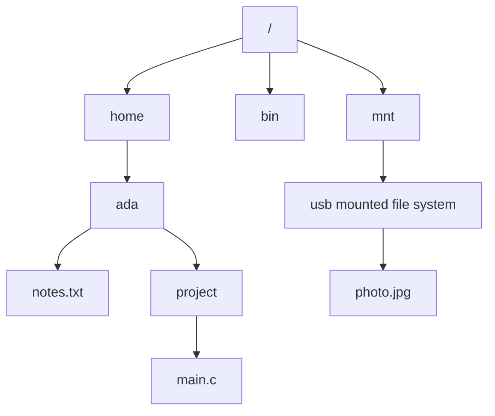

# File-System Interface

The file system is often the most visible part of an operating system. Users name, organize, copy, protect, and share files every day, while programs rely on a stable interface for persistent data. The OS hides the physical differences among disks, SSDs, optical media, and network storage behind the logical idea of a file: a named collection of information with attributes and operations.


*Figure: The Linux kernel map shows how OS services become interacting subsystems. Image: [Wikimedia Commons](https://commons.wikimedia.org/wiki/File:Linux_kernel_map.png), Conan at English Wikipedia, CC BY 3.0.*

This page focuses on the interface rather than the implementation. The implementation page explains directory structures, allocation, free-space management, and recovery. Here the central questions are what a file is, how it is accessed, how directories name files, how file systems are mounted, what sharing means, and how access is protected.

## Definitions

A **file** is a logical storage unit defined by the OS. It usually has data plus attributes such as name, identifier, type, location, size, protection bits, timestamps, and owner. The textbook emphasizes that a file abstracts away physical storage properties so programs can use a uniform view.

Common file operations include **create**, **open**, **read**, **write**, **reposition** or seek, **delete**, **truncate**, and **close**. Opening a file typically creates an entry in a per-process open-file table and may also refer to a system-wide open-file table entry containing shared state such as file position, access mode, and reference count.

An **access method** defines how file contents are read or written. **Sequential access** processes bytes or records in order. **Direct access** treats a file as numbered blocks or records that can be read in arbitrary order. Indexed methods add an index that maps keys or logical positions to locations.

A **directory** maps human-meaningful names to file-system objects. Directory structures include single-level, two-level, tree-structured, acyclic-graph, and general-graph designs. Tree-structured directories are common because they support grouping, relative paths, and scalable naming.

A **path name** identifies a file by walking directories. An **absolute path** starts at the root; a **relative path** starts at the current directory.

**Mounting** attaches a file system to a point in the existing directory hierarchy. After mounting, path traversal crosses from one file system into another through the mount point.

**File sharing** allows multiple users or processes to access the same file. Sharing requires semantics for concurrent access, permissions, locks, and consistency. **Advisory locks** require cooperating processes to check them; **mandatory locks** are enforced by the OS.

## Key results

The file interface separates persistent naming from physical placement. A program that calls `read(fd, buf, n)` need not know whether bytes come from a disk block, SSD page, network server, memory cache, or device driver. That abstraction is powerful, but it means the OS must define precise semantics for offsets, end-of-file, metadata changes, and errors.

File attributes are not decorative; they drive protection and behavior:

| Attribute | Example | Why it matters |
|---|---|---|
| Name | `report.txt` | Human-readable lookup |
| Identifier | inode number or file ID | Stable internal reference |
| Type | regular, directory, device | Determines valid operations |
| Location | block pointers or metadata | Implementation maps file to storage |
| Size | bytes or blocks | Defines end-of-file |
| Protection | read/write/execute bits or ACL | Controls access |
| Timestamps | created, modified, accessed | Synchronization, backup, auditing |
| Owner/group | user and group IDs | Authorization and accounting |

Directory structures are a naming policy. A single-level directory is simple but name conflicts are unavoidable. A two-level directory gives each user a private namespace but weakens sharing. A tree provides hierarchy and locality. Acyclic graphs add shared files or directories through links while avoiding cycles. General graphs require cycle detection or reference-management policies.

Sharing semantics can be subtle. In UNIX-style semantics, writes by one process can become visible to other processes that read later, although buffering and caching complicate timing. In session semantics, changes become visible when a file is closed. Immutable shared files avoid many race problems but require replacing the whole file to update it.

Protection mechanisms include access lists, owner/group/other permission bits, passwords in older designs, and capabilities. The interface must balance usability and precision: too coarse a policy causes over-sharing, while too complex a policy leads to mistakes.

The open-file abstraction is one of the most important interface details. A path name is used to find a file, but after `open` succeeds, the process usually operates through a handle or descriptor. This matters because the directory entry can be renamed or removed while the file remains open. The open object records mode, current offset, and references to lower-level metadata. Two descriptors may share an open-file description, as after `fork()`, or they may refer to separate opens of the same file with independent offsets.

File types extend the interface beyond ordinary stored bytes. UNIX-like systems expose directories, character devices, block devices, FIFOs, sockets, and symbolic links through the file namespace. This unifies many operations but does not make every object identical. Seeking on a pipe is meaningless; reading from a terminal may block until a line is entered; writing to a device file may invoke driver behavior rather than allocate storage blocks. A clean interface provides uniform operations where they make sense and well-defined errors where they do not.

Mounting also has administrative and security consequences. A removable or remote file system can introduce different performance, permission, and failure behavior under an ordinary path. Systems therefore support mount options such as read-only mounting, disabling execution of programs, or ignoring device-file interpretation on less trusted media. The interface still presents a tree, but the OS must remember that different subtrees may have different backing file systems and policies.

File deletion is another interface detail that surprises students. In UNIX-like semantics, unlinking a name removes a directory entry, not necessarily the underlying open file immediately. If a process still has the file open, the storage can remain allocated until the last reference is closed. This behavior is useful for temporary files and log rotation, but it reinforces the distinction between names, open handles, and file objects.

## Visual



The tree gives users a stable naming structure. Mounting makes another file system appear as a subtree, so ordinary path traversal can reach files on a different device.

## Worked example 1: resolving an absolute path

Problem: Resolve the path `/home/ada/project/main.c` in a tree-structured directory. Identify each lookup and the object reached.

1. Start at the root directory `/` because the path is absolute.
2. Look up entry `home` in `/`. Suppose it maps to the directory object for `/home`.
3. Look up entry `ada` in `/home`. It maps to the directory object for `/home/ada`.
4. Look up entry `project` in `/home/ada`. It maps to the directory object for `/home/ada/project`.
5. Look up entry `main.c` in `/home/ada/project`. It maps to a regular file object.
6. The OS checks execute/search permission on each directory traversed and requested access permission on `main.c`.
7. If the caller requested `open(..., O_RDONLY)`, the OS checks read permission. If successful, it creates or references an open-file table entry and returns a file descriptor.

Checked answer: The path is resolved through four directory lookups after the root: `home`, `ada`, `project`, and `main.c`. Directory search permission and final file access permission are both required.

## Worked example 2: sequential versus direct access

Problem: A log analyzer reads every line of a 2 GB log file once. A database reads record number 850,000 and then record number 12. Which access method fits each workload?

1. The log analyzer consumes records in order and does not need random jumps.
2. Sequential access fits the log analyzer. The OS and storage device can prefetch upcoming blocks and keep disk or SSD access efficient.
3. The database needs arbitrary records. If each record is fixed at 256 bytes, record 850,000 begins at:

$$
850000 \times 256 = 217600000\ \mathrm{bytes}
$$

4. Record 12 begins at:

$$
12 \times 256 = 3072\ \mathrm{bytes}
$$

5. Reading sequentially from the beginning to record 850,000 would waste enormous work. Direct access can seek or map directly to the block containing the requested record.

Checked answer: Sequential access fits the log scan; direct access fits the database. The correct interface follows the pattern of use, not the file size alone.

## Code

```python
from pathlib import Path

def summarize_file(path):
    p = Path(path)
    stat = p.stat()
    return {
        "name": p.name,
        "absolute": str(p.resolve()),
        "size_bytes": stat.st_size,
        "is_directory": p.is_dir(),
        "is_file": p.is_file(),
    }

for key, value in summarize_file("docs/cs/operating-systems/intro.md").items():
    print(f"{key}: {value}")
```

This Python snippet uses a high-level library, but the operations still correspond to file-system interface concepts: path resolution, metadata lookup, and type inspection.

## Common pitfalls

- Confusing a filename with a file object. Several names can refer to one object through links, and an open descriptor can outlive a directory entry.
- Assuming every file has a meaningful extension. File type may be inferred from metadata, content, conventions, or not at all.
- Ignoring directory permissions. Traversing a path requires access to the directories, not just the final file.
- Treating file locks as universal. Advisory locks work only when all participants cooperate.
- Assuming local and remote sharing have identical semantics. Network latency and caching can change visibility rules.
- Forgetting that `open` is a security boundary. The OS checks permissions and access modes before returning a handle.

## Connections

- [File-System Implementation](/cs/operating-systems/file-system-implementation)
- [Mass Storage and RAID](/cs/operating-systems/mass-storage-raid)
- [I/O Systems](/cs/operating-systems/io-systems)
- [Protection and Access Control](/cs/operating-systems/protection-access-control)
- [Security](/cs/operating-systems/security)
