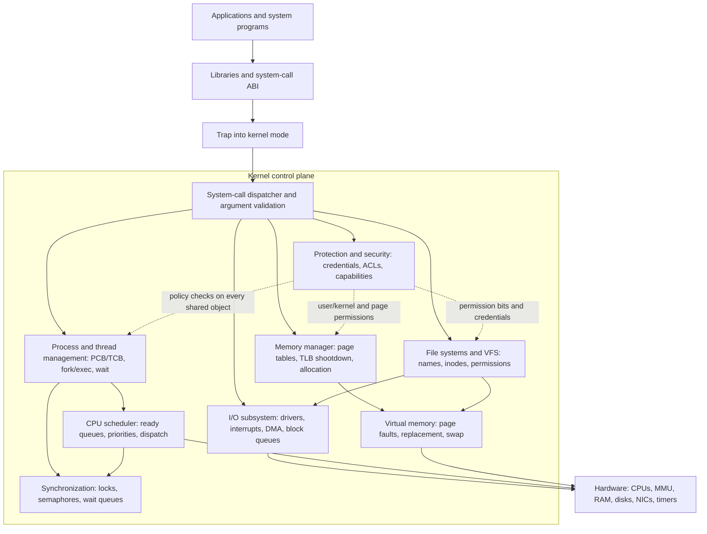

# Operating Systems

Operating systems sit between applications and hardware. They make programs easier to run, keep users and processes from interfering with one another, and allocate scarce resources such as CPU time, memory, storage, devices, and network access. Silberschatz, Galvin, and Gagne organize the subject around this central idea: an OS is both a convenience layer for programs and a control layer for the machine.


*Figure: Linux provides the concrete kernel case study for many OS abstractions. Image: [Wikimedia Commons](https://commons.wikimedia.org/wiki/File:Tux.svg), Larry Ewing, Simon Budig, and Garrett LeSage, CC0/attribution permission.*


*Figure: The Linux kernel map shows how OS services become interacting subsystems. Image: [Wikimedia Commons](https://commons.wikimedia.org/wiki/File:Linux_kernel_map.png), Conan at English Wikipedia, CC BY 3.0.*


*Figure: Unix history gives Linux, BSD, and commercial Unix systems shared lineage. Image: [Wikimedia Commons](https://commons.wikimedia.org/wiki/File:Unix_history-simple.svg), Eraserhead1, Infinity0, and Sav vas, CC BY-SA 3.0/GFDL.*

These notes follow the scope of *Operating System Concepts Essentials*, 2nd edition: overview and structure, process management, concurrency, scheduling, memory, virtual memory, storage, I/O, protection, security, and a Linux case study. The pages are written as study notes rather than a replacement for the textbook: they emphasize definitions, algorithms, trade-offs, worked examples, and the connections among topics.

## Definitions

An **operating system** is software that manages computer hardware and provides services to application programs. At the center is the **kernel**, the privileged program that remains running and mediates access to hardware resources. Around it are system programs, libraries, shells, graphical environments, daemons, and applications.

A **process** is a program in execution. It owns an address space and resources such as open files. A **thread** is a schedulable path of execution inside a process. Threads share process resources but have their own program counters, registers, and stacks.

**CPU scheduling** is the choice of which ready process or thread runs next. **Synchronization** is the discipline for coordinating concurrent activities that share data or resources. **Deadlock** is a failure mode where a set of processes waits forever in a cycle of dependencies.

**Main memory management** maps logical addresses to physical memory and protects address spaces. **Virtual memory** extends this model by allowing only part of a process to be resident in RAM, using demand paging and replacement.

A **file system** provides persistent named storage. Its interface defines files, directories, access methods, sharing, and protection. Its implementation maps names and byte ranges to metadata, blocks, free-space structures, caches, and recovery mechanisms.

**Mass storage** includes disks, SSDs, swap space, and RAID arrays. **I/O systems** generalize device access through drivers, interrupts, DMA, buffering, caching, and standard application interfaces.

**Protection** controls access to internal objects such as files, memory, devices, and processes. **Security** addresses broader threats, including malware, authentication failure, cryptographic misuse, network attack, and denial of service.

The generated chapter list is:

| Position | Page | Main coverage |
|---:|---|---|
| 1 | [Operating Systems](/cs/operating-systems/intro) | Course map and conceptual overview |
| 2 | [OS Overview, Services, and Structures](/cs/operating-systems/os-overview-structures) | Services, system calls, kernel organization, booting |
| 3 | [Processes](/cs/operating-systems/processes) | PCB, states, creation, scheduling queues, IPC |
| 4 | [Threads](/cs/operating-systems/threads) | Thread models, libraries, multicore programming, Amdahl's law |
| 5 | [CPU Scheduling](/cs/operating-systems/cpu-scheduling) | FCFS, SJF, priority, RR, real-time and multiprocessor scheduling |
| 6 | [Process Synchronization](/cs/operating-systems/process-synchronization) | Race conditions, critical sections, mutexes, semaphores, monitors |
| 7 | [Deadlocks](/cs/operating-systems/deadlocks) | Necessary conditions, prevention, avoidance, detection, recovery |
| 8 | [Main Memory](/cs/operating-systems/main-memory) | Contiguous allocation, segmentation, paging, TLBs |
| 9 | [Virtual Memory](/cs/operating-systems/virtual-memory) | Demand paging, replacement, thrashing, working sets |
| 10 | [File-System Interface](/cs/operating-systems/file-system-interface) | Files, directories, access methods, mounting, sharing |
| 11 | [File-System Implementation](/cs/operating-systems/file-system-implementation) | Inodes/FCBs, allocation, free space, caching, recovery |
| 12 | [Mass Storage and RAID](/cs/operating-systems/mass-storage-raid) | Disk scheduling, SSDs, swap, RAID, stable storage |
| 13 | [I/O Systems](/cs/operating-systems/io-systems) | Hardware, drivers, interrupts, DMA, kernel I/O subsystem |
| 14 | [Protection and Access Control](/cs/operating-systems/protection-access-control) | Domains, access matrix, ACLs, capabilities |
| 15 | [Security](/cs/operating-systems/security) | Threats, malware, cryptography, authentication, firewalls |
| 16 | [Linux Case Study](/cs/operating-systems/linux-case-study) | Linux architecture, tasks, CFS, VFS, virtual memory |

## Key results

The most important operating-systems result is abstraction with enforcement. A good abstraction hides irrelevant hardware detail, but an OS abstraction must also be enforceable against buggy or malicious programs. A file descriptor is useful because it hides device placement; it is safe because the kernel checks that the process has the right to use it. A virtual address space is useful because it gives each process a private memory view; it is safe because the MMU and kernel page tables reject invalid access.

Several recurring patterns appear throughout the subject:

| Pattern | Appears in | Core idea |
|---|---|---|
| Indirection | Page tables, file descriptors, VFS, capabilities | Insert a controlled mapping between name and object |
| Caching | TLB, page cache, buffer cache, directory cache | Keep recent data near the CPU to avoid slow paths |
| Queuing | Ready queues, device queues, disk queues, print spools | Order competing requests when a resource is busy |
| Atomicity | Locks, semaphores, journaling, system calls | Make a multi-step operation appear indivisible where needed |
| Policy/mechanism split | Scheduling, allocation, protection | Separate what can be done from which choice is made |
| Locality | Virtual memory, caching, disk layout | Recent or nearby references are likely to be useful |
| Least privilege | Protection, security, kernel design | Grant only the rights needed for the current job |

The course also shows why trade-offs are unavoidable. Preemptive scheduling improves responsiveness but adds context-switch overhead. Paging avoids external fragmentation but adds translation cost and possible page faults. Write-back caching improves speed but complicates crash recovery. Shared memory is fast but requires synchronization. A microkernel can improve isolation but may add communication overhead. RAID can improve availability but is not a backup.

When studying these pages, keep asking four questions:

1. What resource is being abstracted?
2. What kernel data structure records the state?
3. What algorithm chooses among competing requests?
4. What failure or attack is the mechanism trying to prevent?

Those questions connect the entire subject more reliably than memorizing isolated terms.

## Visual



This overview diagram shows the OS as a protected control plane rather than a loose topic list. Applications enter through a system-call ABI, the kernel dispatcher validates the request, and the internal subsystems cooperate through concrete structures such as PCBs, ready queues, page tables, inodes, and device queues. The dotted protection edges emphasize that security is not a final chapter bolted on later; it is checked along the paths that manipulate processes, files, memory, and devices.

## Worked example 1: classifying OS responsibilities

Problem: Classify each event as process management, memory management, storage/file management, I/O management, protection, or security: a timer interrupt preempts a task; a page fault loads a missing page; a user opens a file read-only; a disk controller completes DMA; a login attempt uses a password hash.

1. Timer interrupt preempts a task. This is primarily process management and CPU scheduling. The OS saves the running task's context, chooses another ready task, and dispatches it.
2. Page fault loads a missing page. This is virtual memory. The OS validates the address, locates or creates the page, selects a frame, updates the page table, and restarts the instruction.
3. User opens a file read-only. This crosses file-system interface and protection. The OS resolves the path and checks whether the requested read access is allowed.
4. Disk controller completes DMA. This is I/O management. The controller interrupts, the kernel completes the request, and any waiting process can be woken.
5. Login attempt uses a password hash. This is security, especially authentication. The system verifies identity using a stored salted password hash or a stronger authentication mechanism.

Checked answer: The events map to scheduling, virtual memory, file/protection, I/O, and security respectively. Many real events span categories, which is why operating systems are studied as an integrated system.

## Worked example 2: tracing one command through the OS

Problem: A shell command runs `sort input.txt > output.txt`. Trace the major OS services involved from command launch to completion.

1. The shell parses the command line and identifies a program name, an input file, and output redirection.
2. The shell creates a child process. On a UNIX-like system, this commonly uses `fork()`.
3. The child opens `input.txt` for reading. The file system resolves the path, and protection checks read permission.
4. The child opens or creates `output.txt` for writing. The OS checks directory and file permissions, creates metadata if needed, and returns a file descriptor.
5. The child arranges file descriptors so standard output points to `output.txt`.
6. The child replaces its program image with the `sort` executable using an `exec`-style operation.
7. The scheduler gives the process CPU time. If `sort` blocks for file I/O, another ready process may run.
8. Virtual memory maps the executable, stack, heap, and libraries. Page faults bring code and data pages into RAM as needed.
9. The file system and I/O subsystem read input blocks, cache data, and write output blocks.
10. When `sort` exits, the parent shell collects its status and prints another prompt.

Checked answer: One small command exercises process creation, file descriptors, protection checks, scheduling, virtual memory, file-system implementation, I/O, and process termination.

## Code

```python
topics = [
    ("process", "program in execution"),
    ("thread", "schedulable execution path inside a process"),
    ("page table", "mapping from virtual pages to physical frames"),
    ("file descriptor", "per-process handle for an open file"),
    ("ACL", "object-centered access-control representation"),
]

for term, meaning in topics:
    print(f"{term:16} -> {meaning}")
```

This code is intentionally simple: it mirrors the study strategy for the topic. Learn the object, the state it stores, the operations on it, and the failure it helps prevent.

## Common pitfalls

- Studying each chapter as if it were isolated. Scheduling decisions affect memory pressure; memory pressure affects I/O; file permissions depend on protection; security failures bypass clean abstractions.
- Forgetting the user/kernel boundary. Many OS mechanisms exist because applications cannot be trusted with privileged operations.
- Treating algorithms as universally best. FCFS, LRU, semaphores, RAID levels, and access-control models all have workloads where they fit poorly.
- Ignoring error handling. Real OS calls fail often and for normal reasons.
- Confusing mechanism with policy. The same mechanism can support several policies, and the same policy can be implemented with different mechanisms.
- Assuming current Linux, Windows, Android, or iOS behavior exactly matches a textbook edition. The concepts persist, but implementation details evolve.

## Connections

- [OS Overview, Services, and Structures](/cs/operating-systems/os-overview-structures)
- [Processes](/cs/operating-systems/processes)
- [Virtual Memory](/cs/operating-systems/virtual-memory)
- [File-System Implementation](/cs/operating-systems/file-system-implementation)
- [Security](/cs/operating-systems/security)
