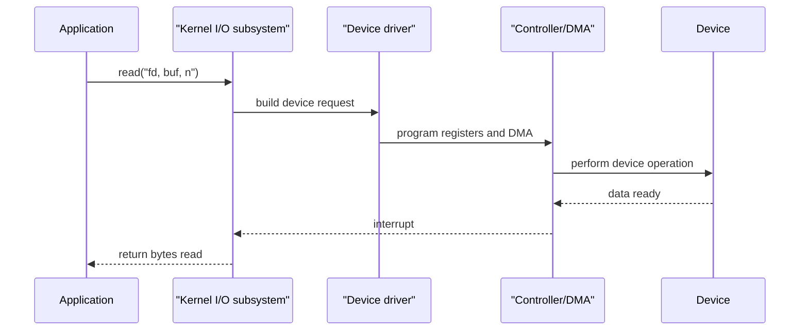

# I/O Systems

I/O systems are where operating systems confront hardware diversity directly. A keyboard, network interface, timer, SSD, GPU, and printer all behave differently, yet applications expect a small set of coherent operations: read, write, wait, control, map, and close. The kernel I/O subsystem turns many device-specific protocols into stable abstractions while preserving performance and protection.


*Figure: The Linux kernel map shows how OS services become interacting subsystems. Image: [Wikimedia Commons](https://commons.wikimedia.org/wiki/File:Linux_kernel_map.png), Conan at English Wikipedia, CC BY 3.0.*

The textbook's I/O chapter brings together hardware, application interfaces, kernel services, request transformation, STREAMS, and performance. The central design problem is bridging the gap between device-controller reality and programmer-facing uniformity. That bridge includes interrupts, polling, DMA, buffering, caching, spooling, device drivers, and error handling.

## Definitions

An **I/O device** communicates with the computer through a **device controller**. The controller exposes registers for data, status, and control. The CPU and controller communicate through port-mapped I/O or memory-mapped I/O.

**Polling** means the CPU repeatedly checks a device status register to see whether the device is ready. **Interrupt-driven I/O** lets the device notify the CPU when attention is needed. Polling can be efficient for very fast devices or short waits, but interrupts avoid wasting CPU time during long waits.

**Direct memory access** (DMA) lets a device controller transfer blocks of data between the device and main memory without the CPU copying every byte. The CPU sets up the transfer, the controller performs it, and an interrupt signals completion.

A **device driver** is kernel software that knows how to operate a particular device or device class. Drivers translate generic kernel requests into device-specific commands.

The **application I/O interface** classifies devices into standard categories such as block devices, character devices, network devices, clocks/timers, and memory-mapped files. This interface hides device differences where possible and exposes special operations through control calls where necessary.

**Blocking I/O** suspends the calling thread until the operation completes. **Nonblocking I/O** returns immediately if the operation cannot complete now. **Asynchronous I/O** starts an operation and notifies the application later when it completes.

**Buffering** stores data temporarily during transfer. **Caching** keeps copies of data for reuse. **Spooling** queues output for a device that cannot interleave multiple users' output safely, such as a printer.

## Key results

The I/O subsystem exists because devices are slow, varied, and failure-prone compared with the CPU. The OS provides uniform naming, protection, buffering, error handling, and scheduling, while drivers handle device-specific details.

| Mechanism | Purpose | Example |
|---|---|---|
| Interrupt | Notify CPU of completion or event | Disk read finished |
| DMA | Transfer blocks without CPU byte-copy loop | Network packet to memory |
| Buffering | Smooth producer/consumer speed mismatch | Keyboard input buffer |
| Caching | Avoid repeated slow reads | File-system page cache |
| Spooling | Serialize access to exclusive device | Print queue |
| Device driver | Encapsulate hardware protocol | SATA, USB, display driver |
| I/O scheduler | Reorder requests for performance/fairness | Disk request queue |

Blocking, nonblocking, and asynchronous I/O differ in control flow. Blocking I/O is simple: call and wait. Nonblocking I/O works well with event loops because a thread can check many descriptors without being trapped by one slow device. Asynchronous I/O is useful when operations take long enough that submitting work and receiving completion events is better than dedicating a waiting thread.

DMA improves throughput but introduces coordination issues. The OS must pin or otherwise manage memory involved in a DMA transfer, ensure cache coherence where hardware requires it, and prevent a device from writing into unauthorized memory. I/O is therefore also a protection problem.

Performance is often improved by reducing context switches, reducing data copies, batching requests, using DMA, caching intelligently, and placing computation near data when possible. However, buffering and caching can conflict with latency or durability. A write that returns after data reaches a memory cache is faster than one that waits for stable storage, but it gives a different failure guarantee.

STREAMS, discussed in the textbook through UNIX System V, is a framework for composing full-duplex communication paths from modules. The broader lesson is modular I/O processing: terminal handling, protocol processing, and driver interaction can be arranged as reusable layers.

The kernel I/O subsystem also standardizes errors and completion behavior. A device can fail because media is damaged, a cable is removed, a timeout expires, a buffer is invalid, a permission check fails, or an operation is interrupted by a signal. Applications should receive these situations through documented return values and error codes rather than device-specific surprises. Internally, the kernel must decide which errors are retryable, which should be reported immediately, and which require marking a device or path offline.

Synchronous, asynchronous, blocking, and nonblocking are related but distinct terms. A synchronous operation has a clear completion point before the next dependent step. A blocking call parks the calling thread until progress is possible or complete. A nonblocking call returns quickly if it would otherwise wait. An asynchronous interface lets the program submit work and later receive completion notification. Combining these models carefully allows servers to scale: a small number of threads can manage many sockets, while disk or network operations complete through event queues.

I/O performance is often limited by data movement. A naive path might copy data from a device to a kernel buffer, from the kernel buffer to a user buffer, and then from that user buffer to another kernel buffer for network transmission. Techniques such as memory mapping, scatter-gather I/O, vectored I/O, and zero-copy transfer reduce copying or let one request describe several memory regions. The improvement is not only CPU time; fewer copies also reduce cache pollution and memory bandwidth pressure.

Device independence is always partial. The OS can present many devices as files or handles, but it still needs escape hatches for device-specific control. UNIX-like systems use operations such as `ioctl`; other systems expose structured device-control APIs. These calls are less elegant than `read` and `write`, but they are necessary for actions such as setting terminal modes, querying disk geometry, configuring network interfaces, or controlling specialized hardware. The generic interface and special controls coexist.

That compromise is normal.

## Visual



The application sees a `read`; the kernel sees queues, drivers, controller registers, DMA mappings, interrupts, and wakeups.

## Worked example 1: polling versus interrupts

Problem: A device becomes ready after 5 ms. Checking its status register takes 1 microsecond. If the CPU polls continuously, how many checks occur before readiness? Why might interrupts be better?

1. Convert 5 ms to microseconds:

$$
5\ \mathrm{ms} = 5000\ \mathrm{\mu s}
$$

2. Each poll takes 1 microsecond.
3. Number of checks:

$$
\frac{5000\ \mathrm{\mu s}}{1\ \mathrm{\mu s/check}} = 5000\ \mathrm{checks}
$$

4. During these 5000 checks, the CPU is not doing other useful work unless the polling loop includes other tasks.
5. With interrupt-driven I/O, the CPU can run another process while the device works. The device interrupts when ready.
6. Polling may still be better if the expected wait is extremely short or interrupts are too expensive relative to the device speed.

Checked answer: Continuous polling performs about 5000 status checks. Interrupts are better when wait time is long enough that the CPU should do other work.

## Worked example 2: DMA copy reduction

Problem: A program reads a 64 KiB disk block. Without DMA, assume the CPU copies each byte from a device register into memory. With DMA, assume the CPU only sets up a 2000-instruction transfer and handles a 1000-instruction completion path. Compare CPU work at a high level.

1. Without DMA, the CPU performs one byte-transfer action per byte:

$$
64\ \mathrm{KiB} = 64 \times 1024 = 65{,}536\ \mathrm{bytes}
$$

2. So the CPU participates in roughly 65,536 byte-copy steps, plus loop and control overhead.
3. With DMA, CPU setup and completion work is:

$$
2000 + 1000 = 3000\ \mathrm{instructions}
$$

4. Difference in direct CPU transfer involvement:

$$
65{,}536 - 3{,}000 = 62{,}536
$$

   units are not exactly comparable because one is byte-copy steps and the other is instructions, but the scale shows the benefit.
5. The device controller performs the bulk transfer while the CPU can schedule other work.

Checked answer: DMA greatly reduces CPU involvement for block transfers. The OS still must set up, validate, and complete the operation safely.

## Code

```python
import selectors
import socket

selector = selectors.DefaultSelector()

server = socket.socket()
server.setblocking(False)
server.bind(("127.0.0.1", 0))
server.listen()
selector.register(server, selectors.EVENT_READ, data="accept")

print("listening on", server.getsockname())

for key, _ in selector.select(timeout=0.1):
    if key.data == "accept":
        conn, addr = server.accept()
        conn.setblocking(False)
        selector.register(conn, selectors.EVENT_READ, data="client")
    else:
        data = key.fileobj.recv(4096)
        if data:
            key.fileobj.sendall(data)
```

This small event-loop sketch uses nonblocking sockets and readiness notification. It avoids dedicating one blocked thread to each connection.

## Common pitfalls

- Assuming interrupts are always better than polling. For very short waits, polling can avoid interrupt overhead.
- Treating DMA as only a performance feature. It also requires memory protection and cache-coherence handling.
- Confusing buffering and caching. Buffering handles transfer timing; caching avoids repeated access to the same data.
- Returning from a write without understanding durability semantics. Data in a cache is not necessarily on stable storage.
- Placing device-specific logic in generic code. Drivers exist to isolate hardware protocols.
- Ignoring error paths. Devices time out, disappear, return partial transfers, and report media errors.

## Connections

- [Mass Storage and RAID](/cs/operating-systems/mass-storage-raid)
- [File-System Implementation](/cs/operating-systems/file-system-implementation)
- [Virtual Memory](/cs/operating-systems/virtual-memory)
- [Protection and Access Control](/cs/operating-systems/protection-access-control)
- [Linux Case Study](/cs/operating-systems/linux-case-study)
