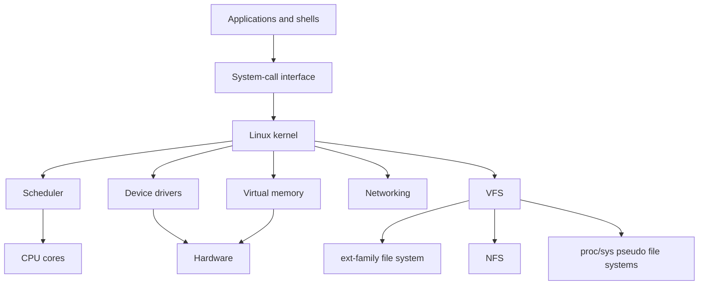

# Linux Case Study

The Linux case study ties the course concepts to a real operating system. The textbook chapter describes Linux through the 3.2 kernel era and presents it as a UNIX-like system that runs from small devices to large servers. Linux is useful pedagogically because it exposes the same abstractions studied earlier: processes, kernel threads, scheduling, memory management, file systems, I/O, IPC, networking, modules, and security.

This page is not a full Linux internals manual. It is a bridge from concept to implementation. The point is to see how a production kernel combines ideas that were studied separately: a modular monolithic kernel, process descriptors, preemptive scheduling, virtual memory areas, page cache, virtual file system, block I/O layer, device drivers, and permission checks.

## Definitions

**Linux** is a UNIX-like operating-system kernel originally released by Linus Torvalds and developed collaboratively. A complete Linux-based system combines the kernel with system libraries, tools, daemons, graphical components, package managers, and applications.

A **monolithic modular kernel** keeps core services in kernel space but supports dynamically loadable modules. Linux device drivers, file systems, and other components can often be built as modules, loaded when needed, and unloaded when safe.

A Linux **task** is represented by a kernel data structure often called a process descriptor. Linux uses tasks to represent both processes and threads. Threads in the same process share resources such as address space and open files according to clone flags.

The **Completely Fair Scheduler** (CFS), discussed in the textbook as a Linux scheduling example, models ideal fair sharing by tracking virtual runtime. Tasks that have received less weighted CPU time are favored.

A **virtual memory area** (VMA) describes a contiguous range of virtual addresses with common permissions and backing, such as code, heap, stack, shared library mapping, or memory-mapped file.

The **Virtual File System** (VFS) is an abstraction layer that lets Linux support many file-system types through common objects and operations. It provides a uniform interface above ext-family file systems, network file systems, pseudo-file systems, and device-oriented file systems.

**Kernel modules** are loadable pieces of kernel code. They improve flexibility but run with kernel privilege, so a module bug can crash or compromise the system.

## Key results

Linux demonstrates that "monolithic" and "modular" are not opposites in practice. Most core services run in kernel space for performance and integration, while modules provide extensibility. This is a pragmatic structure: it avoids the message-passing overhead of a pure microkernel for common paths, yet it allows optional drivers and file systems to be added without rebuilding the entire kernel image.

The Linux process model is UNIX-like but thread-friendly. Traditional process creation uses `fork()` followed by `exec()`. Linux also supports `clone()`, which allows fine-grained sharing of resources and underlies thread creation. The difference between a process and a thread is largely which resources are shared.

CFS uses virtual runtime rather than fixed time slices in the simple round-robin sense. A task's virtual runtime increases as it runs, adjusted by weight derived from niceness. The scheduler chooses the runnable task with the smallest virtual runtime, approximating fair processor sharing.

Linux memory management combines demand paging, copy-on-write, page replacement, slab-style kernel allocators, and memory-mapped files. User address spaces are described by VMAs; page tables map virtual pages to physical frames; page faults bring in pages, create zero-filled pages, or perform copy-on-write.

The VFS makes file operations polymorphic:

| Concept | Linux-facing role | Course concept |
|---|---|---|
| Task/process descriptor | Represents execution context | PCB |
| Scheduler run queue/tree | Tracks runnable tasks | Ready queue |
| VMA | Region of virtual address space | Segmentation-like region metadata |
| Page table | Maps pages to frames | Paging |
| Inode | File metadata object | File-control block |
| Dentry | Directory-entry cache object | Path-name lookup |
| File object | Open file state | Open-file table entry |
| Kernel module | Loadable privileged component | Modular kernel structure |

Security in Linux combines discretionary access control, user and group IDs, capabilities that split root privileges into smaller units, namespaces, cgroups, and optional security modules such as SELinux or AppArmor in many distributions. The textbook's Linux chapter emphasizes the kernel architecture through its historical point; modern deployments add many policy layers above the same core ideas.

Linux IPC shows the continuity with earlier chapters. Pipes and FIFOs provide byte streams. Signals deliver asynchronous notifications. Shared memory gives fast communication but requires synchronization. Sockets support local and network communication through a common interface. Futexes, widely used by threading libraries, combine user-space fast paths with kernel assistance when a thread must block. These mechanisms are not interchangeable; they represent different points in the design space of performance, structure, and kernel involvement.

The Linux file-system view is also intentionally broad. The VFS lets ordinary operations reach persistent file systems, network file systems, device nodes, and pseudo-file systems. `/proc` exposes process and kernel information as files generated on demand. `/sys` exposes device and kernel object information. This design reflects a UNIX tradition: many system resources can be named and inspected through file-like interfaces, but the implementation behind those names may be dynamic kernel state rather than stored disk blocks.

As a case study, Linux is best read as a set of concrete answers rather than the only possible answer. It chooses a modular monolithic kernel, strong POSIX compatibility, aggressive caching, demand-paged virtual memory, a VFS abstraction, loadable drivers, and extensive networking support. Other operating systems make different choices for microkernel isolation, real-time predictability, mobile energy management, or proprietary compatibility. The value of the case study is seeing how the abstractions fit together under production constraints.

The same caution applies when reading kernel source or documentation: names are concrete, but concepts are portable. A Linux `task_struct` is not every operating system's PCB, yet it plays the same role of collecting execution state, scheduling information, credentials, and resource links. Learning the mapping from concept to Linux object makes the rest of the OS course less abstract.

## Visual



Linux exposes a UNIX-like system-call interface while internally coordinating scheduler, memory, VFS, networking, and drivers inside a modular monolithic kernel.

## Worked example 1: mapping `fork()` with copy-on-write

Problem: A Linux process has 100 MiB of private anonymous memory. It calls `fork()`, and the child immediately calls `exec()` to run another program. Why is copy-on-write efficient here?

1. Without copy-on-write, `fork()` would copy the parent's 100 MiB into a new child address space.
2. If the child immediately calls `exec()`, that copied memory would be discarded almost at once.
3. With copy-on-write, the kernel creates a child address space whose page-table entries initially point to the same physical frames as the parent.
4. The shared pages are marked read-only or copy-on-write in both processes.
5. If either process writes to a shared page before `exec()`, a page fault occurs. The kernel allocates a new frame, copies just that page, updates the writer's page table, and resumes.
6. If the child calls `exec()` immediately, the old mappings are replaced by the new program image, and most pages were never copied.
7. The work saved is approximately the full private memory size minus any pages written before `exec()`.

Checked answer: Copy-on-write makes `fork()` plus immediate `exec()` efficient because page tables are copied and physical pages are shared until a write actually requires duplication.

## Worked example 2: connecting VFS objects to a file read

Problem: A process calls `read()` on an already open Linux file descriptor. Map the high-level operation to VFS-related objects.

1. The file descriptor indexes the process's descriptor table.
2. The descriptor table entry points to a kernel file object representing this open instance. The file object contains current offset and access mode.
3. The file object refers to a dentry and inode. The dentry represents a cached directory-name relationship; the inode represents file metadata and file-system operations.
4. The VFS invokes the appropriate file-system-specific read operation through function pointers or equivalent operation tables.
5. If data is already in the page cache, the kernel can copy it to the user buffer.
6. If data is missing, the file system maps the file offset to storage blocks and submits block I/O through lower layers.
7. After data arrives, the kernel updates the file offset and returns the byte count.

Checked answer: A Linux `read()` moves from file descriptor to file object to dentry/inode to file-system operation, often using the page cache before reaching the block device.

## Code

```c
#include <stdio.h>
#include <sys/types.h>
#include <sys/wait.h>
#include <unistd.h>

int main(void) {
    printf("parent pid before fork: %ld\n", (long)getpid());

    pid_t pid = fork();
    if (pid < 0) {
        perror("fork");
        return 1;
    }

    if (pid == 0) {
        printf("child pid: %ld, parent pid: %ld\n",
               (long)getpid(), (long)getppid());
        return 0;
    }

    waitpid(pid, NULL, 0);
    printf("parent observed child exit\n");
    return 0;
}
```

This program exercises the UNIX-like process model that Linux implements. Internally, Linux represents both parent and child as tasks and uses copy-on-write for the address space.

## Common pitfalls

- Equating Linux with a full distribution. Linux is the kernel; distributions add user-space components and policy.
- Assuming "monolithic" means no modules. Linux is monolithic in kernel-space organization but supports loadable modules.
- Thinking Linux threads are unrelated to processes. Linux represents both with tasks; sharing choices determine thread-like behavior.
- Treating `/proc` and `/sys` as ordinary stored files. They are pseudo-file-system interfaces to kernel information and controls.
- Forgetting that modules run with kernel privilege. A faulty driver is not isolated like an ordinary application.
- Applying textbook Linux 3.2 details as if every current kernel is identical. The concepts remain useful, but implementation details evolve.

## Connections

- [OS Overview, Services, and Structures](/cs/operating-systems/os-overview-structures)
- [Processes](/cs/operating-systems/processes)
- [CPU Scheduling](/cs/operating-systems/cpu-scheduling)
- [Virtual Memory](/cs/operating-systems/virtual-memory)
- [File-System Implementation](/cs/operating-systems/file-system-implementation)
