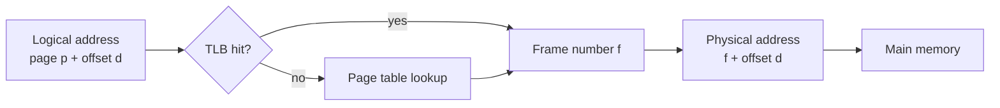

# Main Memory

Main memory management explains how several processes can coexist in RAM while each program behaves as if it has its own orderly address space. CPU scheduling improves utilization only if multiple processes are available to run, and that requires memory sharing. The OS must decide where processes live, how logical addresses become physical addresses, how protection is enforced, and how fragmentation is controlled.

This page covers the mechanisms emphasized before virtual memory: address binding, relocation, contiguous allocation, segmentation, paging, page tables, and the translation lookaside buffer. Virtual memory builds on these ideas by allowing pages to be absent from RAM; main-memory management first explains what it means for an address to be valid and translated at all.

## Definitions

A **logical address** is generated by the CPU from the program's point of view. A **physical address** is the actual address sent to memory hardware. The **memory-management unit** (MMU) maps logical addresses to physical addresses at run time.

**Address binding** can occur at compile time, load time, or execution time. Execution-time binding is most flexible because a process can move during execution, but it requires hardware support.

In **contiguous memory allocation**, each process occupies one contiguous region of physical memory. A base register and limit register can relocate and protect the process. The base is added to each logical address; the limit rejects addresses outside the process's range.

**Fragmentation** is wasted memory. **External fragmentation** occurs when free memory exists in holes too small or scattered to satisfy a request. **Internal fragmentation** occurs when allocated memory is larger than requested and the unused portion cannot be given to another process.

**Segmentation** divides a program into logical units such as code, stack, heap, and data. A logical address has a segment number and offset. The segment table stores each segment's base and limit.

**Paging** divides logical memory into fixed-size pages and physical memory into same-size frames. A page table maps page numbers to frame numbers. The page offset is copied unchanged into the physical address.

A **translation lookaside buffer** (TLB) is a small associative cache of recent page-table entries. Because every instruction fetch and data access may need translation, TLB effectiveness is crucial.

## Key results

Paging removes external fragmentation because any free frame can hold any page. It may still create internal fragmentation in the last page of a process, because the process rarely uses an exact multiple of the page size. If the page size is 4 KiB and a process needs 18 KiB, it receives 5 pages, or 20 KiB, with 2 KiB unused inside the allocation.

Address translation in paging splits the logical address:

$$
\mathrm{logical\ address} = (p, d)
$$

where $p$ is the page number and $d$ is the page offset. If page $p$ maps to frame $f$, then:

$$
\mathrm{physical\ address} = f \times \mathrm{page\ size} + d
$$

The TLB changes effective memory-access time. Suppose a TLB lookup has negligible time compared with memory, memory access takes $m$, and the TLB hit ratio is $h$. On a hit, one memory access obtains the data. On a miss, one memory access reads the page-table entry and another reads the data. A simplified effective access time is:

$$
EAT = h(m) + (1-h)(2m)
$$

This explains why page tables cannot be treated as a minor detail. Without a TLB, paging can double memory references for ordinary loads and stores.

Page-table structure must scale. A single-level page table for a large virtual address space can be enormous. Hierarchical page tables split the table into levels so unused regions need not have allocated lower-level tables. Hashed and inverted page tables are alternatives for very large address spaces.

Segmentation matches programmer-visible regions and supports per-segment protection and sharing. Paging matches fixed-size hardware management and avoids external fragmentation. Many systems combine the ideas conceptually or historically, but contemporary general-purpose systems rely heavily on paging.

Protection is built into translation. A page-table entry normally carries bits such as valid, read/write, user/supervisor, execute-disable, referenced, and dirty. If a user process tries to write a read-only page or execute a non-executable page, the hardware raises a fault and transfers control to the kernel. The same page-table mechanism therefore supports isolation, sharing, copy-on-write, memory-mapped files, and security features such as non-executable stacks.

Page size is a practical design trade-off. Larger pages reduce page-table size and can improve TLB coverage because each TLB entry maps more memory. They also increase internal fragmentation and can waste I/O if a program touches only a small part of each page. Smaller pages reduce wasted space and make fine-grained protection easier, but they require more page-table entries and can increase TLB pressure. Many architectures support multiple page sizes so kernels can use large pages for large contiguous mappings and normal pages for general allocations.

Contiguous allocation remains conceptually useful even though paging dominates general-purpose systems. Embedded systems, DMA buffers, kernel memory, and hardware devices sometimes need physically contiguous memory or special alignment. The OS must then combine paging-based flexibility with lower-level allocators that can satisfy hardware constraints. This is a recurring OS pattern: a clean abstraction exists for most programs, but the kernel still handles awkward physical realities.

Swapping is the older and coarser cousin of demand paging. Instead of moving individual pages, the OS may move an entire process image out of memory and later bring it back. Pure swapping is less central on modern general-purpose systems than paging, but the idea remains useful for understanding memory pressure: the OS can trade storage I/O for more available RAM. Mobile systems may avoid traditional swap or use compressed memory and process termination policies because storage writes consume energy and flash endurance.

Address binding also explains why relocation hardware matters. If a program contains absolute physical addresses, moving it is difficult. If the program uses logical addresses translated at execution time, the OS can place it wherever memory is available and can later change mappings. This flexibility is what enables multiprogramming, shared libraries, copy-on-write, and virtual memory. It also lets the same executable image run in different physical locations across different executions.

The hardware translation path is therefore a performance feature and a protection feature at the same time.

## Visual



The page offset is not translated. Only the page number changes into a frame number, which is why page and frame sizes must match.

| Technique | Unit size | Fragmentation | Protection granularity | Main advantage |
|---|---|---|---|---|
| Contiguous allocation | Whole process or partition | External, sometimes internal | Whole region | Simple hardware |
| Segmentation | Logical variable-size segment | External | Segment | Matches program structure |
| Paging | Fixed-size page/frame | Internal only | Page | Easy noncontiguous allocation |
| Segmented paging | Segment plus page | Mostly internal | Segment and page | Combines logical view with paging |

## Worked example 1: page translation

Problem: A system has page size 1024 bytes. A process's page table maps page 0 to frame 5, page 1 to frame 9, and page 2 to frame 1. Translate logical address 2500.

1. Compute the page number:

$$
p = \left\lfloor \frac{2500}{1024} \right\rfloor = 2
$$

2. Compute the offset:

$$
d = 2500 \bmod 1024 = 452
$$

3. Look up page 2 in the page table. Page 2 maps to frame 1.
4. Compute physical address:

$$
\begin{aligned}
\mathrm{physical}
  &= 1 \times 1024 + 452 \\
  &= 1476
\end{aligned}
$$

5. Check that the offset is less than the page size. Since $452 \lt  1024$, the offset is valid.

Checked answer: Logical address 2500 translates to physical address 1476.

## Worked example 2: TLB effective access time

Problem: Memory access takes 100 ns. A TLB hit adds no visible cost for this simplified calculation. The TLB hit ratio is 95 percent. Compute effective access time.

1. Identify values:

$$
m = 100\ \mathrm{ns}, \quad h = 0.95
$$

2. On a TLB hit, time is one memory access:

$$
100\ \mathrm{ns}
$$

3. On a TLB miss, time is two memory accesses:

$$
200\ \mathrm{ns}
$$

4. Compute:

$$
\begin{aligned}
EAT
  &= 0.95(100) + 0.05(200) \\
  &= 95 + 10 \\
  &= 105\ \mathrm{ns}
\end{aligned}
$$

5. Compare with no TLB. Without a TLB, every access would require about 200 ns in this model.

Checked answer: Effective access time is 105 ns. A 95 percent hit ratio almost recovers direct-memory speed.

## Code

```python
def translate(logical_address, page_size, page_table):
    page = logical_address // page_size
    offset = logical_address % page_size

    if page not in page_table:
        raise ValueError(f"invalid page {page}")

    frame = page_table[page]
    return frame * page_size + offset

page_table = {0: 5, 1: 9, 2: 1}
print(translate(2500, 1024, page_table))
```

This snippet models the core arithmetic of paging. Real systems add valid bits, protection bits, dirty bits, reference bits, TLB lookup, and page faults.

## Common pitfalls

- Mixing up pages and frames. Pages are logical; frames are physical.
- Translating the offset. The offset is copied unchanged once the page number maps to a frame.
- Assuming paging has no wasted space. Paging removes external fragmentation but can create internal fragmentation.
- Ignoring TLB behavior. A correct page table can still perform poorly if locality is weak and TLB misses are frequent.
- Treating segmentation and paging as interchangeable. Segments are logical variable-size units; pages are fixed-size allocation units.
- Forgetting protection bits. Translation is also an enforcement step, not just arithmetic.

## Connections

- [Virtual Memory](/cs/operating-systems/virtual-memory)
- [Processes](/cs/operating-systems/processes)
- [CPU Scheduling](/cs/operating-systems/cpu-scheduling)
- [Protection and Access Control](/cs/operating-systems/protection-access-control)
- [Linux Case Study](/cs/operating-systems/linux-case-study)
