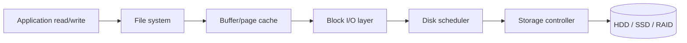

# Mass Storage and RAID

Mass storage is where file systems meet physical devices. The OS cannot treat disks, SSDs, and storage arrays as abstract infinite boxes; their physical behavior shapes performance and reliability. Traditional hard disks have seek time and rotational latency. SSDs have no mechanical head but have erase blocks, write amplification, and finite write endurance. RAID arrays combine devices to improve capacity, performance, reliability, or some mixture of these.

This page follows the textbook's mass-storage chapter: disk structure, attachment, scheduling, disk management, swap-space management, RAID, and stable storage. The goal is not to memorize every device detail, but to understand why operating systems schedule I/O, manage bad blocks, reserve swap space, and use redundancy.

## Definitions

A **hard disk drive** stores data magnetically on rotating platters. A disk surface is divided into tracks, tracks into sectors, and tracks at the same arm position across platters form a cylinder. A disk access includes **seek time**, **rotational latency**, and **transfer time**.

A **solid-state disk** stores data in flash memory. It has no mechanical seek, but writes are constrained by erase blocks and flash-translation-layer behavior. Random writes can be more expensive than reads.

**Disk scheduling** chooses the order of pending disk I/O requests. Algorithms include FCFS, SSTF, SCAN, C-SCAN, LOOK, and C-LOOK. These were designed mainly for mechanical disks where head movement dominates cost.

**FCFS** serves requests in arrival order. **SSTF** serves the request closest to the current head position. **SCAN** moves the head in one direction serving requests, then reverses, like an elevator. **C-SCAN** serves in one direction only and jumps back to the beginning. **LOOK** and **C-LOOK** avoid going all the way to the end if no requests exist there.

**Swap space** is storage used to hold pages or processes that are not currently resident in RAM. It may be a dedicated partition or a file, and its layout affects paging performance.

**RAID** stands for redundant array of independent disks. RAID levels use striping, mirroring, and parity to trade capacity, performance, and fault tolerance.

**Stable storage** is an abstraction that attempts to make data survive failures by storing redundant copies and carefully ordering writes.

## Key results

Mechanical disk performance is dominated by movement:

$$
\mathrm{access\ time} = \mathrm{seek\ time} + \mathrm{rotational\ latency} + \mathrm{transfer\ time}
$$

Disk scheduling reduces total head movement and improves throughput, but fairness matters. SSTF can starve requests far from the current head if nearer requests keep arriving. SCAN and C-SCAN produce more predictable waiting times by imposing directional service.

| Algorithm | Main idea | Strength | Weakness |
|---|---|---|---|
| FCFS | Arrival order | Fair and simple | Poor head movement |
| SSTF | Nearest request next | Low average seek | Starvation possible |
| SCAN | Sweep back and forth | Better fairness | Edge cylinders can wait differently |
| C-SCAN | Sweep one direction | More uniform waits | Return sweep does no service |
| LOOK | SCAN but stops at last request | Avoids unnecessary travel | Still directional |
| C-LOOK | C-SCAN over request range | Avoids end travel | More bookkeeping |

RAID levels have different meanings:

| RAID level | Technique | Fault tolerance | Capacity with $N$ equal disks |
|---|---|---:|---|
| RAID 0 | Striping | None | $N$ disks |
| RAID 1 | Mirroring | One disk per mirror pair | About $N/2$ disks |
| RAID 5 | Block striping plus distributed parity | One disk | $N-1$ disks |
| RAID 6 | Distributed double parity | Two disks | $N-2$ disks |
| RAID 10 | Mirrored pairs striped | One per mirror pair, depending on failures | About $N/2$ disks |

RAID is not a backup. It can survive some device failures, but it does not protect against accidental deletion, corruption replicated across the array, malware, fire, or administrative mistakes.

For SSDs, traditional seek-based scheduling is less important, but the OS still cares about batching, queue depth, write alignment, TRIM/discard support, and avoiding unnecessary writes. The textbook's inclusion of SSDs is a reminder that OS policies must follow storage technology.

Disk management includes formatting, boot blocks, bad-block handling, and partitioning. Low-level formatting creates sectors and controller-visible structures. Logical formatting creates file-system metadata. Boot blocks hold enough code or references to begin loading the operating system. Bad-block management hides defective sectors through controller remapping or OS-level avoidance. These details are easy to overlook because file systems present a clean namespace, but reliability depends on the storage stack noticing and isolating failing locations.

Swap-space management is a storage policy tied directly to virtual memory. Some systems use a dedicated swap partition to avoid file-system overhead and fragmentation. Others use swap files for flexibility. The best layout depends on workload and administrative needs, but the principle is stable: paging traffic should avoid unnecessary metadata work and should not compete destructively with ordinary file I/O. When memory pressure is high, swap placement can determine whether the system slows gracefully or becomes unusable.

Stable-storage techniques use redundancy and careful ordering to approximate reliable writes despite failures. A simple approach writes data to one copy, verifies it, then writes a second copy, ensuring recovery can find at least one valid version after a crash. RAID, journaling file systems, and database logs all reflect the same principle at different layers: do not let a single interrupted write destroy the only description of important state.

Modern storage stacks also queue requests below the OS scheduler. SATA, SAS, NVMe, and RAID controllers may reorder internally, merge requests, or exploit parallelism across channels and flash dies. The OS scheduler therefore cooperates with hardware rather than commanding a simple arm directly in every case. This is another reason that old cylinder-based examples are best treated as models for reasoning about cost, not exact descriptions of every current device.

Storage reliability has both device and software dimensions. A disk can report a write as complete before data is truly stable unless caches are flushed correctly. A controller can reorder writes unless barriers or flush commands enforce ordering. A file system can journal metadata but still leave application data vulnerable if the application never requested durability. Correct storage design therefore crosses API, file-system, driver, controller, and hardware boundaries. Each layer must preserve the assumptions made by the layer above it.

Performance and correctness both depend on those assumptions staying true during failures.

Storage policies should therefore be tested under both normal load and simulated failure.

## Visual



The file system is not the final stop. Requests pass through caching, block mapping, scheduling, and controller queues before reaching storage.

## Worked example 1: SSTF disk scheduling

Problem: The disk head is at cylinder 53. Pending requests are `98, 183, 37, 122, 14, 124, 65, 67`. Use SSTF and compute total head movement.

1. Start at 53. Distances: to 65 is 12, to 67 is 14, to 37 is 16, to 14 is 39, to 98 is 45, to 122 is 69, to 124 is 71, to 183 is 130. Choose 65.
2. Move 53 to 65: movement 12. Current 65.
3. Nearest from 65 is 67, distance 2. Total 14. Current 67.
4. Nearest from 67 is 37 distance 30 or 98 distance 31. Choose 37. Total 44. Current 37.
5. Nearest from 37 is 14, distance 23. Total 67. Current 14.
6. Remaining are 98, 122, 124, 183. Nearest from 14 is 98, distance 84. Total 151. Current 98.
7. Nearest from 98 is 122, distance 24. Total 175. Current 122.
8. Nearest from 122 is 124, distance 2. Total 177. Current 124.
9. Last is 183, distance 59. Total 236.

Checked answer: SSTF order is `65, 67, 37, 14, 98, 122, 124, 183`, with total head movement 236 cylinders.

## Worked example 2: RAID 5 usable capacity

Problem: A RAID 5 array uses six 4 TB disks. What is the usable capacity, and how many disk failures can it tolerate?

1. RAID 5 uses distributed parity equivalent to one disk's capacity.
2. Usable disk count:

$$
N - 1 = 6 - 1 = 5
$$

3. Usable capacity:

$$
5 \times 4\ \mathrm{TB} = 20\ \mathrm{TB}
$$

4. Fault tolerance: RAID 5 can tolerate one disk failure. If a second disk fails before rebuild completes, data is lost.
5. Check against RAID 6. RAID 6 with the same disks would use two disks' worth of parity:

$$
(6 - 2) \times 4\ \mathrm{TB} = 16\ \mathrm{TB}
$$

   but could tolerate two disk failures.

Checked answer: RAID 5 provides 20 TB usable capacity and tolerates one disk failure.

## Code

```python
def sstf(start, requests):
    pending = list(requests)
    current = start
    total = 0
    order = []

    while pending:
        next_req = min(pending, key=lambda r: abs(r - current))
        total += abs(next_req - current)
        current = next_req
        order.append(next_req)
        pending.remove(next_req)

    return order, total

requests = [98, 183, 37, 122, 14, 124, 65, 67]
print(sstf(53, requests))
```

This simulator models only cylinder movement. Real devices also have rotational latency, queue reordering inside controllers, caches, and different behavior for SSDs.

## Common pitfalls

- Applying HDD scheduling intuition blindly to SSDs. SSDs have different costs, though batching and write behavior still matter.
- Treating SSTF as always best. It can starve far-away requests.
- Forgetting rotational latency and transfer time. Seek is important, but it is not the whole access time.
- Assuming RAID replaces backup. RAID improves availability after device failure; backups protect against broader loss.
- Ignoring rebuild risk. Large arrays can be vulnerable while reconstructing after a disk failure.
- Putting swap space on slow or overloaded storage. Paging performance depends heavily on swap placement and contention.

## Connections

- [File-System Implementation](/cs/operating-systems/file-system-implementation)
- [Virtual Memory](/cs/operating-systems/virtual-memory)
- [I/O Systems](/cs/operating-systems/io-systems)
- [Security](/cs/operating-systems/security)
- [Linux Case Study](/cs/operating-systems/linux-case-study)
