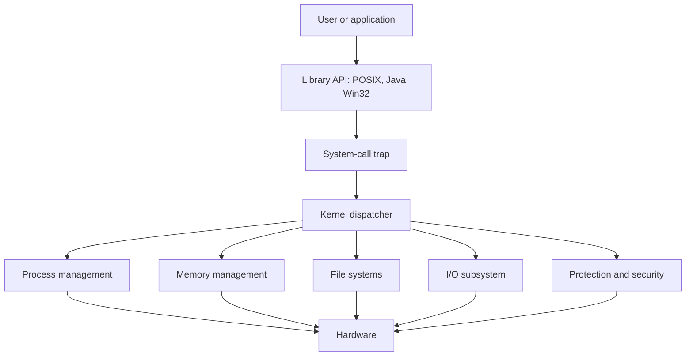

# OS Overview, Services, and Structures

An operating system is the control layer that makes bare hardware usable. It hides awkward device details, allocates shared resources, gives programs a stable execution environment, and prevents one program from casually damaging another. Silberschatz, Galvin, and Gagne frame the OS from two complementary views: to users and applications it is a convenient service provider, while to the hardware it is a resource allocator and control program.

This page sits at the entrance to the rest of operating systems. Processes, memory, files, I/O, protection, and security are not separate inventions; they are services exposed through interfaces and implemented inside a kernel structure. Understanding that split between interface and implementation makes later topics easier: a file descriptor, page table, interrupt handler, and scheduler queue are all parts of the same larger design problem.


*Figure: Five-state process model used in operating systems. Image: [Wikimedia Commons](https://commons.wikimedia.org/wiki/File:Process_state.svg), MrDrBob, CC BY-SA 3.0.*

## Definitions

An **operating system** is the software that manages hardware resources and provides services for programs. The textbook uses the common practical definition of the **kernel** as the program running at all times on the computer. System programs, libraries, command interpreters, graphical shells, daemons, and application programs may ship with an OS distribution, but they are not necessarily part of the kernel.

A **system call** is the controlled entry point from user mode into kernel mode. User programs normally cannot execute privileged instructions, manipulate device controllers directly, or modify kernel data structures. Instead, they request services such as `open`, `read`, `fork`, `exec`, `CreateProcess`, memory mapping, device control, or network I/O through a trap-like mechanism that transfers control to a kernel handler.

The **user interface** is the human-facing side of the system. Traditional systems provide command-line shells; desktop systems provide graphical interfaces; mobile systems emphasize touch, gestures, and app-focused workflows. The **application programming interface** is different: it is the set of functions a program calls, often through a library such as the POSIX C library or the Windows API, which then issues system calls when kernel service is required.

An OS also depends on hardware execution modes. In **user mode**, an application has restricted privileges. In **kernel mode**, trusted OS code can execute privileged instructions, configure memory protection, perform I/O, and handle interrupts. A **timer interrupt** lets the kernel regain control even if a user process never voluntarily yields the CPU.

Common kernel structures include **monolithic kernels**, **layered systems**, **microkernels**, **modules**, and **hybrid systems**. A monolithic kernel keeps most services in one large kernel address space. A layered system organizes services above lower-level abstractions. A microkernel moves many services, such as file systems or device services, into user-space servers and leaves only small core mechanisms in the kernel. A modular kernel keeps a core kernel but loads components dynamically. Hybrid systems combine these ideas in pragmatic ways.

## Key results

The most important design result is the separation between **policy** and **mechanism**. Mechanism answers "what operations are possible?" Policy answers "which operation should be chosen now?" A scheduling mechanism can switch from one thread to another; a scheduling policy decides whether round-robin, priority, shortest-job, or real-time order should run next. This split does not make an OS easy to design, but it prevents every policy change from requiring a new low-level mechanism.

System calls usually follow a standard path. First, a user program calls a library wrapper. Second, the wrapper places a system-call number and arguments where the calling convention requires them. Third, a trap instruction switches to kernel mode and enters a dispatch table. Fourth, the kernel validates arguments, checks permissions, performs the requested service, stores a return value or error code, and returns to user mode. This path matters because it explains both safety and cost: crossing the boundary is more expensive than an ordinary function call, but it lets the kernel enforce protection.

Operating-system services can be grouped by purpose:

| Service class | Typical operations | Why the OS owns it |
|---|---|---|
| Program execution | load, start, terminate, wait | Needs protected address spaces and CPU control |
| I/O operations | read, write, device control | Devices differ widely and need serialized access |
| File-system manipulation | create, delete, open, close, permissions | Persistent storage must be named, shared, and protected |
| Communication | pipes, sockets, shared memory, messages | Processes need controlled cooperation |
| Error detection | hardware faults, illegal memory, I/O errors | Faults must be contained before they spread |
| Resource allocation | CPU, memory, disk, devices | Multiprogramming creates contention |
| Accounting and auditing | usage records, logs, quotas | Shared systems need accountability |
| Protection and security | authentication, authorization, isolation | Users and processes cannot all be trusted equally |

Kernel structure is a trade-off between performance, reliability, evolvability, and security. A monolithic kernel can be fast because calls between services are ordinary procedure calls inside kernel memory, but a bug in a driver can crash the whole system. A microkernel can isolate services, but message passing between user-space servers may add overhead. Modular kernels, such as the style used by Linux, preserve a monolithic core while allowing device drivers and file systems to be loaded as kernel modules.

Booting follows a layered handoff. Firmware runs first, initializes enough hardware to find a boot loader, the boot loader loads the kernel, the kernel initializes devices and memory management, and then the first user-space process starts system services. On UNIX-like systems this first process is historically `init`; more recent Linux systems often use `systemd`, but the conceptual role is the same: create the early user-space service tree.

## Visual



The diagram separates the interface path from the implementation modules. Applications mostly see the API and system-call contract; the kernel internally coordinates hardware, memory, files, devices, and protection.

## Worked example 1: tracing a file read

Problem: A C program executes `read(fd, buffer, 4096)` on a file descriptor that refers to a disk file. Trace what must happen conceptually and identify where protection checks occur.

1. The program calls the C library wrapper for `read`. This wrapper is ordinary user-space code, so it cannot touch the disk controller or kernel file table directly.
2. The wrapper places the system-call identifier for `read` and the arguments `fd`, `buffer`, and `4096` in the expected registers or stack locations.
3. The wrapper executes a trap instruction. The CPU switches from user mode to kernel mode and jumps to the kernel's system-call entry code.
4. The kernel dispatches to the `read` handler. The handler validates that `fd` is open in this process and that it permits reading.
5. The kernel checks that the user buffer range is a legal writable range in the process address space. Without this check, a malicious process could ask the kernel to copy file data into kernel memory or another process's memory.
6. The file-system layer maps the current file offset to one or more disk blocks. If the block is cached in the buffer cache or page cache, the kernel can copy data immediately. If not, it submits an I/O request to the device subsystem.
7. The disk controller performs the transfer, possibly using DMA. When the device completes, it raises an interrupt.
8. The interrupt handler wakes the waiting process, the kernel copies the bytes into `buffer`, updates the file offset, and returns the number of bytes read.

Checked answer: A file read crosses the user-kernel boundary once on entry and once on return. Protection happens at the file descriptor permission check and at the user-buffer validation step. Performance depends on whether the data is already cached; the same system call can be memory-speed or disk-speed.

## Worked example 2: choosing a kernel organization

Problem: A small embedded controller needs predictable timing, a narrow set of devices, and high reliability. A research workstation needs frequent file-system and network experiments. Which structure fits each case better?

1. Identify the embedded controller's constraints. It probably has limited memory, fixed hardware, and a small application set. Dynamic extensibility matters less than predictable control over every path.
2. A compact monolithic or carefully layered kernel may fit. It avoids user-space server message overhead and can be validated around a narrow configuration. If the device has hard real-time constraints, unnecessary abstraction layers can be harmful.
3. Identify the research workstation's constraints. Developers need to replace components, observe behavior, and experiment with policies without rebooting or rewriting the whole kernel.
4. A microkernel-like or modular design is more attractive. A file-system server or loadable module can be changed independently, and failures may be easier to isolate.
5. Compare the trade-off. The embedded system values small, predictable paths. The research system values changeability and fault containment.

Checked answer: The embedded controller leans toward a small integrated kernel; the research workstation leans toward modular or microkernel-style decomposition. There is no universal "best" structure; the right choice follows the environment's reliability, latency, and evolution requirements.

## Code

```c
#include <errno.h>
#include <fcntl.h>
#include <stdio.h>
#include <unistd.h>

int main(void) {
    char buf[4096];
    int fd = open("notes.txt", O_RDONLY);

    if (fd == -1) {
        perror("open");
        return 1;
    }

    ssize_t n = read(fd, buf, sizeof(buf));
    if (n == -1) {
        perror("read");
        close(fd);
        return 1;
    }

    ssize_t written = write(STDOUT_FILENO, buf, (size_t)n);
    if (written == -1) {
        perror("write");
    }

    close(fd);
    return written == -1;
}
```

This short POSIX program uses four kernel services: opening a file, reading data, writing to standard output, and closing the file descriptor. Each call looks like a normal C function but may become a system call.

## Common pitfalls

- Treating the shell or desktop as the kernel. They are user interfaces and system programs; the kernel is the privileged core underneath them.
- Thinking a system call is just a library call. The wrapper may be a library function, but the service requires a controlled mode switch.
- Ignoring error returns. OS services fail for normal reasons: missing permissions, invalid descriptors, interrupted calls, absent devices, or full disks.
- Assuming a monolithic kernel means "unstructured." Many monolithic kernels have strong internal subsystems even though they share one kernel address space.
- Assuming a microkernel is automatically more secure. Smaller trusted code can help, but security still depends on correct interfaces, authorization, and implementation.
- Forgetting that mobile and embedded systems are operating systems too. Their constraints differ from desktop systems, but they still manage resources and protection.

## Connections

- [Processes](/cs/operating-systems/processes)
- [Threads](/cs/operating-systems/threads)
- [Main Memory](/cs/operating-systems/main-memory)
- [File-System Interface](/cs/operating-systems/file-system-interface)
- [Protection and Access Control](/cs/operating-systems/protection-access-control)

