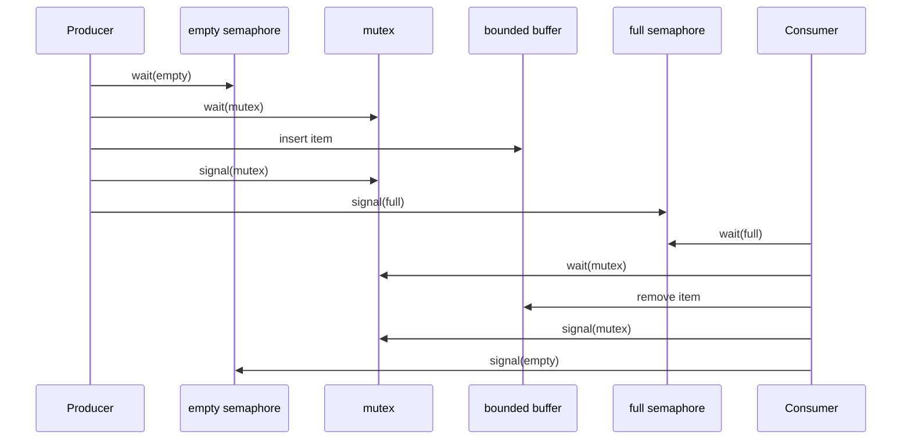

# Process Synchronization

Process synchronization is the part of operating systems where concurrency becomes precise. Processes and threads often cooperate by sharing memory, files, buffers, counters, or kernel objects. If two execution contexts access the same mutable state without coordination, the final result may depend on timing rather than logic. That timing dependence is a race condition, and it is one of the most persistent sources of operating-system bugs.

The textbook develops synchronization from the critical-section problem through hardware support, mutex locks, semaphores, monitors, classic synchronization problems, and deadlocks. The common theme is controlled access: the OS and programs need ways to express "only one at a time," "wait until a condition is true," and "wake the right waiters without losing events."


*Figure: Dining philosophers as a synchronization and deadlock example. Image: [Wikimedia Commons](https://commons.wikimedia.org/wiki/File:Dining_philosophers.svg), DnetSvg after Allen3, public domain.*

## Definitions

A **race condition** occurs when the correctness of a result depends on the relative timing of concurrent operations. The simplest example is two threads executing `counter = counter + 1` at the same time. The statement looks atomic in source code, but it compiles into multiple load, add, and store operations.

The **critical-section problem** asks for a protocol that lets processes execute code sections that access shared data safely. A correct solution must satisfy **mutual exclusion**, **progress**, and **bounded waiting**. Mutual exclusion means at most one process is in the critical section. Progress means the decision about who enters next cannot be postponed forever when no one is inside. Bounded waiting means there is a limit on how many times others can enter after a process requests entry.

A **mutex lock** provides mutual exclusion with `acquire()` and `release()` operations. A simple spinlock repeatedly checks a lock variable until it becomes available. Spinlocks waste CPU cycles if held for long periods, but they can be appropriate in kernel code when the wait is shorter than the cost of blocking and rescheduling.

A **semaphore** is an integer synchronization variable accessed only through atomic `wait()` and `signal()` operations. A **binary semaphore** behaves like a mutex. A **counting semaphore** represents multiple identical resources, such as available buffer slots.

A **monitor** is a higher-level synchronization construct that combines shared data, procedures, mutual exclusion, and condition variables. Only one thread is active inside a monitor at a time. Threads use condition variables to wait for predicates such as "buffer not empty" or "buffer not full."

**Atomic hardware instructions** such as test-and-set and compare-and-swap support synchronization by making a read-modify-write operation indivisible with respect to other CPUs.

## Key results

The first key result is that source-level statements are not atomic unless the language and memory model say they are. A counter increment can interleave as follows:

| Step | Thread A | Thread B | Counter |
|---:|---|---|---:|
| 1 | load counter into register |  | 5 |
| 2 |  | load counter into register | 5 |
| 3 | add 1 to register |  | 5 |
| 4 |  | add 1 to register | 5 |
| 5 | store 6 |  | 6 |
| 6 |  | store 6 | 6 |

Two increments produced one visible increase. Mutual exclusion around the read-modify-write sequence fixes the lost update.

Peterson's solution is a classic two-process software algorithm using `flag[2]` and `turn`. It demonstrates the logic of mutual exclusion, progress, and bounded waiting, but modern CPUs and compilers can reorder memory operations unless proper memory barriers or atomic variables are used. Therefore real systems rely on hardware atomic operations and carefully defined memory-ordering rules.

Semaphores solve more than mutual exclusion. They can encode ordering constraints. If `S` is initialized to 0, thread B can execute `wait(S)` before using data, and thread A can execute `signal(S)` after producing the data. B cannot pass the wait until A signals. This turns a timing assumption into an explicit synchronization edge.

Classic synchronization problems illustrate reusable patterns. The **bounded-buffer** problem uses one mutex plus two counting semaphores: `empty` counts empty slots and `full` counts filled slots. The **readers-writers** problem balances concurrent reads against exclusive writes. The **dining-philosophers** problem exposes deadlock and starvation risks when several actors need multiple resources.

Monitors reduce accidental misuse by grouping the lock with the data it protects. A condition variable wait must be placed inside a loop, not an `if`, because wakeups mean "the condition may now be true," not "the condition is guaranteed true forever."

Hardware support matters because synchronization has to work across CPUs, compiler optimizations, caches, and interrupts. An atomic compare-and-swap can implement a lock by changing a memory word only if it still contains the expected old value. Memory barriers or acquire/release semantics prevent the compiler and CPU from reordering memory operations across synchronization boundaries in ways that would break the protected invariant. Without these ordering rules, two processors might agree on who owns a lock but still observe stale protected data.

Blocking locks and spinlocks serve different situations. A blocking mutex puts the caller to sleep when the lock is unavailable, allowing the CPU to run another thread. This is appropriate when the critical section may be long. A spinlock repeatedly checks the lock and is appropriate only when the wait is expected to be very short or when sleeping is illegal, such as certain kernel interrupt contexts. The wrong choice can waste CPU time or introduce invalid blocking in low-level code.

Synchronization design also requires choosing the granularity of locks. One global lock is easy to reason about but limits parallelism. Fine-grained locks allow more concurrency but increase the risk of deadlock and make invariants harder to understand. Production kernels and runtimes often combine strategies: coarse locks for rare administrative paths, fine-grained locks for hot data structures, lock-free or per-CPU structures for very frequent operations, and higher-level monitors or condition variables where clarity matters more than raw speed.

Correct synchronization usually protects an invariant, not a line of code. For a bounded buffer, the invariant might be that `0 <= count <= capacity` and that producer and consumer indexes identify valid slots. For a file table, the invariant might be that reference counts match open handles. Naming the invariant makes it easier to choose the lock, decide the critical-section boundaries, and review whether every path preserves the same rule.

## Visual



The bounded-buffer protocol separates capacity control from mutual exclusion. `empty` and `full` track how many slots are usable; `mutex` protects the buffer's internal indexes and contents.

## Worked example 1: lost update on a shared counter

Problem: `counter` starts at 10. Two threads each execute `counter = counter + 1` once. Show how the final value can be 11 instead of 12.

1. Break the statement into machine-like steps:
   - load `counter` into a register
   - add 1 to the register
   - store the register into `counter`
2. Thread A loads 10 into `rA`.
3. The scheduler switches to Thread B before A stores.
4. Thread B loads 10 into `rB`.
5. Thread B adds 1, so `rB = 11`.
6. Thread B stores 11 into `counter`.
7. The scheduler switches back to Thread A.
8. Thread A adds 1 to its old register value, so `rA = 11`.
9. Thread A stores 11 into `counter`, overwriting B's update with the same value.

Checked answer: The final value is 11 because both threads read the same original value. A mutex around the entire read-add-store sequence would force the second thread to read 11 and store 12.

## Worked example 2: bounded buffer semaphore counts

Problem: A circular buffer has capacity 5. Initially it contains 2 items. Set the initial semaphore values for the producer-consumer solution, then trace one producer insert and one consumer remove.

1. The `full` semaphore counts filled slots, so initially:

$$
full = 2
$$

2. The `empty` semaphore counts empty slots:

$$
empty = 5 - 2 = 3
$$

3. The `mutex` semaphore protects the buffer structure and starts unlocked:

$$
mutex = 1
$$

4. Producer insert:
   - `wait(empty)` changes `empty` from 3 to 2.
   - `wait(mutex)` changes `mutex` from 1 to 0.
   - Producer inserts one item; buffer now has 3 items.
   - `signal(mutex)` changes `mutex` from 0 to 1.
   - `signal(full)` changes `full` from 2 to 3.
5. Consumer remove:
   - `wait(full)` changes `full` from 3 to 2.
   - `wait(mutex)` changes `mutex` from 1 to 0.
   - Consumer removes one item; buffer now has 2 items.
   - `signal(mutex)` changes `mutex` from 0 to 1.
   - `signal(empty)` changes `empty` from 2 to 3.

Checked answer: The system returns to the original counts after one insert and one remove: `full = 2`, `empty = 3`, `mutex = 1`. The intermediate counts prevent overflow and underflow.

## Code

```python
from threading import Condition, Thread
from collections import deque

class BoundedBuffer:
    def __init__(self, capacity):
        self.capacity = capacity
        self.items = deque()
        self.condition = Condition()

    def put(self, item):
        with self.condition:
            while len(self.items) == self.capacity:
                self.condition.wait()
            self.items.append(item)
            self.condition.notify_all()

    def get(self):
        with self.condition:
            while not self.items:
                self.condition.wait()
            item = self.items.popleft()
            self.condition.notify_all()
            return item

buffer = BoundedBuffer(2)
Thread(target=lambda: buffer.put("A")).start()
Thread(target=lambda: print(buffer.get())).start()
```

This monitor-style Python example uses a condition variable. The `while` loops are intentional: a thread rechecks the predicate after waking before it touches the buffer.

## Common pitfalls

- Assuming a high-level statement is atomic. Most useful updates are multiple lower-level operations.
- Protecting the write but not the read. Shared mutable state needs a consistent rule for every access.
- Calling `signal()` before the shared state is actually updated. Wakeups should correspond to real predicate changes.
- Using `if` instead of `while` around condition-variable waits. Wakeups can be spurious or consumed by another thread first.
- Holding a lock during slow I/O. That expands the critical section and can block unrelated work.
- Forgetting starvation. Mutual exclusion prevents simultaneous access, but it does not automatically guarantee fairness.

## Connections

- [Threads](/cs/operating-systems/threads)
- [CPU Scheduling](/cs/operating-systems/cpu-scheduling)
- [Deadlocks](/cs/operating-systems/deadlocks)
- [Main Memory](/cs/operating-systems/main-memory)
- [Protection and Access Control](/cs/operating-systems/protection-access-control)
