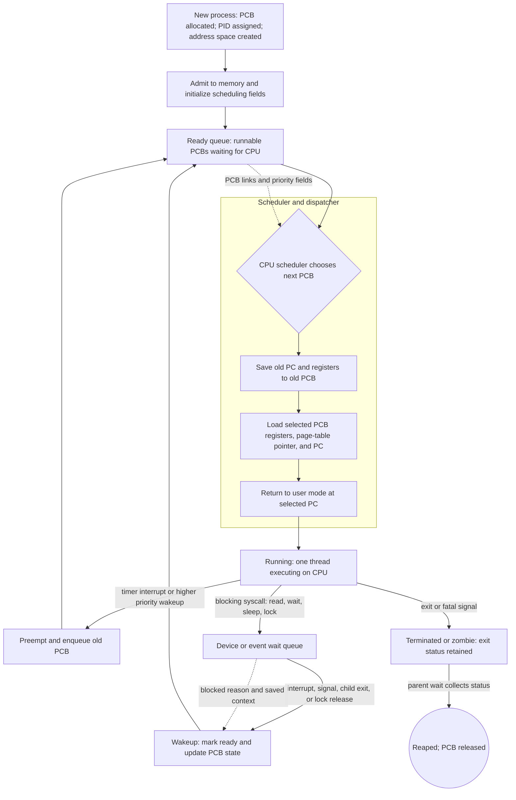

# Processes

A process is a program in execution, but that phrase is only the beginning. The executable file is passive bytes on storage; the process is active state: an address space, a program counter, CPU registers, open files, accounting data, scheduling information, and relationships to other processes. Modern operating systems are built around this abstraction because many activities must appear to progress at once even when the machine has fewer CPUs than runnable activities.


*Figure: The Linux kernel map shows how OS services become interacting subsystems. Image: [Wikimedia Commons](https://commons.wikimedia.org/wiki/File:Linux_kernel_map.png), Conan at English Wikipedia, CC BY 3.0.*

Processes connect the user-level idea of "running a program" to the kernel-level mechanisms of scheduling, memory isolation, resource ownership, and interprocess communication. The process page therefore prepares for CPU scheduling, synchronization, virtual memory, file systems, and protection. Once a program becomes a process, it is no longer just code; it is a managed object in the kernel.

## Definitions

A **process** is an executing program with its current activity and resources. It includes a **text section** containing program code, a **data section** for global variables, a **heap** for dynamically allocated memory, and a **stack** for function calls, parameters, local variables, and return addresses.

A **process control block** (PCB), also called a task control block in some systems, is the kernel record for a process. It stores process state, program counter, CPU registers, CPU-scheduling information, memory-management information, accounting data, and I/O status information. During a context switch, the PCB is where the old process's CPU state is saved and the new process's state is restored.

Common process states are **new**, **running**, **waiting**, **ready**, and **terminated**. A process is ready when it can run but the CPU is assigned elsewhere; it is waiting when it cannot run until an event occurs, such as I/O completion.

**Process scheduling** chooses which ready process should execute next. The kernel maintains scheduling queues: a job queue for all processes in the system, a ready queue for processes in memory ready to run, and device queues for processes waiting on I/O devices.

**Process creation** builds a child process from a parent. UNIX-like systems traditionally separate creation and replacement: `fork()` creates a child process that initially resembles the parent, and `exec()` replaces the child's address space with a new program. Windows commonly uses a single creation call that names the new program directly.

**Interprocess communication** (IPC) lets cooperating processes exchange data. The two classic models are **shared memory**, where processes map a common region and coordinate access, and **message passing**, where the kernel or a communication facility transfers messages through operations such as send and receive.

## Key results

The central result is that the process abstraction lets the OS multiplex the CPU while preserving the illusion of private execution. A context switch saves the state of one process and restores the state of another. No useful user computation occurs during the switch itself, so context switching is overhead. However, without it, a time-sharing system could not keep many interactive, I/O-bound, and background activities responsive.

The PCB is the unit that makes context switching possible:

| PCB field | Example contents | Why it matters |
|---|---|---|
| Process state | ready, running, waiting | Determines eligible transitions |
| Program counter | next instruction address | Resumes execution correctly |
| CPU registers | general registers, stack pointer | Preserves computation across switches |
| Scheduling info | priority, queue links, CPU time | Supports scheduling policy |
| Memory info | page tables, segment tables, limits | Enforces address-space isolation |
| Accounting info | CPU used, owner, limits | Enables quotas and auditing |
| I/O status | open files, devices, pending I/O | Connects process to external resources |

Process relationships form trees. A parent may wait for a child to terminate and collect its exit status. In UNIX terminology, a **zombie** process has terminated but still has an entry so the parent can read its status. An **orphan** process continues after its parent exits and is adopted by a system process.

IPC has a major design trade-off. Shared memory is usually faster after setup because processes communicate by ordinary memory loads and stores, but it requires synchronization to avoid races. Message passing is easier to reason about across machines and between untrusted processes, but the data path may involve copying, buffering, blocking semantics, and kernel mediation.

Client-server communication extends IPC across a network or host boundary. Sockets identify communication endpoints; remote procedure calls hide message passing behind procedure-call syntax; pipes provide a byte stream between related processes. Each mechanism chooses different answers for naming, buffering, ordering, failure handling, and security.

Process creation policy differs by environment. A traditional UNIX shell creates a child and then replaces the child's image, which makes redirection and pipelines elegant because the child can adjust descriptors before `exec()`. A browser such as Chrome uses multiple processes to isolate tabs, extensions, or privileged components, trading higher memory use for fault isolation and security boundaries. Mobile systems often restrict background processes to preserve battery, memory, and user attention; a process may be suspended, killed, or given limited background execution rights.

A process is also a resource-accounting container. The kernel can charge CPU time, memory use, open files, signals, and child processes to it. Quotas, limits, priorities, and credentials attach naturally to this container. Threads share much of that container, which is why a thread bug can corrupt the whole process, while a process boundary gives the OS a stronger isolation point. Choosing process versus thread structure is therefore both a performance decision and a reliability decision.

## Visual



This process-state diagram separates runnable work from blocked work by showing the ready queue, device/event wait queues, and the PCB fields that move between them. The scheduler and dispatcher path makes context switching explicit: CPU state is saved to one PCB and restored from another before returning to user mode. The dotted arrows highlight metadata dependencies rather than direct execution flow, while the terminal path distinguishes process exit from final PCB reaping.

## Worked example 1: following a context switch

Problem: Process `P1` is running when it issues a disk read. Process `P2` is already in the ready queue. Trace the state changes and PCB operations.

1. Initially, `P1` is running and `P2` is ready.
2. `P1` calls `read()`. The kernel determines that the requested disk block is not in cache, so `P1` cannot continue until the I/O completes.
3. The kernel saves `P1`'s program counter, registers, stack pointer, and relevant scheduling state into `P1`'s PCB.
4. The kernel changes `P1` from running to waiting and places it on the disk device queue.
5. The scheduler selects `P2` from the ready queue.
6. The dispatcher loads `P2`'s saved registers and program counter from `P2`'s PCB, changes `P2` to running, and returns to user mode.
7. Later, the disk interrupt arrives. The interrupt handler marks the I/O complete, moves `P1` from waiting to ready, and places it on the ready queue.

Checked answer: `P1` does not return directly from its `read()` call until after the disk interrupt and a later scheduling decision give it the CPU again. The PCB is the durable kernel object that preserves both processes across these transitions.

## Worked example 2: choosing shared memory or messages

Problem: Two processes on the same machine produce and consume video frames. Each frame is 8 MB, and the producer creates 30 frames per second. Should they use shared memory or message passing for the frame data?

1. Compute the raw data rate:

$$
8\ \mathrm{MB/frame} \times 30\ \mathrm{frames/s} = 240\ \mathrm{MB/s}
$$

2. If message passing copies each frame from producer to kernel and kernel to consumer, the memory traffic can be roughly doubled, before accounting for buffering and cache effects:

$$
240\ \mathrm{MB/s} \times 2 = 480\ \mathrm{MB/s}
$$

3. Shared memory can place frames in a ring buffer mapped into both address spaces. The producer writes a frame once; the consumer reads it once.
4. Synchronization is still required. The producer and consumer need indexes, full/empty counts, or semaphores so that the producer does not overwrite a frame before the consumer has finished.
5. If the processes were on different machines, shared memory would no longer be the natural choice, and messages or streaming sockets would fit better.

Checked answer: On the same host, shared memory is the better data path for large high-rate frames, provided synchronization is correct. Message passing may still be used for small control messages such as "new frame available" or "change resolution."

## Code

```c
#include <stdio.h>
#include <sys/types.h>
#include <sys/wait.h>
#include <unistd.h>

int main(void) {
    pid_t pid = fork();

    if (pid < 0) {
        perror("fork");
        return 1;
    }

    if (pid == 0) {
        execlp("echo", "echo", "child replaced by echo", (char *)NULL);
        perror("execlp");
        return 1;
    }

    int status = 0;
    if (waitpid(pid, &status, 0) == -1) {
        perror("waitpid");
        return 1;
    }

    printf("child %ld finished with status %d\n", (long)pid, status);
    return 0;
}
```

This POSIX example shows the classic split between creation and program replacement: the child is created with `fork()`, then it becomes a different program with `execlp()`, while the parent waits for termination.

## Common pitfalls

- Confusing a program with a process. The same executable can have many simultaneous processes, each with different state.
- Assuming a blocked process is still competing for the CPU. Waiting processes need an event; ready processes need CPU scheduling.
- Forgetting that context switching is overhead. More switches can improve responsiveness but reduce throughput if excessive.
- Using shared memory without synchronization. Fast communication is not automatically correct communication.
- Treating `fork()` as portable to all OS families. It is central to UNIX-like systems but not the usual Windows creation model.
- Ignoring child collection. A parent that never waits for children can leave zombie entries until the system adopts or cleans them.

## Connections

- [OS Overview, Services, and Structures](/cs/operating-systems/os-overview-structures)
- [Threads](/cs/operating-systems/threads)
- [CPU Scheduling](/cs/operating-systems/cpu-scheduling)
- [Process Synchronization](/cs/operating-systems/process-synchronization)
- [Protection and Access Control](/cs/operating-systems/protection-access-control)
