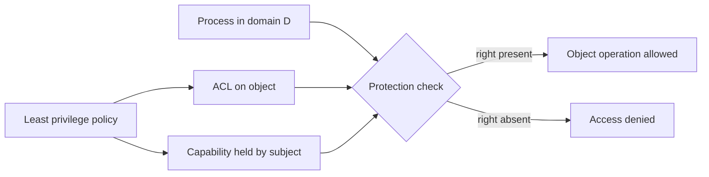

# Protection and Access Control

Protection is the internal control problem: once users, processes, files, memory, and devices exist, who may do what to which resource? It is narrower than security but foundational for it. A system cannot defend against external attack if it cannot reliably enforce internal access rules among its own subjects and objects.


*Figure: Linux provides the concrete kernel case study for many OS abstractions. Image: [Wikimedia Commons](https://commons.wikimedia.org/wiki/File:Tux.svg), Larry Ewing, Simon Budig, and Garrett LeSage, CC0/attribution permission.*

The textbook distinguishes protection from security. Protection provides mechanisms for specifying and enforcing access to resources. Security includes broader threats such as authentication failure, malware, network attacks, and cryptography. This page focuses on domains, access matrices, access-control lists, capability lists, revocation, and language-based protection.

## Definitions

A **protection domain** is a set of objects and the operations allowed on each object. A process executes within a domain, and the domain determines what the process can access. Domains may correspond to users, processes, procedures, roles, or protection rings.

An **object** is a resource that needs protection: file, memory segment, CPU, printer, socket, semaphore, or another process. A **right** is permission to perform an operation, such as read, write, execute, append, delete, lock, or signal.

The **principle of least privilege** says each process, user, or component should operate with only the privileges needed for its current task. This reduces damage from bugs and compromises.

An **access matrix** is a conceptual table with domains as rows and objects as columns. Each entry lists rights. The matrix is a model; real systems usually implement it sparsely.

An **access-control list** (ACL) stores, with each object, the domains or users and their allowed rights. A **capability list** stores, with each domain or subject, protected tokens that name objects and rights. ACLs answer "who can access this object?" Capabilities answer "what can this subject access?"

**Revocation** removes rights. It may be immediate or delayed, selective or general, partial or total, temporary or permanent.

**Language-based protection** uses programming-language and runtime features such as type safety, visibility, modules, memory safety, and managed execution to restrict access before or in addition to OS-level checks.

## Key results

The access matrix is a clean model because it separates subjects, objects, and rights:

| Domain / Object | File A | File B | Printer | Process P |
|---|---|---|---|---|
| User domain D1 | read, write | read | print | signal |
| User domain D2 | read | none | print | none |
| Backup domain D3 | read | read | none | none |

The table is too sparse to store literally on large systems, so implementations choose object-centered or subject-centered structures. ACLs are natural for files because administrators often ask who has access to a file. Capabilities are natural for delegation because possession of the capability authorizes use, provided capabilities cannot be forged.

Protection domains may change. A process may switch domains when executing a privileged program, entering a protected subsystem, or invoking a system call. UNIX set-user-ID programs are a classic example of controlled privilege change: execution of a file can temporarily grant the program the file owner's effective privileges. This is powerful and dangerous, so such programs must validate inputs carefully.

Revocation differs sharply between ACLs and capabilities. With an ACL, removing a user from the object's list is conceptually direct, though cached permissions may complicate enforcement. With capabilities, the system must find and invalidate outstanding capabilities, use indirection through revocable objects, or rely on expiration and reissue.

Protection rings implement a hardware-supported hierarchy of privilege. The kernel runs in a highly privileged ring or mode; applications run in a less privileged mode. System calls are controlled transitions. The exact ring model varies by architecture and OS, but the concept supports isolation.

Language-based protection can reduce the number of dangerous operations that reach the OS. For example, a memory-safe language can prevent arbitrary pointer arithmetic from corrupting another object in the same process. However, language protection relies on trusted compilers, runtimes, and escape-hatch controls.

The access matrix also explains delegation. If domain `D1` has a right that includes copy or owner authority, it may be able to grant a right to `D2`. That is useful for collaboration but dangerous without limits. Systems need rules about who can grant, copy, transfer, or revoke rights. Otherwise, temporary access can become permanent access through uncontrolled propagation.

Capabilities must be unforgeable. A plain integer object ID is not a capability if any process can guess or manufacture it. Real capability systems protect tokens through hardware tags, kernel-managed tables, cryptographic construction, or language/runtime restrictions. Once capabilities are protected, possession can be the authorization check, which makes delegation simple: pass the capability to the component that needs exactly that authority.

Protection also includes auditing and accountability. The OS may need to record failed access attempts, privilege changes, administrative actions, and use of sensitive objects. Logs do not replace enforcement, but they help detect misconfiguration and misuse. The design challenge is to log enough to reconstruct important events without exposing private data or creating an unmanageable volume of records.

Domain switching is especially important for controlled privilege. A process should not run with administrative rights for its entire lifetime simply because one operation requires them. Instead, systems provide narrow transitions: a system call enters kernel mode for a checked operation; a service may briefly assume a role; a privileged helper may perform one task and return a result. The smaller and shorter the privileged domain, the easier it is to audit.

Access control also has usability limits. If users cannot understand the policy, they will overgrant rights, reuse privileged accounts, or bypass the mechanism with copied data. Good protection design therefore needs sensible defaults, understandable group or role structure, and tools that show effective permissions. A technically expressive model can still fail if ordinary administration is error-prone.

Protection decisions are also time-dependent. A process may be allowed to open a file, then lose the permission later; the system must define whether the existing open handle remains valid. A capability may expire; an ACL may be edited; a role may be revoked after logout. Clear rules avoid surprising security gaps.

The safest systems document these lifetime rules because ambiguity usually becomes over-permissive behavior in real deployments.

Auditable, predictable rules are part of the protection mechanism, not merely documentation.

## Visual



The enforcement step must be unavoidable. Whether rights come from ACLs, capabilities, roles, or rings, the kernel or trusted runtime must mediate access.

## Worked example 1: reading an access matrix

Problem: A system has domains `D1`, `D2`, and `D3`; objects `F1`, `F2`, and `Printer`. The rights are:

| Domain | F1 | F2 | Printer |
|---|---|---|---|
| D1 | read, write | read | print |
| D2 | read | read, write | none |
| D3 | none | read | print |

Can a process in `D2` write `F1`, read `F2`, and print?

1. Locate row `D2`.
2. For object `F1`, the entry is `read`. It does not include `write`, so writing `F1` is denied.
3. For object `F2`, the entry is `read, write`. Reading `F2` is allowed.
4. For `Printer`, the entry is `none`. Printing is denied.
5. The allowed operation set for this process is exactly what the row grants unless it changes domain.

Checked answer: In domain `D2`, the process may read `F2`; it may not write `F1`; it may not print.

## Worked example 2: ACL versus capability choice

Problem: A shared project file should be readable by every member of a class but writable only by three teaching assistants. A temporary build worker should receive access to exactly one output directory and then lose that access after the build. Which protection style is natural for each?

1. The project file policy is object-centered. The administrator wants to inspect and edit the file's allowed readers and writers.
2. An ACL is natural: attach entries such as `class: read` and `ta-group: read, write` to the file.
3. The build worker policy is subject/session-centered. It needs a limited, delegable, temporary right to one directory.
4. A capability is natural if the system can issue an unforgeable token for that directory with expiration or revocation.
5. Consider revocation. The ACL file change is easy to audit at the object. The build capability should expire automatically or be invalidated through an indirection table.

Checked answer: Use an ACL-style representation for the shared class file and a capability-style delegation for the temporary build worker. Real systems often combine both patterns.

## Code

```python
access_matrix = {
    "D1": {"F1": {"read", "write"}, "F2": {"read"}, "Printer": {"print"}},
    "D2": {"F1": {"read"}, "F2": {"read", "write"}, "Printer": set()},
    "D3": {"F1": set(), "F2": {"read"}, "Printer": {"print"}},
}

def can(domain, operation, obj):
    rights = access_matrix.get(domain, {}).get(obj, set())
    return operation in rights

tests = [
    ("D2", "write", "F1"),
    ("D2", "read", "F2"),
    ("D2", "print", "Printer"),
]

for test in tests:
    print(test, can(*test))
```

This toy model stores the full access matrix directly. Real operating systems use sparse representations and protect the representation itself from user modification.

## Common pitfalls

- Treating protection and security as synonyms. Protection is about controlled internal access; security includes wider threats and defenses.
- Granting privileges for convenience and forgetting to remove them. Least privilege must be maintained over time.
- Assuming ACLs and capabilities are mutually exclusive. Practical systems often combine object-centered and subject-centered checks.
- Ignoring revocation. Delegating access is easy; taking it back safely is harder.
- Trusting set-user-ID or elevated programs without careful input validation. Privilege changes magnify bugs.
- Depending only on language protection. OS-level isolation is still needed for files, devices, processes, and untrusted code.

## Connections

- [Security](/cs/operating-systems/security)
- [OS Overview, Services, and Structures](/cs/operating-systems/os-overview-structures)
- [Processes](/cs/operating-systems/processes)
- [File-System Interface](/cs/operating-systems/file-system-interface)
- [I/O Systems](/cs/operating-systems/io-systems)
