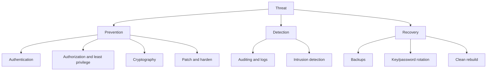

# Security

Security extends protection beyond internal access control into the environment where users, programs, networks, and attackers interact. A protection matrix is useless if an attacker steals credentials, installs a Trojan horse, exploits a buffer overflow, or tricks a user into running malicious code. Security therefore combines authentication, authorization, cryptography, auditing, defensive design, and operational discipline.


*Figure: Linux provides the concrete kernel case study for many OS abstractions. Image: [Wikimedia Commons](https://commons.wikimedia.org/wiki/File:Tux.svg), Larry Ewing, Simon Budig, and Garrett LeSage, CC0/attribution permission.*

The textbook's security chapter covers threats, program attacks, system and network attacks, cryptography, user authentication, defenses, firewalls, classifications, and a Windows example. This page emphasizes the conceptual mechanics: what can go wrong, what cryptography can and cannot provide, and how layered defenses reduce risk.

## Definitions

A **threat** is a potential security violation. An **attack** is an attempt to exploit a vulnerability. Common goals are disclosure, modification, destruction, denial of service, and unauthorized use.

**Confidentiality** means preventing unauthorized disclosure. **Integrity** means preventing unauthorized modification or detecting it. **Availability** means keeping services usable despite faults or attacks. **Authentication** verifies identity. **Authorization** determines permitted actions after identity or authority is established.

A **Trojan horse** is a program that appears useful but performs hidden malicious actions. A **trap door** or backdoor is a hidden access path. A **logic bomb** triggers malicious behavior under certain conditions. A **buffer overflow** writes beyond a buffer and may overwrite control data.

**Malware** includes viruses, worms, spyware, ransomware, and related malicious software. A **virus** attaches to a host program or document; a **worm** spreads independently across networks.

**Encryption** transforms plaintext into ciphertext using a key. **Symmetric encryption** uses the same secret key for encryption and decryption. **Asymmetric encryption** uses a public/private key pair. A **cryptographic hash** maps data to a fixed-size digest designed to resist preimage and collision attacks. A **message authentication code** (MAC) uses a secret key to verify integrity and authenticity. A **digital signature** uses public-key cryptography to provide integrity, authentication, and nonrepudiation properties.

A **firewall** filters traffic between security domains according to rules. It may operate at packet, stateful connection, application proxy, or host levels.

## Key results

Security is a chain. Strong encryption does not help if keys are stolen. Strong passwords do not help if malware runs with the user's privileges. Strong ACLs do not help if a privileged service has a remotely exploitable bug. Defense in depth exists because no single mechanism covers all failures.

Cryptographic tools provide different properties:

| Tool | Key type | Main property | Typical use |
|---|---|---|---|
| Symmetric encryption | Shared secret | Confidentiality | Bulk data encryption |
| Public-key encryption | Public/private pair | Confidentiality or key exchange | Sharing a session key |
| Cryptographic hash | No secret | Integrity fingerprint | File checksums, password hashing input |
| MAC | Shared secret | Integrity and authenticity | Network message protection |
| Digital signature | Private signing key, public verification key | Integrity and signer authentication | Software updates, certificates |

Authentication requires careful storage. Systems should not store plaintext passwords. Instead, they store salted, deliberately expensive password hashes. The salt prevents identical passwords from producing identical stored values and frustrates precomputed tables. The expensive hash slows offline guessing if the password database is stolen.

Program threats often exploit confused trust boundaries. A set-user-ID program, service daemon, browser helper, or driver may process untrusted input with elevated privileges. Secure design minimizes privileged code, validates input, checks bounds, separates parsing from authority, and drops privileges when possible.

Network threats include spoofing, replay, man-in-the-middle attacks, denial of service, port scanning, and worms. Cryptographic protocols help with confidentiality and authentication, while firewalls and intrusion detection reduce exposure and improve visibility. Availability remains difficult because attackers can consume bandwidth, CPU, memory, or application-level resources.

Auditing and logging do not prevent all attacks, but they help detection, forensics, and accountability. Logs must themselves be protected from tampering and excessive disclosure.

User authentication is stronger when it uses multiple factors from different categories: something the user knows, something the user has, and something the user is. Passwords alone are vulnerable to reuse, phishing, guessing, and database theft. Tokens and authenticator apps reduce some risks but introduce recovery and enrollment problems. Biometrics can improve convenience but are hard to rotate if compromised. The OS and surrounding services must therefore treat authentication as a lifecycle, not a single login check.

Security defenses should fail safely. If an authorization database cannot be read, the system should not silently allow access. If a cryptographic certificate cannot be validated, the connection should not proceed as trusted. If a privilege-dropping step fails, the service should stop rather than continue with excess authority. This design principle appears repeatedly in secure OS services because partial failure is common under attack.

Firewalls and network filters reduce reachable attack surface, but host security still matters. A service exposed only to an internal network can still be attacked by a compromised internal machine or malicious insider. Conversely, a well-hardened host still benefits from network filtering because fewer packets reach complex parsers. Defense in depth combines least privilege, patching, memory protection, authentication, cryptography, logging, backups, and network controls.

Backups are part of security because integrity and availability failures include accidental deletion, ransomware, and destructive attacks. A useful backup strategy has offline or immutable copies, tested restoration, and retention long enough to notice delayed corruption. RAID, snapshots, and replication can support availability, but they can also replicate mistakes quickly; they do not replace independent recovery copies.

Secure systems also need update mechanisms. Vulnerabilities are discovered after deployment, so the OS and applications need authenticated, rollback-resistant, and reliable update paths. The cryptographic signature example on this page is not just theory: without authenticated updates, an attacker can turn the maintenance channel into a software installation attack. Delayed patching leaves known vulnerabilities exposed, so update reliability is part of the defense.

Operational security is the practice of keeping those mechanisms working after the system leaves the classroom example.

People, procedures, and recovery drills matter because technical controls eventually meet operational mistakes.

## Visual



Security is not a single switch. Prevention, detection, and recovery are all required because some attacks will bypass or outlast preventive controls.

## Worked example 1: choosing a cryptographic primitive

Problem: A software vendor wants users to verify that an update file really came from the vendor and was not modified. The file is public, so confidentiality is not required. Which cryptographic tool fits?

1. Identify the desired properties: origin authentication and integrity.
2. Symmetric encryption is not a good fit. If every user had the same secret key, any user could forge an update.
3. A plain hash is insufficient by itself. An attacker who changes the file can publish a matching new hash unless the hash value is authenticated through a trusted channel.
4. A MAC requires a shared secret. Distributing the MAC key to all users would let any user forge updates.
5. A digital signature fits. The vendor signs the update hash with its private key. Users verify with the vendor's public key.
6. The public key must be obtained through a trusted certificate or distribution channel; otherwise an attacker could substitute a different key.

Checked answer: Use a digital signature over the update or its cryptographic hash. It provides public verification without giving users the ability to sign forged updates.

## Worked example 2: salted password hashing

Problem: Two users choose the same password, `correct horse battery staple`. Why should the system use unique salts, and what does verification look like?

1. Without salts, both users would have the same stored password hash:

$$
H(password)
$$

2. An attacker who sees matching hashes learns that the users share a password. The attacker can also use precomputed hash tables.
3. With salts, user A stores:

$$
salt_A,\ H(salt_A \| password)
$$

4. User B stores:

$$
salt_B,\ H(salt_B \| password)
$$

5. Since $salt_A \ne salt_B$, the stored hashes differ even for the same password.
6. During login, the system retrieves the user's salt, hashes the submitted password with that salt, and compares the result with the stored value using a timing-safe comparison.
7. The hash function for passwords should be intentionally slow and memory-hard when possible, not a fast general-purpose checksum.

Checked answer: Unique salts prevent equal passwords from producing equal stored hashes and reduce the value of precomputed tables. Verification recomputes the salted hash for the submitted password.

## Code

```python
import hashlib
import hmac
import os

def hash_password(password):
    salt = os.urandom(16)
    digest = hashlib.pbkdf2_hmac(
        "sha256",
        password.encode("utf-8"),
        salt,
        200_000,
    )
    return salt, digest

def verify_password(password, salt, expected_digest):
    actual = hashlib.pbkdf2_hmac(
        "sha256",
        password.encode("utf-8"),
        salt,
        200_000,
    )
    return hmac.compare_digest(actual, expected_digest)

salt, digest = hash_password("correct horse battery staple")
print(verify_password("correct horse battery staple", salt, digest))
```

This demonstrates salted password hashing with PBKDF2. Real deployments must also handle password policy, rate limiting, account recovery, secret rotation, and secure storage.

## Common pitfalls

- Equating encryption with security. Encryption protects confidentiality only when keys, endpoints, and protocols are secure.
- Storing plaintext passwords or fast unsalted hashes. A stolen password database then becomes far easier to exploit.
- Running large parsers or network services with unnecessary privileges. Bugs become more damaging when privileges are broad.
- Trusting file extensions or user-supplied metadata. Security decisions need authenticated identity and validated content.
- Ignoring availability. A system that preserves secrecy but can be trivially knocked offline still has a security failure.
- Treating firewalls as complete protection. They reduce exposure but do not fix vulnerable services or malicious insiders.

## Connections

- [Protection and Access Control](/cs/operating-systems/protection-access-control)
- [File-System Interface](/cs/operating-systems/file-system-interface)
- [I/O Systems](/cs/operating-systems/io-systems)
- [Mass Storage and RAID](/cs/operating-systems/mass-storage-raid)
- [Linux Case Study](/cs/operating-systems/linux-case-study)
