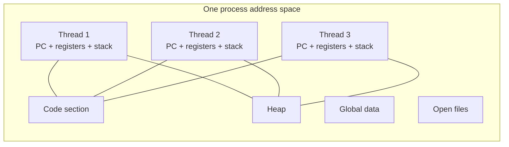

# Threads

Threads refine the process model. A process owns an address space and resources; a thread is a path of execution inside that process. A single-threaded process has one program counter, one register set, and one stack. A multithreaded process has several of these execution contexts sharing the same code, data, heap, and open files. That sharing is exactly why threads are useful and exactly why they can be dangerous.

The textbook places threads after processes because the motivation is clearer once the cost of process creation, context switching, and IPC is visible. Threads make servers more responsive, allow one activity to block while another continues, exploit multiple cores, and express parallel structure within an application. They also introduce races, deadlocks, visibility bugs, and scheduling interactions that show up throughout synchronization and CPU scheduling.

## Definitions

A **thread** is a basic unit of CPU utilization. It contains a thread ID, program counter, register set, and stack. Threads in the same process share the process's code section, data section, heap, and operating-system resources such as open files.

A **single-threaded process** has one thread of control. A **multithreaded process** has two or more threads that may run concurrently. On a multicore system, multiple threads from the same process may run in parallel on different cores.

**User threads** are managed by a user-level thread library. Operations such as creating, scheduling, and synchronizing user threads may occur without kernel involvement. **Kernel threads** are known and scheduled by the kernel. If one kernel-level thread blocks, other threads in the same process can still run if they are ready.

The standard mapping models are **many-to-one**, **one-to-one**, and **many-to-many**. Many-to-one maps many user threads to one kernel thread; one blocking system call can block the whole process. One-to-one maps each user thread to a kernel thread; it supports real parallelism but can create many kernel objects. Many-to-many multiplexes user threads over a smaller or equal number of kernel threads.

Thread libraries expose creation and synchronization APIs. The textbook discusses POSIX Pthreads, Windows threads, and Java threads. It also discusses **implicit threading** approaches such as thread pools, OpenMP, and Grand Central Dispatch, where programmers describe tasks or parallel regions and a runtime manages worker threads.

A **thread pool** creates a bounded set of worker threads in advance. Requests are placed on a queue, and workers repeatedly remove and execute them. This avoids unbounded thread creation and amortizes creation cost.

## Key results

Threads provide four practical benefits: responsiveness, resource sharing, economy, and scalability. A graphical program can keep the interface responsive while background work continues. A web server can serve many requests without creating a full process per request. Threads are cheaper to create than processes because they share an address space. On multicore machines, CPU-bound work can run faster if it is divided into independent parts.

Amdahl's law limits parallel speedup:

$$
\mathrm{speedup} \le \frac{1}{S + \frac{1-S}{N}}
$$

Here $S$ is the serial fraction of the computation and $N$ is the number of processing cores. The result is not merely mathematical; it is a warning about design. Adding threads helps only when enough work is parallel, communication overhead is controlled, and synchronization does not serialize the program.

Threading models differ in their failure modes:

| Model | Parallel on multicore? | Blocking system call effect | Main advantage | Main risk |
|---|---:|---|---|---|
| Many-to-one | No | Can block all user threads | Very cheap user-level management | Poor kernel integration |
| One-to-one | Yes | Blocks only that kernel thread | Simple and widely used | Too many threads can strain the system |
| Many-to-many | Yes | Runtime can schedule around blocking | Flexible mapping | More complex runtime and kernel support |
| Thread pool | Yes | Worker-specific | Bounded resource usage | Queue delays under overload |

Thread cancellation can be asynchronous or deferred. Asynchronous cancellation stops a target thread immediately, which is risky if it holds locks or owns partially updated data. Deferred cancellation lets the target check at safe points and clean up. Most robust designs prefer cooperative cancellation because it preserves invariants.

Signals and thread-local storage show another subtlety. A signal sent to a process must be delivered to some appropriate thread, and the answer depends on signal masks and OS rules. Thread-local storage gives each thread its own instance of data that would otherwise be shared, reducing accidental interference while keeping the process-level sharing model.

Implicit threading raises the abstraction level. With OpenMP, a programmer marks a loop or region as parallel and the runtime creates or reuses worker threads. With Grand Central Dispatch, work is expressed as blocks submitted to queues. With thread pools, a server submits tasks to a bounded worker set. These models do not remove synchronization problems, but they reduce direct thread-lifecycle management and let a runtime adapt worker counts to the machine.

Threading also interacts with blocking I/O and libraries. A many-to-one user-thread package can be efficient until one user thread makes a blocking system call; then the kernel blocks the only underlying kernel thread and all user threads stop. One-to-one threading avoids that problem, but very large thread counts can increase memory consumption because every thread needs a stack and kernel scheduling state. Practical systems often combine nonblocking I/O, pools, and asynchronous completion to avoid both extremes.

Thread safety must be specified at API boundaries. A function may be reentrant, thread-safe with internal locks, thread-compatible only when callers serialize access, or unsafe for concurrent use. Operating-system libraries document these distinctions because hidden shared state, static buffers, environment variables, signal handlers, and cancellation points can make code unsafe even when it has no obvious global variable in the caller's source.

Scheduling scope is another thread issue. Under process-contention scope, a user-level library schedules user threads against other threads in the same process. Under system-contention scope, kernel threads compete system-wide for CPUs. POSIX systems commonly expose system-contention behavior for ordinary kernel-scheduled threads, which is why thread priority and policy can affect the whole machine rather than only one process.

## Visual



The shared address space is the reason threads communicate cheaply. It is also why synchronization is necessary when two threads access the same mutable data.

## Worked example 1: applying Amdahl's law

Problem: A data-processing job spends 20 percent of its time in serial setup and output. The remaining 80 percent can be parallelized perfectly. What is the best possible speedup on 4 cores and 16 cores?

1. Identify the serial fraction:

$$
S = 0.20
$$

2. For 4 cores:

$$
\begin{aligned}
\mathrm{speedup}_4
  &= \frac{1}{0.20 + \frac{0.80}{4}} \\
  &= \frac{1}{0.20 + 0.20} \\
  &= \frac{1}{0.40} \\
  &= 2.5
\end{aligned}
$$

3. For 16 cores:

$$
\begin{aligned}
\mathrm{speedup}_{16}
  &= \frac{1}{0.20 + \frac{0.80}{16}} \\
  &= \frac{1}{0.20 + 0.05} \\
  &= \frac{1}{0.25} \\
  &= 4
\end{aligned}
$$

4. Interpret the result. Quadrupling the cores from 4 to 16 increases the ideal speedup from 2.5 to only 4 because the 20 percent serial part is now dominant.

Checked answer: The maximum speedup is 2.5 on 4 cores and 4 on 16 cores. More cores cannot overcome a fixed serial fraction.

## Worked example 2: sizing a thread pool

Problem: A server receives CPU-light requests that spend about 10 ms computing and 40 ms waiting for disk or network I/O. On a 4-core machine, estimate a reasonable starting worker count.

1. Compute the waiting-to-compute ratio:

$$
\frac{40}{10} = 4
$$

2. A common sizing intuition for I/O-heavy work is:

$$
\mathrm{threads} \approx \mathrm{cores} \times (1 + \frac{\mathrm{wait}}{\mathrm{compute}})
$$

3. Substitute the values:

$$
\begin{aligned}
\mathrm{threads}
  &\approx 4 \times (1 + 4) \\
  &= 4 \times 5 \\
  &= 20
\end{aligned}
$$

4. Check the assumption. The estimate assumes requests are independent and the I/O subsystem can handle the concurrency. If the disk saturates at 8 outstanding requests, 20 workers may increase latency without improving throughput.
5. A production system would measure queue length, CPU utilization, I/O wait, and tail latency, then tune the pool.

Checked answer: About 20 workers is a reasonable first estimate, not a proof. The correct pool size is empirical because device saturation and request variance matter.

## Code

```c
#include <pthread.h>
#include <stdio.h>
#include <stdlib.h>

typedef struct {
    long start;
    long end;
    long result;
} Task;

void *sum_range(void *arg) {
    Task *task = (Task *)arg;
    long total = 0;

    for (long i = task->start; i <= task->end; ++i) {
        total += i;
    }

    task->result = total;
    return NULL;
}

int main(void) {
    pthread_t t1, t2;
    Task a = {1, 500000, 0};
    Task b = {500001, 1000000, 0};

    pthread_create(&t1, NULL, sum_range, &a);
    pthread_create(&t2, NULL, sum_range, &b);
    pthread_join(t1, NULL);
    pthread_join(t2, NULL);

    printf("sum = %ld\n", a.result + b.result);
    return 0;
}
```

The two Pthreads share the same process but keep separate stacks. Each thread writes only its own `Task.result`, so this example avoids a data race without using a mutex.

## Common pitfalls

- Assuming threads always make a program faster. Serial sections, lock contention, cache effects, and I/O bottlenecks can erase speedup.
- Sharing mutable data without a synchronization plan. Threads make communication easy, not automatically correct.
- Creating one thread per request without a bound. Under load, the system may spend more time scheduling than doing useful work.
- Cancelling threads while they hold locks. Deferred or cooperative cancellation is usually safer.
- Confusing concurrency with parallelism. One CPU can run concurrent threads by interleaving them; parallel execution requires multiple cores.
- Ignoring library and runtime rules. POSIX, Windows, and Java threading APIs differ in creation, cancellation, signals, priorities, and memory visibility.

## Connections

- [Processes](/cs/operating-systems/processes)
- [CPU Scheduling](/cs/operating-systems/cpu-scheduling)
- [Process Synchronization](/cs/operating-systems/process-synchronization)
- [Deadlocks](/cs/operating-systems/deadlocks)
- [Linux Case Study](/cs/operating-systems/linux-case-study)
