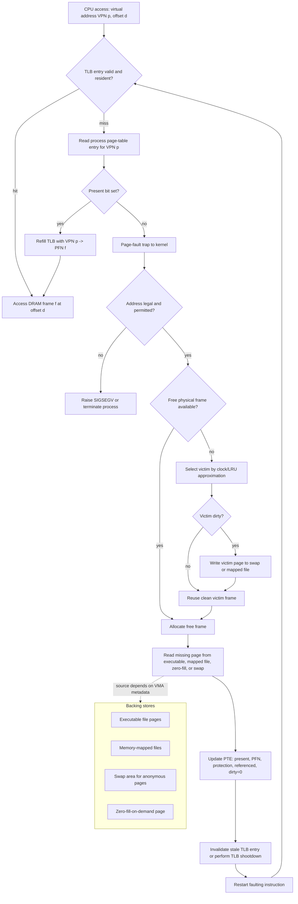

# Virtual Memory

Virtual memory lets a process execute even when not all of its pages are in physical memory. This is one of the most important abstractions in modern operating systems because it separates a program's logical address space from the size and placement of RAM. Programs can be larger than physical memory, processes can share pages, process creation can be faster, and the OS can keep more runnable work resident.


*Figure: The Linux kernel map shows how OS services become interacting subsystems. Image: [Wikimedia Commons](https://commons.wikimedia.org/wiki/File:Linux_kernel_map.png), Conan at English Wikipedia, CC BY 3.0.*

The benefit has a cost: a missing page causes a page fault, and servicing a page fault may require disk or SSD I/O, page-table changes, and replacement of another page. The central questions are therefore when to bring pages in, which page to evict, how many frames each process should receive, and how to detect when the system is spending more time paging than executing.

## Definitions

**Virtual memory** is the technique of executing processes whose complete address spaces are not resident in physical memory. The logical address space may be much larger than RAM.

**Demand paging** loads a page only when it is referenced. A page-table entry includes a valid-invalid bit or equivalent state. If a process references a page that is not resident, the hardware traps to the OS with a **page fault**.

A **page fault** is not automatically an error. If the address is legal but the page is not in memory, the OS locates the page on backing store, finds a free frame or evicts a victim, reads the page into memory, updates the page table, and restarts the faulting instruction. If the address is illegal, the OS terminates or signals the process.

**Copy-on-write** lets parent and child processes share pages after process creation. Shared pages are marked read-only. When either process writes a shared page, the OS copies that page and gives the writer a private copy.

**Page replacement** chooses a victim frame when no free frame is available. Algorithms include FIFO, optimal, least-recently-used (LRU), second-chance/clock, counting-based algorithms, and approximations based on reference bits.

**Thrashing** occurs when the system spends excessive time paging because the active working sets of processes exceed available frames. The **working set** of a process is the set of pages it has referenced in a recent window.

## Key results

The effective access time of demand paging is dominated by the page-fault rate. If memory access takes $ma$, page-fault service time is $pft$, and page-fault probability is $p$, then:

$$
EAT = (1-p)ma + p(pft)
$$

Because page-fault service time can be millions of times slower than memory access, even a tiny fault rate can be expensive. This is why locality matters. Programs usually reference a small active set for a while; virtual memory performs well when that active set fits in RAM.

The optimal replacement algorithm evicts the page whose next use is farthest in the future. It gives the theoretical minimum number of page faults for a fixed reference string and frame count, but it cannot be implemented directly because the future is unknown. It is still useful as a benchmark.

FIFO is easy but can suffer Belady's anomaly: increasing the number of frames can increase the number of page faults for some reference strings. Stack algorithms such as LRU do not suffer this anomaly because the set of pages held with $n$ frames is always a subset of the pages held with $n+1$ frames.

LRU approximates optimal by assuming recent past predicts near future. Exact LRU is expensive, so hardware reference bits and clock algorithms approximate it. The second-chance algorithm inspects pages in circular order. If a page's reference bit is set, the algorithm clears the bit and skips it; if clear, the page is a replacement candidate.

Frame allocation can be equal, proportional, priority-based, local, or global. Local replacement makes a process replace only its own pages, isolating processes but possibly wasting memory. Global replacement lets a process take frames from others, improving utilization but increasing interference.

Memory-mapped files extend virtual memory into the file-system interface. Instead of explicitly calling `read()` and `write()`, a process maps a file into its address space and then uses ordinary loads and stores. The page-fault handler brings file-backed pages into memory on demand, and dirty pages can later be written back. This mechanism supports shared libraries, fast file access patterns, and shared memory between processes, but it also requires clear rules for synchronization, truncation, and durability.

Kernel memory allocation has different constraints from user memory. The kernel sometimes needs physically contiguous memory for DMA, cache-aligned objects for performance, or allocations that cannot sleep because they occur in interrupt context. Slab-style allocators keep caches of frequently used kernel objects, reducing allocation overhead and fragmentation. The textbook mentions Linux SLAB-family allocators as examples of memory management specialized for kernel data structures rather than user pages.

Thrashing control often requires reducing the degree of multiprogramming. If every process's working set is larger than its allocated frames, the page replacement algorithm may evict pages that will be needed almost immediately. CPU utilization can fall because processes are mostly waiting for paging I/O. The counterintuitive fix is sometimes to suspend or swap out a process so the remaining active processes have enough frames to run with locality.

Page-fault handling must also be restartable. The fault may occur halfway through an instruction that reads or writes memory. After the OS services a legal fault, the CPU must retry the instruction as if the memory had been resident all along. This requirement affects instruction-set architecture, kernel trap handling, and side effects. If an instruction cannot be safely restarted, demand paging becomes much harder to implement.

Replacement policy also interacts with dirty pages. Evicting a clean page is cheap because the copy on disk or in the executable file is already valid. Evicting a dirty anonymous page requires writing it to swap; evicting a dirty file-backed page may require write-back to the file. Many page replacement systems prefer clean victims when possible or start background write-back so dirty pages become clean before memory pressure is severe.

## Visual



This page-fault diagram expands the slow path behind demand paging. A TLB miss can still be cheap if the page-table entry is present, but a nonresident page transfers control to the kernel, may evict a dirty victim, reads from the appropriate backing store, updates the PTE, and restarts the original instruction. The labeled backing-store branch explains why executable pages, mapped files, anonymous zero pages, and swapped pages all use the same fault machinery but different data sources.

| Algorithm | Uses future? | Easy to implement? | Typical role |
|---|---:|---:|---|
| Optimal | Yes | No | Benchmark for comparisons |
| FIFO | No | Yes | Simple baseline |
| LRU | Past recency | Exact version costly | Strong conceptual policy |
| Second chance / clock | Reference bit approximation | Yes | Practical LRU approximation |
| Counting | Reference counts | Varies | Specialized policies |

## Worked example 1: FIFO page replacement

Problem: Use FIFO with 3 frames on the reference string `7, 0, 1, 2, 0, 3, 0, 4`. Count page faults.

1. Start with empty frames: `[-, -, -]`.
2. Reference 7: fault, load 7. Frames `[7, -, -]`. Faults = 1.
3. Reference 0: fault, load 0. Frames `[7, 0, -]`. Faults = 2.
4. Reference 1: fault, load 1. Frames `[7, 0, 1]`. Faults = 3.
5. Reference 2: fault. FIFO evicts 7, the oldest page. Frames `[2, 0, 1]`. Faults = 4.
6. Reference 0: hit. Frames unchanged. Faults = 4.
7. Reference 3: fault. FIFO evicts 0, because it is now the oldest loaded page among current frames. Frames `[2, 3, 1]`. Faults = 5.
8. Reference 0: fault. FIFO evicts 1. Frames `[2, 3, 0]`. Faults = 6.
9. Reference 4: fault. FIFO evicts 2. Frames `[4, 3, 0]`. Faults = 7.

Checked answer: FIFO produces 7 page faults. Notice that page 0 was evicted even though it had been used recently; FIFO does not consider recency.

## Worked example 2: effective access time with page faults

Problem: Memory access time is 100 ns. Page-fault service time is 8 ms. The page-fault rate is 1 fault per 100,000 memory accesses. Compute effective access time.

1. Convert page-fault rate:

$$
p = \frac{1}{100000} = 0.00001
$$

2. Convert page-fault service time to nanoseconds:

$$
8\ \mathrm{ms} = 8{,}000{,}000\ \mathrm{ns}
$$

3. Apply the formula:

$$
\begin{aligned}
EAT
  &= (1-p)100 + p(8{,}000{,}000) \\
  &= 0.99999(100) + 0.00001(8{,}000{,}000) \\
  &= 99.999 + 80 \\
  &= 179.999\ \mathrm{ns}
\end{aligned}
$$

4. Interpret the result. A very small fault rate nearly doubles the effective access time.

Checked answer: Effective access time is about 180 ns. Demand paging performs well only when page faults are rare.

## Code

```python
from collections import deque

def fifo_faults(reference_string, frame_count):
    frames = set()
    order = deque()
    faults = 0

    for page in reference_string:
        if page in frames:
            continue

        faults += 1
        if len(frames) == frame_count:
            victim = order.popleft()
            frames.remove(victim)

        frames.add(page)
        order.append(page)

    return faults

refs = [7, 0, 1, 2, 0, 3, 0, 4]
print(fifo_faults(refs, frame_count=3))
```

This FIFO simulation is intentionally small. More realistic simulations track dirty bits, reference bits, process ownership, and backing-store operations.

## Common pitfalls

- Treating every page fault as a program bug. Legal demand-paged references fault normally when the page is absent.
- Ignoring the cost gap between memory and storage. A tiny fault rate can dominate effective access time.
- Assuming FIFO is "fair" because it is simple. FIFO can evict heavily used pages and can show Belady's anomaly.
- Confusing local and global replacement. They have different isolation and throughput behavior.
- Forgetting dirty pages. Evicting a modified page may require a write before the replacement frame is usable.
- Adding more processes during thrashing. If total working sets already exceed memory, more multiprogramming can reduce CPU utilization.

## Connections

- [Main Memory](/cs/operating-systems/main-memory)
- [CPU Scheduling](/cs/operating-systems/cpu-scheduling)
- [Mass Storage and RAID](/cs/operating-systems/mass-storage-raid)
- [File-System Implementation](/cs/operating-systems/file-system-implementation)
- [Linux Case Study](/cs/operating-systems/linux-case-study)
