# Virtualization


*Figure: Docker is the canonical OS-level virtualization runtime, contrasted in this chapter with full system VMs such as KVM, Xen, and VMware ESXi. Image: [Wikimedia Commons](https://commons.wikimedia.org/wiki/File:Docker_(container_engine)_logo.svg), Docker, Inc., Apache 2.0.*

Virtualization inserts a controlled execution layer beneath, beside, or inside an operating system so that software sees a machine different from the one that physically exists. At operating-system scale, the usual goal is to let several guest systems share one host while preserving the illusion that each guest owns its CPUs, memory, devices, clocks, and interrupts. That illusion supports consolidation, cloud multi-tenancy, migration, testing, and legacy compatibility.

Smith and Nair present virtual machines as a family of interface-preserving mechanisms, not as one product category [1]. This page focuses on the virtualization layer beneath the OS: system virtual machines, CPU virtualization, memory virtualization, I/O virtualization, containers as a lighter OS-level sibling, and modern cloud variants such as microVMs and confidential VMs. It connects naturally to [virtual memory](/cs/operating-systems/virtual-memory), [I/O systems](/cs/operating-systems/io-systems), [protection](/cs/operating-systems/protection-access-control), and the [Linux case study](/cs/operating-systems/linux-case-study).

## Definitions

A **virtual machine** is an execution environment whose visible interface is implemented by another layer. The guest sees a virtual interface; the host supplies real resources. A useful VM preserves enough behavior that ordinary software runs with little awareness of the layer beneath it [1].

A **process virtual machine** supports one process or application. The JVM and .NET CLR are standard examples: application code targets bytecode or an intermediate language, and a runtime maps that code to the host operating system and hardware.

A **system virtual machine** supports a complete guest operating system and its applications. VMware, KVM, Xen, Hyper-V, and ESXi provide system VMs. They must virtualize privileged CPU state, memory, interrupts, timers, storage, network adapters, and boot-time platform details [1].

The **host** is the real platform providing resources. The **guest** is the OS or program running inside the virtual environment. The **virtual machine monitor** or **hypervisor** is the layer that creates and controls VMs. Smith and Nair use VMM for the classic monitor; modern systems often say hypervisor [1].

A **Type 1 hypervisor** runs directly on hardware. Xen, ESXi, Hyper-V, and many KVM deployments fit this category conceptually, although KVM is implemented as Linux kernel virtualization support. A **Type 2 hypervisor** runs on a host OS; VMware Workstation, VirtualBox, and many QEMU configurations are examples. Real products often mix kernel drivers, user-space device models, and host services.

**Full virtualization** presents the hardware interface an unmodified guest OS expects. **Paravirtualization** changes the interface so the guest cooperates through hypercalls or paravirtual drivers. Xen originally made this tradeoff explicit for x86 [4]. **Hardware-assisted virtualization** adds CPU and chipset support, such as Intel VT-x, AMD-V, Intel EPT, AMD NPT, Intel VT-d, and AMD-Vi, so a VMM can run unmodified guests with fewer software tricks.

Popek and Goldberg define three requirements for a virtual machine monitor: **equivalence**, meaning programs behave as they would on the real machine except for timing and resource availability; **resource control**, meaning the VMM remains in ultimate control of resources; and **efficiency**, meaning harmless instructions run directly on hardware [2]. Their famous sufficient condition is that every sensitive instruction must be privileged, so it traps when executed without enough privilege [2].

A **privileged instruction** traps outside privileged mode. A **sensitive instruction** either changes resource configuration or reveals behavior that depends on resource configuration. An ISA is classically easy to virtualize when sensitive instructions are a subset of privileged instructions. Pre-VT-x x86 violated this rule: Robin and Irvine identified 17 sensitive but non-privileged IA-32 instructions, which forced VMware and others toward binary translation or paravirtualization [1], [5].

**Trap and emulate** runs guest code directly until a privileged operation traps, then lets the VMM emulate that operation on virtual state and resume. **Binary translation** rewrites problematic guest code blocks before execution. VMware used it to patch sensitive x86 sequences while ordinary instructions ran quickly [5]. **Hypercalls** are explicit guest calls into the hypervisor.

**VMX root operation** and **VMX non-root operation** are Intel VT-x modes. The hypervisor runs in root operation; guests run in non-root operation even when they believe they are in ring 0. **VMENTRY** starts guest execution, **VMEXIT** returns to the hypervisor, and the **VMCS** stores guest state, host state, controls, and exit information [1].

**Nested virtualization** runs a hypervisor inside a VM. The outer hypervisor virtualizes the virtualization controls themselves, so the inner hypervisor can create guests. This is useful for cloud development, CI, security labs, and teaching, but it adds exits and translation layers.

**Guest virtual address**, **guest physical address**, and **host physical address** name the three memory levels in a modern VM. Guest page tables translate guest virtual to guest physical addresses; the hypervisor translates guest physical to host physical addresses. Legacy systems used **shadow page tables** maintained by the VMM. Modern processors use Intel **extended page tables** or AMD **nested page tables** to compose both translations in hardware.

**Memory ballooning** uses a guest driver to pin pages and return the backing host memory to the hypervisor. **Page sharing**, such as VMware Transparent Page Sharing or Linux KSM, deduplicates identical pages. **Compression** keeps cold pages in compressed RAM before swap. These mechanisms improve density but affect security, predictability, and CPU cost.

An **IOMMU** virtualizes DMA. Intel VT-d and AMD-Vi translate device DMA addresses and restrict devices to assigned memory regions. DMA and interrupt remapping make PCI passthrough and SR-IOV safe enough for production. Without an IOMMU, a passed-through device could overwrite arbitrary memory.

**Containers** are not full system VMs. Linux containers use namespaces, cgroups, capabilities, seccomp, and LSMs such as AppArmor or SELinux to isolate processes that share the host kernel. Docker, containerd, runc, CRI-O, and Kubernetes build packaging and orchestration around this model. LXC and OpenVZ are important ancestors.

## Key results

The first key result is Popek-Goldberg virtualizability. If every sensitive instruction traps when executed outside privileged mode, a VMM can run all innocuous instructions natively and emulate only the sensitive ones [2]. This gives the classic architecture:

$$
\text{sensitive instructions} \subseteq \text{privileged instructions}
$$

When the subset condition fails, a VMM can still exist, but the efficiency proof no longer follows. The VMM must find problematic instructions by interpretation, patching, dynamic binary translation, paravirtualization, or hardware assists. Pre-VT-x x86 shaped early PC virtualization because instructions such as `popf` could reveal or alter interrupt state without trapping in the way a transparent VMM needed [1], [5].

CPU virtualization is a controlled state-machine loop. Guest code runs until an exit condition occurs: a privileged instruction, interrupt, VMM-relevant page fault, hypercall, I/O access, timer event, or nested virtualization event. The VMM saves guest state, updates virtual resources, possibly injects a virtual interrupt or exception, and re-enters the guest. Hardware support reduced scanning and patching by letting the VMM configure VMEXIT causes and by loading and saving state through structures such as the VMCS [1].

Memory virtualization moved from software-maintained shadow page tables to hardware nested paging. With shadow paging, the VMM tracks guest page-table writes and maintains guest-virtual to host-physical shadow mappings [1]. With EPT or NPT, the processor walks guest tables to get a guest physical address, then hypervisor tables to get a host physical address. Hardware may cache combined translations. Nested paging removes much shadow-maintenance overhead, but misses can still be expensive.

I/O virtualization is often hardest because devices have complex state, vendor-specific behavior, interrupts, DMA, firmware, queues, and timing assumptions [1]. Emulated devices maximize compatibility but are slow. Paravirtualized devices such as virtio and Xen split drivers expose virtualization-friendly queues. Direct assignment gives a guest near-native access through an IOMMU, but reduces sharing and complicates live migration. SR-IOV gives one PCIe device multiple virtual functions, each assignable to a guest.

Hypervisor architectures split responsibility differently. **KVM** turns Linux into a hypervisor through kernel support for vCPUs, memory slots, and exits, while QEMU often provides firmware and device models [6]. **Xen** separates privileged dom0 from unprivileged domU guests and originally relied heavily on paravirtualization [4]. **ESXi** is a bare-metal VMware hypervisor. **Hyper-V** uses a parent partition for many management and device responsibilities while child partitions run guests. Microhypervisors such as NOVA and seL4 minimize the trusted computing base; seL4 also shows how formal verification can enter this design space.

Containers trade a smaller boundary for speed and density. A containerized process is scheduled by the host kernel, uses the host kernel's VFS and memory machinery, and is constrained by namespace and cgroup views. This makes startup and image distribution efficient, but kernel bugs are shared across tenants. gVisor adds a user-space kernel between applications and the host kernel, while Kata-style systems combine container workflows with lightweight VMs.

Modern cloud platforms combine several layers. AWS Nitro moves much virtualization and I/O work into dedicated hardware and service cards. Firecracker provides minimal KVM-based microVMs for serverless and container workloads, emphasizing fast startup and a small device model [9]. Unikernels such as MirageOS and IncludeOS specialize one application into a small VM image [8]. Confidential computing adds memory encryption and attestation: AMD SEV, SEV-ES, SEV-SNP, Intel TDX, and Arm CCA reduce what a cloud operator or compromised hypervisor can observe. They do not remove all side channels, but they change the trust boundary.

Performance depends on exit frequency, TLB behavior, memory placement, and I/O path length. A VMEXIT can cost thousands of cycles, and the real cost includes cache pollution, TLB effects, lock contention, and scheduler delay. Tagged TLBs, address-space identifiers, VPIDs, PCIDs, and nested-page translation caches reduce flush overhead. Virtual CPUs introduce **steal time**, when a guest vCPU is runnable but the host schedules something else. NUMA awareness and vCPU pinning matter because guest-local memory may be remote on the host. Live migration usually uses **pre-copy**, repeatedly copying dirty pages while the VM runs, then pausing for final state. **Post-copy** resumes at the destination sooner and faults missing pages across the network, reducing duplicate copying but increasing failure risk. Containers use CRIU-style checkpoint and restore for process state.

## Visual

```mermaid
flowchart TB
  subgraph T1["Type 1 hypervisor stack"]
    T1Apps["Guest applications"] --> T1OS["Guest OS"]
    T1OS --> T1HV["Hypervisor"]
    T1HV --> T1HW["Hardware"]
  end

  subgraph T2["Type 2 hypervisor stack"]
    T2Apps["Guest applications"] --> T2OS["Guest OS"]
    T2OS --> T2VMM["VMM process and kernel driver"]
    T2VMM --> T2Host["Host OS"]
    T2Host --> T2HW["Hardware"]
  end

  subgraph CPU["VM entry and exit lifecycle"]
    HRoot["Hypervisor in root mode"] --> Entry["VMENTRY loads guest state"]
    Entry --> Guest["Guest runs in non-root mode"]
    Guest --> Exit{"Exit condition?"}
    Exit -->|privileged op| Handle["Emulate or reflect event"]
    Exit -->|timer or interrupt| Handle
    Exit -->|I/O or EPT fault| Handle
    Handle --> Entry
  end

  subgraph MEM["Nested paging"]
    GVA["Guest virtual address"] --> GPT["Guest page tables"]
    GPT --> GPA["Guest physical address"]
    GPA --> EPT["EPT or NPT"]
    EPT --> HPA["Host physical address"]
  end
```



| Technique | Guest changes | Main mechanism | Strength | Cost or risk |
|---|---:|---|---|---|
| Trap and emulate | No | Sensitive privileged instructions trap to VMM | Simple when ISA is virtualizable | Fails efficiently when sensitive instructions do not trap |
| Binary translation | No | Rewrite dangerous kernel code blocks | Enabled early x86 full virtualization | Complex, code-cache and correctness burden |
| Paravirtualization | Yes | Hypercalls and PV drivers | Lower overhead, simpler interface | Requires guest cooperation |
| Hardware assist | No | VT-x or AMD-V, EPT or NPT, IOMMU | Runs unmodified guests with less software patching | VMEXIT, nested page-walk, and device costs remain |
| Containers | App or packaging changes | Namespaces, cgroups, LSMs | Fast start, high density | Shared-kernel security boundary |

## Worked example 1: classifying x86-like instructions

Problem: Classify `mov rax, rbx`, `popf`, `mov cr3, rax`, and `hlt` as privileged, sensitive, innocuous, or non-virtualizable under the Popek-Goldberg lens. Assume a pre-VT-x x86-like machine where a guest kernel is deprivileged and the VMM relies on traps.

1. Recall the definitions.

   A privileged instruction traps when executed without sufficient privilege. A control-sensitive instruction changes resource configuration. A behavior-sensitive instruction produces results that depend on configuration. An innocuous instruction is neither control-sensitive nor behavior-sensitive. A problematic instruction for efficient virtualization is sensitive but not privileged.

2. Classify `mov rax, rbx`.

   This is an ordinary register-to-register move. It does not change CPU mode, interrupt state, page tables, device state, or resource allocation. Its result does not depend on whether the guest is virtualized, except through normal register values.

   Result: non-privileged, non-sensitive, innocuous. It should run directly.

3. Classify `popf`.

   `popf` restores flags from the stack. Some flags, especially interrupt-enable state, are sensitive because a guest kernel expects to control interrupt masking. On pre-VT-x x86, deprivileged execution could make some flag changes silently ineffective rather than trapping. The guest could then observe behavior different from real ring 0 unless the VMM detected and emulated it.

   Result: sensitive but not reliably privileged in the classical sense. It is non-virtualizable by pure trap and emulate, so VMware-style binary translation or hardware assist is needed [1], [5].

4. Classify `mov cr3, rax`.

   `cr3` points to the active page-table root on x86. Changing it changes virtual memory mappings and address translation state. That is control-sensitive. The instruction is privileged and traps outside kernel privilege.

   Result: privileged and sensitive. A VMM can trap it, update the guest's virtual `cr3`, switch or update shadow/EPT state, and resume.

5. Classify `hlt`.

   `hlt` halts the processor until an interrupt. In a VM, a guest cannot be allowed to halt the real CPU indefinitely; it should block only its virtual CPU while the hypervisor schedules another vCPU or host task. `hlt` is privileged on x86.

   Result: privileged and sensitive. The VMM intercepts it and treats the vCPU as idle until a virtual interrupt arrives.

6. Check the Popek-Goldberg condition.

   The set contains one innocuous instruction, two sensitive privileged instructions, and one sensitive non-privileged instruction. Since `popf` is sensitive but not privileged enough for transparent trap and emulate, the set violates:

$$
\text{sensitive} \subseteq \text{privileged}
$$

   Therefore a pure trap-and-emulate VMM is not efficient for this ISA fragment. A correct VMM must use binary translation, paravirtualization, or hardware-assisted controls.

## Worked example 2: nested paging address translation

Problem: A guest process accesses guest virtual address `0x1234`. Page size is 256 bytes, so the low 8 bits are the offset. The guest page table maps guest virtual page `0x12` to guest physical frame `0xA7`. The EPT maps guest physical frame `0xA7` to host physical frame `0x3C`. Translate the address and identify where faults could occur.

1. Split the guest virtual address.

   With 256-byte pages, offset bits are:

$$
0x1234 \bmod 0x100 = 0x34
$$

   The guest virtual page number is:

$$
\left\lfloor 0x1234 / 0x100 \right\rfloor = 0x12
$$

2. Walk the guest page table.

   The guest page table entry for virtual page `0x12` says:

$$
\text{GVP } 0x12 \mapsto \text{GPF } 0xA7
$$

   Therefore the guest physical address is frame `0xA7` plus offset `0x34`:

$$
0xA7 \cdot 0x100 + 0x34 = 0xA734
$$

3. Walk the nested page table.

   The EPT entry for guest physical frame `0xA7` says:

$$
\text{GPF } 0xA7 \mapsto \text{HPF } 0x3C
$$

   Therefore the host physical address is frame `0x3C` plus the same offset:

$$
0x3C \cdot 0x100 + 0x34 = 0x3C34
$$

4. Check possible faults.

   If the guest page-table entry for `0x12` is not present, the guest should receive a page fault and may page data in from its virtual disk. If the guest entry is present but the EPT entry for `0xA7` is missing or disallows the access, the VM exits to the hypervisor. The guest sees a fault only if the hypervisor injects one. If the hypervisor had swapped out the host page backing guest frame `0xA7`, it would page host memory back in and retry without telling the guest.

5. Final answer.

   The access to guest virtual address `0x1234` reaches host physical address `0x3C34`, assuming both guest and nested entries are valid and permit the requested read, write, or execute access.

## Code

```python
from collections import deque

PAGE_SIZE = 256

class ShadowPager:
    """Tiny model of guest page tables, host backing, and shadow mappings."""

    def __init__(self):
        self.guest_pt = {}      # guest virtual page -> guest physical frame
        self.host_map = {}      # guest physical frame -> host physical frame
        self.shadow_pt = {}     # guest virtual page -> host physical frame

    def map_guest(self, gvp, gpf):
        self.guest_pt[gvp] = gpf
        self._refresh_shadow(gvp)

    def map_host(self, gpf, hpf):
        self.host_map[gpf] = hpf
        for gvp, mapped_gpf in list(self.guest_pt.items()):
            if mapped_gpf == gpf:
                self._refresh_shadow(gvp)

    def _refresh_shadow(self, gvp):
        gpf = self.guest_pt.get(gvp)
        if gpf in self.host_map:
            self.shadow_pt[gvp] = self.host_map[gpf]
        else:
            self.shadow_pt.pop(gvp, None)

    def translate(self, guest_virtual_address):
        gvp, offset = divmod(guest_virtual_address, PAGE_SIZE)
        if gvp not in self.guest_pt:
            raise PageFault(f"guest page fault for GVP {gvp:#x}")
        if gvp not in self.shadow_pt:
            raise VmExit(f"hypervisor must resolve backing for GVP {gvp:#x}")
        return self.shadow_pt[gvp] * PAGE_SIZE + offset

class VirtQueue:
    """Minimal virtio-style descriptor ring."""

    def __init__(self, size):
        self.free = deque(range(size))
        self.desc = [None] * size
        self.avail = deque()
        self.used = deque()

    def submit(self, buffer):
        if not self.free:
            raise RuntimeError("virtqueue is full")
        index = self.free.popleft()
        self.desc[index] = buffer
        self.avail.append(index)
        return index

    def device_step(self):
        if not self.avail:
            return None
        index = self.avail.popleft()
        data = self.desc[index]
        result = data.upper()
        self.used.append((index, result))
        return index

    def complete(self):
        if not self.used:
            return None
        index, result = self.used.popleft()
        self.desc[index] = None
        self.free.append(index)
        return result

class PageFault(Exception):
    pass

class VmExit(Exception):
    pass

pager = ShadowPager()
pager.map_guest(0x12, 0xA7)
pager.map_host(0xA7, 0x3C)
print(hex(pager.translate(0x1234)))

queue = VirtQueue(4)
queue.submit(b"read block 7")
queue.device_step()
print(queue.complete())
```

## Common pitfalls

- Treating containers as small VMs. Containers share the host kernel; full VMs run separate guest kernels.
- Forgetting that guest physical memory is still virtual from the hypervisor's point of view.
- Assuming EPT or NPT removes all memory overhead. It removes most shadow-page-table maintenance, but nested page walks and TLB pressure remain.
- Thinking PCI passthrough is safe without an IOMMU. DMA remapping is the boundary that prevents assigned devices from writing arbitrary memory.
- Ignoring time. Clocks, timers, `rdtsc`, steal time, and live migration can make guest-visible time differ from hardware time.
- Assuming paravirtualization is obsolete. Virtio, Xen PV drivers, enlightened Hyper-V drivers, and clock paravirtualization remain important.
- Overcommitting memory without considering ballooning, swap storms, page sharing security, and workload phase changes.
- Pinning vCPUs blindly. Pinning can reduce jitter, but poor pinning can fight the host scheduler or cross NUMA boundaries.
- Treating live migration as just copying RAM. Dirty-page rate, device state, storage access, network identity, and failure handling determine whether migration is practical.
- Assuming confidential VMs hide everything. Memory encryption and attestation help, but side channels, device trust, firmware, and availability remain concerns.
- Confusing emulated devices with paravirtual devices. Emulated e1000 or IDE devices target compatibility; virtio devices target efficient queues.

## Connections

- [Virtual Memory](/cs/operating-systems/virtual-memory): nested paging extends ordinary page-table translation with a hypervisor-owned second translation.
- [Main Memory](/cs/operating-systems/main-memory): allocation, fragmentation, NUMA, and page replacement reappear as host-level VM placement problems.
- [Processes](/cs/operating-systems/processes): containers virtualize process views through namespaces rather than virtual hardware.
- [CPU Scheduling](/cs/operating-systems/cpu-scheduling): hypervisors schedule vCPUs and expose steal time when a guest is runnable but not running.
- [I/O Systems](/cs/operating-systems/io-systems): emulated devices, virtio queues, DMA, and interrupt remapping all depend on OS I/O concepts.
- [Protection and Access Control](/cs/operating-systems/protection-access-control): hypervisors rely on privilege separation, capabilities, and hardware isolation.
- [Security](/cs/operating-systems/security): VM escape, side channels, device assignment, and confidential computing are security topics as much as OS topics.
- [Linux Case Study](/cs/operating-systems/linux-case-study): KVM, cgroups, namespaces, KSM, seccomp, and LSMs are Linux implementations of the abstractions here.
- [Computer Architecture](/cs/computer-architecture/intro): VT-x, AMD-V, EPT, NPT, TLBs, rings, interrupts, and IOMMUs are architecture support for OS virtualization.
- [Distributed Systems](/cs/distributed-systems/intro): cloud scheduling, live migration, overlay networks, and fault isolation turn local virtualization into a distributed platform.

## References

[1] J. E. Smith and R. Nair, *Virtual Machines: Versatile Platforms for Systems and Processes*. San Francisco, CA, USA: Morgan Kaufmann, 2005.

[2] G. J. Popek and R. P. Goldberg, "Formal requirements for virtualizable third generation architectures," *Communications of the ACM*, vol. 17, no. 7, pp. 412-421, 1974.

[3] E. Bugnion, S. Devine, K. Govil, and M. Rosenblum, "Disco: Running commodity operating systems on scalable multiprocessors," *ACM Transactions on Computer Systems*, vol. 15, no. 4, pp. 412-447, 1997.

[4] P. Barham et al., "Xen and the art of virtualization," in *Proc. 19th ACM Symposium on Operating Systems Principles*, 2003, pp. 164-177.

[5] K. Adams and O. Agesen, "A comparison of software and hardware techniques for x86 virtualization," in *Proc. 12th International Conference on Architectural Support for Programming Languages and Operating Systems*, 2006, pp. 2-13.

[6] A. Kivity, Y. Kamay, D. Laor, U. Lublin, and A. Liguori, "KVM: The Linux virtual machine monitor," in *Proc. Linux Symposium*, 2007, pp. 225-230.

[7] A. Belay et al., "IX: A protected dataplane operating system for high throughput and low latency," *ACM Transactions on Computer Systems*, vol. 34, no. 4, 2017.

[8] F. Manco et al., "My VM is lighter and safer than your container," in *Proc. 26th ACM Symposium on Operating Systems Principles*, 2017, pp. 218-233.

[9] A. Agache et al., "Firecracker: Lightweight virtualization for serverless applications," in *Proc. 17th USENIX Symposium on Networked Systems Design and Implementation*, 2020, pp. 419-434.
