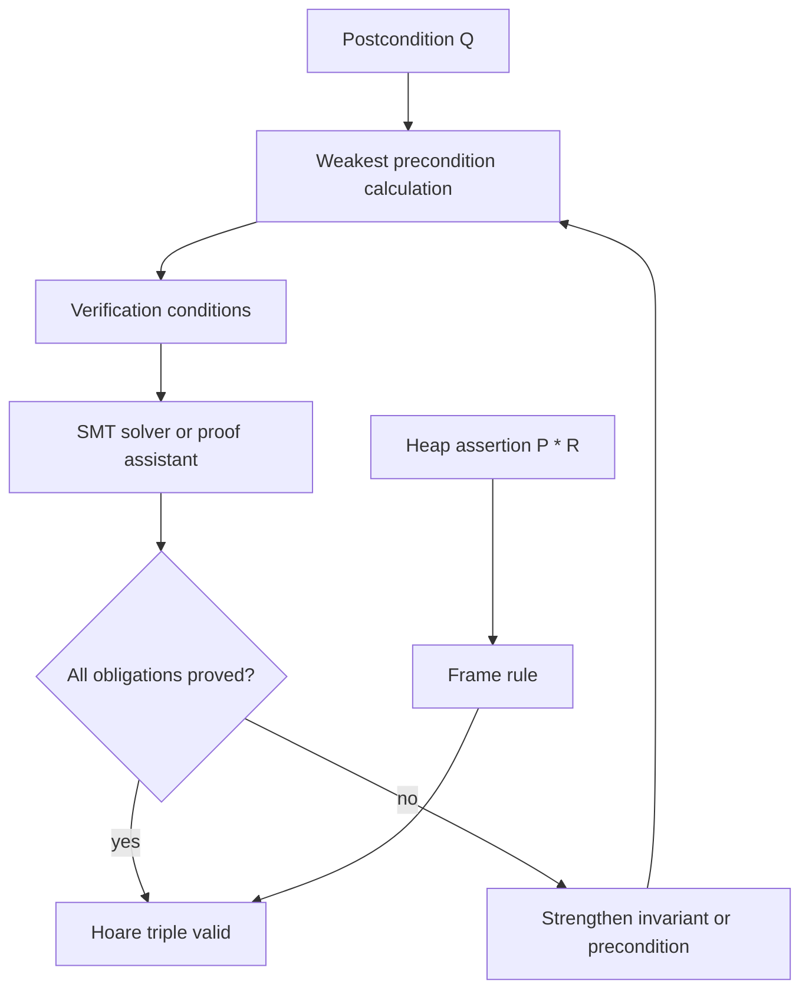

# Axiomatic Semantics and Program Logic

Axiomatic semantics describes programs by the assertions that hold before and after execution. Instead of computing a trace or a denotation, it proves contracts such as "if the input is nonnegative, this loop returns the factorial." The formal-semantics source treats Hoare-style reasoning as one of the major semantic methods; Software Foundations mechanizes the same style for small imperative languages; modern tools such as Dafny, Frama-C, F*, and Why3 automate large parts of the verification workflow [1], [2], [3].

This page emphasizes partial correctness, weakest preconditions, loop invariants, and separation logic. These are not replacements for operational semantics. They are reasoning systems whose soundness is usually proved with respect to an operational or denotational semantics.

## Definitions

A **Hoare triple**

$$
\{P\}\ c\ \{Q\}
$$

means: if command $c$ starts in a state satisfying precondition $P$ and terminates, then the final state satisfies postcondition $Q$. This is **partial correctness**. **Total correctness** additionally proves termination.

The core rules are:

$$
\frac{}{\{Q[x\mapsto a]\}\ x:=a\ \{Q\}}
$$

$$
\frac{\{P\}\ c_1\ \{R\}\quad \{R\}\ c_2\ \{Q\}}
{\{P\}\ c_1;c_2\ \{Q\}}
$$

$$
\frac{\{P\land b\}\ c_1\ \{Q\}\quad \{P\land \neg b\}\ c_2\ \{Q\}}
{\{P\}\ \textsf{if}\ b\ \textsf{then}\ c_1\ \textsf{else}\ c_2\ \{Q\}}
$$

$$
\frac{\{I\land b\}\ c\ \{I\}}
{\{I\}\ \textsf{while}\ b\ \textsf{do}\ c\ \{I\land \neg b\}}.
$$

$I$ is a **loop invariant**. It must be true before the loop, preserved by one iteration, and strong enough with loop exit to imply the desired postcondition.

Dijkstra's **weakest precondition** $wp(c,Q)$ is the weakest assertion that guarantees command $c$ terminates in a state satisfying $Q$ [4]. For partial correctness, one often uses weakest liberal precondition $wlp(c,Q)$, which does not require termination.

**Separation logic** extends assertions with heap ownership. The separating conjunction

$$
P * Q
$$

means the heap can be split into disjoint parts satisfying $P$ and $Q$ respectively. The **frame rule** is

$$
\frac{\{P\}\ c\ \{Q\}}
{\{P * R\}\ c\ \{Q * R\}}
$$

when $c$ does not modify variables free in $R$. It enables local reasoning about heap-manipulating programs [5], [6].

A **variant** or ranking function proves termination by mapping loop states to a well-founded order and decreasing on every iteration.

## Key results

**Soundness of Hoare logic.** If a triple is derivable in the proof system, it is semantically valid: every terminating execution from a state satisfying $P$ ends in a state satisfying $Q$. Proof is by induction on the derivation of the triple, using the operational or denotational meaning of each command [1], [3].

**Relative completeness.** Cook's completeness theorem says that, for a suitable while language, Hoare logic is complete relative to the ability to prove assertions in the underlying assertion logic. The caveat is crucial: arithmetic truths may themselves be undecidable or hard.

**Assignment rule is backward.** The assignment rule uses substitution in the precondition because it asks what must have been true before `x := a` to make $Q$ true afterward. For postcondition $x\gt 0$, the precondition for `x := y+1` is $y+1\gt 0$.

**Weakest preconditions compose backward.** For sequencing:

$$
wp(c_1;c_2,Q)=wp(c_1,wp(c_2,Q)).
$$

This is why verification-condition generators work backward from the desired postcondition, producing proof obligations for branches and loops.

**Separation logic localizes heap reasoning.** Ordinary Hoare logic can reason about heaps, but specifications become cluttered with "and the rest of the heap is unchanged." The frame rule factors this into reusable local triples. This is foundational for verification of pointer programs, data structures, and concurrent resource protocols.

**Concurrent separation logic.** CSL extends the ownership idea to concurrency: threads can reason independently about disjoint resources, while shared invariants are protected by synchronization. This page only sketches CSL as supplementary modern context; it is beyond the supplied introductory semantics material.

**Verification-condition generation.** Most practical tools do not ask users to manually build Hoare derivation trees. They translate annotated programs into verification conditions. Assignments become substitutions, sequencing becomes predicate transformation, branches split obligations, and loops require user-supplied or inferred invariants. The resulting formulas are sent to SMT solvers or proof assistants. This explains the feel of Dafny, Why3, and Frama-C: the programmer writes code plus specifications, and the tool reports which logical obligations remain unproved.

**Dafny, F*, Why3, and Frama-C.** Dafny integrates specifications, ghost state, termination metrics, and SMT-backed verification for a managed imperative language. F* is a dependently typed language with effects, weakest precondition calculi, and extraction paths used in verified systems code. Why3 is a platform for generating verification conditions and dispatching them to multiple provers. Frama-C analyzes C programs through plug-ins, including deductive verification with ACSL annotations. These are supplementary modern tools, but they are direct descendants of Hoare logic and weakest precondition semantics.

**Separation logic intuition.** The assertion $x\mapsto 3 * y\mapsto 4$ says the heap can be split into two disjoint cells, one owned by the left assertion and one by the right. It therefore implies $x\ne y$. This is stronger than ordinary conjunction, which could accidentally describe the same cell twice. The frame rule works because commands that own only one part of the heap cannot disturb a disjoint framed part. This is the key to concise linked-list, tree, and allocator proofs.

**Refinement types as a bridge.** A refinement type such as $\{n:\mathsf{int}\mid n\gt 0\}$ packages a base type with a logical predicate. It can express many preconditions and postconditions directly in types. Practical refinement systems usually restrict predicates to decidable SMT-friendly fragments. Thus refinement types sit between ordinary static typing and full Hoare logic: more automatic than arbitrary program proofs, but less expressive than unrestricted assertions.

**Aliasing is the hard case.** Scalar examples make Hoare logic look like algebra. Heap programs add aliasing: writing through one pointer may change what another pointer observes. Separation logic addresses this by tying assertions to ownership of heap fragments. If a procedure requires ownership of a list segment, its specification can say it may rearrange that segment while preserving a framed heap outside it. Without such locality, a proof about an update to `p.next` must mention every other pointer that might alias `p`, which destroys modularity.

**Invariants are discovered, not guessed blindly.** A practical invariant often records what has been processed, what remains, and what quantity is preserved. For a counting loop, $y+x=n$ preserves the total. For array traversal, an invariant may say all indices below $i$ satisfy a property and indices from $i$ onward are untouched. For linked lists, a separation-logic invariant may split the heap into a processed prefix and an unprocessed suffix. When a proof fails, the right response is usually to inspect the failed verification condition and strengthen the invariant with the missing relationship.

**Partial and total correctness should be documented.** Many textbook derivations quietly prove only partial correctness. In production verification, this distinction affects user trust: a sorting procedure that preserves sortedness only when it terminates is not enough if nontermination is possible. Termination arguments may use simple numeric variants, lexicographic tuples, multiset orders, or well-founded relations supplied to a proof assistant. When termination is outside the scope, the specification should say so directly.

The same documentation rule applies to overflow, allocation failure, and undefined behavior: either model them, rule them out with preconditions, or state that the proof assumes they cannot occur in the verified execution model.

## Visual



| Construct | Hoare rule idea | Common proof obligation |
|---|---|---|
| Assignment | substitute expression into postcondition | algebraic simplification |
| Sequence | invent intermediate assertion | connect two triples |
| Conditional | prove both branches | include branch condition |
| While | supply invariant | initialization and preservation |
| Total correctness | add variant | prove well-founded decrease |
| Heap update | use separating conjunction | prove ownership of modified cell |

## Worked example 1: verifying an assignment sequence

Problem: prove

$$
\{x=3\}\ y:=x+2;\ x:=y*2\ \{x=10\}.
$$

Step 1: work backward from the final assignment. For `x := y*2` and postcondition $x=10$, the assignment rule requires precondition

$$
y*2=10.
$$

So it is enough to prove

$$
\{x=3\}\ y:=x+2\ \{y*2=10\}.
$$

Step 2: apply the assignment rule to `y := x+2`. Substitute $x+2$ for $y$ in $y*2=10$:

$$
(x+2)*2=10.
$$

Step 3: show the original precondition implies this computed precondition:

$$
x=3 \Rightarrow (x+2)*2=10.
$$

Step 4: calculate:

$$
\begin{aligned}
(x+2)*2 &= (3+2)*2 \\
&= 5*2 \\
&= 10.
\end{aligned}
$$

Step 5: by the consequence rule, strengthen the assignment precondition from $(x+2)*2=10$ to $x=3$. The sequence rule combines the two triples. The checked postcondition is $x=10$.

## Worked example 2: proving a loop invariant

Problem: verify partial correctness of

```text
y := 0;
while x > 0 do
  y := y + 1;
  x := x - 1
```

with precondition $x=n \land n\ge 0$ and postcondition $y=n$.

Step 1: choose invariant

$$
I \equiv y+x=n \land x\ge 0.
$$

Step 2: initialization. After `y := 0`, we need

$$
0+x=n \land x\ge 0.
$$

From the precondition $x=n\land n\ge0$, this holds.

Step 3: preservation. Assume

$$
I \land x>0.
$$

Let the old values be $x_o,y_o$. After `y := y+1`, $y_1=y_o+1$. After `x := x-1`, $x_1=x_o-1$.

Step 4: check the invariant:

$$
\begin{aligned}
y_1+x_1 &= (y_o+1)+(x_o-1) \\
&= y_o+x_o \\
&= n.
\end{aligned}
$$

Also $x_o\gt 0$ and integer arithmetic give $x_o-1\ge0$, so $x_1\ge0$.

Step 5: exit. When the loop exits,

$$
I \land \neg(x>0)
$$

means $y+x=n$, $x\ge0$, and $x\le0$. Hence $x=0$ and $y=n$. The proof establishes partial correctness. Termination follows with variant $x$, which decreases and is bounded below by $0$.

## Code

```dafny
method CountDown(n: nat) returns (y: nat)
  ensures y == n
{
  var x := n;
  y := 0;
  while x > 0
    invariant y + x == n
    invariant x >= 0
    decreases x
  {
    y := y + 1;
    x := x - 1;
  }
}
```

## Common pitfalls

- Reading Hoare triples as guaranteeing termination; ordinary triples are partial correctness unless stated otherwise.
- Applying the assignment rule forward instead of substituting backward.
- Choosing a loop invariant that is true but too weak to imply the postcondition.
- Choosing the postcondition itself as an invariant when it is not established before the loop.
- Forgetting to prove invariant initialization before the first iteration.
- Forgetting the branch condition in conditional and loop-body proofs.
- Proving termination with an expression that decreases but can go below zero in a non-well-founded domain.
- Treating weakest precondition and weakest liberal precondition as identical.
- Using separation conjunction as ordinary logical `and`; it also asserts disjoint heap ownership.
- Applying the frame rule when the command may modify framed variables.
- Trusting automated verification failures as program bugs; they may indicate missing annotations.
- Treating refinement types as full Hoare logic; they usually encode a decidable or restricted assertion fragment.

## Connections

- [Operational and Denotational Semantics](/cs/programming-language-theory/operational-and-denotational-semantics) supplies the semantic validity relation for Hoare triples.
- [Dependent Types and Proof Assistants](/cs/programming-language-theory/dependent-types-and-proof-assistants) explains proof assistants used to mechanize program logic.
- [Dataflow Analysis and Abstract Interpretation](/cs/programming-language-theory/dataflow-and-abstract-interpretation) automates invariant discovery approximately.
- [Effects, Monads, and Concurrency Models](/cs/programming-language-theory/effects-monads-and-concurrency-models) connects separation logic to concurrent effects.
- [Cryptography](/cs/cryptography/intro), [Compilers](/cs/compilers/intro), [Theory of Computation](/cs/theory/intro), and [Discrete Math](/math/discrete/intro) link verification to protocols, tools, decidability, and proof methods.

## References

[1] K. Slonneger and B. L. Kurtz, *Formal Syntax and Semantics of Programming Languages*. Addison-Wesley, 1995.  
[2] B. C. Pierce et al., *Software Foundations*, electronic textbook series.  
[3] C. A. R. Hoare, "An axiomatic basis for computer programming," *Communications of the ACM*, 1969.  
[4] E. W. Dijkstra, "Guarded commands, nondeterminacy and formal derivation of programs," *Communications of the ACM*, 1975.  
[5] J. C. Reynolds, "Separation logic: A logic for shared mutable data structures," LICS, 2002.  
[6] P. W. O'Hearn, "Resources, concurrency, and local reasoning," *Theoretical Computer Science*, 2007.
