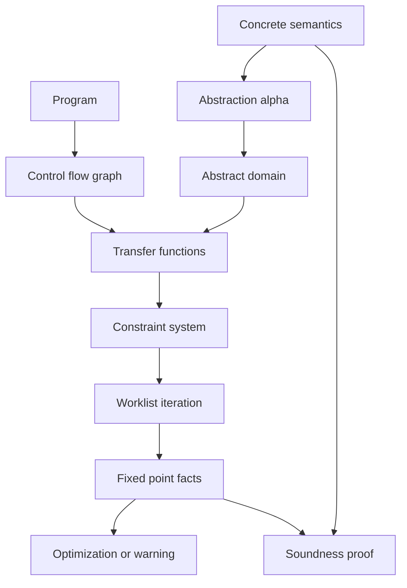

# Dataflow Analysis and Abstract Interpretation

Program analysis computes facts about programs without running every concrete execution. A compiler may need to know which expressions are available, which variables are live, which definitions reach a point, or whether an integer expression can overflow. Nielson, Nielson, and Hankin treat these questions systematically through constraints, lattices, fixed points, control-flow analysis, and abstract interpretation [1]. TAPL contributes the type-system viewpoint; the semantics sources explain why these analyses approximate operational behavior [2], [3].

The central pattern is: choose an abstract domain, define transfer functions for program statements, solve a fixed-point problem over the control-flow graph, and prove the result safely approximates concrete executions. Precision, cost, and termination are engineering choices, not afterthoughts.

## Definitions

A **control-flow graph** (CFG) has program points as nodes and possible transfers of control as edges. A **dataflow fact** is an element of a domain such as a set of definitions, a set of live variables, or an interval environment.

A **lattice** $(L,\sqsubseteq)$ is a partially ordered set where relevant joins and meets exist. Many analyses use finite-height lattices to guarantee termination. A function $f:L\to L$ is **monotone** if

$$
x\sqsubseteq y \Rightarrow f(x)\sqsubseteq f(y).
$$

By the Knaster-Tarski theorem, a monotone function on a complete lattice has least and greatest fixed points. By Kleene iteration, if $f$ is sufficiently continuous and the chain stabilizes,

$$
\mathrm{lfp}(f)=\bigsqcup_{n\ge0} f^n(\bot).
$$

Dataflow analyses are classified by direction and quantification:

| Analysis | Direction | May/must | Informal fact |
|---|---|---|---|
| Reaching definitions | forward | may | a definition may reach this point |
| Available expressions | forward | must | expression computed on all paths and not killed |
| Live variables | backward | may | current value may be used later |
| Very busy expressions | backward | must | expression will be used before operands change |

For a node $n$, a typical forward equation is

$$
OUT[n]=transfer_n(IN[n]),
\qquad
IN[n]=\bigvee_{p\in pred(n)} OUT[p].
$$

For backward analysis:

$$
IN[n]=transfer_n(OUT[n]),
\qquad
OUT[n]=\bigvee_{s\in succ(n)} IN[s].
$$

**Meet-over-paths** (MOP) combines facts from all concrete paths. **Maximum fixed point** or **minimum fixed point** solutions are what iterative algorithms compute. For distributive frameworks, MOP and MFP coincide; for merely monotone frameworks, MFP is a safe approximation that may be less precise.

**Abstract interpretation** relates a concrete domain $C$ and abstract domain $A$ by abstraction and concretization maps:

$$
\alpha:C\to A,\qquad \gamma:A\to C.
$$

They form a **Galois connection** when

$$
\alpha(c)\sqsubseteq_A a \quad \text{iff} \quad c\sqsubseteq_C \gamma(a).
$$

Common abstract domains include signs, intervals, congruences, octagons, and polyhedra. **Widening** forces convergence on infinite-height domains; **narrowing** recovers some precision after widening [4].

Pointer analyses include Andersen's inclusion-based analysis and Steensgaard's unification-based analysis. Information-flow analysis tracks confidentiality and integrity labels [5]. Control-flow analysis such as $k$-CFA approximates possible function calls in higher-order languages.

## Key results

**Worklist termination on finite lattices.** If the lattice has finite height and transfer functions are monotone, chaotic iteration with a fair worklist eventually stabilizes. Each update moves facts monotonically upward or downward, and only finitely many strict moves are possible.

**Soundness as overapproximation.** A may analysis is sound if every fact that can happen in a concrete execution appears in the abstract result. A must analysis is sound if every reported fact truly holds on all relevant executions. The direction of approximation must be stated carefully; "larger" is not always "less precise" unless the order is chosen that way.

**MOP versus MFP.** MOP is the ideal path-sensitive solution:

$$
MOP[n]=\bigvee_{\pi\in Paths(entry,n)} transfer_\pi(init).
$$

MFP solves recursive equations over CFG joins. Distributivity of transfer functions over meet or join ensures equality. Without distributivity, joining early can lose correlations between facts.

**Abstract interpretation generalizes dataflow.** Classical dataflow frameworks can be seen as abstract interpretations where the concrete semantics is sets of reachable states and the abstract semantics computes over a lattice of facts. This view gives a clean proof method: show each abstract transfer soundly simulates the concrete transfer.

**Widening trades precision for termination.** Intervals over integers have infinite ascending chains:

$$
[0,0]\sqsubseteq[0,1]\sqsubseteq[0,2]\sqsubseteq\cdots.
$$

A widening such as $[l,u]\nabla[l',u']=[l'',u'']$, where bounds that keep moving become $\pm\infty$, ensures convergence. Narrowing can then refine $\infty$ bounds when stable information is available.

**Sensitivity dimensions.** Analyses are often described by what distinctions they preserve. A flow-sensitive analysis respects statement order; a flow-insensitive analysis treats a procedure more like a bag of constraints. A context-sensitive analysis distinguishes different call sites or calling histories; a context-insensitive analysis merges them. A path-sensitive analysis preserves branch correlations; a path-insensitive analysis joins facts at control-flow merge points. A field-sensitive pointer analysis distinguishes object fields; a field-insensitive one merges them. These choices can change both precision and asymptotic cost by orders of magnitude.

**Alias analysis affects everything downstream.** For imperative languages, many optimizations depend on whether two expressions may refer to the same memory. Andersen-style analysis creates inclusion constraints such as $pts(x)\supseteq pts(y)$ for assignments. Steensgaard-style analysis unifies points-to sets, making it faster but usually less precise. The result feeds constant propagation, dead-store elimination, race detection, escape analysis, and security checks. Unsound alias assumptions are especially dangerous because they let compilers reorder memory operations incorrectly.

**Information flow is a semantic property.** Explicit flows copy secret data into public variables. Implicit flows occur when control decisions leak information, as in `if secret then public := 1 else public := 0`. A type-and-effect or dataflow system can conservatively reject such programs by tracking labels through expressions and control dependence. This connects program analysis to security: the goal is not just optimization but noninterference, a property saying low-observable outputs do not depend on high-secret inputs [5].

**Correlation loss explains false alarms.** Suppose an analysis knows $x\in[0,10]$ and $y\in[0,10]$ but has forgotten the relation $x=y$. After a branch that preserves equality, an interval domain still cannot prove $x-y=0$ because intervals track variables independently. A polyhedral domain could keep the equality but would cost more. This is the central abstract-interpretation tradeoff: false alarms are often not bugs in transfer functions, but consequences of choosing an abstract domain that intentionally forgets correlations.

A good analyzer design therefore starts from the client: an optimizer, security checker, and bug finder may need different facts, different tolerances for false positives, and different runtime budgets.

It also starts from the language semantics. Exceptions, closures, reflection, threads, and undefined behavior all change the concrete executions that the analysis must safely cover during compilation or verification.

## Visual



| Abstract domain | Example element | Captures | Loses |
|---|---|---|---|
| Signs | `neg`, `zero`, `pos`, `top` | sign of integers | magnitude |
| Intervals | $[0,10]$ | lower and upper bounds | relations like $x\lt y$ |
| Congruences | $x \equiv 1 \pmod 2$ | parity and modular facts | order bounds |
| Octagons | $\pm x \pm y \le c$ | limited variable relations | nonlinear facts |
| Polyhedra | linear inequalities | rich linear relations | high performance |

## Worked example 1: live variables by backward analysis

Problem: compute live variables for the program:

```text
1: x := 1
2: y := x + 2
3: z := y
4: print z
```

A variable is live before a statement if its current value may be read later before being overwritten.

Step 1: define uses and defs.

| Line | use | def |
|---|---|---|
| 1 | $\emptyset$ | $\{x\}$ |
| 2 | $\{x\}$ | $\{y\}$ |
| 3 | $\{y\}$ | $\{z\}$ |
| 4 | $\{z\}$ | $\emptyset$ |

Step 2: use the backward transfer equation:

$$
IN[n]=use[n]\cup(OUT[n]\setminus def[n]).
$$

Step 3: start at the end. After line 4, no variables are live:

$$
OUT[4]=\emptyset.
$$

Then

$$
IN[4]=\{z\}\cup(\emptyset\setminus\emptyset)=\{z\}.
$$

Step 4: propagate to line 3:

$$
OUT[3]=IN[4]=\{z\}
$$

$$
IN[3]=\{y\}\cup(\{z\}\setminus\{z\})=\{y\}.
$$

Step 5: line 2:

$$
OUT[2]=\{y\}
$$

$$
IN[2]=\{x\}\cup(\{y\}\setminus\{y\})=\{x\}.
$$

Step 6: line 1:

$$
OUT[1]=\{x\}
$$

$$
IN[1]=\emptyset\cup(\{x\}\setminus\{x\})=\emptyset.
$$

Checked result: $x$ is live after line 1, $y$ after line 2, $z$ after line 3, and no variable is live before the whole program.

## Worked example 2: interval analysis with widening

Problem: analyze

```text
x := 0;
while x < 100 do
  x := x + 1
```

Step 1: choose interval domain. Initial fact after assignment:

$$
x\in[0,0].
$$

Step 2: one loop iteration maps $[l,u]$ under guard $x\lt 100$ and assignment $x:=x+1$ to approximately

$$
[l+1,\min(u,99)+1].
$$

Starting from $[0,0]$, the head facts grow:

$$
[0,0], [0,1], [0,2], \ldots, [0,100].
$$

Step 3: without widening, this finite example stabilizes at $[0,100]$, but a loop with unknown bound might not. With widening at the loop head:

$$
[0,0]\nabla[0,1]=[0,\infty].
$$

Step 4: apply the loop guard $x\lt 100$ inside the body, refining to $[0,99]$, then assignment gives $[1,100]$.

Step 5: a narrowing phase can combine the widened invariant with the guard/assignment structure and recover the head interval $[0,100]$.

Checked interpretation: widening may first jump to $[0,\infty]$, which is sound but imprecise. Narrowing can recover the useful upper bound for warning suppression or optimization.

## Code

```python
from collections import deque

def live_variables(nodes, succ, use, define):
    in_fact = {n: set() for n in nodes}
    out_fact = {n: set() for n in nodes}
    work = deque(nodes)

    pred = {n: set() for n in nodes}
    for n in nodes:
        for s in succ[n]:
            pred[s].add(n)

    while work:
        n = work.popleft()
        old_in = set(in_fact[n])
        out_fact[n] = set().union(*(in_fact[s] for s in succ[n]))
        in_fact[n] = use[n] | (out_fact[n] - define[n])
        if in_fact[n] != old_in:
            work.extend(pred[n])
    return in_fact, out_fact

nodes = [1, 2, 3, 4]
succ = {1: [2], 2: [3], 3: [4], 4: []}
use = {1: set(), 2: {"x"}, 3: {"y"}, 4: {"z"}}
define = {1: {"x"}, 2: {"y"}, 3: {"z"}, 4: set()}
print(live_variables(nodes, succ, use, define))
```

## Common pitfalls

- Mixing up forward and backward equations.
- Mixing up may and must analyses, especially the join/meet operator.
- Treating all dataflow initial values as $\emptyset$; must analyses often start from a universal fact.
- Forgetting kill sets, so overwritten definitions remain incorrectly visible.
- Assuming MFP always equals MOP; distributivity is the missing condition.
- Ignoring infeasible paths, causing safe but surprising imprecision.
- Using widening too early and losing useful bounds.
- Forgetting narrowing after widening when precision matters.
- Claiming an analysis is sound without defining the concrete semantics it approximates.
- Treating pointer analysis results as exact aliasing information.
- Confusing flow-sensitive, path-sensitive, context-sensitive, and field-sensitive dimensions.
- Assuming $k$-CFA scales monotonically in practice; precision improvements can be costly.
- Ignoring information-flow implicit flows through control dependence.

## Connections

- [Operational and Denotational Semantics](/cs/programming-language-theory/operational-and-denotational-semantics) supplies the concrete behavior being approximated.
- [Axiomatic Semantics and Program Logic](/cs/programming-language-theory/axiomatic-semantics-and-program-logic) uses invariants that abstract interpretation can infer.
- [Polymorphism, Subtyping, and Type Inference](/cs/programming-language-theory/polymorphism-subtyping-and-inference) shares constraints, fixed points, and lattice reasoning.
- [Compilers](/cs/compilers/intro) uses dataflow for optimization and warnings.
- [Discrete Math](/math/discrete/intro), [Theory of Computation](/cs/theory/intro), and [Cryptography](/cs/cryptography/intro) connect lattices, decidability, and information-flow security.

## References

[1] F. Nielson, H. R. Nielson, and C. Hankin, *Principles of Program Analysis*. Springer, 1999.  
[2] B. C. Pierce, *Types and Programming Languages*. MIT Press, 2002.  
[3] G. Winskel, *The Formal Semantics of Programming Languages*. MIT Press, 1993.  
[4] P. Cousot and R. Cousot, "Abstract interpretation: A unified lattice model for static analysis of programs," POPL, 1977.  
[5] A. Sabelfeld and A. C. Myers, "Language-based information-flow security," *IEEE Journal on Selected Areas in Communications*, 2003.  
[6] L. O. Andersen, "Program analysis and specialization for the C programming language," Ph.D. dissertation, 1994.  
[7] B. Steensgaard, "Points-to analysis in almost linear time," POPL, 1996.
