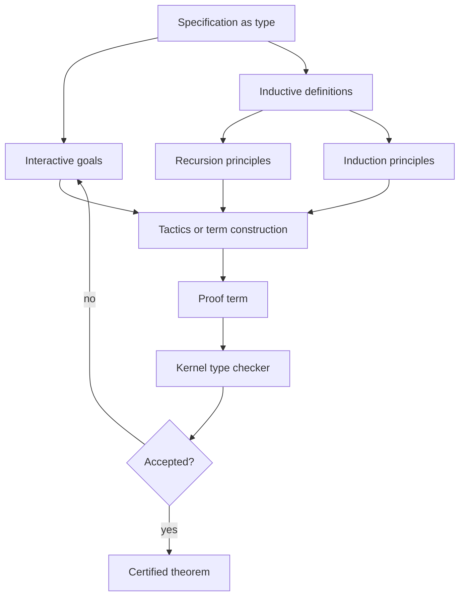

# Dependent Types and Proof Assistants

Dependent type theory lets types mention values. That single move turns types from coarse program classifiers into precise specifications: a vector type may include its length, a parser type may state the grammar it recognizes, and a theorem may be represented as the type of its proofs. TAPL mentions dependent types as an advanced direction, while Software Foundations makes the Curry-Howard style concrete through machine-checked definitions, inductive propositions, tactics, and proofs about small programming languages [1], [2].

This page is a combined treatment of the source material plus modern context. Coq, Lean, Agda, and Idris differ in syntax, automation, and universe choices, but they share the same central idea: programming and proving are both construction of typed terms. The practical challenge is to keep the logic consistent, type checking decidable, and proof scripts maintainable.

## Definitions

A **dependent function type** or Pi type

$$
\Pi (x:A).B(x)
$$

classifies functions whose result type may depend on the input value. If $B$ does not mention $x$, this collapses to the ordinary arrow $A\to B$. A theorem like "for every natural number $n$, $n+0=n$" can be read as a type:

$$
\Pi(n:\mathsf{Nat}).\ n+0=n.
$$

A **dependent pair type** or Sigma type

$$
\Sigma (x:A).B(x)
$$

classifies pairs consisting of a witness $a:A$ and evidence of $B(a)$. It is the constructive version of existential quantification.

The **Calculus of Constructions** combines dependent functions, polymorphism, and propositions-as-types. Coq's Calculus of Inductive Constructions extends it with inductive types and universes. A **universe** is a type of types, often written `Type 0`, `Type 1`, and so on. Predicative universes avoid a universe containing itself. Impredicative universes allow quantification over a collection that includes the thing being defined; Coq's `Prop` is impredicative, while its computational `Type` hierarchy is predicative [3].

An **inductive type** is defined by constructors. For natural numbers:

$$
\mathsf{Nat} ::= Z \mid S(\mathsf{Nat}).
$$

Its recursion principle says to define a function out of `Nat`, give a case for `Z` and a case for `S n` assuming the recursive result for `n`. Its induction principle says to prove a proposition for all naturals, prove the base case and the successor case.

An **inductive proposition** is an inductive type whose inhabitants are proof evidence. For example, evenness can be generated by constructors:

$$
\frac{}{\mathsf{even}(0)}
\qquad
\frac{\mathsf{even}(n)}{\mathsf{even}(n+2)}.
$$

A **proof assistant** is an interactive system that maintains proof goals, checks proof terms, and offers tactics. Coq and Lean emphasize tactic scripting; Agda and Idris emphasize dependently typed programming by pattern matching, though both styles overlap.

Decidable type checking means the system can always determine whether a submitted term has a claimed type. This usually requires totality or guardedness checks for recursive definitions. Consistency means not every proposition is inhabited; in particular, there should be no closed proof of `False`.

## Key results

**Curry-Howard in depth.** Propositions are types and proofs are programs. Conjunction corresponds to product types, disjunction to sum types, implication to function types, universal quantification to Pi types, and existential quantification to Sigma types. Normalizing a proof term corresponds to simplifying a proof [2], [4].

**Induction is generated by data declarations.** When a user defines an inductive type, the proof assistant creates an eliminator. For `Nat`, the eliminator is induction over zero and successor. For syntax trees, it is structural induction over constructors. Software Foundations uses this repeatedly: define expressions, define evaluation or typing as inductive relations, then prove determinism, preservation, and progress by induction over derivations [2].

**Proofs about languages scale through mechanized metatheory.** A paper proof may say "by substitution" or "by inversion." A proof assistant requires a precise statement of substitution, a representation of variables, and proof scripts or terms for every case. This extra cost catches errors in binding, contexts, and side conditions.

**Consistency depends on termination and universe discipline.** If arbitrary nonterminating recursion were accepted as a proof term, one could inhabit any type by looping or by defining a paradoxical fixed point. Therefore proof assistants enforce structural recursion, guarded corecursion, well-founded recursion, or termination metrics. Universe hierarchies avoid Girard-style paradoxes [3].

**Proof irrelevance and computation are policy choices.** In Coq, proofs in `Prop` are normally erased during extraction, while computational data in `Type` remains. Lean has its own universe and proof-irrelevance conventions. Agda tends to blur proof and program more uniformly. These design choices affect extraction, automation, and how much proof content can be inspected.

**Decidable type checking is not decidable theorem proving.** The kernel can check a proposed proof term, but finding that proof may be undecidable or practically difficult. Tactics, automation, SMT integration, and libraries help construct proof terms; the small kernel checks them.

**Reflection and computation inside proofs.** Proof assistants often let users replace repetitive logical reasoning with computation. For example, a verified decision procedure for equality on arithmetic expressions can compute a boolean and then reflect that boolean result into a proposition. Software Foundations uses smaller examples of this pattern when relating boolean tests to propositional facts [2]. The advantage is scalability: once the reflective procedure is proved sound, many future goals are solved by normalization plus a small lemma rather than by hand-built proof trees.

**Extraction and trusted kernels.** Coq can extract computational content to OCaml, Haskell, or Scheme-like targets, erasing proofs in `Prop`. Lean and Agda have their own compilation stories. Extraction is powerful but must be interpreted carefully: the kernel certifies the source term in the logic, while the trusted computing base also includes extraction, the runtime, foreign libraries, and any axioms used. For high-assurance work, engineers track that boundary explicitly.

**The Imp case study.** Software Foundations' small imperative language, often called Imp, is a model example for PL courses. One defines arithmetic and boolean expressions, commands, evaluation relations, program equivalence, Hoare triples, and finally verified transformations. The point is not that Imp is realistic; it is that every element of a real language proof is visible in miniature. The same recipe scales conceptually to compilers, type soundness, and verified optimizations, but the administrative proof burden grows quickly.

**Equality is not one thing.** Definitional equality is what the type checker computes automatically, such as reducing $0+n$ to $n$ when addition recurses on its first argument. Propositional equality is an explicit type of evidence, such as a proof that $n+0=n$. Extensional equality says two functions are equal if they return equal outputs for all inputs; many systems do not make full function extensionality definitional. Confusing these levels leads to stuck proofs: the term may be true, but the kernel needs a lemma, rewrite, or axiom to see it.

A reliable workflow is to simplify first, inspect the remaining goal, then decide whether the missing step is computation, induction, rewriting, or an imported theorem.

## Visual



| Logical idea | Type-theoretic form | Programming analogue |
|---|---|---|
| $P \Rightarrow Q$ | $P \to Q$ | function from proof of $P$ to proof of $Q$ |
| $P \land Q$ | product | pair |
| $P \lor Q$ | sum | tagged union |
| $\forall x:A.P(x)$ | $\Pi(x:A).P(x)$ | dependent function |
| $\exists x:A.P(x)$ | $\Sigma(x:A).P(x)$ | dependent pair |
| induction | eliminator | structural recursion |

## Worked example 1: proving `n + 0 = n` by induction

Problem: prove for all natural numbers $n$:

$$
n+0=n.
$$

Assume addition is defined by recursion on the first argument:

$$
\begin{aligned}
0+m &= m \\
S(n)+m &= S(n+m).
\end{aligned}
$$

Step 1: state the proposition:

$$
P(n) \equiv n+0=n.
$$

Step 2: prove the base case:

$$
P(0):\quad 0+0=0.
$$

By the first equation of addition, $0+0$ reduces to $0$, so the goal is $0=0$, proved by reflexivity.

Step 3: prove the inductive step. Assume the induction hypothesis:

$$
IH:\ n+0=n.
$$

We must prove

$$
S(n)+0=S(n).
$$

Step 4: unfold addition:

$$
S(n)+0 = S(n+0).
$$

The goal becomes

$$
S(n+0)=S(n).
$$

Step 5: rewrite using $IH$:

$$
S(n+0)=S(n).
$$

After rewriting $n+0$ to $n$, the goal is $S(n)=S(n)$, again reflexivity. The checked proof term is a function taking $n$ and returning evidence of equality.

## Worked example 2: dependent vectors and length-preserving append

Problem: specify append for length-indexed vectors:

$$
\mathsf{append} : \Pi A.\Pi m.\Pi n.\ \mathsf{Vec}\ A\ m \to \mathsf{Vec}\ A\ n \to \mathsf{Vec}\ A\ (m+n).
$$

Step 1: inspect the first vector. If it is empty, then $m=0$ and the first argument is `vnil`.

Step 2: the required result type becomes

$$
\mathsf{Vec}\ A\ (0+n).
$$

By computation, $0+n$ reduces to $n$, so returning the second vector has the correct type.

Step 3: if the first vector is `vcons x xs`, then $m=S(k)$ for some $k$ and

$$
xs : \mathsf{Vec}\ A\ k.
$$

Step 4: recursively append the tail:

$$
\mathsf{append}\ A\ k\ n\ xs\ ys :
\mathsf{Vec}\ A\ (k+n).
$$

Step 5: cons the head onto that result:

$$
\mathsf{vcons}\ x\ (\mathsf{append}\ xs\ ys)
:
\mathsf{Vec}\ A\ (S(k+n)).
$$

Step 6: the required type is

$$
\mathsf{Vec}\ A\ (S(k)+n).
$$

By the computation rule for addition on the first argument, $S(k)+n$ reduces to $S(k+n)$. The types match definitionally, so no separate theorem is needed if addition was oriented this way. The checked answer is a program whose type guarantees length preservation.

## Code

```coq
Inductive nat : Type :=
| O : nat
| S : nat -> nat.

Fixpoint plus (n m : nat) : nat :=
  match n with
  | O => m
  | S k => S (plus k m)
  end.

Inductive Vec (A : Type) : nat -> Type :=
| vnil : Vec A O
| vcons : forall n, A -> Vec A n -> Vec A (S n).

Fixpoint append {A : Type} {m n : nat}
  (xs : Vec A m) (ys : Vec A n) : Vec A (plus m n) :=
  match xs with
  | vnil _ => ys
  | vcons _ k x rest => vcons A (plus k n) x (append rest ys)
  end.
```

## Common pitfalls

- Thinking dependent types automatically prove properties; they let properties be stated in types, but proofs still must be constructed.
- Confusing type checking with proof search.
- Ignoring termination checks; unrestricted recursion threatens logical consistency.
- Placing computational data in proof-irrelevant universes and then expecting to compute with it.
- Assuming all equalities are definitional equalities; many require explicit rewrite lemmas.
- Choosing a bad recursion orientation, making simple programs require hard arithmetic transports.
- Treating tactics as trusted magic; the kernel checks the proof term they build.
- Forgetting that variable binding in object languages is difficult to mechanize cleanly.
- Using large automation without understanding generated subgoals.
- Assuming Coq, Lean, Agda, and Idris have identical universe rules.
- Over-indexing every datatype; precise types can become cumbersome if the index is not useful.
- Believing consistency proves a library theorem is true in classical mathematics; the theorem is true in the logic and axioms the assistant accepts.

## Connections

- [Type Systems and Type Soundness](/cs/programming-language-theory/type-systems-and-type-soundness) gives the metatheorems often mechanized in Coq.
- [Polymorphism, Subtyping, and Type Inference](/cs/programming-language-theory/polymorphism-subtyping-and-inference) leads from $\forall$ types to richer dependent quantification.
- [Axiomatic Semantics and Program Logic](/cs/programming-language-theory/axiomatic-semantics-and-program-logic) uses proof assistants to verify imperative programs.
- [Cryptography](/cs/cryptography/intro) connects to machine-checked protocol and proof verification.
- [Discrete Math](/math/discrete/intro), [Theory of Computation](/cs/theory/intro), and [Compilers](/cs/compilers/intro) support induction, decidability, and extraction.

## References

[1] B. C. Pierce, *Types and Programming Languages*. MIT Press, 2002.  
[2] B. C. Pierce et al., *Software Foundations*, electronic textbook series.  
[3] T. Coquand and G. Huet, "The calculus of constructions," *Information and Computation*, 1988.  
[4] W. A. Howard, "The formulae-as-types notion of construction," 1980.  
[5] P. Martin-Lof, *Intuitionistic Type Theory*. Bibliopolis, 1984.  
[6] Y. Bertot and P. Casteran, *Interactive Theorem Proving and Program Development*. Springer, 2004.
