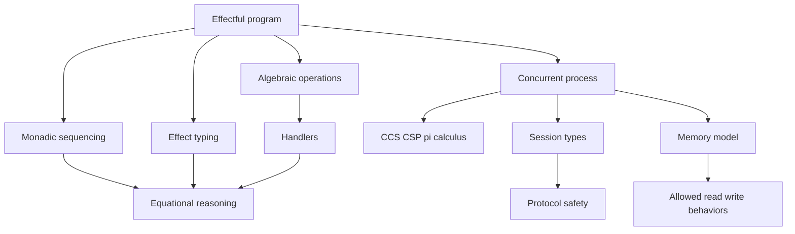

# Effects, Monads, and Concurrency Models

Pure lambda calculus isolates computation as substitution, but real programs allocate, throw exceptions, perform I/O, mutate state, communicate, and run concurrently. TAPL covers references and exceptions as typed language features; program-analysis texts cover type-and-effect systems; the remaining material on monads, algebraic effects, process calculi, session types, memory models, and STM is modern supplementary context that connects PL theory to Haskell, OCaml, Koka, Eff-style languages, Rust, databases, and concurrent runtimes [1], [2], [3].

The unifying question is how to expose effects without losing reasoning principles. One answer is to sequence effects explicitly with monads. Another is to track them in types. Another is to give concurrent processes an algebra of communication and equivalence. These approaches often meet in modern language design.

## Definitions

A **side effect** is an observable interaction beyond returning a value: state update, exception, nondeterminism, I/O, control transfer, or communication. A pure expression can be replaced by its value without changing behavior; an effectful expression often cannot.

A **monad** packages effectful computation with a type constructor $M$ and operations:

$$
\mathsf{return}:A\to M A
$$

$$
\mathsf{bind}:M A\to(A\to M B)\to M B.
$$

The laws are left identity, right identity, and associativity:

$$
\mathsf{return}\ a >>= k = k\ a
$$

$$
m >>= \mathsf{return}=m
$$

$$
(m >>= k) >>= h = m >>= (\lambda x. k x >>= h).
$$

Common monads include `Maybe` for failure, `List` for nondeterminism, `State` for mutable state threading, `IO` for external actions, and `Cont` for continuations.

An **effect system** annotates types with effects:

$$
\Gamma\vdash e:T\ !\ \epsilon
$$

meaning expression $e$ returns type $T$ and may perform effects $\epsilon$. Lucassen and Gifford's work is a classic type-and-effect formulation [4].

**Algebraic effects** describe operations such as `get`, `put`, `choose`, or `raise` abstractly; **handlers** interpret those operations. This separates effect syntax from effect meaning [5].

Concurrency models include:

- **CCS**: processes synchronize on named actions and co-actions [6].
- **CSP**: processes communicate through events and are studied through traces, failures, and refusals [7].
- **Pi-calculus**: channels themselves can be sent over channels, allowing mobile communication topology [8].

**Linear types** ensure a value is used exactly once or according to a controlled discipline. **Session types** describe communication protocols as types, such as "send an integer, then receive a boolean, then close." **Memory models** define which reads may observe which writes in concurrent shared-memory programs. **Software transactional memory** (STM) executes memory operations speculatively and commits them atomically.

## Key results

**Monads restore equational structure for effects.** Rather than pretending effects are pure, a monadic type distinguishes values from computations. The monad laws justify refactoring nested effectful code. Haskell's `IO A` does not mean "an `A` with side effects already performed"; it means a description of an action that, when run by the runtime, may perform effects and produce an `A`.

**State monad makes store passing explicit.** A stateful computation can be modeled as

$$
State\ S\ A = S \to (A,S).
$$

This mirrors denotational semantics for commands and expressions with stores. Mutation becomes function composition over an explicit state parameter.

**Effect systems refine type soundness.** Ordinary types may prove a program will not apply an integer as a function. Effects can prove a function is pure, cannot throw a certain exception, touches only a region, or performs only allowed I/O. The soundness theorem usually says dynamic effects are included in static effect annotations.

**Handlers are modular interpreters.** Algebraic effect operations declare what can be requested; handlers say how requests are answered. The same `choose` operation can be interpreted as backtracking search, random choice, or collection of all possibilities.

**Bisimulation supports process equivalence.** In CCS and pi-calculus, two processes are behaviorally equivalent if each can match the other's actions step by step. Bisimulation is a coinductive proof principle, contrasting with the inductive proofs used for terminating syntax trees.

**Session types turn protocols into typechecking problems.** If one endpoint has type "send `Int`; receive `Bool`; close," the peer should have the dual type "receive `Int`; send `Bool`; close." Typechecking can rule out many deadlocks, arity mismatches, and protocol-order errors, though full deadlock freedom requires stronger disciplines.

**Memory models constrain reasoning.** Sequential consistency says execution behaves like some interleaving of thread steps. Modern hardware and optimizing compilers often allow weaker behaviors for performance, constrained by fences, atomics, and language-level rules. A PL memory model specifies the allowed observations so programmers and compilers can reason consistently. This is why concurrency is not just an operating-systems topic: the language definition must say what a read can see, what counts as a data race, and which transformations preserve meaning.

**STM and composability.** Locks protect critical sections but compose poorly: two correct lock-based operations can deadlock or violate ordering when combined. Software transactional memory offers `atomically` blocks that either commit as a unit or retry. In typed functional settings, STM is often exposed through a monad so transactional effects are separated from arbitrary `IO`. The restriction matters because irreversible I/O cannot be rolled back if a transaction aborts.

**Algebraic handlers versus monad stacks.** Monad transformers combine effects by layering monads, but order matters and plumbing can become visible in program types. Algebraic effects offer a different interface: code invokes operations, and handlers decide how to interpret them. A handler for nondeterminism may collect all answers; a handler for state may thread a store; a handler for exceptions may abort or resume. This makes effects modular, but type systems for handlers must track which operations remain unhandled.

**Linear and affine disciplines.** Linear types require exactly one use; affine types allow at most one use. These disciplines support safe resource management: file handles are closed once, channels follow a protocol, and unique references can be updated without aliases. Rust's ownership system is not a pure linear type theory, but it demonstrates how substructural ideas can shape a mainstream language. Session types apply the same intuition to communication: using a channel advances its type.

**Continuations as an effect.** Continuation-passing style makes "the rest of the computation" explicit. The continuation monad packages computations that receive their future as an argument, which models early exit, backtracking, coroutines, and control operators. Denotational semantics often uses continuations to model jumps, exceptions, and complex control. The PL lesson is that control flow is an effect too: once a term can decide whether, when, or how often to invoke its continuation, equational reasoning must account for that behavior.

**Typed effects remain an active design space.** Some languages expose effects mostly through libraries, as Haskell does with monads. Some infer row-polymorphic effect sets. Some use capability passing, region systems, or uniqueness types. The common theme is that effect information becomes part of the interface. A function type can say not only what value is returned, but also which resources may be touched and which control behaviors may occur.

This interface-level view is what links effects to security and verification: authority can be represented as a capability, protocol state as a session type, and interference as an effect to be ruled out or contained.

## Visual



| Effect model | Main idea | Example use |
|---|---|---|
| Monad | sequence computations in a type constructor | Haskell `IO`, parser combinators |
| Effect system | annotate possible effects | purity, exceptions, regions |
| Algebraic effects | operations plus handlers | resumable exceptions, generators |
| Process calculus | algebra of communicating processes | protocol equivalence |
| Session types | communication protocol as type | typed channels |
| Memory model | allowed shared-memory observations | atomics, data-race rules |
| STM | optimistic atomic transactions | composable concurrent updates |

## Worked example 1: state monad calculation

Problem: model a computation that increments an integer state and returns the old value.

Define:

$$
State\ S\ A = S\to(A,S).
$$

Let

$$
get(s)=(s,s)
$$

and

$$
put(s')(s)=((),s').
$$

The program is:

```haskell
do
  old <- get
  put (old + 1)
  return old
```

Step 1: start with state $10$.

$$
get(10)=(10,10).
$$

So `old = 10` and the state remains $10$.

Step 2: execute `put (old + 1)`:

$$
put(11)(10)=((),11).
$$

The return value is unit and the new state is $11$.

Step 3: execute `return old` in the new state:

$$
return(10)(11)=(10,11).
$$

Checked result: the computation returns $10$ and leaves state $11$. The apparent mutation was just explicit store threading, which is why the state monad matches denotational accounts of imperative commands.

## Worked example 2: dual session type check

Problem: check whether two channel endpoints can communicate safely.

Endpoint A has protocol:

$$
!Int.?Bool.end
$$

meaning send an integer, receive a boolean, then close.

Endpoint B has protocol:

$$
?Int.!Bool.end
$$

Step 1: define duality:

$$
dual(!T.S)=?T.dual(S)
$$

$$
dual(?T.S)=!T.dual(S)
$$

$$
dual(end)=end.
$$

Step 2: compute the dual of A:

$$
\begin{aligned}
dual(!Int.?Bool.end)
&= ?Int.dual(?Bool.end) \\
&= ?Int.!Bool.dual(end) \\
&= ?Int.!Bool.end.
\end{aligned}
$$

Step 3: compare with B:

$$
B=?Int.!Bool.end.
$$

Step 4: since $B=dual(A)$, the endpoints agree on order and payload types. If B had been $?Bool.!Int.end$, the first communication would mismatch: A sends `Int` while B expects `Bool`.

Checked conclusion: this two-party protocol is locally type-correct. Additional global checks may still be needed for multiparty deadlock freedom.

## Code

```haskell
newtype State s a = State { runState :: s -> (a, s) }

instance Functor (State s) where
  fmap f (State act) = State $ \s ->
    let (a, s') = act s in (f a, s')

instance Applicative (State s) where
  pure a = State $ \s -> (a, s)
  State ff <*> State fa = State $ \s ->
    let (f, s1) = ff s
        (a, s2) = fa s1
    in (f a, s2)

instance Monad (State s) where
  State act >>= k = State $ \s ->
    let (a, s1) = act s
    in runState (k a) s1

get :: State s s
get = State $ \s -> (s, s)

put :: s -> State s ()
put s = State $ \_ -> ((), s)
```

## Common pitfalls

- Treating monads as just containers; many monads represent computations, not stored collections.
- Ignoring monad laws when defining custom monads.
- Believing `IO` makes a language impure internally; it can preserve a pure core while describing external actions.
- Confusing algebraic effects with exceptions only; handlers can resume computations.
- Assuming effect annotations are always inferred; many systems need annotations or restrictions.
- Treating process interleavings as deterministic traces.
- Confusing trace equivalence with bisimulation; bisimulation is stepwise and branching-sensitive.
- Forgetting that pi-calculus channels can be communicated as values.
- Assuming session duality alone prevents all deadlocks.
- Ignoring memory models and reasoning as if all concurrent programs were sequentially consistent.
- Treating data-race freedom as a performance detail rather than a semantic boundary in many languages.
- Assuming STM composes with arbitrary I/O; transactions generally require rollback-safe effects.

## Connections

- [Untyped and Typed Lambda Calculus](/cs/programming-language-theory/untyped-and-typed-lambda-calculus) gives the pure core that effects extend.
- [Operational and Denotational Semantics](/cs/programming-language-theory/operational-and-denotational-semantics) models stores, continuations, and process steps.
- [Axiomatic Semantics and Program Logic](/cs/programming-language-theory/axiomatic-semantics-and-program-logic) connects effects to separation logic and concurrent reasoning.
- [Dataflow Analysis and Abstract Interpretation](/cs/programming-language-theory/dataflow-and-abstract-interpretation) analyzes effects, aliases, and information flow.
- [Operating Systems](/cs/operating-systems/intro) and [Computer Architecture](/cs/computer-architecture/intro) connect memory models to real execution.
- [Compilers](/cs/compilers/intro), [Theory of Computation](/cs/theory/intro), [Discrete Math](/math/discrete/intro), and [Cryptography](/cs/cryptography/intro) connect implementation, process equivalence, coinduction, and verified protocols.

## References

[1] B. C. Pierce, *Types and Programming Languages*. MIT Press, 2002.  
[2] F. Nielson, H. R. Nielson, and C. Hankin, *Principles of Program Analysis*. Springer, 1999.  
[3] E. Moggi, "Notions of computation and monads," *Information and Computation*, 1991.  
[4] J. M. Lucassen and D. K. Gifford, "Polymorphic effect systems," POPL, 1988.  
[5] G. D. Plotkin and J. Power, "Algebraic operations and generic effects," *Applied Categorical Structures*, 2003.  
[6] R. Milner, *Communication and Concurrency*. Prentice Hall, 1989.  
[7] C. A. R. Hoare, *Communicating Sequential Processes*. Prentice Hall, 1985.  
[8] R. Milner, J. Parrow, and D. Walker, "A calculus of mobile processes," *Information and Computation*, 1992.
