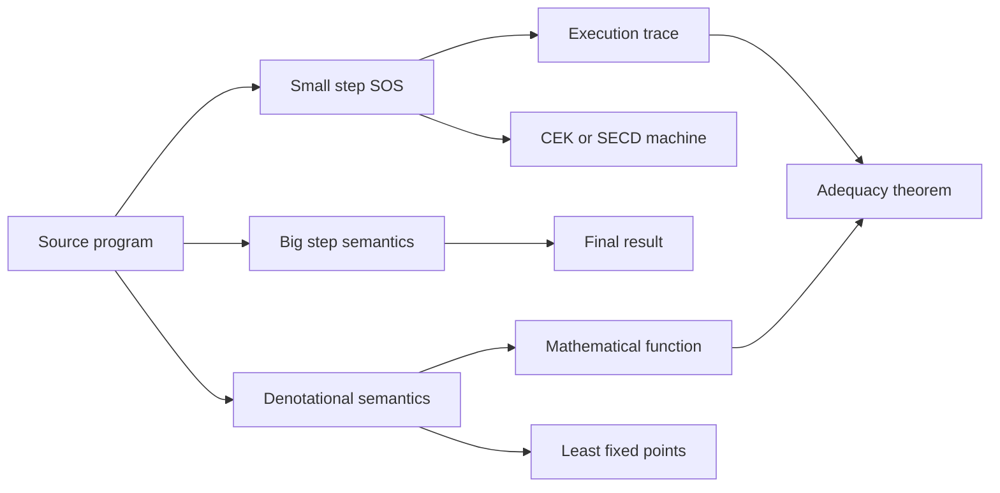

# Operational and Denotational Semantics

Semantics answers the question "what does this program mean?" Operational semantics answers by describing execution steps. Denotational semantics answers by mapping syntax into mathematical objects. TAPL mostly uses small-step operational semantics because it supports type-safety proofs and interpreters; the formal-semantics source emphasizes the broader family of structural operational, natural, denotational, continuation, and fixed-point techniques; Winskel's classic account gives the domain-theoretic bridge between computation and meaning [1], [2], [3].

The two styles are complementary. Operational rules are close to abstract machines, debuggers, and interpreters. Denotational semantics is better for compositional reasoning, equivalence, recursion via least fixed points, and language-independent mathematical models. A serious PL account often proves that the two agree for a core language, then uses whichever style makes a theorem cleaner.

## Definitions

A **configuration** packages the current program fragment with its runtime state. For a small imperative language, configurations might be $\langle c,\sigma\rangle$, where $c$ is a command and $\sigma$ is a store mapping variables to values. A **small-step** semantics is a transition relation:

$$
\langle c,\sigma\rangle \to \langle c',\sigma'\rangle.
$$

It describes one atomic execution step. Its reflexive transitive closure $\to^*$ describes zero or more steps. A **big-step** or **natural** semantics relates a whole program to its final result:

$$
\langle c,\sigma\rangle \Downarrow \sigma'.
$$

Structural operational semantics (SOS) gives syntax-directed inference rules. For sequencing:

$$
\frac{\langle c_1,\sigma\rangle \to \langle c_1',\sigma'\rangle}
{\langle c_1;c_2,\sigma\rangle \to \langle c_1';c_2,\sigma'\rangle}
\qquad
\frac{}{\langle \textsf{skip};c_2,\sigma\rangle \to \langle c_2,\sigma\rangle}.
$$

Denotational semantics assigns a semantic function to each syntactic category. Expressions may denote functions from states to values:

$$
\mathcal{E}\llbracket e \rrbracket : State \to Value.
$$

Commands may denote partial functions from states to states:

$$
\mathcal{C}\llbracket c \rrbracket : State \rightharpoonup State.
$$

Partiality models nontermination or runtime failure. Domain theory makes this precise by ordering approximations. A **complete partial order** (CPO) has a least element $\bot$ and least upper bounds for directed chains. A function $F:D\to D$ is Scott-continuous if it preserves directed least upper bounds. The least fixed point is

$$
\mathrm{lfp}(F)=\bigsqcup_{n\ge 0} F^n(\bot).
$$

This is the standard denotation of recursion and `while` loops.

An **abstract machine** refines operational semantics by making evaluation contexts explicit. The SECD machine has Stack, Environment, Control, and Dump components; the CEK machine has Control, Environment, and Continuation. Both transform high-level evaluation into a state-transition system [2], [4].

## Key results

**Small-step and big-step agreement for terminating programs.** For deterministic languages without abnormal control, $\langle c,\sigma\rangle \Downarrow \sigma'$ iff $\langle c,\sigma\rangle \to^* \langle \textsf{skip},\sigma'\rangle$. The proof goes in two directions. Big-step-to-small-step is by induction on the big-step derivation. Small-step-to-big-step is by induction on the length of the small-step sequence, with lemmas for sequencing and conditionals.

**Determinism.** A small-step semantics is deterministic when $t\to t_1$ and $t\to t_2$ imply $t_1=t_2$. Determinism is usually proved by induction on one derivation and inversion on the other. It matters because it lets us speak of "the" result of running a program, rather than a set of possible results.

**Safety.** A semantics defines which configurations are terminal and which are stuck. A language is safe for a class of programs when well-formed programs either reach a final configuration, diverge through an infinite sequence, or take a specified error transition. They do not enter an undefined stuck state.

**Compositionality.** A denotational semantics is compositional when the meaning of a phrase is built from the meanings of its immediate subphrases. For example,

$$
\mathcal{C}\llbracket c_1;c_2 \rrbracket =
\mathcal{C}\llbracket c_2 \rrbracket \circ \mathcal{C}\llbracket c_1 \rrbracket.
$$

This is why denotational definitions are useful for equivalence reasoning: if two commands have the same denotation, replacing one with the other preserves program meaning in all contexts.

**Least fixed points for loops.** The command `while b do c` denotes the least fixed point of a functional:

$$
F(g)(\sigma)=
\begin{cases}
g(\mathcal{C}\llbracket c \rrbracket(\sigma)) & \text{if } \mathcal{B}\llbracket b \rrbracket(\sigma)=\textsf{true}\\
\sigma & \text{if } \mathcal{B}\llbracket b \rrbracket(\sigma)=\textsf{false}.
\end{cases}
$$

The least fixed point chooses the least-defined solution, which corresponds to finite unrollings plus divergence when no finite exit exists [3].

**Operational-denotational adequacy.** Adequacy states that the denotation predicts observable execution. For a simple deterministic command language:

$$
\mathcal{C}\llbracket c \rrbracket(\sigma)=\sigma'
\quad\text{iff}\quad
\langle c,\sigma\rangle \Downarrow \sigma'.
$$

Proofs usually proceed by induction on syntax for nonrecursive constructs and by fixed-point induction for loops or recursive procedures.

**Divergence requires care.** A naive big-step relation only records terminating evaluations, so an infinite loop and a stuck program may both have no derivation. There are several repairs. One can add a coinductive big-step relation for divergence, add explicit error results, or use small-step traces as the primary account of nontermination. This is why TAPL's type-safety theorem normally uses small-step semantics: "not stuck" is visible one transition at a time [1]. Denotational semantics handles divergence with $\bot$, but then adequacy must say exactly how $\bot$ corresponds to missing termination in the operational account.

**CEK and SECD as implementation bridges.** Reduction rules for lambda terms can leave evaluation contexts implicit. Abstract machines make them explicit. The CEK machine state $(C,E,K)$ stores the control expression, an environment for free variables, and a continuation describing what remains to do. The SECD machine state $(S,E,C,D)$ separates an operand stack, environment, control list, and dump for saved continuations. These machines are not merely implementation tricks: they can be derived from evaluators and used as semantic artifacts. They also explain why compilers introduce closures, environments, and continuations even when the source calculus only has substitution.

**Choosing a semantic style.** Small-step semantics is usually the best first choice for concurrency, exceptions, interleavings, and type soundness. Big-step semantics is concise for definitional interpreters and terminating evaluators. Denotational semantics is strongest when reasoning about equivalence, recursion, and compositional meaning. A mature language definition may include all three: operational rules for implementers, denotational clauses for mathematical reasoning, and an adequacy theorem connecting them.

**Contextual equivalence.** Two phrases are contextually equivalent when no enclosing program context can distinguish them by any observation the language defines. Operationally, this is hard because it quantifies over all contexts. Denotational semantics can simplify the problem: if the denotations are equal and the semantics is compositional and adequate, then no context can distinguish the phrases. This is one reason denotational semantics remains valuable even when an implementation is operational.

For students, the practical test is to ask what observation counts: final integer result, termination, printed output, exceptions, store contents, or communication trace. Changing the observation changes the equivalence.

## Visual



| Style | Judgment shape | Best for | Main limitation |
|---|---|---|---|
| Small-step | $t \to t'$ | interleaving, stuck states, type safety | long traces for whole programs |
| Big-step | $t \Downarrow v$ | terminating evaluation | hides divergence unless extended |
| Denotational | $\llbracket t\rrbracket$ | equivalence, recursion, compositionality | requires semantic domains |
| Abstract machine | machine state transition | implementation model | more administrative detail |

## Worked example 1: deriving a small-step trace

Problem: evaluate the command

```text
x := 1;
y := x + 2
```

from the initial state $\sigma_0$ where $x=0$ and $y=0$.

Step 1: assignment updates the store:

$$
\langle x:=1,\sigma_0\rangle \to \langle \textsf{skip},\sigma_1\rangle
$$

where $\sigma_1=\sigma_0[x\mapsto 1]$, so $\sigma_1(x)=1$ and $\sigma_1(y)=0$.

Step 2: sequencing propagates the first command's step:

$$
\langle x:=1; y:=x+2,\sigma_0\rangle
\to
\langle \textsf{skip}; y:=x+2,\sigma_1\rangle.
$$

Step 3: remove the leading `skip`:

$$
\langle \textsf{skip}; y:=x+2,\sigma_1\rangle
\to
\langle y:=x+2,\sigma_1\rangle.
$$

Step 4: evaluate the expression in $\sigma_1$:

$$
\mathcal{E}\llbracket x+2\rrbracket(\sigma_1)=1+2=3.
$$

Step 5: update $y$:

$$
\langle y:=x+2,\sigma_1\rangle
\to
\langle \textsf{skip},\sigma_2\rangle
$$

where $\sigma_2=\sigma_1[y\mapsto 3]$. The checked final state is $x=1$, $y=3$.

## Worked example 2: denotation of a loop by approximation

Problem: compute the effect of

```text
while x > 0 do x := x - 1
```

on a state with $x=2$.

Let $F$ be the loop functional:

$$
F(g)(\sigma)=
\begin{cases}
g(\sigma[x\mapsto \sigma(x)-1]) & \sigma(x)>0\\
\sigma & \sigma(x)\le 0.
\end{cases}
$$

The denotation is $\mathrm{lfp}(F)=\bigsqcup_n F^n(\bot)$.

Step 1: $F^0(\bot)=\bot$, undefined for every input.

Step 2: $F^1(\bot)$ handles states already satisfying $x\le 0$:

$$
F(\bot)(\sigma)=\sigma \quad \text{if } \sigma(x)\le 0.
$$

For $x=2$, it is still undefined because one recursive loop call is needed.

Step 3: $F^2(\bot)$ handles states with $x=1$:

$$
F^2(\bot)(x=1)=F(\bot)(x=0)=x=0.
$$

For $x=2$, it is still undefined.

Step 4: $F^3(\bot)$ handles states with $x=2$:

$$
F^3(\bot)(x=2)=F^2(\bot)(x=1)=x=0.
$$

Therefore the least fixed point maps the initial state $x=2$ to the final state $x=0$. The approximation index corresponds to the number of loop tests and unfoldings required to witness termination.

## Code

```python
def eval_expr(expr, store):
    tag = expr[0]
    if tag == "num":
        return expr[1]
    if tag == "var":
        return store[expr[1]]
    if tag == "add":
        return eval_expr(expr[1], store) + eval_expr(expr[2], store)

def step(config):
    cmd, store = config
    tag = cmd[0]
    if tag == "skip":
        return None
    if tag == "assign":
        _, name, expr = cmd
        new_store = dict(store)
        new_store[name] = eval_expr(expr, store)
        return (("skip",), new_store)
    if tag == "seq":
        _, first, second = cmd
        if first[0] == "skip":
            return (second, store)
        next_first, next_store = step((first, store))
        return (("seq", next_first, second), next_store)
    raise ValueError(f"unknown command {tag}")
```

## Common pitfalls

- Treating big-step semantics as if it automatically distinguishes divergence from stuckness.
- Forgetting to include the store, environment, heap, or continuation in configurations.
- Writing non-syntax-directed SOS rules that make induction on derivations harder than necessary.
- Assuming deterministic rules when the language has concurrency or unspecified evaluation order.
- Confusing denotational equality with syntactic equality; denotationally equal programs may look different.
- Using ordinary sets of values for recursion without a bottom element or approximation order.
- Choosing an arbitrary fixed point instead of the least fixed point for recursive definitions.
- Reversing composition order in the denotation of sequencing.
- Treating abstract machines as unrelated to semantics; they are operational semantics with explicit control.
- Ignoring errors and exceptions; a total state-to-state function is often too simple.
- Believing adequacy is automatic; it is a theorem connecting two definitions.
- Trying to prove loop equivalence without an invariant or fixed-point principle.

## Connections

- [Untyped and Typed Lambda Calculus](/cs/programming-language-theory/untyped-and-typed-lambda-calculus) supplies the reduction model used in functional languages.
- [Type Systems and Type Soundness](/cs/programming-language-theory/type-systems-and-type-soundness) uses small-step semantics to define progress and preservation.
- [Axiomatic Semantics and Program Logic](/cs/programming-language-theory/axiomatic-semantics-and-program-logic) reasons about commands with assertions instead of traces.
- [Dataflow Analysis and Abstract Interpretation](/cs/programming-language-theory/dataflow-and-abstract-interpretation) abstracts semantic traces into computable approximations.
- [Compilers](/cs/compilers/intro) connects abstract machines to bytecode interpreters and IR execution.
- [Theory of Computation](/cs/theory/intro), [Discrete Math](/math/discrete/intro), and [Cryptography](/cs/cryptography/intro) provide computability, relation, and verification context.

## References

[1] B. C. Pierce, *Types and Programming Languages*. MIT Press, 2002.  
[2] K. Slonneger and B. L. Kurtz, *Formal Syntax and Semantics of Programming Languages*. Addison-Wesley, 1995.  
[3] G. Winskel, *The Formal Semantics of Programming Languages*. MIT Press, 1993.  
[4] P. J. Landin, "The mechanical evaluation of expressions," *The Computer Journal*, 1964.  
[5] G. D. Plotkin, "A structural approach to operational semantics," Aarhus University technical report, 1981.  
[6] D. Scott and C. Strachey, "Toward a mathematical semantics for computer languages," 1971.
