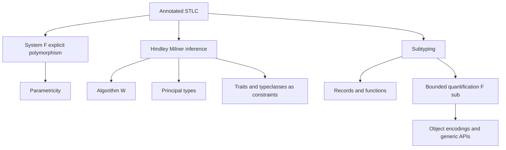

# Polymorphism, Subtyping, and Type Inference

Simple types classify terms but are deliberately modest. Real languages need reusable functions, records that can be passed where fewer fields are needed, and inference so programmers do not annotate every expression. TAPL develops these extensions in detail: ML-style reconstruction, System F, existential types, subtyping, bounded quantification, and higher-order systems [1]. Software Foundations reinforces the proof style, while program-analysis texts connect inference constraints with broader static analysis [2], [3].

The core tension is expressiveness versus decidability and usability. System F makes polymorphism explicit and powerful, but full inference is undecidable. Hindley-Milner gives principal types for a large ML-like fragment, but restricts where polymorphism is introduced. Subtyping models substitutability, but interacts with inference and variance in subtle ways.

## Definitions

**Parametric polymorphism** allows one term to work uniformly for many types. In System F, types include variables and universal quantification:

$$
T ::= X \mid T\to T \mid \forall X.T.
$$

Terms include type abstraction and type application:

$$
t ::= x \mid \lambda x:T.t \mid t\ t \mid \Lambda X.t \mid t[T].
$$

The key rules are

$$
\frac{\Gamma \vdash t:T \quad X\notin FV(\Gamma)}
{\Gamma \vdash \Lambda X.t:\forall X.T}
\qquad
\frac{\Gamma\vdash t:\forall X.T}
{\Gamma\vdash t[S]:[X\mapsto S]T}.
$$

**Let-polymorphism** generalizes types at `let` bindings. In ML notation:

$$
\textsf{let}\ id = \lambda x.x\ \textsf{in}\ (id\ 3,\ id\ \textsf{true})
$$

is accepted because `id` is generalized to $\forall A.A\to A$ and instantiated separately at `Int` and `Bool`.

**Hindley-Milner inference** assigns principal type schemes without most annotations. It uses type variables, unification constraints, generalization, and instantiation. A type scheme is $\forall \alpha_1\ldots\alpha_n.T$. The principal type is the most general type from which all other valid types can be obtained by substitution [4], [5].

**Subtyping** is a preorder $S\lt :T$, read "an $S$ may be used where a $T$ is expected." The subsumption rule is

$$
\frac{\Gamma\vdash t:S \quad S<:T}{\Gamma\vdash t:T}.
$$

For records, width subtyping allows extra fields:

$$
\{a:A,b:B\}<:\{a:A\}.
$$

Depth subtyping allows field types to vary covariantly for immutable records:

$$
S<:T \Rightarrow \{a:S\}<:\{a:T\}.
$$

Permutation subtyping ignores field order. Function subtyping is contravariant in the argument and covariant in the result:

$$
S_2<:S_1 \quad T_1<:T_2 \Rightarrow S_1\to T_1 <: S_2\to T_2.
$$

**Bounded quantification** in System F&lt;: restricts type variables:

$$
\forall X<:T.U.
$$

This expresses APIs such as "for any subtype of `Comparable`, return a result depending on that type."

Higher-rank polymorphism permits universal types to appear as function arguments. GADTs refine result types by constructors. Typeclasses and Rust traits provide ad-hoc polymorphism through dictionaries or monomorphized dispatch, complementing parametric polymorphism.

## Key results

**Parametricity.** A closed System F term of type $\forall X.X\to X$ behaves like identity: it cannot inspect values of unknown type $X$. Relational parametricity is deeper than typechecking; it gives "theorems for free" about polymorphic programs [6].

**Principal types in Hindley-Milner.** If an expression is typable in the HM fragment, Algorithm W computes a principal type scheme. Every other valid type is an instance of it. The proof relies on soundness and completeness of unification plus induction over expression structure [4], [5].

**Unification produces most-general unifiers.** Given equations between first-order type expressions, unification either fails or returns a substitution $\theta$ such that every other solution factors through $\theta$. The occurs check prevents infinite types such as $\alpha = \alpha \to \beta$.

**Subtyping is structural for records and arrows.** Width, depth, and permutation rules capture substitutability for immutable records. Function argument contravariance is the rule students most often reverse: a function that accepts a broader input can stand in for one that only needs to accept a narrower input.

**Value restriction.** In impure ML-like languages, unrestricted let-generalization is unsound with mutable references. The value restriction generalizes only syntactic values or non-expansive expressions, preserving safety in the presence of effects.

**Inference with subtyping is harder.** Full combinations of HM-style inference and expressive subtyping can lose principal types or require constraint solving beyond simple unification. Practical languages choose restricted forms: local inference, bidirectional checking, trait constraints, or explicit annotations.

**Elaboration explains implementation.** A source language may present implicit polymorphism, typeclasses, or traits, but a compiler often elaborates this into a smaller explicitly typed core. An HM `let` binding can elaborate to type abstraction and type application in a System-F-like intermediate language. A Haskell typeclass call can elaborate to an extra dictionary argument containing the overloaded operations. Rust trait dispatch may monomorphize generic functions or use dynamic dispatch through trait objects. These elaborations are useful because they separate surface ergonomics from the metatheory of a smaller target calculus.

**Bidirectional checking.** Many modern typed languages use two mutually reinforcing judgments: checking, where an expression is checked against a known type, and synthesis, where an expression produces a type. Lambda abstractions are easy to check against an arrow type but hard to synthesize without annotations. Variables and applications often synthesize. Bidirectional typing supports higher-rank polymorphism and local inference without pretending that full inference is decidable. It also improves error messages because expected types flow inward through the syntax.

**Parametricity has design consequences.** A function of type $\forall A. A\to A$ cannot manufacture an arbitrary $A$ or inspect one, so it must return its argument or diverge in a language with nontermination. But adding effects, type reflection, unsafe casts, or ad-hoc overloading weakens that reasoning. This is why polymorphism is not just a notation for generics; it is a semantic promise about uniformity, and language features determine how strong that promise remains.

**Subtyping algorithms need normalization.** Declarative subtyping rules are written for clarity, not always for direct execution. Record permutation, transitivity, and bounded quantification can make naive proof search loop or branch wildly. Implementations often use algorithmic subtyping, which orients rules, removes admissible transitivity where possible, and normalizes record field order. TAPL separates declarative and algorithmic systems to prove that the checker is sound and complete for the intended subtyping relation [1]. This distinction mirrors the gap between a mathematical specification and a compiler implementation.

The same lesson applies to inference: a declarative typing rule may be elegant, while the implementation needs a syntax-directed algorithm, fresh-name discipline, and explicit failure modes.

## Visual



| Feature | Typical notation | Strength | Cost |
|---|---|---|---|
| System F | $\forall X.T$ | explicit impredicative polymorphism | full inference undecidable |
| Let-polymorphism | `let id = ...` | ergonomic reuse | polymorphism mostly at lets |
| HM inference | Algorithm W | principal types | limited subtyping and higher rank |
| Record subtyping | `{a,b} <: {a}` | flexible structural APIs | variance rules matter |
| Bounded quantification | $\forall X\lt :T.U$ | generic code with subtype bounds | more complex metatheory |
| Typeclasses/traits | constraints | ad-hoc overloaded operations | coherence and dispatch rules |

## Worked example 1: Algorithm W for `let id = fun x -> x in id id`

Problem: infer a principal type for

```ocaml
let id = fun x -> x in id id
```

Step 1: infer the type of `fun x -> x`. Give `x` a fresh type variable $\alpha$. The body `x` has type $\alpha$, so

$$
\lambda x.x : \alpha \to \alpha.
$$

Step 2: generalize at the `let`. Since $\alpha$ is not free in the environment,

$$
id : \forall \alpha.\alpha\to\alpha.
$$

Step 3: infer `id id`. Instantiate the function occurrence of `id` with a fresh type:

$$
id_1 : \beta \to \beta.
$$

Instantiate the argument occurrence separately:

$$
id_2 : \gamma \to \gamma.
$$

Step 4: application requires the function domain to match the argument type. Generate a fresh result type $\delta$ and constraint

$$
\beta \to \beta = (\gamma \to \gamma) \to \delta.
$$

Step 5: unify. The left side is an arrow, so match domains and codomains:

$$
\beta = \gamma \to \gamma
\qquad
\beta = \delta.
$$

Thus $\delta = \gamma \to \gamma$.

Step 6: the expression has type

$$
\gamma \to \gamma.
$$

Generalizing the whole expression would yield $\forall \gamma.\gamma\to\gamma$ if it were bound by another `let`. The checked result is that `id id` is again identity-like, not a type error, because let-polymorphism instantiated `id` twice.

## Worked example 2: checking function subtyping

Problem: decide whether

$$
\textsf{Animal}\to\textsf{Dog} <: \textsf{Dog}\to\textsf{Animal}
$$

assuming $\textsf{Dog}\lt :\textsf{Animal}$.

Step 1: use the function subtyping rule:

$$
S_1\to T_1 <: S_2\to T_2
\quad\text{iff}\quad
S_2<:S_1 \text{ and } T_1<:T_2.
$$

Step 2: identify

$$
S_1=\textsf{Animal},\quad T_1=\textsf{Dog},\quad
S_2=\textsf{Dog},\quad T_2=\textsf{Animal}.
$$

Step 3: check the argument side contravariantly:

$$
S_2<:S_1 \quad \text{means} \quad \textsf{Dog}<:\textsf{Animal},
$$

which is true.

Step 4: check the result side covariantly:

$$
T_1<:T_2 \quad \text{means} \quad \textsf{Dog}<:\textsf{Animal},
$$

also true.

Step 5: conclude

$$
\textsf{Animal}\to\textsf{Dog} <: \textsf{Dog}\to\textsf{Animal}.
$$

Intuition check: a context expecting a function from dogs to animals may safely receive a function that accepts any animal and returns a dog. It will only pass dogs, and receiving a dog is acceptable where an animal is expected.

## Code

```python
def occurs(name, ty):
    tag = ty[0]
    if tag == "var":
        return ty[1] == name
    if tag == "arrow":
        return occurs(name, ty[1]) or occurs(name, ty[2])
    return False

def apply_subst(subst, ty):
    if ty[0] == "var" and ty[1] in subst:
        return apply_subst(subst, subst[ty[1]])
    if ty[0] == "arrow":
        return ("arrow", apply_subst(subst, ty[1]), apply_subst(subst, ty[2]))
    return ty

def unify(equations):
    subst = {}
    while equations:
        left, right = equations.pop()
        left, right = apply_subst(subst, left), apply_subst(subst, right)
        if left == right:
            continue
        if left[0] == "var":
            if occurs(left[1], right):
                raise TypeError("occurs check failed")
            subst[left[1]] = right
        elif right[0] == "var":
            equations.append((right, left))
        elif left[0] == right[0] == "arrow":
            equations.append((left[1], right[1]))
            equations.append((left[2], right[2]))
        else:
            raise TypeError(f"cannot unify {left} with {right}")
    return subst
```

## Common pitfalls

- Confusing parametric polymorphism with overloading; parametric code is uniform across types.
- Forgetting to instantiate a polymorphic `let` binding at each use.
- Generalizing lambda parameters in HM; generalization happens at `let`, not every binder.
- Skipping the occurs check and accidentally accepting infinite types.
- Assuming System F has full type inference; annotations or bidirectional restrictions are needed.
- Reversing function subtyping variance.
- Applying record depth subtyping to mutable fields without accounting for write safety.
- Treating subclassing and subtyping as identical; nominal languages may separate them.
- Expecting subtyping plus HM inference to always have principal types.
- Ignoring value restriction in languages with references.
- Assuming GADTs are just algebraic datatypes; constructors refine type equalities.
- Treating Rust traits as exactly Haskell typeclasses; coherence, ownership, and monomorphization affect behavior.

## Connections

- [Type Systems and Type Soundness](/cs/programming-language-theory/type-systems-and-type-soundness) supplies the preservation/progress obligations for these richer systems.
- [Untyped and Typed Lambda Calculus](/cs/programming-language-theory/untyped-and-typed-lambda-calculus) is the base calculus extended here.
- [Dependent Types and Proof Assistants](/cs/programming-language-theory/dependent-types-and-proof-assistants) continues from universal quantification to terms indexed by values.
- [Dataflow Analysis and Abstract Interpretation](/cs/programming-language-theory/dataflow-and-abstract-interpretation) shares constraint-solving themes with type inference.
- [Compilers](/cs/compilers/intro), [Theory of Computation](/cs/theory/intro), [Discrete Math](/math/discrete/intro), and [Cryptography](/cs/cryptography/intro) connect inference to implementation, decidability, partial orders, and verified APIs.

## References

[1] B. C. Pierce, *Types and Programming Languages*. MIT Press, 2002.  
[2] B. C. Pierce et al., *Software Foundations*, electronic textbook series.  
[3] F. Nielson, H. R. Nielson, and C. Hankin, *Principles of Program Analysis*. Springer, 1999.  
[4] R. Hindley, "The principal type-scheme of an object in combinatory logic," *Transactions of the American Mathematical Society*, 1969.  
[5] R. Milner, "A theory of type polymorphism in programming," *Journal of Computer and System Sciences*, 1978.  
[6] J. C. Reynolds, "Types, abstraction and parametric polymorphism," 1983.  
[7] L. Cardelli and P. Wegner, "On understanding types, data abstraction, and polymorphism," *ACM Computing Surveys*, 1985.
