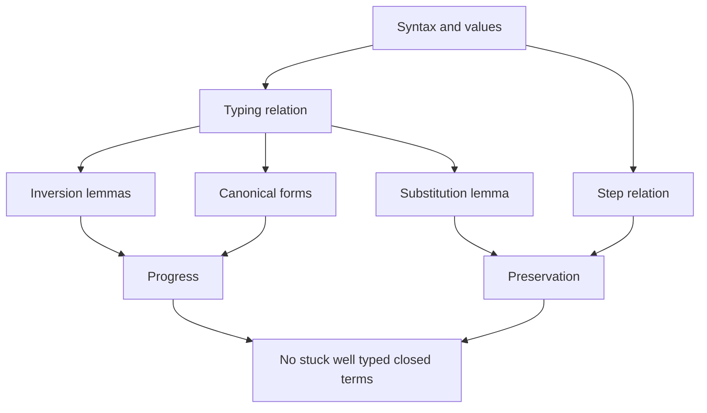

# Type Systems and Type Soundness

A type system is a static discipline for classifying program phrases before they run. The important claim is not merely "the checker accepts this program"; it is "accepted programs cannot go wrong in the specific ways the language definition rules out." TAPL gives the standard proof architecture through progress and preservation, while Software Foundations shows how the same proof skeleton becomes a mechanized theorem over inductive syntax, relations, and derivations [1], [2].

Type soundness is a contract between syntax, static semantics, and dynamic semantics. Change one rule and the proof may fail. This is why PL texts spend so much time on canonical forms, inversion lemmas, substitution lemmas, and derivation induction: they are the working parts that make the slogan precise.

## Definitions

A **typing judgment** has the form $\Gamma \vdash t : T$, meaning term $t$ has type $T$ under context $\Gamma$. A context is a finite map from variables to types. A **typing derivation** is a tree built from typing rules. For STLC:

$$
\frac{x:T \in \Gamma}{\Gamma \vdash x:T}
\qquad
\frac{\Gamma,x:T_1 \vdash t:T_2}{\Gamma \vdash \lambda x:T_1.t:T_1\to T_2}
\qquad
\frac{\Gamma \vdash t_1:T_1\to T_2 \quad \Gamma \vdash t_2:T_1}{\Gamma \vdash t_1\ t_2:T_2}.
$$

A **value** is a completed result. For STLC functions, values include lambda abstractions. In richer languages values also include booleans, numbers, records, locations, and variants. A term is **stuck** if it is not a value and no evaluation rule applies.

The two central soundness properties are:

$$
\textbf{Progress:}\quad
\emptyset \vdash t:T \Rightarrow t\ \text{is a value or}\ \exists t'.\ t\to t'.
$$

$$
\textbf{Preservation:}\quad
\Gamma \vdash t:T \land t\to t' \Rightarrow \Gamma \vdash t':T.
$$

Preservation is also called **subject reduction**. The combined theorem is **type soundness**: a closed well-typed term never reaches a stuck state.

Several auxiliary lemmas appear repeatedly:

- **Weakening:** adding unused assumptions to $\Gamma$ preserves typing.
- **Exchange:** reordering independent context assumptions preserves typing.
- **Substitution:** if $\Gamma,x:S \vdash t:T$ and $\Gamma \vdash s:S$, then $\Gamma \vdash [x\mapsto s]t:T$.
- **Inversion:** if a judgment was derived, its last rule determines necessary premises.
- **Canonical forms:** if a closed value has a certain type, it must have a corresponding syntactic form.

Undefined behavior changes the theorem. In a safe language, an invalid operation becomes a specified error, rejection by the typechecker, or an impossible state. In an unsafe language, some operations are deliberately outside the semantics, so soundness applies only to a restricted fragment or a separate safety policy.

## Key results

**Canonical forms for functions.** If $\emptyset \vdash v:T_1\to T_2$ and $v$ is a value, then $v=\lambda x:T_1.t$ for some $x$ and $t$. Proof: inspect the grammar of values and typing rules. In pure STLC, the only value-form that can have an arrow type is an abstraction.

**Substitution lemma.** If $\Gamma,x:S \vdash t:T$ and $\Gamma \vdash s:S$, then $\Gamma \vdash [x\mapsto s]t:T$. Proof is by induction on the typing derivation of $t$. The variable case splits on whether the variable is $x$. The abstraction case requires choosing bound names to avoid capture, or using de Bruijn indices. TAPL highlights this as the proof step where informal substitution errors usually surface [1].

**Progress theorem for STLC.** Suppose $\emptyset \vdash t:T$. Proceed by induction on the typing derivation. Variables cannot occur because the context is empty. For abstractions, the term is already a value. For applications, the induction hypotheses say $t_1$ is a value or steps, and $t_2$ is a value or steps. If either steps, the application steps by a congruence rule. If both are values, canonical forms says $t_1$ is a lambda, so beta-reduction applies.

**Preservation theorem for STLC.** Suppose $\Gamma \vdash t:T$ and $t\to t'$. Induct on the step derivation. Congruence cases rebuild the same typing rule after applying the induction hypothesis. The beta case is:

$$
(\lambda x:S.t_{12})\ v_2 \to [x\mapsto v_2]t_{12}.
$$

Typing inversion gives $\Gamma,x:S \vdash t_{12}:T$ and $\Gamma \vdash v_2:S$. The substitution lemma gives $\Gamma \vdash [x\mapsto v_2]t_{12}:T$.

**Safety corollary.** If $\emptyset \vdash t:T$ and $t\to^* u$, then $u$ is not stuck. Proof: preservation extends typing along $\to^*$; progress then applies to $u$.

**Mechanized proof structure.** Software Foundations formalizes syntax as inductive datatypes, typing as inductive propositions, and proofs as total programs in Coq or related systems. The paper proof and the mechanized proof have the same outline, but the mechanized version requires all administrative lemmas to be stated explicitly, especially context lookup, substitution, and determinism [2].

**Store typing for mutable references.** Once references are added, preservation is not just $\Gamma\vdash t:T$ and $t\to t'$ imply $\Gamma\vdash t':T$. Evaluation also changes the store. The proof introduces a store typing $\Sigma$ mapping locations to the types of values stored there, and the preservation statement becomes: if $\Gamma;\Sigma\vdash t:T$ and the runtime store matches $\Sigma$, then after a step there is an extended or updated store typing $\Sigma'$ such that $\Gamma;\Sigma'\vdash t':T$ and the new store matches $\Sigma'$. This is a good example of a proof invariant growing to match a language feature [1].

**Exceptions and errors.** Adding exceptions changes progress: an exception may be a final abnormal result, or it may step outward through evaluation contexts until a handler catches it. A division-by-zero check may step to a specified `error` term. In both cases, the theorem must classify these outcomes explicitly. A language is not safer because the proof ignores bad states; it is safer when every possible dynamic state is represented and handled by the semantics.

**Soundness versus expressiveness.** Type systems can reject useful programs. The interesting engineering question is whether the rejected programs are an acceptable cost for the guarantees gained. STLC rejects all general recursion, while ML adds recursion but retains type soundness by no longer guaranteeing termination. Rust adds ownership and borrowing to prove stronger memory safety properties, but programmers sometimes need explicit escape hatches. The proof method is the same discipline: specify the static judgment, specify execution, then prove the invariant actually holds.

**Canonical forms are type-specific.** Each new type constructor normally needs its own canonical-forms lemma. If a closed value has product type, it must be a pair. If it has sum type, it must be an injection. If it has record type, it must be a record value with the required fields. If it has reference type, it may be a location whose type is justified by the store typing. These lemmas look routine, but they are where mismatches between value syntax and typing rules become visible. A missing value form or an overly permissive typing rule can break progress immediately.

## Visual



| Lemma | Typical induction target | Why it is needed |
|---|---|---|
| Weakening | typing derivation | contexts grow under binders |
| Substitution | typing derivation | beta-reduction removes binders |
| Inversion | typing derivation shape | recovers premises from conclusions |
| Canonical forms | value syntax | proves a value can actually compute |
| Preservation | step derivation | keeps type invariant across execution |
| Progress | typing derivation | rules out stuck closed terms |

## Worked example 1: proving progress for a boolean conditional

Problem: prove the conditional case of progress for a language with booleans:

$$
\frac{\Gamma\vdash t_1:\textsf{Bool}\quad \Gamma\vdash t_2:T\quad \Gamma\vdash t_3:T}
{\Gamma\vdash \textsf{if}\ t_1\ \textsf{then}\ t_2\ \textsf{else}\ t_3:T}.
$$

Assume the whole term is closed and well typed:

$$
\emptyset \vdash \textsf{if}\ t_1\ \textsf{then}\ t_2\ \textsf{else}\ t_3:T.
$$

Step 1: by inversion on the typing derivation:

$$
\emptyset\vdash t_1:\textsf{Bool},\quad
\emptyset\vdash t_2:T,\quad
\emptyset\vdash t_3:T.
$$

Step 2: apply the induction hypothesis to $t_1$. Since $t_1$ is closed and well typed, either $t_1$ is a value or $t_1\to t_1'$.

Step 3: if $t_1\to t_1'$, then the whole conditional steps:

$$
\textsf{if}\ t_1\ \textsf{then}\ t_2\ \textsf{else}\ t_3
\to
\textsf{if}\ t_1'\ \textsf{then}\ t_2\ \textsf{else}\ t_3.
$$

Step 4: if $t_1$ is a value, canonical forms for booleans says $t_1$ is either $\textsf{true}$ or $\textsf{false}$.

Step 5: if $t_1=\textsf{true}$, the term steps to $t_2$; if $t_1=\textsf{false}$, it steps to $t_3$. In every case, the conditional is a value or can step. It is not a value syntactically, so it can step.

## Worked example 2: preservation for beta-reduction

Problem: prove preservation for

$$
(\lambda x:S.t_{12})\ v_2 \to [x\mapsto v_2]t_{12}.
$$

Assume

$$
\Gamma \vdash (\lambda x:S.t_{12})\ v_2 : T.
$$

Step 1: invert the application typing rule. There is some argument type $S$ such that

$$
\Gamma \vdash \lambda x:S.t_{12}:S\to T
\qquad
\Gamma \vdash v_2:S.
$$

Step 2: invert the abstraction typing rule:

$$
\Gamma,x:S \vdash t_{12}:T.
$$

Step 3: apply the substitution lemma using $\Gamma,x:S \vdash t_{12}:T$ and $\Gamma\vdash v_2:S$:

$$
\Gamma \vdash [x\mapsto v_2]t_{12}:T.
$$

Step 4: this is exactly the required typing judgment for the reduct. The important check is that the type $T$ is unchanged. Evaluation removed syntax but did not change the static classification of the program.

## Code

```coq
Inductive ty : Type :=
| TBool : ty
| TArrow : ty -> ty -> ty.

Inductive tm : Type :=
| tru : tm
| fls : tm
| var : nat -> tm
| abs : nat -> ty -> tm -> tm
| app : tm -> tm -> tm.

Inductive value : tm -> Prop :=
| v_true : value tru
| v_false : value fls
| v_abs : forall x T body, value (abs x T body).

(* A real development defines contexts, substitution, and step.
   The safety theorem then has the standard shape: *)
Theorem progress_shape :
  forall t T, (* empty |- t : T *) True ->
  value t \/ exists t', (* t --> t' *) True.
Proof.
  intros. left. (* placeholder for the induction skeleton *)
  admit.
Admitted.
```

## Common pitfalls

- Proving progress for open terms; variables can be well typed under a context but cannot step by themselves.
- Forgetting canonical forms, then getting stuck in the application case of progress.
- Treating preservation as "the value has the same type" rather than "every single step preserves type."
- Proving substitution informally while ignoring variable capture.
- Stating weakening only for closed terms, making abstraction cases impossible.
- Using induction on syntax when induction on typing derivations is needed.
- Using induction on typing when induction on step derivations is cleaner for preservation.
- Failing to define runtime errors as values, steps, or stuck states before claiming safety.
- Assuming type soundness proves correctness; it proves absence of a class of runtime type errors, not functional correctness.
- Confusing dynamic type tags with static types; a language can use both.
- Adding references or exceptions and expecting the old proof to work unchanged.
- Ignoring stores in preservation for mutable languages; store typing becomes part of the invariant.

## Connections

- [Operational and Denotational Semantics](/cs/programming-language-theory/operational-and-denotational-semantics) defines the step relations used by progress and preservation.
- [Untyped and Typed Lambda Calculus](/cs/programming-language-theory/untyped-and-typed-lambda-calculus) provides the STLC core.
- [Polymorphism, Subtyping, and Type Inference](/cs/programming-language-theory/polymorphism-subtyping-and-inference) adds features that complicate inversion and preservation.
- [Dependent Types and Proof Assistants](/cs/programming-language-theory/dependent-types-and-proof-assistants) mechanizes these arguments.
- [Compilers](/cs/compilers/intro), [Theory of Computation](/cs/theory/intro), [Discrete Math](/math/discrete/intro), and [Cryptography](/cs/cryptography/intro) connect safety proofs to implementations, decidability, induction, and verified systems.

## References

[1] B. C. Pierce, *Types and Programming Languages*. MIT Press, 2002.  
[2] B. C. Pierce et al., *Software Foundations*, electronic textbook series.  
[3] R. Milner, "A theory of type polymorphism in programming," *Journal of Computer and System Sciences*, 1978.  
[4] A. K. Wright and M. Felleisen, "A syntactic approach to type soundness," *Information and Computation*, 1994.  
[5] G. D. Plotkin, "A structural approach to operational semantics," Aarhus University technical report, 1981.
