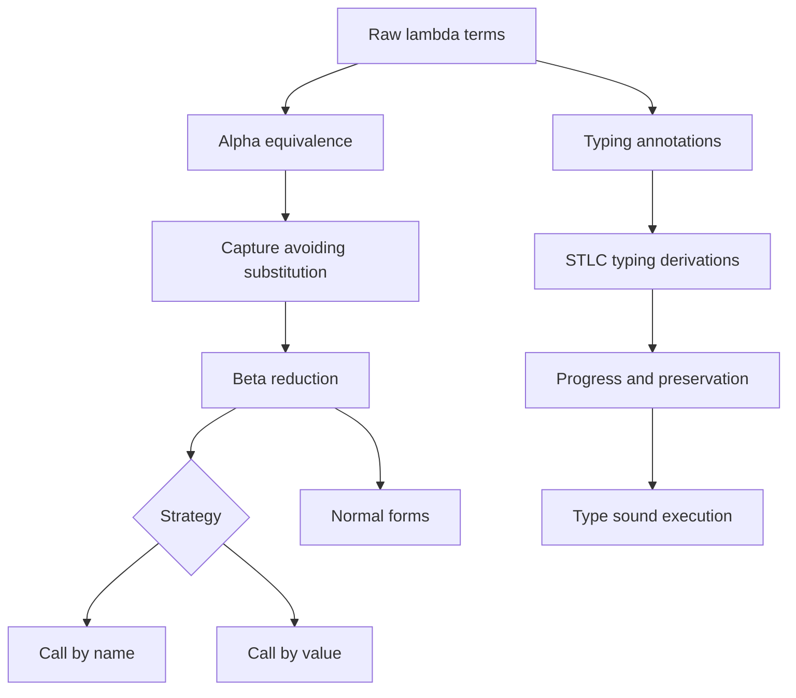

# Untyped and Typed Lambda Calculus


*Figure: Lambda terms reduce by beta-reduction, substituting argument for parameter. Image: [Wikimedia Commons](https://commons.wikimedia.org/wiki/File:Lambda_lc.svg), CC BY-SA.*

The lambda calculus is the small core language behind much of programming language theory: a program is a term, computation is substitution, and functions are ordinary values. TAPL treats it operationally, with careful attention to binding, reduction strategies, and implementations; the semantics text treats it as one of several formal semantic models; Software Foundations uses similar syntax and proof ideas to mechanize reasoning about small languages [1], [2], [3]. This page combines those angles: syntax first, then reduction, then typing.

The untyped calculus is powerful enough to encode natural numbers, booleans, recursion, and all computable functions, but it also admits meaningless self-application and nontermination. The simply typed lambda calculus (STLC) restricts terms with types, which rules out many stuck programs and gives a clean first example of type soundness. The price is expressiveness: plain STLC is strongly normalizing and cannot define general recursion without adding a fixed-point operator.

## Definitions

The pure untyped lambda calculus has terms

$$
t ::= x \mid \lambda x.t \mid t\ t
$$

where $x$ ranges over variables. A variable occurrence is **bound** if it lies inside the body of a matching $\lambda x$; otherwise it is **free**. The set of free variables is defined by

$$
\begin{aligned}
FV(x) &= \{x\} \\
FV(\lambda x.t) &= FV(t) \setminus \{x\} \\
FV(t_1\ t_2) &= FV(t_1) \cup FV(t_2).
\end{aligned}
$$

A term is **closed** when $FV(t)=\emptyset$. Substitution $[x \mapsto s]t$ replaces free occurrences of $x$ in $t$ by $s$, avoiding variable capture by renaming bound variables when necessary. The central computational rule is beta-reduction:

$$
(\lambda x.t)\ s \to_\beta [x \mapsto s]t.
$$

Alpha-conversion renames bound variables without changing meaning: $\lambda x.x$ and $\lambda y.y$ are the same up to alpha-equivalence. Eta-reduction expresses extensional equality of functions:

$$
\lambda x.(f\ x) \to_\eta f \quad \text{when } x \notin FV(f).
$$

A **redex** is a reducible expression, usually a beta-redex. A term is in **normal form** when it contains no redex. A **reduction strategy** chooses which redex to contract. Call-by-name reduces the outermost redex without first evaluating the argument. Call-by-value reduces an application only after the argument is a value, normally a lambda abstraction.

STLC adds types:

$$
T ::= \textsf{Bool} \mid \textsf{Nat} \mid T \to T
$$

and typing judgments $\Gamma \vdash t : T$, where $\Gamma$ maps variables to types. The core rules are:

$$
\frac{x:T \in \Gamma}{\Gamma \vdash x:T}
\qquad
\frac{\Gamma,x:T_1 \vdash t:T_2}{\Gamma \vdash \lambda x:T_1.t : T_1 \to T_2}
\qquad
\frac{\Gamma \vdash t_1:T_1 \to T_2 \quad \Gamma \vdash t_2:T_1}{\Gamma \vdash t_1\ t_2:T_2}.
$$

The Curry-Howard correspondence reads $T_1 \to T_2$ as implication, a lambda abstraction as a proof that assumes $T_1$ and derives $T_2$, and application as modus ponens [2], [4].

## Key results

**Church-Rosser confluence.** If $t \to^* u$ and $t \to^* v$, then there exists $w$ such that $u \to^* w$ and $v \to^* w$. Confluence means the final normal form, if it exists, is independent of the reduction path [5]. The proof is usually not by naive local confluence, because ordinary beta-reduction is not strongly normalizing in the untyped calculus. Standard presentations introduce parallel reduction, prove the diamond property for it, and show that ordinary beta-reduction has the same reflexive transitive closure.

**Normal-order completeness for normalization.** If an untyped term has a normal form, leftmost-outermost reduction finds it. This explains why call-by-name can terminate on examples where call-by-value diverges. For example, $(\lambda x.y)\ \Omega$, where $\Omega=(\lambda z.z\ z)(\lambda z.z\ z)$, reduces to $y$ under call-by-name but loops under call-by-value because the argument is evaluated first.

**Expressiveness of encodings.** Church numerals encode $n$ as a higher-order iterator:

$$
\overline{n} = \lambda f.\lambda x. f^n x.
$$

For instance, $\overline{2}=\lambda f.\lambda x.f(fx)$ and successor is

$$
\mathsf{succ}=\lambda n.\lambda f.\lambda x.f(n\ f\ x).
$$

This supports arithmetic without primitive numbers, showing that syntax plus beta-reduction already carries computation.

**Fixed points and recursion.** In the untyped calculus, the combinator

$$
Y = \lambda f.(\lambda x.f(x\ x))(\lambda x.f(x\ x))
$$

satisfies $YF \to_\beta F(YF)$. Thus recursion can be expressed as a fixed point. In strict call-by-value languages, the naive $Y$ forces self-application too early; a value-friendly variant such as $Z$ delays the recursive call under a lambda.

**STLC progress and preservation.** For a closed well-typed STLC term, either the term is a value or it can step. If a well-typed term steps, its type is preserved. Together, these theorems say well-typed STLC programs do not get stuck [1], [2].

**Strong normalization of pure STLC.** Every well-typed term in pure STLC terminates. TAPL presents normalization as an optional deeper result; its proof is typically by logical relations, assigning to each type a set of strongly normalizing terms. This theorem sharply separates STLC from the untyped calculus: self-application $\lambda x.x\ x$ is not typable in plain STLC.

**Binding representations matter.** The paper notation uses named variables because it is readable, but implementations and mechanized proofs often switch representations. A named representation needs alpha-renaming and freshness side conditions. De Bruijn indices replace variable names by numbers counting binders, so $\lambda x.\lambda y.x$ becomes $\lambda.\lambda.1$ and $\lambda a.\lambda b.a$ has the same representation. This removes alpha-equivalence as a separate quotient but makes shifting and substitution delicate. Locally nameless representations combine named free variables with nameless bound variables. TAPL uses nameless terms in an implementation chapter precisely because the mathematical convenience of "rename as needed" must eventually become an algorithm [1].

**Source emphasis.** TAPL treats the calculus as a running substrate for type systems, usually with call-by-value rules because they align with ML-family implementation. The formal-semantics source presents lambda calculus beside abstract machines such as SECD, emphasizing how reduction can be implemented as state transitions [3]. Software Foundations-style developments care about the same definitions but expose proof obligations that paper presentations hide: every substitution lemma, free-variable fact, and context convention must be explicit. A useful study habit is to read each beta-reduction both as informal algebra and as a candidate rule in an interpreter; any ambiguity about variables will show up immediately in the interpreter.

## Visual



| Concept | Untyped calculus | STLC |
|---|---|---|
| Function syntax | $\lambda x.t$ | $\lambda x:T.t$ |
| Application | unrestricted | argument type must match domain |
| Self-application | allowed | usually rejected |
| Recursion | definable with $Y$ | needs an added fix operator or recursive types |
| Normalization | not guaranteed | guaranteed for pure STLC |
| Main proof burden | confluence, substitution | substitution, progress, preservation |

## Worked example 1: reducing a Church numeral

Problem: show that $\mathsf{succ}\ \overline{2}$ behaves like $\overline{3}$.

Use the definitions:

$$
\begin{aligned}
\overline{2} &= \lambda f.\lambda x.f(fx) \\
\mathsf{succ} &= \lambda n.\lambda f.\lambda x.f(n\ f\ x).
\end{aligned}
$$

Step 1: apply successor to $\overline{2}$.

$$
\begin{aligned}
\mathsf{succ}\ \overline{2}
&= (\lambda n.\lambda f.\lambda x.f(n\ f\ x))(\lambda f.\lambda x.f(fx)) \\
&\to_\beta \lambda f.\lambda x.f((\lambda f.\lambda x.f(fx))\ f\ x).
\end{aligned}
$$

Step 2: reduce the encoded two inside the body. Rename bound variables to avoid confusion:

$$
\begin{aligned}
(\lambda g.\lambda y.g(g y))\ f\ x
&\to_\beta (\lambda y.f(fy))\ x \\
&\to_\beta f(fx).
\end{aligned}
$$

Step 3: substitute the result back into the outer body:

$$
\lambda f.\lambda x.f(f(fx)).
$$

This is exactly $\overline{3}$. A quick check is to apply it to a concrete function $S$ and seed $Z$:

$$
(\lambda f.\lambda x.f(f(fx)))\ S\ Z \to S(S(SZ)).
$$

## Worked example 2: why self-application is not typable in STLC

Problem: try to assign a type to $\lambda x.x\ x$ in STLC.

Step 1: assume the abstraction has some type $A \to B$. Then under the context $x:A$, the body $x\ x$ must have type $B$:

$$
x:A \vdash x\ x : B.
$$

Step 2: by the application typing rule, the left occurrence of $x$ must have a function type $C \to B$ and the right occurrence must have type $C$:

$$
x:A \vdash x:C \to B
\qquad
x:A \vdash x:C.
$$

Step 3: by the variable rule, both occurrences of $x$ have the type assigned in the context, so

$$
A = C \to B
\qquad
A = C.
$$

Step 4: combine the equations:

$$
C = C \to B.
$$

Plain STLC has finite simple types built from base types and arrows. No finite type $C$ can equal $C \to B$, because the right side has one more outer arrow constructor. Therefore the original term is untypable. This is not a syntactic accident; it is the mechanism that blocks the usual untyped fixed-point construction.

## Code

```python
from dataclasses import dataclass

@dataclass(frozen=True)
class Var:
    name: str

@dataclass(frozen=True)
class Lam:
    param: str
    body: object

@dataclass(frozen=True)
class App:
    fn: object
    arg: object

def free(t):
    if isinstance(t, Var):
        return {t.name}
    if isinstance(t, Lam):
        return free(t.body) - {t.param}
    return free(t.fn) | free(t.arg)

def subst(t, x, s):
    if isinstance(t, Var):
        return s if t.name == x else t
    if isinstance(t, Lam):
        if t.param == x:
            return t
        if t.param in free(s):
            raise ValueError("alpha-rename before substituting")
        return Lam(t.param, subst(t.body, x, s))
    return App(subst(t.fn, x, s), subst(t.arg, x, s))

def step_cbv(t):
    if isinstance(t, App) and isinstance(t.fn, Lam) and isinstance(t.arg, Lam):
        return subst(t.fn.body, t.fn.param, t.arg)
    if isinstance(t, App) and not isinstance(t.fn, Lam):
        return App(step_cbv(t.fn), t.arg)
    if isinstance(t, App) and not isinstance(t.arg, Lam):
        return App(t.fn, step_cbv(t.arg))
    raise StopIteration("normal form or stuck")
```

## Common pitfalls

- Treating alpha-equivalent terms as different programs; bound variable names are not semantically important.
- Performing substitution without capture avoidance, which can silently change a term's meaning.
- Assuming every term has a normal form; $\Omega$ is the standard counterexample.
- Confusing call-by-name with call-by-need; call-by-need shares evaluated thunks.
- Using the untyped $Y$ combinator directly in a strict language without delaying recursion.
- Forgetting that eta-reduction requires $x \notin FV(f)$.
- Believing Church numerals are efficient integers; they are conceptual encodings, not practical machine representations.
- Thinking confluence implies termination; it only says different terminating paths agree.
- Typing application by matching codomain first; the argument must match the function domain.
- Ignoring contexts in typing derivations; variables receive types only through $\Gamma$.
- Trying to type $\lambda x.x\ x$ by inventing an infinite simple type; STLC does not have recursive types.
- Assuming STLC has recursion by default; adding `fix` changes normalization.

## Connections

- [Type Systems and Type Soundness](/cs/programming-language-theory/type-systems-and-type-soundness) proves the safety theorem hinted at here.
- [Polymorphism, Subtyping, and Type Inference](/cs/programming-language-theory/polymorphism-subtyping-and-inference) extends STLC with universal types and inference.
- [Dependent Types and Proof Assistants](/cs/programming-language-theory/dependent-types-and-proof-assistants) develops Curry-Howard beyond simple implication.
- [Theory of Computation](/cs/theory/intro) supplies the computability background behind Church's thesis.
- [Compilers](/cs/compilers/intro) connects lambda terms to closure conversion and abstract machines.
- [Discrete Math](/math/discrete/intro) covers induction and relations used in metatheory.
- [Cryptography](/cs/cryptography/intro) uses typed proof assistants for verification-heavy protocols.

## References

[1] B. C. Pierce, *Types and Programming Languages*. MIT Press, 2002.  
[2] B. C. Pierce et al., *Software Foundations*, electronic textbook series.  
[3] K. Slonneger and B. L. Kurtz, *Formal Syntax and Semantics of Programming Languages*. Addison-Wesley, 1995.  
[4] W. A. Howard, "The formulae-as-types notion of construction," 1980.  
[5] A. Church and J. B. Rosser, "Some properties of conversion," *Transactions of the American Mathematical Society*, 1936.  
[6] H. P. Barendregt, *The Lambda Calculus: Its Syntax and Semantics*. North-Holland, 1984.
