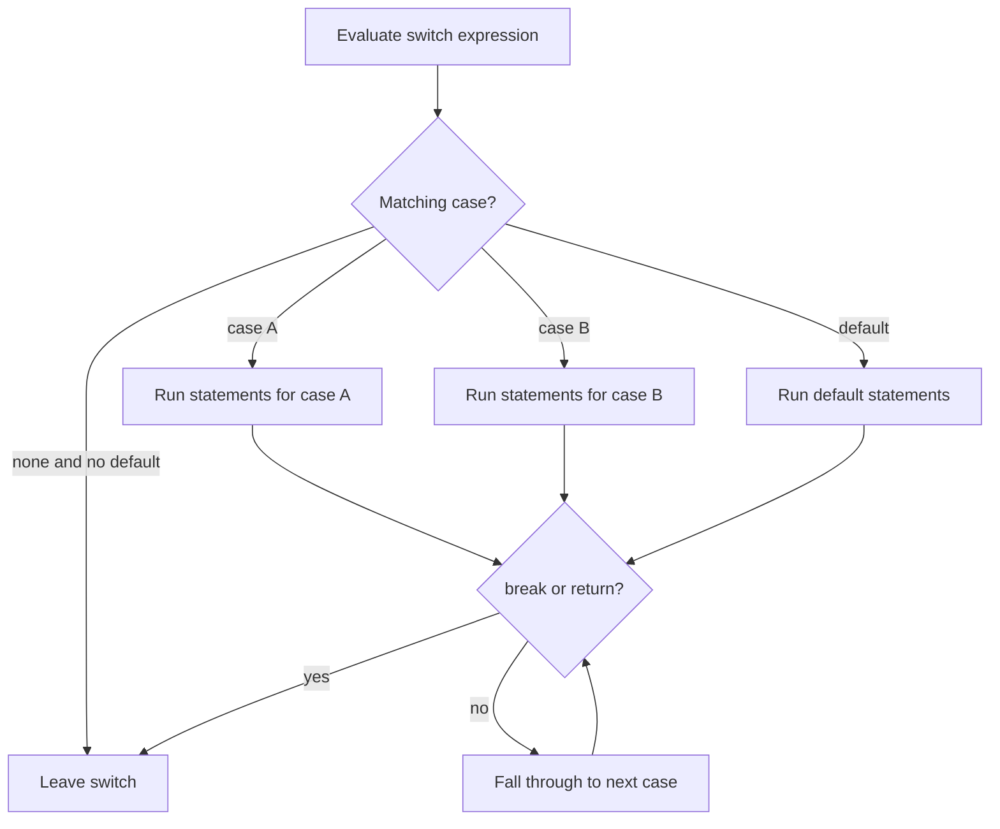

# Control Flow

Control flow is the order in which a C program performs computations. K&R has already used `if`, `while`, and `for` before formally describing them; Chapter 3 completes the set with `else if`, `switch`, `do while`, `break`, `continue`, and `goto`. The language provides only a few constructs, but they combine into compact loops, filters, searches, and parsers.


*Figure: C remains the reference language for low-level memory, pointers, and Unix interfaces. Image: [Wikimedia Commons](https://commons.wikimedia.org/wiki/File:C_Programming_Language.svg), ElodinKaldwin, public domain text logo.*

The important habit is to choose the construct that exposes the shape of the computation. A `for` loop is ideal when initialization, test, and increment belong together. A `while` loop fits input-driven repetition. A `switch` is clear for a fixed set of integer or character cases. `goto` is rare, but K&R does not pretend it is forbidden; it is mainly useful for leaving deeply nested logic or centralizing cleanup in old C code.

## Definitions

An expression statement is an expression followed by a semicolon:

```c
i++;
x = y + 1;
printf("%d\n", x);
```

A block, or compound statement, is a sequence of declarations and statements inside braces. It counts syntactically as one statement:

```c
if (n > 0) {
    sum += n;
    ++count;
}
```

The `if` statement evaluates an expression. If the expression is nonzero, it executes the true branch; otherwise it executes the optional `else` branch.

The `else if` chain is just nested `if` statements written in a readable layout:

```c
if (c < 0)
    puts("negative");
else if (c == 0)
    puts("zero");
else
    puts("positive");
```

The `switch` statement compares an integer expression against constant integer case labels. Execution starts at the matching case and continues until a `break`, `return`, or the end of the `switch`.

The `while` loop tests before each iteration. The `do while` loop tests after each iteration, so its body runs at least once. The `for` loop:

```c
for (expr1; expr2; expr3)
    statement
```

is equivalent to initialization `expr1`, then a `while (expr2)` loop whose body is followed by `expr3`, except that `continue` jumps to `expr3` before retesting.

`break` exits the nearest enclosing loop or `switch`. `continue` skips the rest of the nearest loop body and starts the next iteration. `goto label;` jumps to a labeled statement in the same function.

## Key results

The dangling-`else` rule attaches an `else` to the nearest previous unmatched `if`. Indentation cannot change the rule. Braces are the reliable way to express the intended grouping, especially when nested decisions are modified later.

`switch` labels are labels, not isolated branches. K&R stresses that fall-through is both useful and dangerous. It is useful when several case labels share one action, as with digit characters. It is dangerous when a missing `break` accidentally executes the next case.

Loop selection communicates intent. Use `while ((c = getchar()) != EOF)` when the loop is controlled by input. Use `for (i = 0; i < n; ++i)` when processing array elements. Use `do while` when one pass is required before the test can be meaningful, as in integer-to-string conversion of zero.

The comma operator evaluates left to right and yields the right operand's value. K&R uses it sparingly in `for` loops such as reversing a string with `i++` and `j--` together. The commas separating function arguments are not comma operators and do not impose left-to-right evaluation of arguments.

`goto` is not needed for ordinary loops or decisions. Its defensible use in C is narrow: breaking out of multiple nested loops, or jumping to shared cleanup code after partial resource acquisition. Even then, the label should be close and the invariant should be obvious.

The chapter also reinforces a style rule that is easy to underestimate: control flow should make the exceptional cases visible. In K&R examples, normal loops usually have a short body and a clear termination condition. When a loop has several exits, each exit has a reason: `return` because the answer is known, `break` because a search failed or completed, or `continue` because the current item should be skipped. This is especially important in C because there is no built-in exception mechanism and no automatic cleanup for local resources. The visible path through the function is the error-handling design.

For search and parsing code, the loop invariant is the most useful way to reason. In binary search, the invariant is that if the target is present, it lies between `low` and `high` inclusive. Every update must preserve that fact while shrinking the range. In a character scanner, the invariant might be that all characters before the current pointer have already been classified. K&R does not use the term heavily, but the examples are written so these invariants can be checked by inspection.

Another practical result is that C statements compose without hidden blocks. An `if` controls exactly one statement unless braces create a compound statement. A `for` loop controls exactly one statement. This is why adding a second line under a loop without braces is a classic maintenance bug. K&R's compact formatting works when the controlled statement is truly one statement; modern code often adds braces consistently because edits are common and compilers will not infer intent from indentation.

## Visual



| Construct | Test location | Typical K&R use | Exit mechanism |
|---|---|---|---|
| `if` | once, before branch | two-way decision | branch completes |
| `else if` | top to bottom | multi-way decision by conditions | first true branch completes |
| `switch` | once, then case jump | character or integer command dispatch | `break`, `return`, fall-through |
| `while` | before body | input loop, sentinel loop | false test, `break`, `return` |
| `for` | before body, with update | array traversal, counted loop | false test, `break`, `return` |
| `do while` | after body | generate at least one digit | false test, `break`, `return` |

## Worked example 1: Binary search decisions

Problem: search for `x = 13` in sorted array `v = {1, 4, 9, 13, 20, 25, 31}` using K&R's binary-search structure.

Method:

1. Initialize:

   $$low = 0,\quad high = 6.$$

2. First loop:

   $$mid = (0 + 6) / 2 = 3.$$

   `v[3]` is `13`. Compare:

   $$x = 13,\quad v[mid] = 13.$$

3. The first test `x < v[mid]` is false.
4. The second test `x > v[mid]` is false.
5. The `else` branch returns `mid`.

Checked answer: the search returns index `3`. The loop stops after one iteration because the middle element is the target.

Now check `x = 8`:

1. Start `low = 0`, `high = 6`, `mid = 3`, `v[3] = 13`.
2. Since `8 < 13`, set `high = mid - 1 = 2`.
3. Next `mid = (0 + 2) / 2 = 1`, `v[1] = 4`.
4. Since `8 > 4`, set `low = mid + 1 = 2`.
5. Next `mid = (2 + 2) / 2 = 2`, `v[2] = 9`.
6. Since `8 < 9`, set `high = 1`.
7. Now `low = 2` and `high = 1`, so the loop ends.

Checked answer: `8` is absent, so the function returns `-1`.

## Worked example 2: Switch-based character classification

Problem: classify the input characters `A`, newline, `5`, and `?` using a `switch` for whitespace and digits, and a default for other characters.

Method:

1. Initialize counters:

   $$digits = 0,\quad white = 0,\quad other = 0.$$

2. Character `A` matches no digit case and no whitespace case, so `default` runs:

   $$other = 1.$$

3. Character newline matches `case '\n'`:

   $$white = 1.$$

4. Character `5` matches one of the digit cases:

   $$digits = 1.$$

5. Character `?` matches `default`:

   $$other = 2.$$

Checked answer: after processing the stream, `digits = 1`, `white = 1`, and `other = 2`. Each case must end in `break` unless fall-through is intentional.

## Code

```c
#include <stdio.h>

int binsearch(int x, const int v[], int n)
{
    int low = 0;
    int high = n - 1;

    while (low <= high) {
        int mid = low + (high - low) / 2;

        if (x < v[mid])
            high = mid - 1;
        else if (x > v[mid])
            low = mid + 1;
        else
            return mid;
    }

    return -1;
}

int main(void)
{
    int v[] = { 1, 4, 9, 13, 20, 25, 31 };
    int n = (int)(sizeof v / sizeof v[0]);

    printf("13 at %d\n", binsearch(13, v, n));
    printf("8 at %d\n", binsearch(8, v, n));
    return 0;
}
```

## Common pitfalls

- Letting `else` bind to the wrong `if`. Use braces when an outer `if` owns the `else`.
- Forgetting `break` in a `switch`, causing accidental fall-through into the next case.
- Writing a null loop body by accident: `while (condition);` loops over an empty statement.
- Updating the wrong variable in nested `for` loops.
- Using `continue` in a `for` loop without remembering that the increment expression still runs.
- Writing `high = mid + 1` in binary search when the target is less than `v[mid]`; that can make the loop incorrect or infinite.
- Hiding unrelated work inside `for` loop headers. K&R uses compact loops, but the expressions should still be loop-control expressions.

## Connections

- [Tutorial Introduction](/cs/programming/c/tutorial-introduction)
- [Types, Operators, and Expressions](/cs/programming/c/types-operators-expressions)
- [Functions and Program Structure](/cs/programming/c/functions-program-structure)
- [Pointers, Addresses, and Arrays](/cs/programming/c/pointers-addresses-arrays)
- [Unix System Interface](/cs/programming/c/unix-system-interface)
